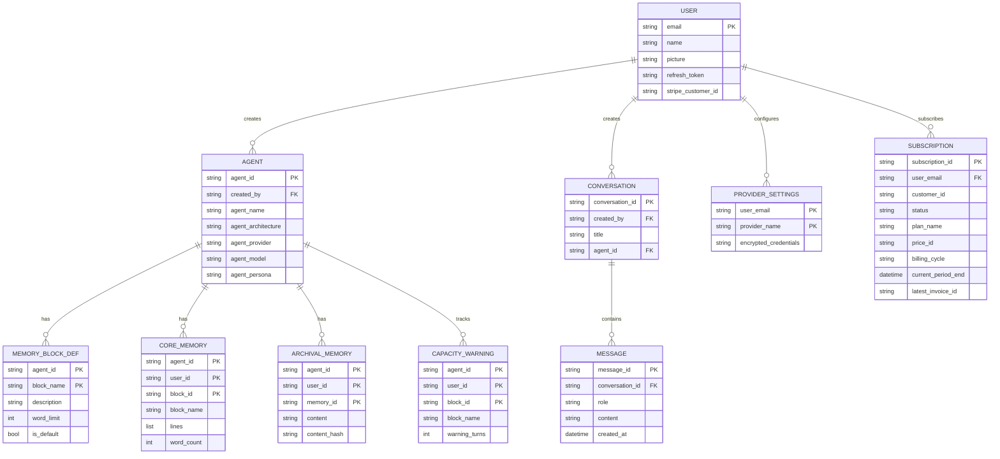
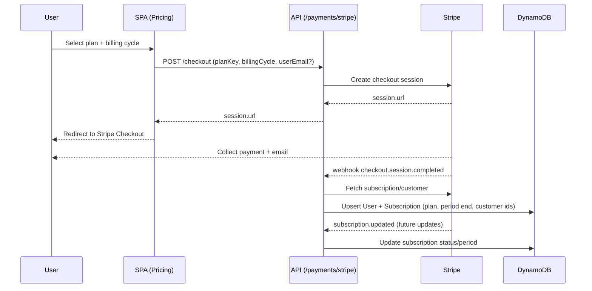
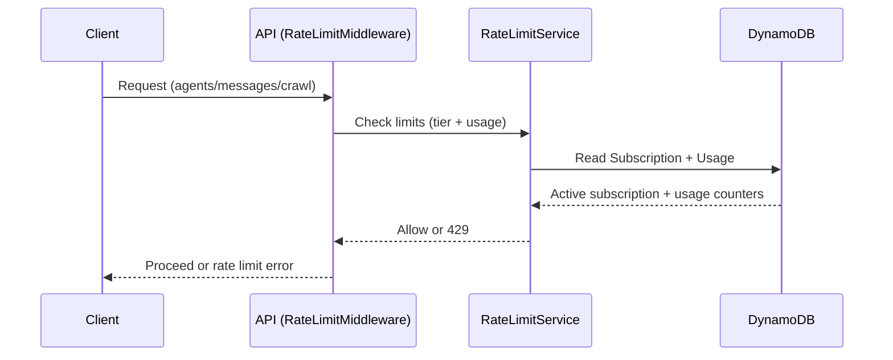

# Dynamic Agent Builder API

FastAPI backend for building dynamic AI agents with long-term memory capabilities.

## Table of Contents

- [Development Philosophy](#development-philosophy)
- [Single Table Design](#single-table-design)
- [Memory Tools (MemGPT Architecture)](#memory-tools-memgpt-architecture)
- [Getting Started](#getting-started)

---

## Development Philosophy

### Core Principles

1. **Idempotency First**: All write operations should be idempotent. Calling the same operation multiple times with the same parameters should produce the same result without side effects.

2. **Schema-Driven Forms**: UI forms are driven by backend schemas. The backend defines form structure, validation rules, and available options. This keeps the frontend thin and ensures consistency.

3. **Streaming by Default**: LLM interactions use Server-Sent Events (SSE) for real-time streaming. The frontend receives granular events for lifecycle notifications, tool calls, and response chunks.

4. **Repository Pattern**: Data access is abstracted through repository classes. Models define DynamoDB serialization (`to_dynamo_item`, `from_dynamo_item`), keeping persistence logic separate from business logic.

5. **Architecture Extensibility**: Agent architectures are pluggable. New architectures can be added by implementing the `AgentArchitecture` base class without modifying existing code.

### Adding New Features

When adding a new feature:

```
1. Model First
   └── Define the domain model in src/<module>/models.py
   └── Include pk/sk properties for DynamoDB keys
   └── Add to_dynamo_item() and from_dynamo_item() methods

2. Repository Layer
   └── Create repository in src/<module>/repository.py
   └── Implement CRUD operations with idempotency checks

3. API Layer
   └── Add router in src/<module>/router.py
   └── Use Pydantic models for request/response validation
   └── Register router in main.py

4. Test
   └── Add unit tests in tests/
   └── Use moto for DynamoDB mocking
```

### Code Organization

```
api/
├── src/
│   ├── agents/          # Agent management
│   │   ├── architectures/   # Pluggable agent architectures
│   │   ├── models.py
│   │   ├── repository.py
│   │   └── router.py
│   ├── conversations/   # Conversation management
│   ├── messages/        # Chat message storage
│   ├── memory/          # MemGPT memory system
│   ├── tools/           # Native tools for agents
│   │   └── native/      # Memory tools
│   ├── llm/             # LLM provider integrations
│   ├── settings/        # User provider settings
│   ├── users/           # User management
│   └── auth/            # Authentication
├── tests/
└── main.py
```

---

## Single Table Design

All entities are stored in a single DynamoDB table using composite primary keys (pk + sk) to enable efficient queries and maintain relationships.

### Entity Relationship Diagram



### Key Patterns Summary

| Entity | Partition Key (pk) | Sort Key (sk) | Access Pattern |
|--------|-------------------|---------------|----------------|
| **User** | `User#{email}` | `User#Metadata` | Get user by email |
| **Agent** | `User#{created_by}` | `Agent#{agent_id}` | List agents by user, Get agent by ID |
| **ProviderSettings** | `User#{user_email}` | `ProviderSettings#{provider_name}` | Get provider config for user |
| **Subscription** | `User#{user_email}` | `Subscription#{subscription_id}` | Get subscriptions by user, Get subscription by ID |
| **Usage** | `User#{user_email}` | `Usage#{YYYY-MM}` | Track monthly usage counters |
| **Usage (Active)** | `User#{user_email}` | `Usage#active` | Track current active agent count |
| **Usage Event** | `User#{user_email}` | `UsageEvent#{event_id}` | Deduplicate usage stream events |
| **Conversation** | `USER#{created_by}` | `CONVERSATION#{conversation_id}` | List conversations by user |
| **Message** | `CONVERSATION#{conversation_id}` | `MESSAGE#{timestamp}#{message_id}` | List messages in conversation (chronological) |
| **MemoryBlockDef** | `Agent#{agent_id}#User#{user_id}` | `MemoryBlockDef#{block_id}` | List memory block definitions for agent + user |
| **CoreMemory** | `Agent#{agent_id}#User#{user_id}` | `CoreMemory#{block_id}` | Get/update memory block content |
| **ArchivalMemory** | `Agent#{agent_id}#User#{user_id}` | `Archival#{timestamp}#{memory_id}` | Search archival memories (chronological) |
| **CapacityWarning** | `Agent#{agent_id}#User#{user_id}` | `CapacityWarning#{block_id}` | Track memory capacity warnings |

### Idempotency Patterns

- **Archival Memory**: Uses `content_hash` (SHA256) stored in a separate index item for deduplication
- **Core Memory Append**: Checks if exact line content already exists before adding
- **Agent Creation**: Checks for existing agent with same name for user

---

## Stripe Payments Flow



---

## Rate Limits and Usage

### Enforcement Flow



### How Limits Are Checked

- Active tier is resolved from `SubscriptionRepository.get_active_for_user()` using status + `current_period_end`.
- Tier limits are loaded from `pricing_config.json`.
- Message and KB limits use monthly usage records in DynamoDB: `Usage#YYYY-MM`.
- Agent limits are checked against current agent count (query by `created_by`).

### Usage Counters

- Messages: `messages_used` on `Usage#YYYY-MM` (incremented after successful send).
- KB pages: `kb_pages_used` on `Usage#YYYY-MM` (incremented after successful crawl).
- Agents: derived from agents table (not a counter).

---

## Memory Tools (MemGPT Architecture)

The `krishna-memgpt` architecture implements a memory system inspired by MemGPT, giving agents persistent memory across conversations.

### Memory Architecture Overview

```
┌─────────────────────────────────────────────────────────────────────────┐
│                    MEMGPT MEMORY ARCHITECTURE                            │
├─────────────────────────────────────────────────────────────────────────┤
│                                                                          │
│  ┌─────────────────────────────────────────────────────────────────┐   │
│  │                    CORE MEMORY (In-Context)                      │   │
│  │  Loaded every turn into system prompt | Default 5000 words/block │   │
│  ├─────────────────────────────────────────────────────────────────┤   │
│  │  [Human]               [Persona]              [Custom...]        │   │
│  │  1: Name: John         1: Helpful assistant   User-defined       │   │
│  │  2: Lives in: London   2: Professional tone   blocks with        │   │
│  │  3: Likes: Coffee      3: Remember all        custom names       │   │
│  └─────────────────────────────────────────────────────────────────┘   │
│                                    │                                     │
│                                    ▼                                     │
│  ┌─────────────────────────────────────────────────────────────────┐   │
│  │                 ARCHIVAL MEMORY (On-Demand)                      │   │
│  │  Searched via tool call, paginated results, idempotent inserts   │   │
│  ├─────────────────────────────────────────────────────────────────┤   │
│  │  • Long-term facts and memories                                  │   │
│  │  • Conversation summaries                                         │   │
│  │  • User preferences and history                                   │   │
│  │  • Detailed information (moved from core when full)              │   │
│  └─────────────────────────────────────────────────────────────────┘   │
│                                                                          │
└─────────────────────────────────────────────────────────────────────────┘
```

### Memory Types

#### Core Memory
- **Loaded every turn** into the system prompt
- **Line-based storage**: Each fact is a numbered line for precise editing
- **Capacity managed**: Default 5000 words per block, warnings at 80%
- **Default blocks**: `human` (facts about user) and `persona` (agent traits)
- **Custom blocks**: Users can create additional blocks (e.g., `projects`, `preferences`)

#### Archival Memory
- **On-demand access** via search tool
- **Unlimited storage** for detailed information
- **Paginated results** (5 per page)
- **Idempotent inserts** via content hashing

### Native Memory Tools

The LLM is provided with these tools to manage its own memory:

#### Core Memory Tools

| Tool | Purpose | Parameters |
|------|---------|------------|
| `core_memory_read` | Read current memory block contents with line numbers | `block` |
| `core_memory_append` | Add new fact to a block (idempotent) | `block`, `content` |
| `core_memory_replace` | Update specific line by number | `block`, `line_number`, `new_content` |
| `core_memory_delete` | Remove specific line (others shift up) | `block`, `line_number` |
| `core_memory_list_blocks` | List all available blocks with capacity | (none) |

#### Archival Memory Tools

| Tool | Purpose | Parameters |
|------|---------|------------|
| `archival_memory_insert` | Store detailed info for later (idempotent) | `content` |
| `archival_memory_search` | Search archival memory with pagination | `query`, `page` (optional) |

### How Tools Are Used by the LLM

1. **System Prompt Injection**: Each turn, core memory is injected into the system prompt:
   ```
   <core_memory>
   [Human - Facts about the user]
   1: Name: John Smith
   2: Lives in: London, UK
   3: Occupation: Software Engineer

   [Persona - Your traits and characteristics]
   1: Helpful and professional
   2: Remembers everything discussed
   </core_memory>
   ```

2. **Agentic Loop**: When the LLM calls a tool:
   ```
   User: "My name is Alice and I work at Google"

   LLM → calls core_memory_append(block="human", content="Name: Alice")
   Tool → "Appended to [human] at line 1: 'Name: Alice' (2/5000 words)"

   LLM → calls core_memory_append(block="human", content="Works at: Google")
   Tool → "Appended to [human] at line 2: 'Works at: Google' (5/5000 words)"

   LLM → "Nice to meet you, Alice! I'll remember that you work at Google."
   ```

3. **Capacity Management**:
   - At 80% capacity: Warning added to tool responses
   - LLM is instructed to consolidate or move data to archival
   - Auto-compaction triggers if ignored for 3+ turns

### Example Tool Responses

**core_memory_read**:
```
[human] Core Memory (4 lines, 18/5000 words):
1: Name: John Smith
2: Lives in: London, UK
3: Occupation: Software Engineer
4: Likes: Coffee, hiking
```

**core_memory_append** (new):
```
Appended to [human] at line 5: "Favorite color: Blue" (23/5000 words)
```

**core_memory_append** (duplicate):
```
Line already exists in [human] at line 3: "Occupation: Software Engineer" (no change)
```

**archival_memory_search**:
```
Archival Memory Search for "coffee" (Page 1 of 3, 12 total):

[1] (2024-01-15) John drinks 3 cups of coffee daily, prefers dark roast...
[2] (2024-01-10) Favorite coffee shops: Monmouth, Prufrock...
[3] (2024-01-08) Morning routine includes coffee at 7am...
[4] (2024-01-05) Uses V60 brewing method...
[5] (2024-01-02) Doesn't like sugar in coffee...

(Use page=2 for more)
```

### Block Name Normalization

The system normalizes block names to handle LLM variations:
- `"Human - Facts about the user"` → `"human"`
- `"Important_Financial_Data"` → `"important_financial_data"`
- `"My Custom Block"` → `"my_custom_block"`

---

## Getting Started

### Prerequisites

- Python 3.13+
- AWS credentials configured (for DynamoDB)
- UV package manager

### Development Setup

```bash
# Install dependencies
uv sync

# Run development server
uv run uvicorn main:app --reload

# Run tests
uv run pytest
```

### Environment Variables

| Variable | Description |
|----------|-------------|
| `DYNAMODB_TABLE` | DynamoDB table name |
| `JWT_SECRET` | Secret for JWT token signing |
| `GOOGLE_CLIENT_ID` | Google OAuth client ID |
| `GOOGLE_CLIENT_SECRET` | Google OAuth client secret |
| `FRONTEND_URL` | SPA URL for redirects |
| `ENCRYPTION_KEY` | Key for encrypting provider credentials |

### Docker

```bash
# Build container
docker build -t innomightlabs-api .

# Run locally
docker run -p 8000:8000 innomightlabs-api
```
