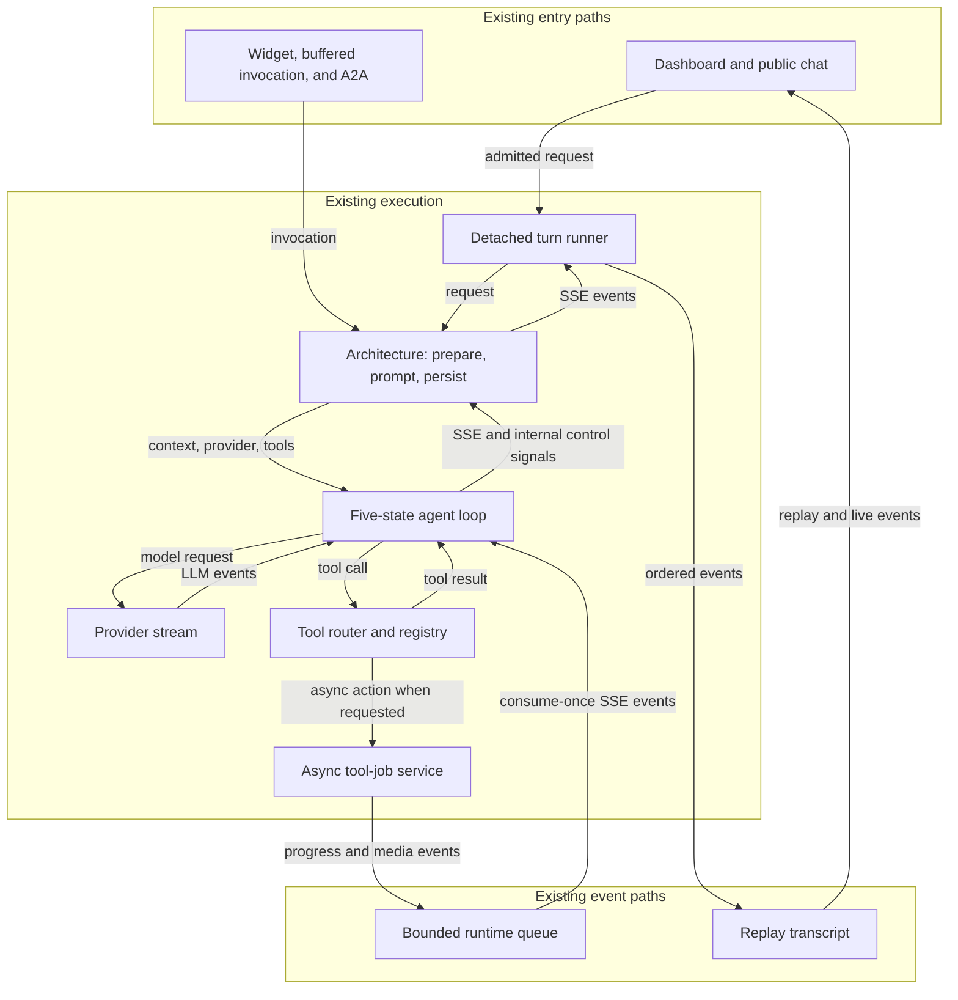
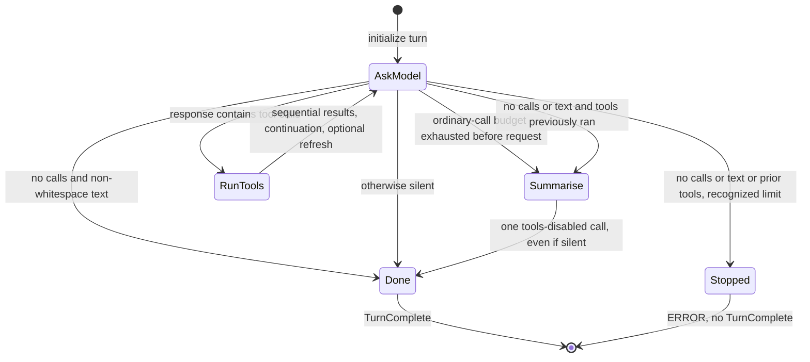

# LLD: A more readable agent core without changing behavior

**Status:** ✅ Implemented: all phases (0–7). See [Outcome](#11-outcome).
**Reviewed:** 2026-10-06, against the current working tree, including existing uncommitted loop/provider/test changes.
**Goal:** Reduce the number of facts and ownership boundaries a developer must hold in their head to understand one turn. Preserve observable behavior, not merely the happy-path answer.

## 1. Recommendation

Keep the existing five-state agent loop. It is already a good starting point. Improve it by making transition policy explicit, keeping model-call data local to one call, returning tool outcomes through ordinary task results, and reporting prompt invalidation as part of those outcomes.

Do **not** introduce a state-machine dependency, classes for every state, an event bus, a universal execution framework, or a single object that owns every kind of runtime state.

The most valuable changes are:

1. Remove the tool-result sentinel protocol and its missing-result guard.
2. Remove shared `prompt_dirty` mutation/reset across the router, loop, and architecture.
3. Separate one model call's output from turn-wide state; put transition precedence in one pure function and state progression in one driver.
4. Stop copying credentials into general tool/architecture state.
5. Remove context wrappers that are immediately unpacked, plus methods with no repository callers.
6. Give detached execution its own task handle rather than making the replay transcript own execution.
7. Centralize stale-job policy while retaining both polling and scheduled cleanup.

This is SOLID applied to actual responsibilities, not an exercise in adding interfaces. Fewer concepts and clear ownership matter more than fewer lines.

### Scope and evidence

Primary review: `src/agents/agentic_loop.py`, `runtime_state.py`, `turn_runtime.py`, `turns/`, `tool_runtime/`, `tool_execution.py`, architecture orchestration, and their tests. Traced provider events, skill/MCP execution, and dashboard/public/widget/A2A callers where relevant. This is not an exhaustive audit of agent CRUD, every skill, or every provider's transport implementation.

Full paths below are relative to `api/`; abbreviated agent-module paths are relative to `api/src/agents/`, with other owning packages named explicitly. Line references describe this working-tree snapshot and will move during implementation. Negative caller searches establish repository-local removal candidates, not proof that out-of-repository consumers do not exist.

`src/runtime/` contains only `env.py`: environment detection, not agent execution. Its `is_lambda()` is used by `main.py:47,63`. Its `aws_region()` has no Python callers found; production callers use `settings.aws_region`. The substantial runtime work lives under `src/agents/`.

The earlier [runtime refactor LLD](LLD-agent-runtime-refactor.md#outcome) describes work already implemented: the old event vocabulary, supervisor, and multi-layer dispatch are gone. Do not propose deleting them again. The working-tree [final-answer LLD](LLD-agent-loop-lost-final-answer.md#what-shipped-differently-from-the-plan) also explains intentional behavior that this plan preserves.

## 2. Current ownership: different meanings of “turn”

| Object/module | What it actually owns | Keep separate from |
| --- | --- | --- |
| `ConversationTurn`, `turns/repository.py` | Durable status, timestamps, message references | In-process tasks and stream closure |
| `turns/run.py` | Detached execution, heartbeat, stop, finalization | Subscriber lifetime |
| `TurnTranscript` | Ordered replay, followers, replay retention | Tool-event backpressure |
| `AgentTurnRuntime` | Bounded tool-to-loop event queue and ambient runtime binding | Durable execution status |
| `AgentTurnState` | Actor identity, request data, architecture/tool enrichment | Provider credentials and loop phase |
| `_Turn` in `agentic_loop.py` | Model/tool iteration and answer policy | HTTP admission and database lifecycle |
| `ToolJob` and its service | Persisted async action status plus local worker scheduling | Exactly-once execution or resumable workflow guarantees |
| `TurnOutputs` | Assistant text/artifact/fallback policy | Tool audit persistence and provider call policy |



*All nodes are existing responsibilities. Direct callers do not automatically acquire the detached chat runner's lifetime or replay contract.*

### Important non-duplication

`turn.status`, `transcript.finished`, and `runtime.closed` are not copies of one boolean. They mean persisted outcome, no further replay events, and refusal of late tool events, respectively. A persistence failure must not prevent closing followers. Likewise, a terminal turn may retain a replayable transcript.

## 3. Behavior that the refactor must preserve

Use this as the compatibility checklist before moving code.

| Area | Current contract and evidence |
| --- | --- |
| Transition priority | Tool calls win over text; non-whitespace text wins over stop reason; silence after tools requests a summary; only silence before tools with a recognized limit emits `ERROR`. `agentic_loop.py:195–216`. |
| Budget | `MAX_TOOL_ITERATIONS` limits ordinary model calls. One additional tools-disabled summary call is allowed. Tools requested on the last ordinary call still run before the budget is checked again. `:195–199,250–258`. |
| Summary | Exactly one summary call, `tools=[]`, unexpected tool-use events logged and ignored. Even a silent or limited summary produces `TurnComplete`, not `ERROR`. `:252–278`. |
| Stream exhaustion | A provider `stop` event is data, not an instruction to stop consuming the stream. Usage can arrive afterward. The last stop/usage event wins. `:266–299`; `llm/providers/base.py:30–35`. |
| Text | Every nonempty text chunk is streamed and contributes to `full_text`, including pre-tool narration and whitespace. Only decision/fallback checks use `.strip()`. `:267–270`; `krishna_memgpt.py:438–446`. |
| Tool order | All tool starts can be emitted during the model stream before execution begins. Tools subsequently execute sequentially, in provider order. Do not parallelize as cleanup. `:205–240,272–277`. |
| Context | Preserve assistant text plus native tool-use blocks, matching tool IDs, Gemini thought signatures, complete tool results, and the single movable continuation/summary block. `loop_context.py`; `agentic_loop.py:219–242,301–308`. |
| Memory refresh | Once per successful completed batch if any normally returning tool is marked as mutating prompt context, before the next model call. A returned error string still triggers refresh; an exception mapped to an error result does not. `tool_execution.py:32–60`. |
| Async settlement | Keep the initial two-second sleep, per-job ten-minute budget, `check_tool_job` routing, generated poll IDs, progress events, and no synthetic start/result events for polls. Return any non-pending/non-job poll result unchanged. `agentic_loop.py:399–454`. |
| Async success flag | ~~The final settled result retains the original start outcome's `success`.~~ **Fixed after this refactor:** the job's final poll decides, so a failed job is reported as failed. See §11. |
| Poll deadline | A terminal result is returned before checking elapsed budget; only a still-pending result can trigger the in-turn timeout. Preserve this order. `:441–446`. |
| Runtime interleaving | Runtime events that arrive before successful tool return must precede the tool result. Preserve the pending-get handoff and queue drain, including simultaneous completion. On task failure, the current helper raises before its success-path trailing drain. `:457–490`. |
| Usage | Once per completed call with usage, using the last usage event, offloaded with `asyncio.to_thread`, best-effort on recording errors. Preserve API-key attribution and omission of an SSE update when no day record is returned. `:346–381`. |
| Architecture ordering | Original SSE first, interpreted artifact/form events next, audit observation afterward. An `ERROR` exits without saving an assistant message. `krishna_memgpt.py:237–268`. |
| Fallbacks | Prefer all streamed model text, then first useful credential fallback, then a record of tools run unless a tool already answered via image. Preserve exact wording and tool-display/count ordering. `krishna_memgpt.py:407–458`. |
| Audit versus context | Audit truncates stored results at 12,000 characters; model context receives full results. These are different policies. `tool_audit.py:13,37–59`; `test_agentic_loop.py:337–362`. |
| Lifecycle | Architecture emits `STREAM_COMPLETE` before detached runner final persistence. Runner completion follows generator exhaustion. Cancellation is re-raised and currently has no cancellation SSE event. `architectures/base.py:103–124`; `turns/run.py:112–158`. |
| Trust boundaries | Keep actor-scoped memory, skill/MCP/job authorization, input normalization/aliases, and visitor-safe error redaction. Tool advertisement is not permission enforcement. |

Preserving behavior also means keeping existing exceptional behavior until explicitly changed. Characterize failure ordering before adopting a cleaner-looking `finally`, `TaskGroup`, or terminal-state rule.

## 4. Prioritized findings and removal ledger

### F1 — Tool completion should be a return value, not a special item hidden in an event stream

**Priority:** High. **Risk:** Medium: cancellation/interleaving requires tests.

**Evidence:** `agentic_loop.py:221–238,384–419,457–490`.

Today `_run_tool` yields both SSE events and `_ToolFinished`. The consumer initializes `result=None`, identifies the special item, and raises if it never appears. `_ToolFinished` duplicates `ToolExecutionOutcome`'s two fields. This is an internal protocol invented because an async generator cannot return a value.

**Change:** Make execution and settlement an ordinary coroutine returning `ToolExecutionOutcome`. Move the event-pump mechanics into `AgentTurnRuntime.stream_while(task)`, which yields **only SSE events** and retains the current pump's failure/cancellation/ordering behavior. The caller owns the task's typed result:

```python
# Proposed call-site shape inside the sequential tool batch.
# execute_and_settle is the replacement for _run_tool's nested execute().
task = asyncio.create_task(execute_and_settle(tool_event, tool_router, state))
async for event in runtime.stream_while(task):
    yield event
outcome = task.result()
yield _tool_call_result_event(tool_event, outcome)
tool_results.append(tool_result_block(tool_event.tool_use_id, outcome.result))
```

The proposed method accepts `asyncio.Task[T]`, waits for it and the next runtime event, and propagates task exceptions before the trailing success-path drain. Normal iterator exhaustion guarantees that the task has finished successfully. Its `finally` cancels the pending queue get and an unfinished execution task, just as today. It does not yield a result sentinel.

**Delete:** `_ToolFinished`, `result=None`, sentinel `isinstance`/`continue`, the “Tool execution did not complete” guard, and the result-yield branch of `_with_runtime_events`. Replace `_run_tool` rather than preserving it as a forwarding wrapper.

**Do not delete:** The two-task race, done/cancelled checks around the pending queue get, queue draining, exception propagation, or strong task ownership. Those reflect real scheduling behavior. Do not replace the race with polling or move all output onto an unbounded queue.

**Cancellation gate:** Keep existing cancellation semantics first. Awaiting cancelled child cleanup or using `TaskGroup` may change latency, exception grouping, and background job behavior; evaluate separately with characterization tests.

### F2 — Carry prompt invalidation in the outcome instead of mutating shared turn state

**Priority:** High. **Risk:** Low to medium.

**Evidence:** `runtime_state.py:51–53`, `tool_execution.py:40–42`, `agentic_loop.py:244–248`, `krishna_memgpt.py:231–235`.

One fact travels through three owners as a mutable flag. The router sets it; the loop probes it with `getattr` and resets it; the architecture performs the refresh. The reset is bookkeeping, not domain behavior.

Extend the **existing** result object, not a second effect/event hierarchy:

```python
@dataclass(frozen=True)
class ToolExecutionOutcome:
    result: str
    success: bool
    refresh_prompt: bool = False
```

On normal handler return, the router returns `refresh_prompt=tool.spec.mutates_prompt_context`. Error/timeout results keep the default. The batch ORs these returned values and emits the existing `PromptRefreshNeeded` once after appending results and replacing the continuation instruction.

The settlement coroutine must preserve invalidation from the initial outcome **and every internal poll outcome**. Current registered check tools do not mutate memory, but OR-ing effects is the faithful replacement for shared accumulation. Preserve the initial `success` flag separately; do not substitute the final poll's success flag.

**Delete:** `AgentTurnState.prompt_dirty`, its write/reset/probe, and any temporary dual mechanism after migration. Update fake routers and tests to return the new outcome field.

**Keep:** `PromptRefreshNeeded` as the small existing architecture handshake. The consumer rebuilds memory synchronously between generator yields, before the loop resumes. Replacing this with a callback is possible, but unnecessary here; it would add callback wiring without eliminating the refresh responsibility.

The remaining `if refresh_prompt` is a real business decision, not a guard to remove.

### F3 — Make state progression visible in one place and scope model output to one call

**Priority:** High. **Risk:** Medium: preserve exact transition precedence.

**Evidence:** `agentic_loop.py:158–166,183–216,250–299`.

`Step` already names the right states. The difficulty is that a dispatch dictionary calls generators which mutate `self.step`, while `_call_model` resets three turn fields that are meaningful only for the current call. `summary_prompt` also lives on every turn despite being relevant only to summary selection.

**Change:** Keep `Step`; use one explicit driver with a `match` over the five states. Only the driver chooses the next state. State work streams events and fills/returns its own local data; it does not change the phase. Extract a pure post-model decision function, shown in §5.

Create one private `_ModelCall` accumulator **per provider invocation** in `agentic_loop.py`, with `text`, `tool_calls: list[LLMEvent]`, and `stop_reason`. Its stream method owns consuming provider events, usage capture, and existing call diagnostics. Parameters are the actual collaborators: provider, context, credentials, tools, model, usage recorder, and attribution state. Do not copy repositories, tool services, or architecture objects into it.

The driver streams the call, then adds `call.text` to turn-wide text and decides what follows. Keep the completed call local across `ASK_MODEL → RUN_TOOLS`. The summary phase constructs its own call and goes directly to `DONE`; it never reuses the ordinary post-call classifier.

**Delete:** Resetting `self.call_text, self.tool_calls, self.stop_reason` on every invocation, step writes scattered across generators, and the dynamic dispatch dictionary. Replace last-call turn fields with one call-local object; do not retain both representations. Summary prompt selection belongs in the driver at the edge entering summary.

This is not a promise that Python makes every invalid enum/data combination unrepresentable. It makes the sole production path construct fresh call data and pass it directly to the next operation, so callers do not need stale-state repair. Do not add an inheritance tree or runtime transition validator to achieve that.

**Types:** Use the existing `LLMEvent` for provider outputs and tool calls rather than `Any`; type state as `AgentTurnState`. Keep the narrow collaborator protocols, but change their event/state annotations. Do not add Pydantic validation between trusted internal functions. `StopReason` describes normalized provider output, but preserve current handling of an unexpected string at the boundary rather than introducing new rejection behavior.

### F4 — Give credentials one owner; remove unused turn-state data

**Priority:** Medium. **Risk:** Low.

**Evidence:** `provider_session.py:34–39`, `runtime_state.py:30,48–49`, `krishna_memgpt.py:134,170–175,217–224`.

`ProviderSession` already returns required credentials. Copying them into an optional state field and reading them with `or {}` invents a missing-credentials state immediately after successful session creation. No `state.provider_name` reader was found.

**Change:** Pass `session.credentials` directly. Remove `AgentTurnState.credentials` and `provider_name` and update constructors/tests. Keep `model_name` because usage attribution consumes it. Do not introduce several replacement identity/request/enrichment DTOs merely to divide up this small dataclass.

**Delete:** Credential assignment, optional field, empty-dict fallback, and unused provider-name field. This also prevents general tool handlers from casually reaching provider credentials through shared state.

Enrichment genuinely occurs in stages; do not construct a supposedly “prepared” object by moving message saves, provider lookup, or lifecycle notifications earlier/later. Those orderings are observable.

### F5 — Remove copy-and-unpack context wrappers, not useful tool boundaries

**Priority:** Medium. **Risk:** Low with identity mapping tests.

**Evidence:** `tool_runtime/contexts.py:34–74`; `handlers.py:80–135`.

`SkillToolContext` copies seven fields only for `run_skill_tool` to unpack them immediately into explicit service arguments. `MCPToolContext` wraps an already meaningful `MCPCaller`, owner email, and agent ID only to be unpacked in two adapters.

Pass skill arguments directly from state. Construct `MCPCaller` in one small helper and pass owner/agent directly. Delete the two wrapper classes, imports, and exports.

Preserve the exact MCP mapping:

```python
actor_email = state.actor_email if state.actor_email != state.owner_email else None
```

This is not equivalent to checking actor kind. Preserve the rest of the caller fields and native `user_id=state.actor_id`.

**Keep:** `NativeToolContext`, which actually crosses the native handler boundary and copies the KB list; `BoundTool`, which normalizes input; `ToolRegistry`, which handles ordered definitions and duplicate registration; and `ToolExecutionRouter`, which owns error/outcome policy. They are not an obsolete five-layer dispatch stack.

### F6 — Separate detached execution ownership from replay, and return what callers just created

**Priority:** Medium; perform after the core loop work. **Risk:** Medium.

**Evidence:** `turns/transcript.py:23–31,67–81`; `turns/run.py:51–103`; `src/agents/router.py:506–516`; `src/public_api/router.py:154–165`.

`start_turn` creates a transcript and task but returns only a persisted row. Both chat routers immediately look the transcript up again and cast away optionality. The transcript also has an optional execution task, although a replay log is not an executor.

Introduce one concrete `RunningTurn` handle in `turns/run.py`:

```python
@dataclass(frozen=True)
class RunningTurn:
    turn: ConversationTurn
    transcript: TurnTranscript
    task: asyncio.Task[None]
```

Start constructs the row, transcript and task in the existing order, then returns and registers the handle. Construction has no intervening `await`; the existing `_drive_turn` continues to receive row/transcript/request, avoiding circular handle construction. Replace the transcript-only global registry with a handle registry owned by `run.py`; do not add a second synchronized registry. Accessors can return `handle.transcript` for replay. Expire the handle after the same grace window.

Callers use `handle.turn` and `handle.transcript`. Stop looks up the handle and cancels its task when active. A missing handle remains legitimate after restart/eviction and retains the current persisted fallback.

Update `turns/__init__.py:8–20` as part of this migration: export replay lookup/eviction from `run.py`, construct `TurnTranscript` directly inside start, and remove `open_transcript` and its obsolete export. Update direct registry imports in tests as well as package imports in routers. Do not make `transcript.py` import `run.py` to preserve forwarding wrappers; keep replay independent of execution. Verify package imports and post-start/reattach lookup in the phase gate.

**Delete:** `TurnTranscript.task`, normal-path optional task checks, post-start lookup and unchecked casts, and the old registry ownership. Retain strong task references and live follower references after eviction.

Separately name the phases within `_drive_turn`: consume/observe events; determine outcome; persist outcome; always close replay and clean up resources. Do not introduce a generic finalizer service or change failure ordering. In particular, closing the stream must not depend on successful terminal persistence.

**Not included:** Making terminal states absorbing, atomic one-active-turn admission, or idempotent stop. Those would change current behavior; see §8.

### F7 — One stale-job rule, two intentional cleanup triggers

**Priority:** Medium. **Risk:** Low to medium around terminal races.

**Evidence:** `tool_runtime/jobs/service.py:127–139`; `jobs/repository.py:20–23,103–120`.

Both on-demand checks and scheduled sweeping implement the same elapsed-time rule and error text. Put the predicate on `ToolJob` and the error constant beside it. Keep each caller responsible for I/O:

```python
def is_stale(self, *, now: datetime) -> bool:
    if self.status not in {ToolJobStatus.QUEUED, ToolJobStatus.RUNNING}:
        return False
    reference = as_aware_utc(self.started_at or self.created_at)
    return (now - reference).total_seconds() > TOOL_JOB_STALE_AFTER_SECONDS
```

**Delete:** Duplicated timestamp selection, status/age policy, and error wording. **Keep:** Authorization before polling-side mutation, both triggers, and conditional repository writes that preserve a concurrent terminal result. Exactly ten minutes is not stale; progress does not reset this elapsed-runtime budget.

An optional follow-on combines `create_skill_action_job` and `start_skill_action_job` into one service operation, because the sole production sequence in `skills/service.py:481–496` always does both. Preserve persist-queued → schedule → retain task → return-start-payload order, and execution-time loading of installed skill/configuration. Never persist decrypted configuration or await the worker inline.

### F8 — Small proven deletions, with an explicit compatibility boundary

| Candidate | Evidence | Recommendation |
| --- | --- | --- |
| `ToolRegistry.specs()` | `tool_runtime/registry.py:27–28`; no caller found | Delete method. |
| `ToolJobRepository.update_progress()` | `jobs/repository.py:64–69`; no caller found | Delete method, **not** `progress_message` data or progress events. |
| `runtime.env.aws_region()` | `src/runtime/env.py:21–23`; only examples in historical docs refer to it | Delete helper and adjust its module description; leave historical examples clearly identified as historical if updated. Keep `is_lambda()`. |
| `ToolSpec.timeout_seconds` | `specs.py:42`; no production declaration sets it, but `test_tool_execution.py:307–329` exercises it | **Retain in this strict behavior-preserving plan.** Removal changes an exercised internal capability, even if currently unused in production. |
| `ToolJob.automation_*` fields | `jobs/models.py:31–33`; current constructor does not populate them | Defer. Persisted schema/unknown historical consumers require a separate migration decision. |

Before implementation, repeat repository-wide caller searches, including scripts and tests. Do not treat a public method's lack of local callers as license to change an external package contract; these recommendations assume these modules are repository-internal.

## 5. Target loop: keep five states, make the rules readable



*This is the current successful control policy made explicit. Exceptions/cancellation escape to existing outer boundaries; `DONE` is loop completion, not proof that an assistant message was persisted.*

### 5.1 Pure transition policy

Proposed implementation in `agentic_loop.py`, using the existing `Step` and `STOPPED_MESSAGES`:

```python
def next_step_after_call(
    *,
    has_tool_calls: bool,
    text: str,
    tools_ran: bool,
    stop_reason: str,
) -> Step:
    if has_tool_calls:
        return Step.RUN_TOOLS
    if text.strip():
        return Step.DONE
    if tools_ran:
        return Step.SUMMARISE
    if stop_reason in STOPPED_MESSAGES:
        return Step.STOPPED
    return Step.DONE
```

This function is deliberately modest. It does not execute effects, know about persistence, classify tool payload success, or infer whether a tool answered with an image. The architecture already owns the last policy.

### 5.2 Driver responsibilities

Keep all progression in the existing entry point/private turn driver, not spread among state implementations:

| State | Work performed by driver | Next state |
| --- | --- | --- |
| `ASK_MODEL` | Check budget before calling. Otherwise construct fresh `_ModelCall`, increment count, stream call events and usage, accumulate its text and last stop reason. | Budget → `SUMMARISE` with iteration-limit prompt; otherwise classifier above. |
| `RUN_TOOLS` | Use that call's text/tool list; append assistant blocks; stream each sequential execution; append user results; set `tools_ran`; move continuation block; yield optional refresh signal. | `ASK_MODEL`. |
| `SUMMARISE` | Replace instruction with selected summary prompt; construct fresh `_ModelCall`; increment count; stream once with tools disabled; accumulate text/stop reason. | Always `DONE`. |
| `DONE` | Leave runtime context, then yield one `TurnComplete` carrying all text and the last stop reason. | Exit. |
| `STOPPED` | Emit existing stop error inside runtime scope; no completion signal. | Exit. |

Preserve the current runtime close/reset timing: `TurnComplete` is emitted after leaving `use_turn_runtime`; the stopped error is emitted while inside it. Summary logging must still report `SUMMARISE`, and ordinary call logging `ASK_MODEL`.

There is no need for `REFRESH_PROMPT`, `AWAIT_JOB`, `PERSIST`, or `REPLAY` loop states: these are subordinate operations or different lifecycles. A future requirement can justify new states; hypothetical extensibility does not justify them now.

### 5.3 Context and prompt ownership

Keep context helpers in `loop_context.py`. The existing nudge implementation already keeps one instruction without scanning all history; do not replace it with a full-history rebuild or a second transcript abstraction.

The loop is the only appender of tool context. The architecture owns the first system message and refreshes it only in response to `PromptRefreshNeeded`. Preserve the identity of the shared context list across that handshake. Do not truncate tool results or change provider-specific message formatting.

Replacing `getattr(tool_event, "thought_signature", None)` with direct access is safe only after internal call sites use the existing `LLMEvent` contract (including fakes). It is not permission to reject previously tolerated provider wire data at a new internal boundary.

## 6. SOLID and future changes, without speculative machinery

| Principle | Concrete application |
| --- | --- |
| Single responsibility | Loop chooses next work; runtime interleaves events; router maps tool outcomes; architecture prepares/persists; runner owns lifetime; transcript replays. |
| Open/closed | Continue adding tool specs/handlers, provider adapters, and tool-result interpreters at existing seams. A new policy genuinely affecting loop transitions should change the explicit policy, not hide in plugins. |
| Liskov substitution | Provider/architecture implementations retain stop/usage streaming, cancellation and lifecycle contracts. Fakes should emit real `LLMEvent` shapes. Do not force Krishna Mini through MemGPT's summary/fallback/usage policy. |
| Interface segregation | Retain narrow provider/router/usage protocols with meaningful event/state types. Keep `NativeToolContext`; remove wrappers that do not narrow an actual boundary. |
| Dependency inversion | Core loop consumes collaborators; it does not construct architecture repositories or know HTTP routes. Do not add a DI container. Existing composition points suffice. |

### Where future features belong

- **New architecture:** existing architecture base/factory; reuse the loop only when its semantics fit.
- **New LLM provider:** provider adapter and normalized `LLMEvent` output; provider-specific stop/usage mapping stays there.
- **New tool type:** spec/handler boundary and its authorization service, not another branch in the loop.
- **New artifact/result type:** existing `tool_results.py` interpreters and `TurnOutputs` policy.
- **Changed continuation/summary behavior:** explicit transition policy plus context tests.
- **Changed tool-event delivery:** `AgentTurnRuntime`, not `TurnTranscript` or provider adapters.
- **Durable execution:** separate design involving execution claims, idempotent side effects, serializable checkpoints, recovery and durable event replay.

A named state machine is not durable execution. Neither `_Turn` nor a task handle can be checkpointed as-is: they contain providers, tasks, queues, credentials, mutable context references and in-flight effects. This refactor improves seams for later work but does not make worker restarts or horizontal scaling safe by itself.

## 7. Guards and abstractions to retain

| Keep | Why design cannot remove it here |
| --- | --- |
| Ignoring tool requests during tools-disabled summary | Provider output is external; empty advertised tools is not a guarantee of compliant output. |
| Tool-input validation and error-to-result conversion | Model output is not trusted input. Returned failure strings and raised exceptions intentionally differ. |
| Skill/MCP/job execution-time authorization | Advertised definitions do not prevent fabricated calls or stale permissions. |
| Runtime closed/no-runtime/full-queue handling | Tools can emit late or execute outside chat; droppable events differ from required events. |
| ContextVar reset and pending event handoff/drain | Real task/context isolation and scheduling races. |
| Async poll timeout and stale-job checks | External work/process failure is not preventable through local typing. |
| Conditional job transitions and heartbeat reaper conditions | In-process state cannot serialize database races. |
| Error boundaries in architecture and runner | Runner also catches construction/persistence failures outside architecture execution. |
| Transcript sequence positions and wake generation | Multiple independent followers can suspend/reattach at different points. Blank superseded image bytes; do not remove sequence entries. |
| Best-effort usage and conversation touch | Auxiliary I/O must not fail the main response or overwrite concurrent conversation edits. |
| `TurnOutputs`, audit log and buffered result as distinct projections | They implement fallback/artifact policy, persisted audit, and full non-streaming event collection respectively—not the same accumulation. |

Decouple transcript image compaction from `is_droppable_runtime_event`: today that predicate means image partials, but future droppable event categories must not automatically become compactable transcript payloads. An explicit `IMAGE_GENERATION_PARTIAL` check preserves today's behavior and separates the two policies.

## 8. Correctness/scalability changes deliberately excluded

These are worth separate work, but including them would violate the “behavior must not change” constraint:

1. **Absorbing terminal turn states/idempotent stop.** `stop_turn` can currently mark a completed/non-local turn cancelled; ordinary `finish` is unconditional. Correcting this changes outcomes.
2. **Atomic admission.** Moving dashboard/public active-turn checks into one helper would centralize policy, not make it atomic across processes/eventually consistent reads. Transactions/claims require a separate design.
3. **Reaper versus late completion.** A late unconditional turn finish can overwrite a reaper outcome. An in-memory enum cannot fix this.
4. **Pre-start cancellation cleanup and heartbeat supervision.** Cancellation before the driver first runs may bypass its cleanup; heartbeat write failure currently terminates the heartbeat task. New handling changes failure/liveness behavior.
5. **Unified error classification.** Runner uses truthiness of the last error text (`turns/run.py:134–140`); architecture/buffered invocation treat any error event as failure. Empty/repeated errors need characterization before normalization.
6. **Job claim/exactly-once behavior.** `execute_skill_action_job` ignores the returned status from `mark_running`, whose conditional-failure path can return an already-terminal row. Preventing execution after a lost claim is a correctness change, not deletion of a guard.
7. **Changing failed async-job success flags, fallback wording, or narrated-text behavior.** These are user-visible semantics even when the alternative seems more correct.
8. **Parallel tools, retries, strict async-payload parsing, new timeouts, truncation, or prompt rewording.** Each changes effects, model inputs, or outcomes.
9. **Uniform architecture policy.** Krishna Mini currently saves even empty responses, does not record token usage, and does not apply MemGPT's tool/summary policy. Do not erase those differences through a universal runner.
10. **General I/O offloading and distributed transcript storage.** Potential throughput/scaling work, not proven necessary by this readability review; measure and design separately.

No production defect fixes are bundled into this plan. Record them separately and agree on desired behavior before implementation.

## 9. Implementation sequence and file-level work

Each phase should be reviewable and independently testable. Do not rewrite the entire runtime at once.

| Phase | Files | Deliverable and removal gate |
| --- | --- | --- |
| 0 — Characterize | Existing loop/runtime/tool/architecture tests; add focused cases below | Freeze event/context/outcome traces before structural changes. No production edits. |
| 1 — Low-risk ownership cleanup | `runtime_state.py`, `provider_session.py` annotations as needed, `architectures/krishna_memgpt.py`, `tool_runtime/{contexts,handlers,__init__,registry}.py`, `jobs/repository.py`, `src/runtime/env.py` | Remove copied credentials, unused provider field, two context wrappers and unused methods/helper. Keep meaningful boundaries. |
| 2 — Explicit loop policy | `agentic_loop.py`, loop/provider fakes | One transition owner, pure policy, fresh call accumulator, typed events/state. No changes to ordering, budgets or summary behavior. |
| 3 — Return-value tool execution | `agentic_loop.py`, `turn_runtime.py` | SSE-only event pump and ordinary task result; delete sentinel and missing-result guard. All race/failure tests pass. |
| 4 — Outcome-carried invalidation | `tool_runtime/specs.py`, `tool_execution.py`, `agentic_loop.py`, `runtime_state.py`, tests | Add outcome field; aggregate through settlement/batches; delete dirty flag completely. Keep architecture handshake. |
| 5 — Job policy | `tool_runtime/jobs/{models,service,repository}.py`, optionally `skills/service.py` | One staleness rule; optionally one persist-and-schedule operation. No claim/retry or persisted-schema change. |
| 6 — Detached ownership | `turns/{run,transcript,__init__}.py`, dashboard/public routers and caller tests | Required task handle, one local registry, migrated package exports, no post-start lookup/casts; same disconnect/replay/stop behavior. |
| 7 — Documentation and validation | `architectures/CONTRIBUTING.md`, relevant LLD status notes and tests | Document outcome-based invalidation and runtime ownership; full suite and live smoke tests before implementation sign-off. |

Do not move every helper to a new module. `_ModelCall` and transition policy can live in `agentic_loop.py`; the event pump belongs in the already-existing `turn_runtime.py`; job policy belongs beside `ToolJob`. This plan needs no new package or dependency.

Existing docs are evidence, not new production specifications. Update the architecture contribution guide's dirty-flag instructions when phase 4 lands. Preserve earlier LLDs' historical outcomes. Mirror accepted API design documentation to the handbook using the repository's documentation workflow; this review only writes a local proposal and does not publish remotely.

### Success criteria

- A reader can find every loop transition in one driver/policy without following mutation through three generators.
- No result sentinel or missing-completion guard remains.
- Prompt invalidation has one path: tool outcome → batch aggregation → existing refresh handshake.
- Credentials have one owner; no optional copy/fallback in general state.
- Starting a detached turn returns its ready-to-use transcript/task handle.
- No second registry, duplicate stale policy, speculative state classes, or new framework remains.
- For deterministic fakes, provider inputs, streamed SSE, tool invocation order, saved messages/audits, and outcomes match the baseline.

Do not set a line-reduction target. Some types and characterization tests add lines while reducing the number of concepts needed to understand execution.

## 10. Validation plan

### Existing coverage retained

- `test_agentic_loop.py`: tool IDs, continuation/summary, limits, full results, thought signatures, runtime event races, usage and display names.
- `test_agentic_loop_context.py`, `test_agentic_loop_usage.py`: context shapes and usage attribution.
- `test_turn_outputs.py`: text/fallback/tool-run record behavior.
- `test_tool_execution.py`: routing, normalization, memory invalidation, error/timeout policy.
- `test_async_jobs.py`, `test_async_tool_runtime.py`, `test_tool_job_liveness.py`: job parser, settlement/progress/timeout, secrets and stale cleanup.
- `test_chat_turn_run.py`, `test_chat_turn_transcript.py`, `test_chat_turn_liveness.py`: disconnect independence, reattach, isolation, retention, cancellation, heartbeat races and conversation touch.
- `test_agent_architecture_base.py`, `test_krishna_memgpt_tool_audit.py`, provider tests, dashboard/public route tests: outer contracts.

### Characterization cases to add before the relevant phase

1. **Transition table:** calls+text+limit, text+limit, whitespace-only before/after tools, empty normal response, silent limited summary, summary requesting tools, last-budget call requesting multiple tools.
2. **Provider stream:** usage after stop, repeated usage/stop (last wins), no stop/usage, partial text followed by provider exception; preserve token recording timing.
3. **Model context:** deep-copy every model request; compare exact message order, one instruction block, full tool payloads and thought signatures before/after refactor.
4. **Runtime pump:** simultaneous task/event completion, more events than queue capacity, required versus droppable events, tool exception with pending events, consumer cancellation and generator close, concurrent/nested ContextVars, late emissions after runtime closure. Test observable event/exception order, not task scheduling internals.
5. **Prompt invalidation:** multiple writes refresh once; returned error string versus exception; no-op write; polling effect aggregation; failed batch/refresh; next model call sees rebuilt prompt with skills/MCP/context preserved.
6. **Async jobs:** queued→running→success/failure; non-job poll result; first sleep and deadline ordering; original success flag; no synthetic tool starts/results; authorization before stale mutation; exact stale threshold and terminal race.
7. **Actor mapping:** MCP owner-email suppression versus distinct visitor email; every skill identity field; native actor memory ID and independent KB lists.
8. **Detached lifecycle:** start handle without lookup, repeated stop, stop after success, stop before first task tick, empty/repeated errors, completion-write failure, cancellation-write failure, follower closure despite persistence failure, heartbeat failure, reaper/completion race. The structural refactor preserves characterized behavior; hardening is separate.
9. **Persistence/stream traces:** original tool result before interpreted UI event before audit save; partial failures; fallback emitted only when model text is absent; image-only answer; canvas attachments and credential fallback precedence.

Use scripted providers and real internal registry/router/runtime objects where practical. Mock external provider/network/storage boundaries, clocks, and identifiers rather than every internal method. Compare timestamps/IDs with injected deterministic values or normalize only those nondeterministic fields. Do not normalize event order or payload content.

### Commands

From `api/`, run the focused baseline command below, then provider/architecture/route suites affected by the phase, then `uv run pytest -v`. Type-check modified modules with the project's mypy configuration; compare against a baseline rather than assuming the whole repository is clean. No mypy result is claimed by this review.

```bash
UV_CACHE_DIR=.uv-cache uv run --offline pytest -v \
  tests/test_agentic_loop.py \
  tests/test_agentic_loop_context.py \
  tests/test_agentic_loop_usage.py \
  tests/test_turn_outputs.py \
  tests/test_tool_execution.py \
  tests/test_async_jobs.py \
  tests/test_async_tool_runtime.py \
  tests/test_tool_job_liveness.py \
  tests/test_chat_turn_run.py \
  tests/test_chat_turn_transcript.py \
  tests/test_chat_turn_liveness.py \
  tests/test_agent_architecture_base.py
```

### Baseline actually observed during this analysis

- Focused command above: **76 passed in 3.41 seconds**.
- Full command `UV_CACHE_DIR=.uv-cache uv run --offline pytest -v`: collected **1,211 items**, then **timed out after 120 seconds at approximately 54%**. The last displayed test was `test_krishna_memgpt_empty_tool_turn_emits_and_persists_a_record_of_what_ran`; this alone does not establish that the test is faulty or identify the cause. No complete full-suite result is available. A longer full rerun was not attempted.
- No live provider, UI, production database, or deployment validation performed.
- These are baseline results for the existing working tree, not proof of a refactor that has not been implemented.

After implementation, smoke-test a normal response, a multi-tool response with memory refresh, an async action with progress, image/canvas output, disconnect/reattach, and explicit stop. Live provider tests require configured credentials and may incur provider charges; they are not part of this analysis-only change.

## 11. Outcome

Implemented in one change on top of `ee21165`. Full suite: **1,222 passed, 1 skipped** in about 74 s (it was 1,210
before the new characterisation tests). The §10 note about a 120-second timeout came from the reviewing tool's own
limit, not the suite: the full suite finishes in about 70–75 s.

### What changed, by finding

| Finding | Result |
| --- | --- |
| F1 | `AgentTurnRuntime.stream_while(task)` yields only events. Tool execution is an ordinary coroutine returning `ToolExecutionOutcome`. `_ToolFinished`, the `result=None` check, the "did not complete" guard and `_with_runtime_events` are gone. |
| F2 | `ToolExecutionOutcome.refresh_prompt`, OR'd across a batch and across async-job polls. `AgentTurnState.prompt_dirty` is gone. |
| F3 | One `match` driver in `run_agentic_tool_loop`, pure `next_step_after_call(call, *, tools_ran)`, a fresh `_ModelCall` per call. `summary_prompt` is a driver local. Protocols use `LLMEvent` and `AgentTurnState`. |
| F4 | `AgentTurnState.credentials` and `provider_name` removed; the loop receives `session.credentials`. |
| F5 | `SkillToolContext` and `MCPToolContext` removed; `_mcp_caller(state)` keeps the exact owner-email rule. |
| F6 | `start_turn` returns `RunningTurn(turn, transcript, task)`; one `_running` registry in `run.py`; `TurnTranscript.task`, `open_transcript`, `forget_transcript` and both routers' `cast(...)` lookups are gone. Transcript image compaction checks `IMAGE_GENERATION_PARTIAL` itself. |
| F7 | `ToolJob.is_stale(now=...)` and `STALE_JOB_ERROR` are the one rule. The optional follow-on is done too: `start_skill_action_job(...)` persists and schedules, with scheduling in `_schedule`. |
| F8 | `ToolRegistry.specs()`, `ToolJobRepository.update_progress()` and `runtime.env.aws_region()` deleted. `ToolSpec.timeout_seconds` and `ToolJob.automation_*` kept, as planned. |

### Where the code differs from this plan

- `_ModelCall` is only the accumulator. The collaborators stay on `_Turn`, which streams into it
  (`turn.call_model(call, step)`), so they are listed once instead of being passed into every call.
- `next_step_after_call` takes the `_ModelCall` itself rather than four keyword arguments.
- `_drive_turn` was not split into named phases. At 8 complexity and about 50 lines it already reads top to bottom,
  and splitting it would only spread it out.
- The async success flag was kept as-is in the refactor (§3), then fixed in its own change. The job's final poll now
  decides `success`: a job that ends `failed`, or a status check that errors, is reported as failed. So the tool-run
  record's "N failed" count is right for async jobs too (`AsyncJobStatus.failed`, `_Turn._execute_and_settle`).

### Measurements

The same 19 files, with radon (`uvx radon`, not a project dependency), `HEAD` versus the working tree:

| Metric | Before | After | Change |
| --- | --- | --- | --- |
| LOC | 3,847 | 3,723 | −124 |
| SLOC | 2,929 | 2,825 | −104 |
| Blocks (functions, methods, classes) | 208 | 199 | −9 |
| Total cyclomatic complexity | 685 | 672 | −13 |
| Average complexity | 3.29 | 3.38 | +0.09 |
| Loop and tool-runtime core (6 files) total complexity | 136 | 130 | −6 |
| `git diff --shortstat -- src` | | | +279 / −398 |

The average rose because the deleted blocks were the simplest ones: wrappers and unused methods with complexity 1–3.
Removing simple blocks raises the mean even though there is less to read. Total complexity and block count are the
honest measures. In the loop, the driver `run_agentic_tool_loop` went from 5 to 11 on purpose. It now holds every
transition that used to be split between `ask_model` (7), the driver and a dispatch dictionary. The heaviest block
is still `_Turn.call_model` (12), the one place that reads provider events.

