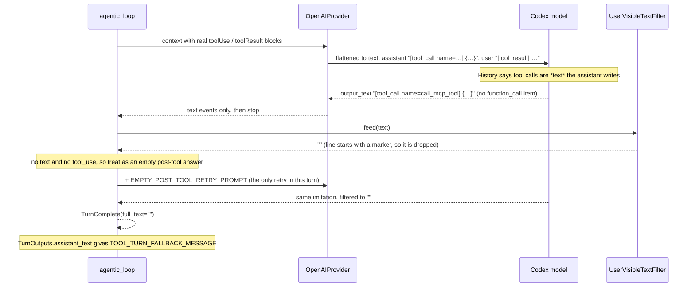
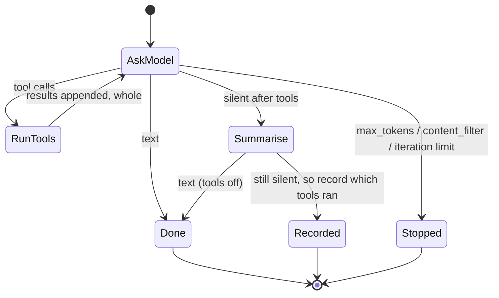

# LLD: The agent loop loses its final answer after tool calls

| Field | Value |
| --- | --- |
| Status | ✅ Implemented: phases 1–4 (log line, native Codex function calls, named loop steps with a tools-off summary, honest stop reasons, single nudge) |
| Last reviewed | 2026-10-06 |
| Scope | `src/llm/providers/openai.py`, `src/agents/agentic_loop.py`, `src/agents/architectures/krishna_memgpt.py`, `src/llm/providers/{anthropic,bedrock}.py` |
| Related | [Agent runtime refactor, P4](LLD-agent-runtime-refactor.md): already flagged the root cause as "out of scope" |

> **Summary:** The message *"The tools finished running, but I could not produce a final response from their
> results"* means the model produced **no visible text in the whole turn**. The main cause is the OpenAI (Codex)
> provider. It sends earlier tool calls and results to the model as **plain chat text**
> (`[tool_call name=…] {…}`, `[tool_result] …`) instead of native function-call items. Several calls into a
> tool-heavy turn, the model copies that pattern: it *types* its next tool call as text instead of making one. The
> loop's `UserVisibleTextFilter` then deletes that text, so the iteration has no text and no tool call. The single
> "empty response" retry hits the same thing, and the turn ends with the fallback. This is reproduced below against
> the real loop. Three more weaknesses make it worse or hide it:
> - the loop ignores *why* the model stopped;
> - the retry budget is one per turn;
> - "ask me to continue" doesn't work, because the next turn can't see any of the tool results.
>
> Tool results are deliberately **not** capped. The model must always see a complete result.

## How the failure happens



*The provider's own encoding teaches the model the wrong format, and the loop's filter then hides the evidence. The
retry sends the same misleading context, so it fails the same way.*

### Reproduced

A provider that makes one real tool call and then copies the history format (what the Codex model sees) produces
exactly the screenshot. Below is what `OpenAIProvider._convert_messages` sends on the final call:

```
model calls: 3
visible text: ''
saved reply: The tools finished running, but I could not produce a final response from their results. ...

--- what the Codex endpoint is sent on the last call ---
user      | update the tickets
assistant | [tool_call name=call_mcp_tool] {"mcp_id": "jira", "tool_name": "editJiraIssue"}
user      | [tool_result] customer found
user      | Review the original user request and the latest tool result. If any requested work remains…
user      | The previous response after receiving tool results was empty. Continue from the latest too…
```

The longer the turn, the more `[tool_call …]` text examples the model has seen. That is why it shows up "more and
more" on 20+ step MCP runs like the Jira one in the report.

## Findings, ranked

### F1. The OpenAI provider encodes tools as text (root cause)

`openai.py:149-154`:

```python
def _content_block_text(self, block):
    if isinstance(block, TextBlock):
        return block.text
    if isinstance(block, ToolUseBlock):
        return f"[tool_call name={block.name}] {json.dumps(block.input, ensure_ascii=True)}"
    return f"[tool_result] {block.content}"
```

and `_convert_messages` (`:100-121`) wraps every block as `input_text`/`output_text` in a chat message. Effects:

- The model never sees that its earlier calls were *function calls*, only text it wrote. So copying it is the
  reasonable thing to do.
- Tool results arrive as **user** text, which makes them indistinguishable from what the person typed.
- `agentic_loop.py:33,410-457` (`UserVisibleTextFilter`) exists only to scrub the copies. It turns a visible
  failure into a silent one.

### F2. The loop ignores why the model stopped

Every provider emits `LLMEvent(type="stop", content=<reason>)`:

- Anthropic: `stop_reason` (`anthropic.py:166`).
- Bedrock: `stopReason` (`bedrock.py:196`).
- OpenAI: always `"completed"` (`openai.py:272`).

`run_agentic_tool_loop` (`agentic_loop.py:154-167`) handles `text`, `tool_use` and `usage`, and drops `stop`. So these
all end up as the same generic fallback:

- `max_tokens` (Anthropic is hard-capped at `max_tokens: 4096`, `anthropic.py:95`);
- a content filter or guardrail;
- an incomplete Codex response.

OpenAI also never handles `response.incomplete` or `response.failed`. Those streams simply end, and the loop reads
them as "the model said nothing".

### F3. One empty-response retry per turn

`empty_post_tool_retry_used` (`agentic_loop.py:138,221-223`) is never reset. If one call early in a 22-step turn
came back empty, the final empty answer goes straight to the fallback with no retry. The retry also resends the same
context. If the cause is F1, it fails the same way.

### F4. "Ask me to continue" cannot work

The fallback is saved as the assistant reply. The next turn's history comes from
`message_repo.find_by_conversation`, which reads only `MESSAGE#` rows (`messages/repositories/dynamodb.py:51`).
Tool results live under `AUDIT#`. So after the fallback, the model **does not know that 20 `editJiraIssue` calls
happened**. "Continue" makes it either:

- **repeat the side effects** (edit the tickets again), or
- answer from nothing.

For tools that write, this is the most damaging part of the failure.

### F5. A synthetic user message is added after every tool batch

`agentic_loop.py:214` appends `POST_TOOL_CONTINUATION_PROMPT` as its own user message after every batch, and none
is ever removed. A 22-step turn carries 22 copies. It also repeats what the system prompt already says
(`ANCHOR_PERSIST` in `krishna_memgpt_system_prompt.j2`). It puts two user messages in a row (tool results, then the
nudge). With F1 that becomes several user texts in a row on Codex, as the repro shows.

### F6. Tool results are never cut, and that is deliberate

`handlers.py:144` `_json_result` passes the full MCP result to the model. **That stays.** A model shown part of a
result reasons confidently from half the data: it edits 25 of 60 issues and reports "done". A lost or partial
context costs far more, in redone work, duplicated side effects and tokens, than carrying a large result. Saving
tokens comes later, and only in ways that never hide data from the model.

### F7. Nothing in the logs explains a fallback

Nothing records how many characters the filter dropped, the stop reason, or the per-iteration counts of text and
tool calls. A fallback in production leaves no trace of whether F1 or F2 caused it.

## Design

### 1. Native function-call items for Codex (fixes F1)

The Responses API, which is what the Codex backend speaks (and what the Codex CLI itself sends with `store: false`),
takes function calls and outputs as their own input items:

```python
# src/llm/providers/openai.py
def _convert_messages(self, messages: list[ChatMessage] | list[dict]) -> list[dict[str, Any]]:
    """Text stays in chat messages; tool calls and results become the Responses API's own items."""
    items: list[dict[str, Any]] = []
    for message in _normalized(messages):
        text_type = self._text_block_type_for_role(message.role)
        texts: list[dict[str, Any]] = []
        for block in message.content:
            match block:
                case TextBlock(text=text):
                    texts.append({"type": text_type, "text": text})
                case ToolUseBlock(id=call_id, name=name, input=arguments):
                    items += _message(message.role, texts)
                    texts = []
                    items.append({"type": "function_call", "call_id": call_id, "name": name,
                                  "arguments": json.dumps(arguments, ensure_ascii=True)})
                case ToolResultBlock(tool_use_id=call_id, content=content):
                    items.append({"type": "function_call_output", "call_id": call_id,
                                  "output": content_text(content)})
        items += _message(message.role, texts)
    return items
```

Then **delete** `_content_block_text`, `UserVisibleTextFilter`, `INTERNAL_TOOL_MARKER_PREFIXES`, and
`test_agentic_loop_filters_internal_tool_markers_but_streams_status_text`. That removes about 50 lines and one
concept, and finishes the refactor LLD's P4 note.

**Verification:** a unit test on `_convert_messages`, and one manual multi-step MCP run against the real Codex
endpoint, because only the live backend can confirm it accepts these items. If it rejects `function_call_output`
without a stored response, the fallback is to keep text encoding but with neutral wording the model won't copy as
output (`Result of editJiraIssue: …`). That is weaker, but still better than marker text plus a filter.

### 2. A guaranteed final answer (fixes F3 and F4)

When the turn would otherwise end empty after tools ran, make **one final call with tools turned off**:

```python
# src/agents/agentic_loop.py
FINAL_SUMMARY_PROMPT = (
    "Tool use is finished for this turn. Using only the tool results above, tell the user what was done, "
    "what was found, and anything that failed or still needs their input."
)
```

- `tools=[]` means the model *cannot* answer with another call, real or typed, so it has to write text.
- This replaces `EMPTY_POST_TOOL_RETRY_PROMPT` and the `empty_post_tool_retry_used` flag. "Retry once with the same
  context" becomes "ask once for the one thing we need".
- If even that is empty, `TurnOutputs` saves a **deterministic record** instead of the vague fallback, built from
  the `TOOL_CALL_RESULT` events it already sees:

  > I ran 22 tool calls (editJiraIssue ×20 succeeded, searchJiraIssuesUsingJql ×1, list_mcp_tools ×1) but couldn't
  > write a summary. Ask me to summarise them; I won't repeat them unless you ask.

  Because this text is the saved assistant message, the **next turn knows what already happened**. That fixes F4
  without putting audit rows back into the history.

### 3. Honest stop reasons (fixes F2)

- Providers report a normalised reason in `stop.content`: `end_turn`, `tool_use`, `max_tokens` or
  `content_filter`. Each provider maps its own strings in one dictionary next to where it emits `stop`.
- OpenAI handles `response.incomplete` (`incomplete_details.reason`) as `max_tokens` or `content_filter`, and
  `response.failed` by raising, the same as the `error` event.
- The loop keeps the last iteration's reason. A turn that ends on `max_tokens` or `content_filter` with no text
  yields an `ERROR` event that says so ("The model hit its output limit…"), instead of the generic fallback.
- Anthropic's `max_tokens: 4096` becomes a module constant sized for long final summaries (16,000). The cap itself
  is fine; leaving it unstated is not.

### 4. One continuation nudge, not one per batch (fixes F5)

The nudge goes **inside** the tool-results message as a trailing text block, and the previous batch's nudge is
removed when the next one is added. That means no back-to-back user messages and at most one copy in the context.
Once §1 lands, measure whether the nudge is needed at all. `ANCHOR_PERSIST` may be enough, and if so, delete it.

### 5. One log line per model call (fixes F7)

```
Agent loop call=7 stop=end_turn text_chars=0 tool_calls=0 context_messages=48 context_chars=412310
```

`stop` is what the provider reported, which the loop otherwise drops. `context_chars` is a rough size (the `repr` of the context) for spotting runaway contexts, not a token count.

### 6. Name the loop's states (makes §2 and §3 simple)

The loop already is a state machine, a hidden one. Its state lives in three booleans
(`awaiting_post_tool_response`, `is_post_tool_response`, `empty_post_tool_retry_used`) plus an iteration counter and
`continue`/`break` jumps (`agentic_loop.py:137-228`). F3 is a flag that was never reset. §2 and §3 would add more
flags, so the states get names first:



*Each arrow is one return value. "Silent after tools" is the only way into Summarise, and Summarise runs at most once
per turn, because it has no edge back to AskModel.*

- **Shape.** A `Step` enum and one `match` inside the existing `run_agentic_tool_loop` async generator. Each state is
  a small function that streams its events and decides the next `Step`. The per-turn facts it needs (context, how
  many model calls so far, the last stop reason, whether tools ran) live in one `Turn` dataclass. Not in loose
  locals, and not in flags.
- **Not a framework.** No transition table, no library, nothing persisted. The turn still lives in one process.
- **Groundwork for durable turns.** [Durable agent orchestration](LLD-durable-agent-orchestration.md) needs to
  checkpoint and resume a run. With named states, that is "save `(step, turn)` at each transition". This design
  doesn't build any of that, but it stops making it harder.

## What shipped differently from the plan

- **A silent summary is not an error.** §2 and §3 suggested an `ERROR` when the summary call also hits a limit. But the
  architecture saves nothing after an `ERROR`, which would lose the tool record. So `SUMMARISE` always ends in
  `DONE`, `TurnComplete` carries `stop_reason`, and `TurnOutputs.record_of_tool_runs()` says why there was no
  summary. `STOPPED` with an `ERROR` is left for turns where no tool ran, so there is nothing to lose.
- **The iteration limit summarises too.** Hitting `MAX_TOOL_ITERATIONS` used to end in `MAX_ITERATIONS_MESSAGE` with
  nothing saved. It now goes to `SUMMARISE` with `ITERATION_LIMIT_SUMMARY_PROMPT`, so a 37-call run still reports
  what it did and what is left.
- **`StopReason` is three words, not four:** `end_turn`, `max_tokens`, `content_filter`. The loop already knows a
  tool call from its `tool_use` events, so `tool_use` added nothing. Providers map their raw reasons with
  `stop_reason_of(raw, MAPPING)` (`llm/providers/base.py`). Anything unmapped is `end_turn`.
- **The summary call uses the nudge slot.** `SUMMARISE` puts its prompt where the continuation nudge was, on the
  latest tool results, so it never adds a user message after a user message. Tool calls the model makes during that
  call are logged and ignored.
- **The record names tools the way the user sees them** (`display_tool_name`, so `editJiraIssue`, not
  `call_mcp_tool`), counts repeats, and counts failures.

## Rollout

| Phase | Change | Risk | Proves |
| --- | --- | --- | --- |
| 1 | §5 logging | none | confirms F1 vs F2 in production before anything else changes |
| 2 | §1 native Codex items, delete the filter | needs one live Codex check | removes the root cause |
| 3 | §6 named states, then §2 as the Summarise state | low | no turn ends without an answer; "continue" stays safe |
| 4 | §3 stop reasons as the AskModel → Stopped edge, §4 single nudge | low | the model's limits are reported, not hidden |

## Testing

- `test_openai_provider`: `_convert_messages` turns a `toolUse`/`toolResult` round trip into `function_call` and
  `function_call_output` items with matching `call_id`s. Assistant text before a call stays a message.
- `test_agentic_loop`:
  - a provider that goes silent after tools gets one final call with `tools == []`, and its text becomes the answer;
  - if that call is silent too, the saved reply lists the tool calls that ran;
  - a turn ending on `max_tokens` yields an `ERROR` that names it;
  - a 3-batch turn carries exactly one continuation nudge;
  - a large tool result reaches the next call whole, never truncated.
- Delete the marker-filter test along with the filter.
