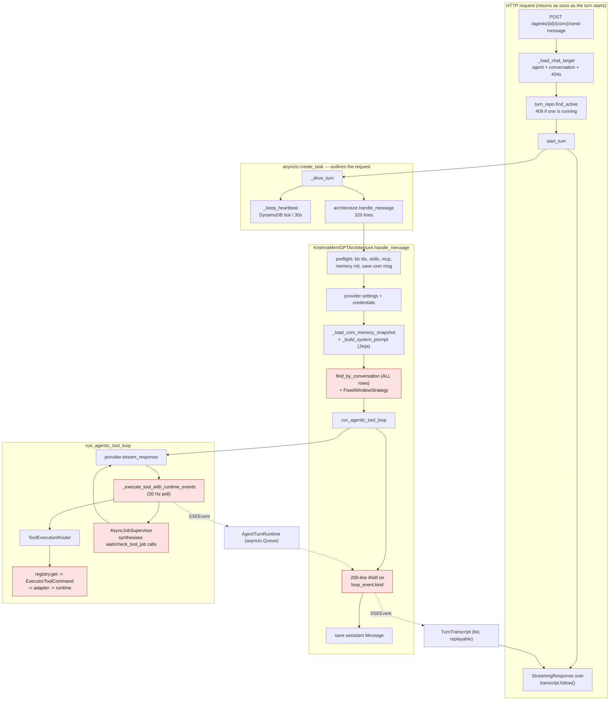
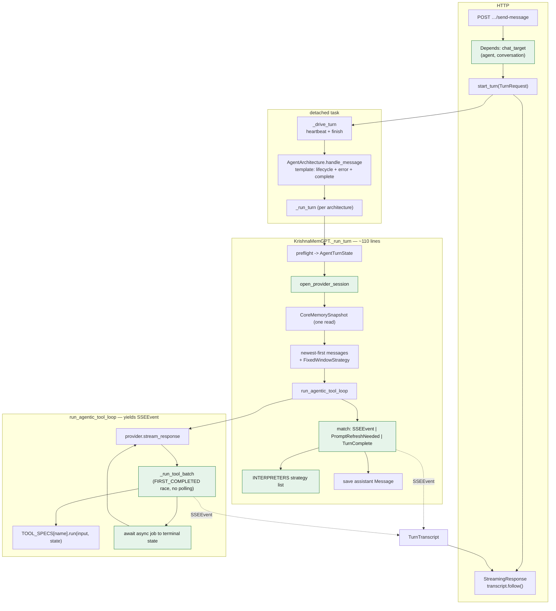

# LLD — Agent runtime refactor (message → async turn → agentic loop → prompt)

Status: **implemented** on `refactor/agent-runtime` (9 commits). This document is the plan it was
built from; the "Outcome" section below records what actually shipped and where reality diverged
from the estimates.

## Scope

Everything on the path from "an HTTP request carrying a user message arrives" to "the assistant
message is persisted":

| Area | Files | Lines |
| --- | --- | --- |
| HTTP entry | `src/agents/router.py` | 676 |
| Async turn | `src/agents/turns/{run,transcript,repository,models}.py` | 569 |
| Architectures | `src/agents/architectures/*` | 983 |
| Agentic loop | `src/agents/{agentic_loop,async_jobs,loop_context,turn_runtime}.py` | 742 |
| Tool runtime | `src/agents/tool_runtime/*`, `src/agents/tool_execution.py` | 852 |
| Prompt | `src/agents/prompt_templates/**`, `krishna_memgpt_prompt.py` | 213 |
| Adjacent, read for coupling | `src/llm/{events,conversation_strategy}.py`, `src/tools/native/*`, `src/messages`, `src/conversations` | — |

**Baseline:** `uv run pytest tests/test_agentic_loop*.py tests/test_chat_turn_*.py
tests/test_krishna_memgpt_*.py tests/test_tool_execution_commands.py tests/test_async_*.py
tests/test_agent_architecture_base.py tests/test_agents_router.py tests/test_tool_display.py
tests/test_conversation_strategy.py` → **91 passed**. Every phase below must keep this green.

**Headline estimate (see Outcome for what happened):** ~3,900 lines in scope, a net **~1,150 lines**
removed and **7 concepts** deleted, plus three real defects fixed (P0.1, P0.2, P1.4).

---

## Current flow



Red nodes are where the cost concentrates. Note the event path: a tool's `SSEEvent` goes into
`AgentTurnRuntime`'s queue, is wrapped in an `AgenticLoopEvent(kind="runtime_event")`, unwrapped by
the architecture's `if/elif`, then appended to `TurnTranscript`'s list — **four representations of
one event.**

---

## Findings

Ordered by leverage. Each has: evidence, which philosophy rule it breaks, the fix, the line delta,
and the risk.

### P0 — Correctness defects found while reading

These are not style issues. Fix them first, each with a regression test, independent of the refactor.

#### P0.1 Conversation context is silently truncated at DynamoDB's 1 MB page

`src/messages/repositories/dynamodb.py:42-55` — `find_by_conversation` issues **one** `table.query`
and never follows `LastEvaluatedKey`. Its three siblings (`find_by_conversation_paginated:70`,
`..._newest_first:107`) handle pagination; this one does not.

It is the method both architectures use to build LLM context
(`krishna_memgpt.py:213`, `krishna_mini.py:139`).

Compounding it: `krishna_memgpt.py:261-272` persists a `tool_call_audit` **system message per tool
call**, capped at 12,000 chars (`tool_audit.py:8`), under the same `MESSAGE#` sort-key prefix. So the
1 MB page fills with audit rows that `FixedWindowStrategy.build_context` then discards
(`conversation_strategy.py:91-93`, `role in {"user","assistant"}`).

**Failure:** a tool-heavy conversation crosses ~1 MB of `MESSAGE#` rows. The query returns the
*first* page — oldest rows, mostly audit — so the recent user/assistant turns are never read and the
model silently loses the recent conversation. No error, no log; `log.info(f"Found {len} messages")`
reports the truncated count as if complete.

**Fix** (two parts, both cheap):
1. Give audit messages their own sort-key prefix (`AUDIT#` rather than `MESSAGE#`) so the context
   query never reads them. Requires a read-path change in whatever renders the timeline — check
   `src/messages/responses.py` and the conversations router.
2. Build context from `find_by_conversation_newest_first(limit=...)` reversed, instead of
   "read everything, then drop 95% in Python". The strategy already walks backwards from the newest
   message (`conversation_strategy.py:114`), so newest-first is the natural read order.

**Delta:** ~+15 / −10. **Risk:** medium — touches the message read path. Needs a migration note for
existing `MESSAGE#`-prefixed audit rows (leave them; the filter still drops them).

#### P0.2 Fire-and-forget task can be garbage-collected mid-flight

`src/agents/tool_runtime/jobs/service.py:62-63`:

```python
def start_skill_action_job(self, job: ToolJob) -> None:
    asyncio.create_task(self.execute_skill_action_job(job.job_id))
```

The event loop holds only a weak reference to a task. With no strong reference kept, a job can be
collected before it completes — the documented CPython footgun. `turns/run.py:53` gets this right
(`transcript.task = asyncio.create_task(...)`).

**Failure:** under GC pressure the skill action never runs; the job row sits in `RUNNING` until
`_fail_stale_job` marks it stale 10 minutes later (`jobs/service.py:116-128`), and the agent's turn
burns its whole async-wait budget waiting for a job nobody is executing.

**Fix:** keep a module-level `set[asyncio.Task]`, `add_done_callback(discard)`. 4 lines.

**Delta:** +5. **Risk:** none.

#### P0.3 Two sources of truth for "memory block nearing capacity"

`krishna_memgpt.py:546` computes `percent >= CAPACITY_WARNING_THRESHOLD * 100`, while
`prompt_templates/krishna_memgpt/sections/core_memory.j2` independently hardcodes
`(block.word_count / block_def.word_limit) >= 0.8` to render `STATUS=NEARING_CAPACITY`.

Changing `CAPACITY_WARNING_THRESHOLD` in `src/common` silently desynchronises the `<core_memory>`
badge from the `<memory_warning>` section. Violates *Do not create duplicate sources of truth*.

**Fix:** compute once. Put `nearing_capacity` and `percent` on `CoreMemoryBlockSnapshot` so the
template reads `` and `_check_capacity_warnings_from_snapshot`
becomes a one-line comprehension over the snapshot. Behavior near the data it belongs to.

**Delta:** −15. **Risk:** low. `tests/test_krishna_memgpt_prompt.py` covers rendering.

---

### P1 — Major structural work (the bulk of the win)

#### P1.1 Collapse the four-layer event stack — delete `AgenticLoopEvent`

**Evidence.** `agentic_loop.py:91-97` defines `AgenticLoopEvent(kind: str, payload: dict[str, Any])`.
Nine `kind` strings flow out of it, and `krishna_memgpt.py:228-432` is a **205-line `if/elif` chain**
that unpacks `payload[...]` back into `SSEEvent`. Seven of the nine kinds are a pure 1:1 rename:

| `kind` | becomes | translation site |
| --- | --- | --- |
| `text` | `AGENT_RESPONSE_TO_USER` | `krishna_memgpt.py:229` |
| `tool_call_start` | `TOOL_CALL_START` | `:234` |
| `tool_call_result` | `TOOL_CALL_RESULT` | `:255` |
| `token_usage` | `TOKEN_USAGE_UPDATE` | `:418` |
| `runtime_event` | passthrough, unwrapped | `:412` |
| `failed` | `ERROR` | `:432` |
| `complete` | sets `full_response` | `:430` |

Only `prompt_refresh_needed` and `complete` are genuinely control signals rather than events.

The `payload` dict is stringly-typed throughout: `loop_event.payload["tool_call_id"]` at three call
sites, `payload.get("message", "Agent run failed")` at one. `AgenticLoopResult` (`:99-101`) is
defined and never used anywhere. This is the *bad abstraction* the philosophy names explicitly — it
requires learning the mechanism, the abstraction, **and** the mapping between them.

**Fix.** The loop yields `SSEEvent` directly, plus a two-member typed union for control:

```python
@dataclass(frozen=True)
class PromptRefreshNeeded: ...

@dataclass(frozen=True)
class TurnComplete:
    full_text: str

LoopYield = SSEEvent | PromptRefreshNeeded | TurnComplete
```

`SSEEvent` already carries every field the architecture reads back out: `content`, `tool_name`,
`tool_args`, `success`, `message_id`. Nothing new is needed on it.

The architecture's chain then becomes three named handlers instead of one 205-line ladder:

```python
async for item in run_agentic_tool_loop(...):
    match item:
        case TurnComplete(full_text=text):
            full_response = text
        case PromptRefreshNeeded():
            context[0]["content"] = self._refresh_system_prompt(agent, actor_id)
        case SSEEvent() as event:
            audit.observe(event)                 # persists tool_call_audit rows
            yield from interpret(event)          # ui_form / canvas / auth_required + the event
```

**Delta:** −190 (`krishna_memgpt.py`), −55 (`agentic_loop.py`). **Risk:** medium — it is the widest
diff in the plan, but every change is mechanical and `tests/test_agentic_loop.py` (499 lines) plus
`tests/test_krishna_memgpt_tool_audit.py` (558 lines) assert the observable events. Those tests will
need their `kind`/`payload` assertions rewritten to `event_type` — that rewrite *is* the proof the
abstraction was redundant.

#### P1.2 Replace the synthetic-tool-call async-job machinery with `await`

**Evidence.** `async_jobs.py` (90 lines) + `agentic_loop.py:132-410` (~120 lines) implement this:
a tool returns `{"async": true, "status": "queued", "job_id": ...}`; the loop then **fabricates a
`wait` tool call** (`async_jobs.py:55-63`), appends a 7-line natural-language instruction telling the
model to poll (`agentic_loop.py:412-428`), fabricates `check_tool_job` calls after the wait
(`async_jobs.py:65-74`), and appends the instruction *again* if jobs remain (`:354-367`).

The job runs **in the same process** — `ToolJobService.execute_skill_action_job` is an in-process
coroutine (`jobs/service.py:65`). The loop already knows the `job_id` and owns the deadline. So the
machinery asks the LLM, over several extra round trips, to poll something the loop can simply await.

Cost of the current design, per async tool call: 2–N extra LLM calls (billed, latency), ~400 extra
prompt tokens of polling instructions, two synthetic tool-call events in the user-visible timeline,
and a `max_tool_iterations` guard that must be specially disabled while jobs are live
(`agentic_loop.py:431-441` — `_max_iterations_exceeded` exists only to except this case).

**Fix.** When `track_tool_result` sees a queued job, the loop awaits the job's completion itself
(bounded by the existing `ASYNC_TOOL_MAX_IN_TURN_WAIT_SECONDS`) and substitutes the terminal payload
as that tool's result. The model sees one tool call with one real result. Progress stays visible by
emitting `LIFECYCLE_NOTIFICATION` from the wait — which is what the `AgentTurnRuntime` channel is
already for.

Deletes: `async_jobs.py` entirely, `_build_async_job_followup_instruction`,
`_max_iterations_exceeded`, `AsyncToolJobStillRunningError`'s duplicated raise sites
(`agentic_loop.py:140-144` and `:403-407` raise the identical 2-sentence message), and the
`needs_async_final_response` / `completed_wait` / `checked_tool_uses` / `checked_results` bookkeeping.

**Delta:** −90 (`async_jobs.py` deleted), −130 (`agentic_loop.py`). **Risk:** high — this changes
model-visible behavior and the chat timeline. `tests/test_async_jobs.py` (69 lines) and
`tests/test_async_tool_runtime.py` (435 lines) encode the current contract and would be substantially
rewritten.

> **Needs your decision.** This is the single largest simplification available and the only item that
> changes what the model sees. If you would rather keep the model-driven polling (e.g. because you
> want the agent to narrate progress in its own words), say so and I will cut this item and keep the
> rest — the other phases do not depend on it.

#### P1.3 Collapse the five-layer tool dispatch

**Evidence.** Calling one tool traverses:

```text
loop → ToolExecutionRouter.execute → registry.get → ExecutorToolCommand.execute
     → spec.input_model.model_validate → .model_dump(by_alias, exclude_none, exclude_unset)
     → context_resolver.resolve(context_type) → executor adapter → isinstance() guard → runtime
```

This is verbatim the indirection chain `CODE_PHILOSOPHY.md` rejects under *Prefer direct code over
indirection*. Measured against *what is actually read*, most of it is inert:

- `ToolCommandMetadata.idempotency` (`commands.py:31`) — set in **9** places
  (`native/specs.py:40,45,50,55`, `skills.py:78,88,97`, `mcp.py:21,31`), **read nowhere**.
- `ToolCommandMetadata.allow_parallel` (`commands.py:34`) — set in 4 places, **read nowhere**. Tools
  still execute strictly sequentially (`agentic_loop.py:258`).
- `ToolExecutionContext` (`contexts.py:19-25`) — registered in the resolver (`:69`), requested by **no
  spec**. Dead.
- `ToolTextOutput` + `output_model` (`commands.py:37,176-178`) — validates a `str` into
  `{"result": str}` then immediately does `str(output.result)`. A provable no-op.
- `ToolCommand` Protocol's `input_model` / `context_type` / `output_model` properties
  (`commands.py:104-114`) — the only readers are three assertions in
  `tests/test_tool_execution_commands.py:197-199` that check they are `not None`. The abstraction
  exists to satisfy a test that tests the abstraction.
- `ToolCommandRegistry.definitions()` (`registry.py:30`) — unused;
  `definitions_for_categories` is the only live method.
- The input round-trip is subtly lossy: `model_dump(exclude_unset=True)` after
  `model_validate` drops fields the caller passed as their default, and `by_alias=True` renames
  `async_` → `async` (`skill_contracts.py:20`) — which happens to be needed, and is the *only* thing
  the round-trip accomplishes.
- `ToolExecutionRouter.__init__` (`tool_execution.py:29-41`) has two mutually exclusive modes: pass a
  `registry`, or pass three runtimes and let it build one. The single production caller
  (`krishna_memgpt.py:206`) passes **both**.

**Fix.** One dataclass, one dict, one function:

```python
@dataclass(frozen=True)
class ToolSpec:
    definition: dict[str, Any]
    category: ToolCommandCategory
    run: Callable[[dict[str, Any], AgentTurnState], Awaitable[str]]
    input_model: type[BaseModel] | None = None      # kept: it does real alias work
    mutates_prompt_context: bool = False
    timeout_seconds: float | None = None
```

`ExecutorToolCommand`, `ToolCommand`, `ToolExecutor`, `ToolContextResolver`,
`ToolExecutionContext`, `ToolTextOutput`, and the three `*ToolExecutor` adapter classes with their
`isinstance` guards all collapse. The three context dataclasses (`NativeToolContext`,
`SkillToolContext`, `MCPToolContext`) stay — they are honest value objects — but are built directly
from `state` at the call site instead of through a registry of lambdas.

`MCPToolExecutor.execute` (`executors.py:110-151`) also branches on `tool_name` *inside* an executor
that was registered per-tool-name — two dispatches for the same decision. Register
`list_mcp_tools` and `call_mcp_tool` with their own `run` callables and the branch disappears,
along with its hand-rolled validation (`:137-140`) that duplicates what `CallMCPToolInput` already
enforces.

**Delta:** −265 across `tool_runtime/` + `tool_execution.py`. **Risk:** medium.
`tests/test_tool_execution_commands.py` (357 lines) needs rewriting — mostly deleting assertions
about the removed layers.

#### P1.4 The tool-execution event pump spins at 20 Hz for the tool's whole duration

`agentic_loop.py:444-474`:

```python
while not tool_task.done():
    try:
        event = await asyncio.wait_for(runtime.next_event(), timeout=0.05)
    except TimeoutError:
        continue
```

Every tool call wakes the event loop 20×/second for as long as it runs, and each wakeup allocates a
`wait_for` timeout handle and a cancelled `Queue.get` waiter. A 10-minute async skill action
(the documented budget, `agentic_loop.py:36`) is **12,000 wakeups**. With several concurrent chat
turns on one worker — the explicit goal of the async-turn design — this is pure contention on the
shared loop. It also adds up to 50 ms of latency to every image-generation partial.

**Fix.** Race the two awaitables instead of polling:

```python
getter = asyncio.ensure_future(runtime.next_event())
while True:
    done, _ = await asyncio.wait({tool_task, getter}, return_when=asyncio.FIRST_COMPLETED)
    if getter in done:
        yield getter.result()
        getter = asyncio.ensure_future(runtime.next_event())
    if tool_task in done:
        getter.cancel()
        break
```

Zero wakeups while idle, zero added latency, same semantics.

**Delta:** ±0 lines, strictly better behavior. **Risk:** low — `tests/test_async_tool_runtime.py`
covers the event ordering. Careful with the final `drain_available()` (`:469`) so no event is lost
between the last `getter` and `tool_task` completing.

#### P1.5 Every repository builds its own boto3 resource — a fresh TLS handshake per repository

**Evidence.** `src/db/dynamodb.py:17-34` returns `boto3.resource("dynamodb", **kwargs)` with **no
caching**; there is not one `lru_cache` in `src/` (verified). 41 call sites construct it, and each
repository calls it in `__init__`.

One `send-message` request constructs, at minimum:

| Where | Repositories constructed |
| --- | --- |
| `router.py:477,490` | `ConversationRepository`, `ConversationTurnRepository` |
| `Depends(get_agent_repository)` | `AgentRepository` |
| `turns/run.py:50` | `ConversationTurnRepository` |
| `turns/run.py:92-93` | `ConversationTurnRepository`, `ConversationRepository` |
| `krishna_memgpt.__init__:80-88` | `MessageRepository`, `MemoryRepository`, `ProviderSettingsRepository`, `AgentKnowledgeBaseRepository`, `NativeToolHandler`→`MessageRepository` |
| `SkillRuntimeService()` → `SkillService()` → `ToolJobService()` | `AgentSkillRepository`, `ToolJobRepository`, + connector/settings repos |
| `MCPConnectorService()` | `MCPConnectionRepository`, `AgentRepository` |

**~15 boto3 resources per message.** Measured on this machine: 59 ms cold, **1.6 ms warm** per
construction — so ~24 ms of pure object construction per turn. That is the small half.

The large half: each `boto3.resource` gets its **own urllib3 connection pool**. Fifteen independent
pools means DynamoDB calls cannot reuse a keep-alive connection across repositories, so most calls
pay a fresh TCP + TLS handshake (tens of ms each, to a different AZ). Every turn does dozens of
DynamoDB calls across these repositories.

Architectures are rebuilt per turn too: `get_agent_architecture` (`architectures/factory.py:35-47`)
constructs the factory dict *inside* the function and returns a new instance every call, so the whole
object graph above is rebuilt for each message.

**Done: connection caching only.** `get_dynamodb_resource` / `get_dynamodb_client` now cache per
thread (`threading.local`, not a global or `lru_cache`, because boto3 *resources* are not documented
thread-safe and `agentic_loop` records token usage under `asyncio.to_thread`). Tests reset the cache
per `mock_aws` context. The full suite got ~8% faster as a side effect.

**Deliberately not done**, after measuring: memoizing the architecture instances and the leaf
repository factories. Once connections are pooled, constructing
`KrishnaMemGPTArchitecture` costs **2.4 ms** warm — irrelevant next to an LLM turn. Sharing one
instance would mean its repositories hold a `Table` bound to whichever thread built it, plus another
reset hook to stop instances leaking across test `mock_aws` contexts. That is real coupling bought
for 2.4 ms, so it fails the complexity budget. `get_message_repository("in_memory")` must stay
uncached regardless: it is stateful, and two callers already rely on getting a fresh one.

> **Thread-safety caveat — read before doing this.** `boto3` *clients* are documented thread-safe;
> *resources* are not. `agentic_loop.py:205` already calls `asyncio.to_thread(usage_service.record_usage, ...)`,
> so at least one repository is used off the main thread. Cache with that in mind: either cache the
> resource behind a `threading.local`, or cache a shared **client** and keep `Table` operations on it.
> I would verify which repositories can run off-thread before flipping the switch. This is the one
> item in the plan where "obvious one-line fix" deserves suspicion.

**Delta:** +10 lines, meaningful latency reduction per turn. **Risk:** medium — see caveat.

#### P1.6 `NativeToolHandler` carries mutable per-turn state; the fallback path it exists for is dead

**Evidence.** `src/tools/native/handlers.py:92-101` exposes `set_conversation_context`,
`set_knowledge_base_context`, `set_user_context`, writing to `self._conversation_id`,
`self._linked_kb_ids`, `self._user_id`. `krishna_memgpt.py:123-124,139` calls all three at the start of
every turn.

Then `handlers.py:120-135` branches on how to read them:

```python
if isinstance(context, NativeToolContext):
    agent_id, user_id, conversation_id, linked_kb_ids = context...
else:
    agent_id = context           # context is a bare str
    user_id = self._user_id      # ...the mutable fields
```

The `else` branch is dead. The only caller is `executors.py:78`, reached only through
`NativeToolExecutorAdapter`, which raises unless the context **is** a `NativeToolContext`
(`executors.py:76-77`). So the mutable fields are written every turn and never read — while being the
sole reason a `NativeToolHandler` (and therefore the whole architecture) cannot be shared between
concurrent turns.

**Failure this prevents:** if P1.5's memoisation were applied *without* this fix, two concurrent turns
for different users would race on `self._user_id`, and one user's memory writes could be scoped to
the other's `actor_id`. A cross-tenant memory leak. Fixing P1.6 is a **precondition** for P1.5 step 2.

**Fix.** Delete the three setters, the three fields, the `| str` in the `context` annotation, and the
`else` branch. `NativeToolHandler` becomes stateless and safely shareable.

**Delta:** −25. **Risk:** low, once the caller audit above is confirmed by the type checker.

#### P1.7 Both architectures duplicate the same turn skeleton

`krishna_mini.handle_message` (`:90-191`) and `krishna_memgpt.handle_message` (`:117-478`) both do,
in the same order: save user message → emit `USER_MESSAGE_SAVED` → emit "Loading provider
configuration…" → `find_by_provider` → emit `ERROR` and return if missing → `load_provider_credentials`
→ `merge_thinking_override` if Ollama → emit "Building conversation context…" → `find_by_conversation`
→ build context → emit "Connecting to AI model…" → `get_llm_provider` → stream → save assistant
message → emit `ASSISTANT_MESSAGE_SAVED` → emit `STREAM_COMPLETE` → and wrap the whole body in
`try/except Exception` → `ERROR`.

The provider block (`krishna_mini.py:107-131` ≡ `krishna_memgpt.py:167-191`) is 25 duplicated lines,
and a third near-copy lives in `image_generation/service.py`.

The `try/except → ERROR` wrapper is duplicated a **third** time in `turns/run.py:147-150`, which also
catches `Exception` and records an `ERROR` event — so a failure inside `handle_message` is caught,
converted to an event, and then the turn driver treats that event as the failure reason
(`turns/run.py:126-127`). Two error paths for one error.

**Fix.**
- `src/agents/provider_session.py`: `async def open_provider_session(agent, owner_email) -> ProviderSession`
  returning `(provider, credentials, model)`, raising `ProviderNotConfigured`. One home for the
  credential + Ollama-override logic, reusable by `image_generation/service.py`.
- Make `handle_message` a **template method** on `AgentArchitecture`: it emits the lifecycle events,
  wraps `_run_turn` in the `try/except → ERROR`, and emits `STREAM_COMPLETE`. Subclasses implement
  `_run_turn` and just yield content events. Guarantees every architecture — including future ones —
  reports errors and completion identically, instead of relying on each one remembering to.

After this, `krishna_mini` is ~45 lines of real behavior and `krishna_memgpt.handle_message` ~110.

**Delta:** −120 across the two architectures and `base.py`, +45 for `provider_session.py`.
**Risk:** low–medium. `tests/test_agent_architecture_base.py` and `tests/test_ollama_thinking_wiring.py`
cover this; 5 external callers use `handle_message`/`handle_message_buffered`
(`widget/router.py:520,794`, `a2a/service.py:233,290`, `scheduler/executors.py:61`,
`automations/runner.py:345`, `skills/agent_invocation/actions.py:44`,
`skills/league_insights_report/report_agent.py:38`) — the public signature must not change.

#### P1.8 Replace the tool-result `if` chain with a strategy list

`krishna_memgpt.py:279-336` inspects every tool result for three unrelated side-channels, inline:

```python
parsed = json.loads(result) if isinstance(result, str) else None
if isinstance(parsed, dict) and parsed.get("type") == "ui_form_render":   # 20 lines of .get() guards
if isinstance(parsed, dict) and parsed.get("type") == "canvas_artifact" and parsed.get("ok"):
if isinstance(parsed, dict):  fallback = fallback or _auth_required_credential_message(parsed)
```

Nested `isinstance` + `.get()` guards, five levels deep in places (`:284-288` re-checks
`isinstance(parsed.get("form"), dict)` three times).

This is the same shape as `tool_display.py`, which already solves it well with an ordered
`_RESOLVERS: list[_Resolver]` and one selection loop (`tool_display.py:26-37`). Follow the convention
the codebase already established.

**Fix.** `src/agents/tool_results.py`: one `ToolResultInterpreter` protocol, three implementations
(`UiFormRender`, `CanvasArtifact`, `AuthRequiredCredential`), and an `INTERPRETERS` list. Each
implementation validates its own payload with a small Pydantic model, so the `.get()` guard pyramid
becomes a model definition. The architecture keeps one loop:

```python
for interpreter in INTERPRETERS:
    yield from interpreter.interpret(parsed, into=turn_outputs)
```

New tool side-channels then land as one new class in one file — not another branch in the 205-line
ladder.

**Delta:** −60 in `krishna_memgpt.py`, +75 in `tool_results.py` (net +15, but the payload guards
become declarative and testable in isolation). **Risk:** low. This is the pattern you have asked for
before; `tests/test_html_canvas_skill.py` and `tests/test_artifacts.py` cover the behavior.

---

### P2 — Smaller structural cleanups

#### P2.1 `router.py`: four endpoints repeat the same turn lookup

`get_active_turn:523`, `stream_turn_events:546`, `stop_turn:587` each call `_load_chat_target(...)`
with the same five arguments, then `ConversationTurnRepository().find_by_id(turn_id)`, then the same
triple guard:

```python
if not turn or turn.conversation_id != conversation_id or turn.agent_id != agent_id:
    raise HTTPException(status_code=404, detail="Turn not found")
```

verbatim at `:573` and `:606`.

**Fix.** Two FastAPI dependencies — `chat_target` → `(agent, conversation)` and `chat_turn` →
`(agent, conversation, turn)`. Each endpoint body drops to 3–6 lines and the guards live in one
place. This is *Prefer framework primitives*: dependencies are what FastAPI provides for exactly
this.

**Delta:** −55. **Risk:** low. `tests/test_agents_router.py` covers it.

#### P2.2 `router.py`: local imports shadowing module imports

`HTTPException` is imported at `:1` and re-imported inside `get_agent` (`:248`) and `update_agent`
(`:350`). `settings` is imported inside `_agent2agent_sharing_response` (`:118`).
`krishna_memgpt.py` does the same with `AgentTurnState` (`:121`), `run_agentic_tool_loop` (`:200`),
`build_krishna_memgpt_system_prompt` (`:500`), and `CoreMemory*Snapshot` (`:518-522`) — and
`krishna_mini.py:208` imports `datetime` inside `_build_context`.

Some of these were presumably circular-import workarounds. `AgentTurnState` is already imported
under `TYPE_CHECKING` at `krishna_memgpt.py:44`, so at least that one is not. Audit each: hoist what
can be hoisted, and leave a one-line `# circular: X imports Y` comment on any that genuinely cannot.
Right now a reader cannot tell which is which.

**Delta:** −10. **Risk:** none (the type checker proves it).

#### P2.3 `turns/run.py`: parameter threading and two lifecycle lies

- `start_turn` takes 8 keyword params and forwards all 8 plus two more to `_drive_turn` (`:53-65`).
  A `TurnRequest` frozen dataclass makes both signatures one parameter.
- `_drive_turn:98-109` records "Loading agent information…" then "Validating conversation…" — but the
  agent and conversation were both loaded and validated in the HTTP handler *before* `start_turn` was
  called (`router.py:480`). These two events describe work already finished. Delete them, or move
  them to the handler where they would be true.
- `failed_error` + the if/else at `:131-143` is one call:
  `turn_repo.finish(turn, FAILED if failed_error else SUCCEEDED, error=failed_error, assistant_message_id=turn.assistant_message_id)`.
- `conversation_repo.save(conversation)` (`:129`) is **load-bearing, and buggy.** Confirmed: it exists
  to bump `updated_at`, which `conversations/repository.py:110,143` sorts conversation lists by
  (`updated_at or created_at`, descending) and the SPA renders as last activity
  (`ConversationSidebar.tsx:87`, `Overview.tsx:111,381`). So the touch must stay — but three things
  about it are wrong:
  1. It costs a `find_by_id` **plus** a full `put_item` (`conversations/repository.py:57-64`) — two
     DynamoDB round trips on the critical path to write one timestamp.
  2. **Lost update.** `save()` re-reads the row, then writes back the `Conversation` object that was
     loaded in the HTTP handler *before the turn started*. If the user renames the conversation while
     the turn runs, the turn's save at the end silently restores the old title.
  3. It is skipped on the failure path (`:131-143` only saves on success), so a conversation whose
     turn failed does not move up the sidebar even though the user did send a message.

  **Fix:** one targeted `update_item` setting `updated_at`, called on every terminal path. Kills the
  extra read, the clobber, and the asymmetry. Same call exists in `a2a/service.py:241` and
  `widget/router.py:527` and should use the same helper.

**Delta:** −35. **Risk:** low. `tests/test_chat_turn_run.py` (345 lines) covers this closely.

#### P2.4 Prompt builder carries three parameters it deletes on entry

`krishna_memgpt_prompt.py:39-42`:

```python
) -> str:
    # These are kept in the signature as a stable architecture seam.
    del memory_repo, agent_id, user_id
```

Three parameters exist solely to be discarded, justified by a comment about a future seam. That is
precisely *Progress beats speculative stability* / "extension points nobody needs". Delete them and
the three arguments at the two call sites (`krishna_memgpt.py:504-506`).

**Delta:** −12. **Risk:** none. Update `tests/test_krishna_memgpt_prompt.py`.

#### P2.5 Core memory is read three times per turn

Within one turn:
1. `_ensure_memory_initialized:481` → `get_block_definitions(agent_id, user_id)`
2. `_load_core_memory_snapshot:524-525` → `get_block_definitions` **again** + `get_all_core_memories`
3. On `prompt_refresh_needed` (`krishna_memgpt.py:395`) → both again

So 4 DynamoDB reads minimum, 6 if any tool writes memory. Steps 1 and 2 can be one read: load the
snapshot first, initialise only if `block_defs` is empty, and reuse it.

Also, `_load_core_memory_snapshot:518-546` is 30 lines of comprehension mapping repository models to
snapshot models inside the architecture. That mapping belongs on `CoreMemorySnapshot.from_blocks(...)`
in `src/memory/snapshot.py` — *put behavior near the data it belongs to*.

**Delta:** −30 in `krishna_memgpt.py`, +15 in `memory/snapshot.py`. **Risk:** low.

#### P2.6 Registry rebuilt per turn from static module constants

`NATIVE_TOOL_SPECS`, `SKILL_TOOL_SPECS`, `MCP_TOOL_SPECS` are module-level immutable lists, yet
`build_default_tool_command_registry` runs per turn (`krishna_memgpt.py:203`) and
`ToolExecutionRouter.__init__` would build a second one. After P1.3 the registry is a plain
`dict[str, ToolSpec]` that can be built once at import.

**Delta:** −15. **Risk:** low.

#### P2.7 Two conventions for building a system prompt

`krishna_memgpt` renders Jinja templates from `prompt_templates/`; `krishna_mini._build_context`
(`:193-236`) builds its system prompt as a 14-line Python f-string heredoc — whose `<identity>` block
duplicates `sections/identity.j2` almost verbatim (same "Sentient AI created by InnomightLabs in
2026", same timestamp line, same four core directives with different wording).

Two sources of truth for the product's identity text, in two formats. Move `krishna_mini`'s prompt to
`prompt_templates/krishna_mini_system_prompt.j2` and `` the shared `identity.j2`.
*Convention over configuration*: one way to write a prompt in this codebase.

**DECIDED: the memGPT wording wins.** `krishna_mini` adopts `sections/identity.j2` verbatim, so its
prompt changes from "respond naturally and conversationally, like a knowledgeable friend … avoid
bullet points, numbered lists, or overly structured formats unless specifically requested" to memGPT's
"Answer naturally and directly. Keep routine replies concise, usually under 50 words, unless the user
asks for detail or the task requires it." Both cap at ~50 words; memGPT's is less prescriptive about
formatting. `krishna_mini` has no memory, skills, or MCP, so the shared identity's CAPABILITY line
("You have long-term memory tools, connected knowledge sources…") would be false for it — guard that
one line with `` rather than forking the template.

**Delta:** −20 Python, +12 Jinja. **Risk:** low, but it is a live prompt-behavior change for every
`krishna-mini` agent. Worth an eyeball on one real mini conversation after the change.

#### P2.8 Duplicated DynamoDB envelope across turn and job models

`turns/models.py` and `tool_runtime/jobs/models.py` independently implement the identical pattern:
`pk`/`sk`/`gsi2_pk`/`gsi2_sk` properties, `to_dynamo_item()` stamping `entity_type`,
`from_dynamo_item()` popping the same five keys, and a TTL `default_factory`. `_as_aware_utc` is
copy-pasted into `turns/models.py:121` and `jobs/service.py:131`.

`jobs/models.py:119-128` also defines `_convert_floats_to_decimals` — the exact inverse of
`convert_decimals`, which lives in `src/utils/dynamodb.py` and is imported two lines above (`:10`) —
and imports `Decimal` inside the function body.

**Fix.** Move `_as_aware_utc` and `_convert_floats_to_decimals` next to `convert_decimals` in
`src/utils/dynamodb.py`. Whether to extract a shared `DynamoEntity` base is a judgement call: two
instances is the threshold where the philosophy says *wait until the pattern is visible*. I would
move the two helpers now and leave the base class until a third entity appears.

**Delta:** −30. **Risk:** low.

---

### P3 — Dead code to delete outright

| What | Where | Why dead |
| --- | --- | --- |
| `_format_content_with_attachments` (24 lines) | `krishna_memgpt.py:594-617` | No callers. Byte-identical to the live `FixedWindowStrategy._format_with_attachments` (`conversation_strategy.py:131`). |
| `AgenticLoopResult` | `agentic_loop.py:99-101` | Defined, never referenced. |
| `ToolExecutionContext` + resolver registration | `contexts.py:19-25,68-78` | No spec requests it. |
| `ToolCommandMetadata.idempotency`, `.allow_parallel` | `commands.py:31,34` + 13 assignments | Written, never read. |
| `ToolTextOutput` + `output_model` plumbing | `commands.py:37,49,112,152,176` | `str` → model → `str` no-op. |
| `ToolCommandRegistry.definitions()` | `registry.py:30` | Unused. |
| `if False: yield` placeholder | `base.py:79-83` | Only there to make an abstract method a generator; a docstring-only body with the right return annotation does the same. |
| `self.max_context_words` | `krishna_mini.py:56`, `krishna_memgpt.py:81` | Stored, then only used on the next line to build the strategy. |
| `AgentTurnState.tools` | `runtime_state.py:43` | Assigned and read once, adjacent lines (`krishna_memgpt.py:204,213`). A local. |
| Stale bytecode | `src/agents/__pycache__/{context_compaction,prompt_pipeline}.cpython-313.pyc` | No corresponding source. Confirm `__pycache__` is gitignored; if it is tracked, remove it. |

**Delta:** −110. **Risk:** none. Do this as its own commit — it makes every later diff smaller.

---

### P4 — Noted, out of scope, worth filing

- **`UserVisibleTextFilter` exists to undo a provider decision.** `agentic_loop.py:477-516` (40 lines)
  strips `[tool_call …]` / `[tool_result]` prefixes from streamed text. Those markers are created by
  `src/llm/providers/openai.py:150-151`, which flattens `ToolUseBlock`/`ToolResultBlock` into *text*
  when encoding the request. The model then imitates the pattern in its output, and the loop scrubs
  it. The honest fix is in the OpenAI provider (emit native function-call items), after which the
  filter can be deleted — but that is a provider change, not a runtime change.
- **`send_message`'s error contract differs from its siblings — DECIDED: align it.**
  `router.py:487-488` catches the 404 from `_load_chat_target` and returns **HTTP 200** with an
  in-stream `ERROR` event, while `get_active_turn` / `stream_turn_events` / `stop_turn` let the same
  404 surface. Two different answers to "this agent does not exist" on adjacent endpoints.

  **This needs no SPA change** (correcting an earlier assessment): `ChatService.sendMessage` already
  has the branch — `if (!response.ok) { throw new Error(errorData.detail || ...) }` routes to
  `onError`, right below the existing `409` handling. So the change is deleting the `try/except
  HTTPException` wrapper and the `_sse_error` helper from `router.py` — **−18 lines**, and the SPA
  starts surfacing a real error instead of a fake successful stream. Moves from P4 into **phase 4**.
- **`SSEEvent` is a 30-field flat model** (`llm/events.py:48-93`) where ~27 fields are `None` on any
  given event. It is genuinely convenient for SSE serialisation and is used everywhere, so I am not
  proposing a discriminated union — but it is why the architecture's translation layer reads as a
  pile of keyword arguments, and it is worth revisiting if the SPA ever gets typed event handling.
- **`image_generation/service.py` (583 lines)** re-implements the provider-credential block and the
  user-message/assistant-message persistence pair. After P1.7 lands, it should adop
  `open_provider_session`. Full review deferred — it is a sibling of this path, not on it.

---

## Target flow



Green nodes are new or rewritten. One event type (`SSEEvent`) now travels the whole path; the
transcript is the only place events are retained.

---

## Sequenced plan

Each phase is one commit (or a small series), independently shippable, with the 91-test baseline green
before moving on. Phases 1–3 carry almost no risk and shrink every later diff.

| Phase | Contents | Net lines | Risk |
| --- | --- | --- | --- |
| **1. Delete dead code** | All of P3 | −110 | none |
| **2. Fix the three defects** | P0.1, P0.2, P0.3 — each with a regression test that fails first | +10 | med (P0.1) |
| **3. Local cleanups** | P2.2, P2.4, P2.8, P1.4 (event-pump race), P1.6 (stateless native handler) | −80 | low |
| **4. Router + turn driver** | P2.1, P2.3, `send_message` → real 404 (decision 5), `ToolJob` reaper | −105 | low |
| **5. Shared turn skeleton** | P1.7 (`provider_session.py`, template-method `handle_message`), P2.7 (mini prompt → Jinja) | −85 | low-med |
| **6. Event stack** | P1.1 (delete `AgenticLoopEvent`), P1.8 (interpreter strategies) | −230 | med |
| **7. Tool dispatch** | P1.3, P2.6 | −280 | med |
| **8. Memory reads** | P2.5 | −15 | low |
| **9. Caching** | P1.5 — **after** phase 3 makes the objects safe to share; resolve the thread-safety caveat first | +10 | med |
| **10. Async jobs** | P1.2 — **needs your decision**; independent of 1–9 | −220 | high |

Phases 1–9: **−870 lines**. With phase 10: **−1,090**. Plus ~60 lines of new focused files
(`provider_session.py`, `tool_results.py`).

### Verification per phase

- `uv run pytest` (full suite, not just the 91) before each commit.
- `uv run pyright` (or the project's configured type checker) — several claims above ("this branch is
  unreachable", "this parameter is unused") should be *proven* by the checker, not by my reading.
- Phase 2 and phase 6 additionally need a manual chat-turn check in the running app: send a message,
  navigate away mid-response, reattach via `turns/{id}/events`, confirm the transcript replays. The
  `/run` skill covers launching it.
- Phase 10, if approved, needs a manual async-skill run (an `execute_skill_action` with
  `async: true`) end to end.

---

## What I am deliberately not proposing

- **No new dependency.** Nothing here needs one.
- **No split of `src/agents` into more packages.** The problem is layers within files, not file
  placement. Adding packages would add concepts, not remove them.
- **Keeping `AgentTurnRuntime` and `TurnTranscript` as separate types.** They look like duplicates but
  are not: one is a bounded, consume-once, single-consumer queue scoped to a loop call; the other is
  an unbounded, replayable, multi-consumer log that outlives the request. `transcript.py:1-8` already
  documents this distinction correctly. Merging them would break SSE reattach.
- **Keeping `ToolCommandCategory`.** It is the one piece of tool metadata that is actually read
  (`registry.py:40`, via `_build_tool_definitions`) and it does real work: gating which tool
  definitions reach the model.
- **Keeping `handle_message_buffered`.** Five callers outside this module depend on it and the
  default implementation on the base class is genuinely shared behavior — a good abstraction.
- **No rewrite of `SSEEvent` into a discriminated union.** Tempting, but it would ripple into the SPA
  for modest internal gain. Noted in P4 instead.
- **No change to the async-turn design itself.** Detached task + heartbeat + reaper + replayable
  transcript is the right shape for "the response must survive the browser leaving", and
  `LLD-async-chat-turns.md` justifies it well. This plan only simplifies what runs *inside* it.

---

## Decisions

| # | Question | Decision |
| --- | --- | --- |
| 2 | Move `tool_call_audit` rows to an `AUDIT#` sort-key prefix? | **Yes.** See P0.1. |
| 3 | Shared `identity.j2` — whose wording? | **memGPT's.** See P2.7. |
| 4 | Is the per-turn `conversation_repo.save` vestigial? | **No — load-bearing and buggy.** See P2.3; becomes a targeted `update_item` on every terminal path. |
| 5 | Align `send_message`'s 200-with-ERROR to a real 404? | **Yes**, and it needs no SPA change. See P4/phase 4. |
| 1 | P1.2 — await async jobs, or keep model-driven polling? | **Option B — the loop awaits the job.** Option C (durable jobs) deferred until production shows real turn loss. |

### Still open: P1.2, and what "reliable" actually means here

The requirement is: *send a message, leave, come back, and get the same state (including a generated
image).* That requirement is served by a **different layer** than P1.2 touches, so it is worth being
precise about which knob affects it.

```mermaid
flowchart LR
    subgraph L1["Layer 1 — durability of the work"]
        D1["ToolJob row in DynamoDB"]
        D2["in-process asyncio task<br/>executes the job"]
    end
    subgraph L2["Layer 2 — leave & come back (ALREADY BUILT)"]
        T1["detached turn task"]
        T2["TurnTranscript<br/>in-process, replayable"]
        T3["GET turns/{id}/events<br/>?after_sequence=N"]
    end
    subgraph L3["Layer 3 — who drives the wait (P1.2)"]
        P1["A: LLM polls via synthetic<br/>wait / check_tool_job"]
        P2["B: loop awaits the job"]
    end
    L3 --> L2
    L2 --> CLIENT["SPA reattaches"]
    L1 --> L3

    classDef unchanged fill:#e8eaed,stroke:#5f6368,color:#1a1a1a
    classDef choice fill:#fff3cd,stroke:#946200,color:#1a1a1a
    class T1,T2,T3 unchanged
    class P1,P2 choice
```



Layer 2 is what makes leave-and-come-back work, it already works, and **both P1.2 options write into
the same transcript** — so for the stated feature, A and B are exactly equally reliable. Choose on
cost and complexity instead. What genuinely limits the feature lives in layer 1, and neither option
addresses it:

- **`TurnTranscript` is a plain in-process dict** (`transcript.py:67`) forgotten
  `chat_turn_transcript_grace_seconds` (120s) after the turn ends (`turns/run.py:154`). Come back
  later than that and `stream_turn_events` returns 410; the SPA refetches messages. The final image
  survives — it is persisted as a `MessageImage` with an S3 key — but the intermediate timeline
  (tool calls, partial previews) does not.
- **A process restart loses everything in flight**, for either option. The reaper marks the turn
  FAILED with "the server restarted, please send the message again" (`turns/repository.py:24`).
- **Confirmed: nothing ever re-executes an orphaned `ToolJob`.** `ToolJobRepository` has no
  queued/running query (`jobs/repository.py` — only `create`, `find_by_id`, and the three `mark_*`),
  and the scheduler reaps crawl jobs, dream runs and chat turns but **not** tool jobs
  (`scheduler/runtime.py:133-155`). `_fail_stale_job` fires only when someone calls
  `check_job_for_agent` for that exact id. So an orphaned job sits `RUNNING` in DynamoDB until its
  7-day TTL.

#### Option A — keep the model-driven wait/check polling

Cons:
1. **Control flow is an LLM decision.** The model can produce a final answer and abandon a running
   job. The only backstop, `AsyncToolJobStillRunningError` (`agentic_loop.py:140`), fails the *entire
   turn* rather than recovering.
2. **The iteration guard is deliberately disabled while a job is live** — `_max_iterations_exceeded`
   (`:431-441`) exists solely to except this case — so the turn's only bound becomes the 10-minute
   wall clock.
3. **Cost:** 2–N extra billed LLM calls per async tool, each re-sending the entire context, plus
   ~400 tokens of polling instructions injected up to twice per wait cycle.
4. **The user sees fake tool calls.** Synthetic `wait` and `check_tool_job` events are recorded in
   the transcript, so they replay on every reattach — exactly the moment in the stated scenario.
5. ~210 lines and five interacting flags (`needs_async_final_response`, `completed_wait`,
   `awaiting_post_tool_response`, `wait_cycles`, `deadline_at`) to reason about.
6. **Its apparent recovery advantage is illusory** — I checked. The job id reaches the model only via
   in-memory tool-result blocks; the persisted `tool_call_audit` rows are `role="system"` and
   `FixedWindowStrategy` filters those out of context (`conversation_strategy.py:91`). After a restart
   the model cannot recover the job id, so "the model could re-check the job" does not hold.

#### Option B — the loop awaits the job

Cons:
1. **No model-narrated progress.** Progress must come from `LIFECYCLE_NOTIFICATION` events. That
   channel already exists (it is what image partials use), but the wording becomes ours, not the
   model's.
2. **Loses a debugging surface.** The job id no longer appears in the LLM transcript, so "why did the
   agent poll four times" stops being answerable from the conversation.
3. **Forces an explicit turn-stop decision:** on user stop, is the job task cancelled, or left running
   orphaned with its result discarded? Today it is left orphaned. B does not create that problem but
   does make it a choice you have to write down.
4. **Concurrent jobs need `asyncio.gather`** if one tool batch starts several. Straightforward, but it
   is new code rather than deleted code.
5. **It is not more reliable.** B is simpler and cheaper; it does not move layer 1.

#### Option C — make it actually durable

The only option that changes the answer to "what if the server restarts while I am away". Cons:
- Persist enough turn state (context, progress, partial output) for a restarted process to resume —
  today the turn's `context` list is purely in-memory.
- Add a queued/running `ToolJob` query plus a worker that claims orphaned jobs, and a `ToolJob`
  reaper in the scheduler.
- Make every skill action **idempotent**, because a claimed-and-retried job must not send the email or
  post the message twice. That is a per-skill audit, not a runtime change.
- Adds "another timeline to reason about", which is the cost *Avoid premature distributed systems*
  warns about.

Multi-day feature, not a refactor.

#### Recommendation

**B now, C only on evidence.** B deletes ~220 lines and cuts real LLM spend without touching the
leave-and-come-back guarantee at all. Before committing to C, check production for the reaper's
`"Marked N stale chat turn(s) as failed"` warnings — if turns are not actually being lost, C is
speculative complexity.

Two cheap layer-1 wins worth taking **regardless** of A/B/C:
- P0.2 (the GC-able task) — a job that is never executed is the most common way this breaks today.
- Add a `ToolJob` reaper alongside the three existing ones in `scheduler/runtime.py`, so orphaned
  jobs fail fast instead of sitting `RUNNING` for seven days.


---

## Outcome

Nine commits on `refactor/agent-runtime`, each independently green.

| | main | after |
| --- | --- | --- |
| `src/agents` total | 6,305 | 5,923 (**−382**) |
| `krishna_memgpt.py` | 648 | 401 (**−38%**) |
| `krishna_mini.py` | 237 | 145 (**−39%**) |
| `tool_runtime/` (excl. `jobs/`) | 757 | 515 (**−32%**) |
| `tool_execution.py` | 95 | 63 |
| `async_jobs.py` | 90 | 43 |
| `agentic_loop.py` | 517 | 455 |
| `router.py` | 676 | 627 |
| Tests | 91 in scope | **882 passing**, 1 skipped |
| mypy | 47 errors | 46 |

**11 concepts deleted outright**, verified absent from `src`: `AgenticLoopEvent`,
`AsyncJobSupervisor`, `ToolCommand`, `ExecutorToolCommand`, `ToolExecutor`, `ToolContextResolver`,
`ToolExecutionContext`, `ToolCommandMetadata`, `ToolIdempotency`, `ToolTextOutput`,
`ToolCommandRequest`. Six focused modules added: `provider_session.py`, `prompts.py`,
`tool_results.py`, `tool_runtime/{specs,handlers}.py`, `common/time.py`.

### Where the estimate was wrong

The projected net was **−1,150**; the actual is **−382**. The deletions landed as planned — the
shortfall is on the other side of the ledger. Two causes, both deliberate:

1. **Comments and docstrings.** Most new code carries a *why* comment the old code did not have (why
   the cache is per-thread, why archival writes are not memory writes, why the settle loop exists at
   all). That is the house style and worth the lines, but it means "delete 200, add 90" where I had
   budgeted "delete 200, add 20".
2. **Named modules over inline deletion.** `tool_results.py` (171 lines) replaced ~60 lines of
   inline `if`/`.get` pyramid. It is longer and better: the payload shapes are now declared as models
   and independently tested. Same for `provider_session.py` and `prompts.py`.

The line count was always the secondary goal. The concept count — 11 out, 6 in, all six with one
clear job — is the result that matters.

### Sequencing changes made during the work

- **Phases 6 and 10 merged.** The duplicated tool-batch block the event rewrite would have had to
  carry existed *only* to serve the async-job machinery. Removing that first made the event rewrite
  much smaller, so they became one commit.
- **Phase 9 scoped down.** Connection pooling shipped (and made the suite ~8% faster). Memoizing
  architectures and repository factories did not: measured at **2.4 ms** per construction once
  connections were pooled, against real thread-affinity and test-isolation coupling. See P1.5.

### Defects found and fixed beyond the three in P0

- **Lost update on conversation rename** (P2.3). The turn wrote back the `Conversation` it loaded
  before starting, so renaming a conversation mid-turn was silently undone. Confirmed by a test that
  fails against the old `save()` and passes against the new `touch()`.
- **Orphaned tool jobs were never reaped.** Nothing queried queued/running `ToolJob` rows, so an
  orphan sat `RUNNING` until its 7-day TTL. Added `fail_stale_jobs` and a fourth scheduler reaper.
- **A second copy of `_convert_floats_to_decimals`** in `jobs/repository.py`, missed on the first
  pass through `jobs/models.py`.

### Still not verified

Everything above is covered by the suite, mypy, and targeted before/after tests. What has **not**
been checked is the running app: send a message, navigate away mid-response, reattach via
`turns/{id}/events`, and confirm the transcript replays — plus one async skill action end to end,
since P1.2 changed what the model sees. Both need a live provider credential.
