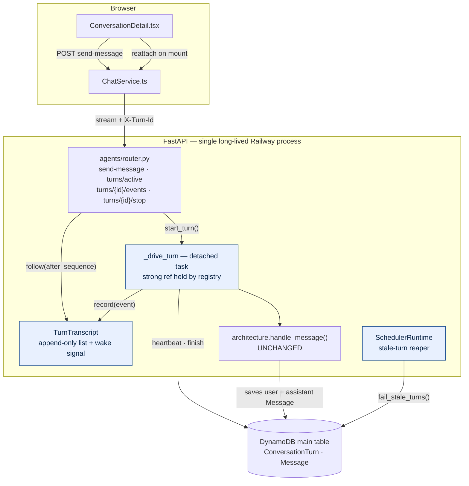
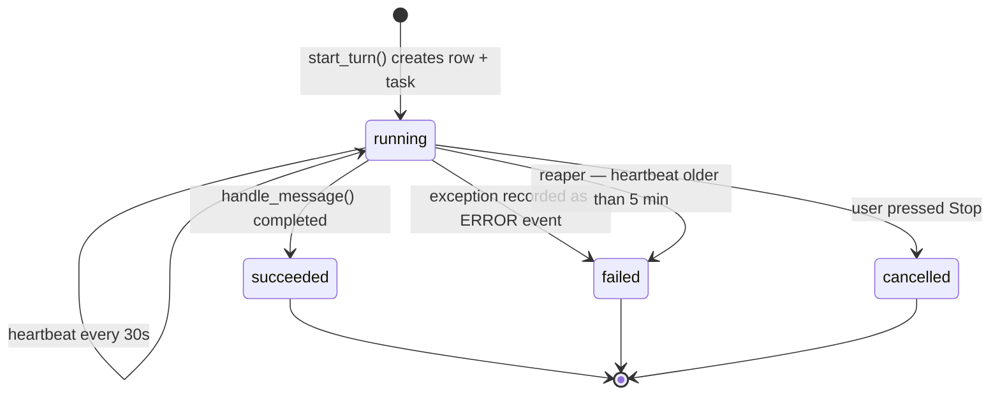
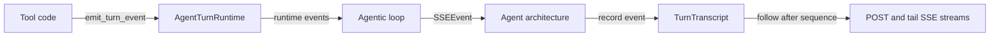

# LLD: Async Chat Turns — Responses That Survive Navigation

## Goal

A chat turn must run to completion on the server regardless of what the browser does.

- If the user sends a message and navigates away, closes the tab, or refreshes, the turn keeps running and the assistant response is persisted.
- While the user stays on the page, behaviour is **byte-identical to today** — same endpoint, same SSE event order, same token-by-token rendering.
- Returning to a conversation mid-turn (including after a full refresh) **resumes live streaming**: replay what has been produced so far, then follow live.
- Several conversations with different agents can stream concurrently from one browser window.

Browser push notifications are a follow-up. This design leaves exactly one seam for them and builds nothing.

## Problem

A chat turn today is a single coroutine owned by one HTTP request. `POST /agents/{agent_id}/{conversation_id}/send-message` (`src/agents/router.py:395-488`) returns a `StreamingResponse` whose inline `event_stream()` generator directly drives `architecture.handle_message(...)`:

```python
# src/agents/router.py:460-472
async for event in architecture.handle_message(
    agent=agent, conversation=conversation, user_message=body.content, ...
):
    yield event.to_sse()

conversation_repo.save(conversation)
```

Two user-visible consequences follow.

### 1. Navigating away destroys the response

Starlette closes the generator when the client disconnects, raising `GeneratorExit` / `asyncio.CancelledError` at the paused `yield`. Both derive from `BaseException`, so none of the three `except Exception` blocks on the path catch them:

- `src/agents/architectures/krishna_memgpt.py:474`
- `src/agents/architectures/krishna_mini.py:186`
- `src/agents/router.py:474`

The assistant text exists only as a local `full_response` variable inside `run_agentic_tool_loop` and is persisted by a **single** `message_repo.save()` *after* the loop completes (`krishna_memgpt.py:453-461`, `krishna_mini.py:167-179`). Unwinding from the middle of the stream therefore discards the entire response — no `Message` row, no `ASSISTANT_MESSAGE_SAVED` event. `conversation_repo.save(conversation)` at `router.py:472` is skipped too, which is why `updated_at` does not move on an abandoned turn.

The user message, by contrast, is saved eagerly at the top of `handle_message`, so the conversation is left with a question and no answer.

### 2. Concurrent turns are impossible

`spa/src/services/chat/ChatService.ts` exports a module singleton holding one `AbortController`, and `sendMessage` aborts it on every call:

```ts
// spa/src/services/chat/ChatService.ts:124-127
// Cancel any existing stream
this.cancel();
this.abortController = new AbortController();
```

Starting any stream aborts every other one, so two agents cannot stream at once.

## Current State

### Entry points sharing the architecture contract

`AgentArchitecture.handle_message(...)` is an async generator of `SSEEvent` (`src/agents/architectures/base.py:46-84`). Callers:

| Caller | Mode | In scope? |
| --- | --- | --- |
| `src/agents/router.py:395` dashboard chat | streaming SSE | **yes — the only one** |
| `src/widget/router.py:794` public widget | streaming SSE | no |
| `src/widget/router.py:520` widget generate_text | buffered | no |
| `src/automations/runner.py:345` | buffered | no |
| `src/scheduler/executors.py:61` | buffered | no |
| `src/a2a/service.py:233` | buffered | no |
| `src/skills/agent_invocation/actions.py:44` | buffered | no |

`handle_message_buffered` (`base.py:86-126`) already drains the same generator to completion decoupled from any HTTP connection. It is the existing proof that a turn can run without a live client; this design generalises that idea for the streaming path.

### Deployment shape

`railway.toml` builds `Dockerfile.railway`, whose command is `uv run uvicorn main:app --host 0.0.0.0 --port ${PORT:-8000}` — a single long-lived process with **no `--workers`**, one replica. `SchedulerRuntime` (APScheduler) already lives in that same process, started from `app_lifespan` (`main.py:88-93`). An in-process registry is therefore coherent with how the app already manages background work.

`settings.async_job_backend` defaults to `"local"`. The durable Lambda self-invoke idiom (`automations/router.py:82-106`, `knowledge/router.py:276-345`) exists for crawl jobs and automation runs, but is deliberately **not** used here — see [Non-Goals](#non-goals).

### Existing background-job conventions to follow

- **Heartbeat + reaper liveness**: `src/automations/run_state.py` (`heartbeat`, `is_stale`, `fail_if_stale`) and `src/knowledge/run_state.py` (`heartbeat`, `fail_stale_jobs`). The liveness reference is always `last_heartbeat_at or started_at or created_at`.
- **Reaper registration**: `SchedulerRuntime.start()` (`src/scheduler/runtime.py`) adds `IntervalTrigger` jobs — `_reap_stale_crawl_jobs`, `_reap_stale_dream_runs`.
- **Conditional-write race guard**: `CrawlJobRepository.mark_failed_if_heartbeat_unchanged` (`src/knowledge/repository.py:228-249`).
- **In-process detached job**: `ToolJobService.start_skill_action_job` (`src/agents/tool_runtime/jobs/service.py:63`). Note it keeps **no reference** to the task it creates, so the task is only weakly held by the loop and can be garbage-collected mid-flight. This design fixes that by holding a strong reference.
- **`gsi2` lookup by id**: `ToolJobRepository.find_by_id` (`src/agents/tool_runtime/jobs/repository.py:26-36`).

### Storage

Single DynamoDB table with exactly **one** GSI — `gsi2` (`terraform/dynamodb.tf:36-41`), used for API key and visitor lookups. A TTL attribute `ttl` is enabled.

`Conversation.to_dynamo_item()` writes `gsi1_pk` / `gsi1_sk` (`src/conversations/models.py:83-84`) but **no `gsi1` index exists**. Those attributes are dead weight; do not copy the pattern.

## Design Decisions (confirmed)

1. **The turn executes as a detached `asyncio.create_task`** in the Railway web process. Durability bar: survives navigation, tab close and refresh — **not** a deploy/restart, which a reaper cleans up.
2. **Re-attach via a tail SSE endpoint** that replays an ordered in-memory transcript from a sequence number, then follows live.
3. **Scope is the dashboard `send-message` endpoint only.** Widget, buffered callers, `SSEEvent.to_sse()` and `terraform/` are untouched.
4. **`POST /send-message` stays a `StreamingResponse`** — its generator becomes a *reader* of the transcript rather than the driver of the turn.
5. **No partial assistant text is persisted.** The cause of loss is removed, not mirrored into a second copy.
6. **A second message while a turn is running is rejected with 409**, carrying the running `turn_id` so the client attaches instead.
7. **There is no wall-clock budget on a turn.** Liveness is "a task is processing this record", detected by a plain heartbeat ticker.

## High-Level Shape



Blue nodes are new. The load-bearing edge is `R -->|follow| T`: the HTTP generator only *reads* the transcript, so closing it cannot reach `_drive_turn`.

### Lifecycle



A turn is `running` the moment the row exists, so there is no `pending` state; `cancelled` is reached only by explicit user action.

### Why a new module rather than reusing `AgentTurnRuntime`

`src/agents/turn_runtime.py` already holds an `AgentTurnRuntime` with a `turn_id` and an `asyncio.Queue`, which looks reusable but is the opposite abstraction on every axis:

| | `AgentTurnRuntime` | `TurnTranscript` |
| --- | --- | --- |
| Consumers | 1 — the agentic loop | N — POST caller plus reattaches |
| Semantics | consume-once (`get()` removes) | retain and replay |
| Lifetime | one `run_agentic_tool_loop` call | the whole turn, outliving the request |
| Producer | may block — `Queue(maxsize=100)` | must never block |
| Direction | tools → loop (inward) | architecture → HTTP (outward) |

It is constructed at `agentic_loop.py:131`, drained by the loop itself at `agentic_loop.py:444-474`, and closed by `use_turn_runtime`. Merging the two would give one class two contradictory modes — `drain_available()` removes while replay must retain — which adds concepts rather than removing them. Leave it unchanged. The layering stays a one-way pipeline:



*Events move in one direction toward the replayable transcript; HTTP streams only follow that transcript.*

## Data Model

### `ConversationTurn`

```python
# src/agents/turns/models.py
CHAT_TURN_TTL_DAYS = 7


class ConversationTurnStatus(str, Enum):
    RUNNING = "running"
    SUCCEEDED = "succeeded"
    FAILED = "failed"
    CANCELLED = "cancelled"


class ConversationTurn(BaseModel):
    turn_id: str = Field(default_factory=lambda: f"turn_{uuid4().hex}")
    conversation_id: str
    agent_id: str
    created_by: str                     # owner == actor for dashboard chat
    status: ConversationTurnStatus = ConversationTurnStatus.RUNNING
    user_message_id: str | None = None
    assistant_message_id: str | None = None
    error: str | None = None
    created_at: datetime
    started_at: datetime | None = None
    last_heartbeat_at: datetime | None = None
    completed_at: datetime | None = None
    ttl: int                            # created_at + 7 days, like ToolJob

    @property
    def pk(self) -> str:
        return f"CONVERSATION#{self.conversation_id}"

    @property
    def sk(self) -> str:
        return f"TURN#{self.created_at.isoformat()}#{self.turn_id}"

    @property
    def gsi2_pk(self) -> str:
        return f"ConversationTurn#{self.turn_id}"

    # gsi2_sk == gsi2_pk; entity_type = "ConversationTurn"

    def is_stale(self, now: datetime | None = None) -> bool: ...
```

### Access patterns — no new GSI

| Question | How |
| --- | --- |
| Is there an active turn for this conversation? | `Query(pk="CONVERSATION#{cid}", sk begins_with "TURN#", ScanIndexForward=False, Limit=1)` then check status. Constant cost on the hot send path; correct because at most one turn per conversation is active. |
| Fetch a turn by id — tail and stop endpoints only have `turn_id` | `Query(IndexName="gsi2", gsi2_pk="ConversationTurn#{turn_id}", Limit=1)`, copying `ToolJobRepository.find_by_id`. |
| List stale `running` turns for the reaper | Paginated `scan` with `Attr("entity_type").eq("ConversationTurn") & Attr("status").eq("running")`, copying `CrawlJobRepository.find_in_progress` (`src/knowledge/repository.py:209-226`). |

Co-locating turn rows in the `CONVERSATION#` partition is safe because **every** message query filters `begins_with("MESSAGE#")` (`src/messages/repositories/dynamodb.py:46,63,76,113,149`), so turn rows are invisible to message reads. `delete_by_conversation` (line 156) will not remove turn rows; the 7-day TTL handles that, exactly as it does for `ToolJob`.

### Why the turn row does not store partial assistant text

The instinct is to checkpoint the growing response so nothing is ever lost. It is the wrong trade here:

- The **cause** of loss is fixed directly. Client disconnect no longer cancels anything, so the architecture's own end-of-turn save (`krishna_memgpt.py:453-461`) always runs.
- A partial copy means a DynamoDB write every few hundred bytes of output, and a **second source of truth for assistant text** alongside `Message`. CODE_PHILOSOPHY: *"Do not create duplicate sources of truth"*, *"Avoid caches as authoritative state"*. Both the live and replay paths would then have to decide which copy wins.
- The only remaining loss window is process death, which is outside the durability bar — and in that window there is nothing in memory left to flush, so a reaper could never salvage it anyway. It would only ever read a copy written before the crash, i.e. lossy regardless.

The row carries `assistant_message_id` instead: a pointer to the one authoritative copy.

## Backend Design

### 1. `TurnTranscript` — the replayable record

```python
# src/agents/turns/transcript.py
@dataclass
class TurnTranscript:
    """The ordered record of everything one agent turn said, replayable from any point."""

    turn_id: str
    events: list[SSEEvent] = field(default_factory=list)   # index i == sequence i+1
    finished: bool = False
    task: asyncio.Task | None = None                       # strong ref; see §3
    _arrival: asyncio.Event = field(default_factory=asyncio.Event)

    def record(self, event: SSEEvent) -> None: ...          # synchronous, unbounded, never blocks
    def finish(self) -> None: ...
    async def follow(self, *, after_sequence: int = 0) -> AsyncIterator[tuple[int, SSEEvent]]: ...


def open_transcript(turn_id: str) -> TurnTranscript: ...
def live_transcript(turn_id: str) -> TurnTranscript | None: ...
def forget_transcript(turn_id: str) -> None: ...
```

One append-only list per turn. Subscribers are **pull-based, each holding only an integer cursor** — no fan-out, no per-subscriber queue, no backpressure.

`follow` is the whole design. Capture the wake signal *before* re-reading the list, or wake-ups that land during the yield loop are lost:

```python
async def follow(self, *, after_sequence: int = 0):
    cursor = max(after_sequence, 0)
    while True:
        arrival = self._arrival          # capture BEFORE draining
        while cursor < len(self.events):
            cursor += 1
            yield cursor, self.events[cursor - 1]
        if self.finished:
            return
        await arrival.wait()
```

`record` and `finish` wake followers by **swapping** the event object, so one follower cannot clear another's signal:

```python
def _wake(self) -> None:
    waiters, self._arrival = self._arrival, asyncio.Event()
    waiters.set()
```

This satisfies all four requirements with a single list:

- **N subscribers per turn** — each holds one integer.
- **A slow subscriber never stalls the producer** — `record()` is synchronous and unbounded, so it cannot apply backpressure to `handle_message`. A lagging follower simply reads a longer slice next time.
- **Attaching after the turn finished** — the list is still there; the follower drains it and returns on `finished`.
- **Replay from a sequence** — `after_sequence` is an index. No allocation, no gaps, numbers are never renumbered.

#### Eviction — two rules only

1. **Nothing is evicted while the turn is live, with one exception.** When `IMAGE_GENERATION_COMPLETE` is recorded, `record()` blanks `image_b64` on the retained earlier `IMAGE_GENERATION_PARTIAL` entries. Those frames are already declared droppable by `is_droppable_runtime_event` (`src/agents/turn_runtime.py:84-85`), are superseded by the complete event, and are the only multi-megabyte payload in the enum. Sequence numbers and list length are untouched.
2. **The whole transcript is dropped at once.** `_drive_turn`'s `finally` schedules `loop.call_later(settings.chat_turn_transcript_grace_seconds, forget_transcript, turn_id)`. An in-flight follower holds its own reference, so forgetting is always safe — refcounting ends the object, not liveness. A reattach after the grace window gets **410 Gone**, and the client refetches messages, which by then contain the assistant message.

No head-trimming and no content cap: trimming would silently break replay-from-zero, and the live and replay paths are deliberately the *same* list.

### 2. `ConversationTurnRepository`

```python
# src/agents/turns/repository.py
class ConversationTurnRepository:
    def create(self, turn: ConversationTurn) -> ConversationTurn: ...        # put, attribute_not_exists
    def find_by_id(self, turn_id: str) -> ConversationTurn | None: ...       # gsi2
    def find_active(self, conversation_id: str) -> ConversationTurn | None: ...
    def heartbeat(self, turn: ConversationTurn) -> None: ...
    def finish(
        self,
        turn: ConversationTurn,
        status: ConversationTurnStatus,
        *,
        error: str | None = None,
        assistant_message_id: str | None = None,
    ) -> ConversationTurn: ...
    def fail_stale_turns(self, *, now: datetime | None = None) -> int: ...
```

`finish` is the single place every turn reaches a terminal status. **That is the push-notification seam** — one hook, later. Build nothing now.

### 3. Driving the turn

```python
# src/agents/turns/run.py
def start_turn(*, agent, conversation, user_message, attachments,
               owner_email, actor_email, actor_id) -> ConversationTurn: ...
def stop_turn(turn: ConversationTurn) -> None: ...
async def _drive_turn(turn, transcript, agent, conversation, ...) -> None: ...
async def _keep_heartbeat(turn, turn_repo) -> None: ...
```

`start_turn` creates the row, opens the transcript, then detaches:

```python
transcript.task = asyncio.create_task(_drive_turn(...))
```

Three properties make survival airtight:

1. `asyncio.create_task` schedules on the event loop, **not** inside the request's task tree. When the client disconnects, uvicorn cancels only the task running the response; the response generator gets `GeneratorExit` at its `yield` and stops iterating `follow()`. `_drive_turn` never notices.
2. `transcript.task` is a **strong reference** held by the module-level registry. This is precisely what `ToolJobService.start_skill_action_job` (`src/agents/tool_runtime/jobs/service.py:63`) omits — do not copy that bug.
3. `_drive_turn` receives only plain values (`Agent`, `Conversation`, strings) and constructs its own repositories. No `Depends`-injected object and no `request.state` outlives the request.

`_drive_turn` is the only new caller of `get_agent_architecture(...).handle_message(...)`. It records the two `LIFECYCLE_NOTIFICATION` events as sequences 1 and 2 so the order the client observes is byte-identical to today, records every subsequent event, tracks `user_message_id` / `assistant_message_id`, and calls `conversation_repo.save(conversation)` — the `updated_at` bump relocated from `router.py:472`.

```python
except asyncio.CancelledError:
    turn_repo.finish(turn, ConversationTurnStatus.CANCELLED, error="Stopped by the user")
    raise
except Exception as exc:
    transcript.record(SSEEvent(event_type=SSEEventType.ERROR, content=str(exc)))
    turn_repo.finish(turn, ConversationTurnStatus.FAILED, error=str(exc))
finally:
    heartbeat.cancel()
    transcript.finish()                        # every follower's follow() returns
    loop.call_later(grace, forget_transcript, turn.turn_id)
```

The architectures are **not** restructured to salvage partial text on cancel. Cancel is now reachable only by explicit user stop (intentional) or process death (out of scope), and the per-tool audit `Message` rows (`krishna_memgpt.py:317-324`) already persist independently. If salvage is ever wanted: accumulate `loop_event.payload["content"]` at `krishna_memgpt.py:272-276`, extract the save at 453-461 into `_save_assistant_message(...)`, and call it from a `finally` that only persists and never yields — yielding during `GeneratorExit` raises `RuntimeError`.

### 4. Router changes

Replace `send_message` (`src/agents/router.py:395-488`) and **delete the inline `event_stream()` generator** (420-479). Validation moves into the handler body because headers must be known before the body starts; observable behaviour is preserved, as the three failure cases still return `200` plus an in-stream `ERROR` event via a small `_sse_error()`.

```python
active = turn_repo.find_active(conversation_id)
if active:
    raise HTTPException(409, detail={"message": "...", "turn_id": active.turn_id})

turn = start_turn(...)

return StreamingResponse(
    _turn_events(turn.turn_id, after_sequence=0),
    media_type="text/event-stream",
    headers={
        "Cache-Control": "no-cache",
        "Connection": "keep-alive",
        "X-Turn-Id": turn.turn_id,
    },
)
```

New endpoints:

```
GET  /agents/{agent_id}/{conversation_id}/turns/active            -> ConversationTurnResponse | null
GET  /agents/{agent_id}/{conversation_id}/turns/{turn_id}/events  -> StreamingResponse | 404 | 410
POST /agents/{agent_id}/{conversation_id}/turns/{turn_id}/stop    -> 204
```

`_turn_events` emits `f"id: {sequence}\n{event.to_sse()}"`. **This breaks the current SPA parser**, which tests `line.startsWith("data: ")` against the whole `\n\n` block (`ChatService.ts:208`) and would drop any block beginning with `id:`. The parser fix must ship in the same change. `SSEEvent.to_sse()` itself is untouched, so the widget and image-stream paths are unaffected.

#### Why keep streaming instead of `202 Accepted` + turn id

- A 202 adds a round trip to first token on the **hot, common** path in order to serve the rare path — directly against "behaviour must not change while the user stays on the page".
- It creates two server and two client code paths for one stream. Here the POST body and the tail endpoint are the **same** `_turn_events()` generator with a different `after_sequence`; the only difference is who created the turn.
- The "events produced before the client's tail request arrives" race is already solved by replay-from-zero, so 202 buys nothing and only makes the gap observable as latency.

#### Why `X-Turn-Id` rather than a new SSE event

`SSEEventType` is duplicated by hand in `src/llm/events.py` and `spa/src/types/message.ts`; a header avoids growing that manually-synchronised pair. `main.py:140` already sets `expose_headers=["*"]`, so the browser can read it, and the SPA uses `fetch` rather than `EventSource`.

#### Concurrency rule: reject with 409

A second message in the **same** conversation while a turn is running returns:

```
409 {"detail": {"message": "This conversation already has a response in progress.",
                "turn_id": "turn_..."}}
```

This is a correctness invariant, not a policy choice: the architecture rebuilds context from `message_repo.find_by_conversation(...)` (`krishna_memgpt.py:226`, `krishna_mini.py:139`), so two concurrent turns in one conversation would interleave `Message` writes and feed each other half-finished transcripts. Queueing would invent a per-conversation queue for a problem nobody has; cancel-and-replace would destroy work the user just paid for, which is the exact complaint being fixed. The SPA guards this client-side already (`ConversationDetail.tsx:352`), but that guard evaporates on refresh, so the server must own it.

The 409 carries the `turn_id` so the client's honest response is to **attach** to the running turn rather than show an error.

Concurrency across **different conversations and agents is unrestricted** — that is the multi-agent requirement, and it needs nothing extra server-side.

The check is read-newest-then-create, so two requests within a few milliseconds could both win. A single browser plus the SPA guard makes this practically unreachable; to close it, re-query after the put and, if another `running` turn has an earlier `created_at`, mark ours `cancelled` and raise 409.

#### Explicit stop is part of this change

Today a refresh "cancels" a hung turn via the bug. Once the bug is fixed, a hung turn would block its conversation for the whole stale timeout. `stop` checks ownership, then calls `transcript.task.cancel()` if the turn is live, or marks the row `CANCELLED` if its process is gone.

### 5. Heartbeat and reaper

```python
async def _keep_heartbeat(turn, turn_repo) -> None:
    while True:
        await asyncio.sleep(settings.chat_turn_heartbeat_interval_seconds)
        turn_repo.heartbeat(turn)
```

Started by `_drive_turn`, cancelled in its `finally`.

The heartbeat is a **plain ticker, not event-driven**, and **there is no wall-clock budget on a turn at all**. What must be detected is "no task is processing this record any more", not "the LLM is slow". An event-driven heartbeat would stop beating during a legitimate ten-minute tool call and the reaper would then kill a perfectly live turn.

**Staleness rule**, identical to `CrawlJobStateService._liveness_reference` (`src/knowledge/run_state.py:57-62`) and `AutomationRunStateService.is_stale` (`src/automations/run_state.py:72-78`):

> A turn is stale iff `status == running` **and** `(last_heartbeat_at or started_at or created_at) < now - chat_turn_stale_timeout_seconds`.

`fail_stale_turns` scans running turns, skips fresh ones, and fails each with a conditional update guarded on `status = :running AND last_heartbeat_at = :observed` — the `mark_failed_if_heartbeat_unchanged` pattern (`src/knowledge/repository.py:228-249`) — so a heartbeat that lands between scan and write always wins the race.

Stored error text: `"This response stopped before it finished because the server restarted. Please send the message again."`

The reaper **salvages nothing** and writes no synthetic assistant `Message`; an empty or apologetic assistant row would corrupt the conversation context for the next turn.

### 6. Settings

Dataclass defaults only, with no `from_env` parsing, matching `dream_run_reaper_interval_seconds` (`src/config/settings.py:88`). Place beside the `crawl_job_*` block (93-94):

```python
# One chat turn keeps running after the browser leaves; these bound how long a turn
# orphaned by a process restart can sit in `running`.
chat_turn_heartbeat_interval_seconds: int = 30
chat_turn_stale_timeout_seconds: int = 5 * 60
chat_turn_reaper_interval_seconds: int = 5 * 60
chat_turn_transcript_grace_seconds: int = 120
```

### 7. Scheduler wiring

In `src/scheduler/runtime.py`: add `CHAT_TURN_REAPER_ID = "internal:stale-chat-turn-reaper"` beside the existing reaper ids (lines 25-26), a `ConversationTurnRepository` in `__init__`, a third `scheduler.add_job(IntervalTrigger(seconds=settings.chat_turn_reaper_interval_seconds), ...)` block in `start()`, and `_reap_stale_chat_turns()` mirroring `_reap_stale_dream_runs` (126-132).

`app_lifespan` needs no change. Do **not** add shutdown draining — a Railway deploy is explicitly outside the durability bar, and the reaper is the whole answer.

## Frontend Design

**In-flight state stays purely server-side; the client reattaches on mount.** No module-level store, no context provider, no state library.

The server must support reattach anyway for full page refresh. A client-side store would be a second source of truth for the same fact, leaving two resume paths that must agree. Instead, navigation and refresh collapse into **one** code path — strictly fewer concepts than today's single path plus a store. No SPA state library is installed, so this also needs no Dependency Rule justification; one would fail it, since the need is "resume a stream" and the platform plus reattach already cover it.

All existing component state (`messages`, `streamingContent`, `streamingContentRef`, `toolActivities`, …) keeps working exactly as today: on-page behaviour is unchanged, and on remount the component starts clean and is refilled from the replay.

Accepted cost: navigating back re-downloads the transcript once. Consciously absent: a cross-page "your other turn finished" indicator — that is the push-notification follow-up.

### `spa/src/services/chat/ChatService.ts`

1. **Delete** the `abortController` field (line 24), the `cancel()` method (180-185), and the two internal `this.cancel()` calls (67, 125). This is the concurrent-turns fix and a net deletion; nothing else in the SPA calls it.
2. Add `signal?: AbortSignal` to `ChatStreamOptions` and pass it to both `fetch` calls, so each caller owns its controller and N streams coexist. Keep the existing `AbortError` swallow.
3. Add `onTurnStarted?: (turnId: string) => void`, fired from `response.headers.get("X-Turn-Id")` right after the `response.ok` check.
4. Upgrade `readSSEStream` (187-219) to parse **per line within each block** and return the last sequence seen:

```ts
private async readSSEStream(body, onEvent): Promise<number> {
  // ...
  for (const block of blocks) {
    for (const line of block.split("\n")) {
      if (line.startsWith("id: ")) lastSequence = Number(line.slice(4));
      else if (line.startsWith("data: ")) { /* parse + onEvent, unchanged */ }
      // anything else (SSE comments / keep-alives) ignored
    }
  }
  return lastSequence;
}
```

5. Add three methods:

```ts
async getActiveTurn(agentId, conversationId): Promise<ActiveTurn | null>
async followTurn(agentId, conversationId, turnId, options: ChatStreamOptions): Promise<void>
async stopTurn(agentId, conversationId, turnId): Promise<void>
```

`followTurn` owns resume: it tracks `lastSequence` from `readSSEStream` and, on a non-abort network failure, retries `GET .../events?after_sequence=${lastSequence}` a couple of times. All sequence bookkeeping stays inside `ChatService`; the component never sees a sequence number.

### `spa/src/pages/dashboard/ConversationDetail.tsx`

1. **Lift the inline `handleEvent`** (406-606) out of `handleSendMessage` into a component-scope `applyTurnEvent(event, { optimisticUserMessageId, imageLabel, finish })`. It currently closes over `messageToSend`, `userMsg` and `finishStream`; those three become the options object. Send and reattach must render identically, and duplicating a 200-line switch would be the wrong kind of duplication. This is the "make the change easy, then make the easy change" step.
2. **Dedupe by `message_id`** in exactly two cases — `USER_MESSAGE_SAVED` and `ASSISTANT_MESSAGE_SAVED` (518-533) skip appending when `messages` already holds that id. That is the whole answer to not duplicating text the client already has: on reattach the persisted user message is already loaded, replay re-announces it with the same real id, and assistant deltas accumulate into a freshly cleared `streamingContentRef`.
3. **One `AbortController` ref**, replaced per send/follow and aborted in a `useEffect` cleanup keyed on `conversationId`. This is the only new unmount behaviour, and it aborts *reading* — never the turn.
4. **Reattach effect**, after `loadData()` resolves:

```
getActiveTurn(agent_id, conversationId)
  -> null : nothing to do (today's behaviour)
  -> turn : setActiveTurnId(turn.turn_id); setIsSending(true);
            followTurn(..., { onEvent: applyTurnEvent, onComplete: finish })
```

`followTurn` replays from zero — lifecycle notices, tool activity, all text — then follows live, so a mid-turn refresh lands the user back in a live token stream. A `410` is a benign no-op: clear `isSending` and refetch messages.

5. **Stop action** while `isSending && activeTurnId`, passed to `ChatComposer` as a `stopAction` prop mirroring the existing `imageAction` / `deepResearchAction` shape (`ChatComposer.tsx:124-137`).
6. **409 handling** on send: read `detail.turn_id` and attach via `followTurn` instead of showing `chatError`.

`spa/src/types/message.ts` needs no change, since no `SSEEventType` is added. The only new type is `ActiveTurn`.

The polling conventions in `useAutomationRuns.ts` and `KnowledgeBaseDetail.tsx` are deliberately **not** used here: we have a live stream, so polling would be a weaker duplicate.

### `spa/src/components/chat/ChatComposer.tsx`

Optional `stopAction` prop.

## Tests

Style follows `tests/test_crawl_job_liveness.py` (real repository plus the moto `dynamodb_table` fixture) and `tests/test_dream_atomicity.py` (plain fake collaborators). `asyncio_mode = "auto"` (`pyproject.toml:50`), so `async def test_*` needs no marker.

Only the LLM boundary is faked: monkeypatch `src.agents.turns.run.get_agent_architecture` to return a fake architecture, extending the pattern at `tests/test_agent_architecture_base.py:9-43` with one that blocks on an `asyncio.Event` mid-stream so tests control timing. The transcript, repository, turn task, reaper and DynamoDB writes are all real.

### `tests/test_chat_turn_transcript.py` — pure asyncio, no AWS

- A follower receives recorded events in order, then returns on `finish()`.
- **A follower attaching after `finish()` replays everything and terminates.**
- Two followers at different cursors each receive the complete ordered sequence.
- **A slow subscriber never blocks the producer**: suspend one follower, `record()` 1000 events, assert the producer completed, then the follower sees all 1000.
- `after_sequence=k` yields exactly `k+1 …` with no gap or repeat.
- `IMAGE_GENERATION_COMPLETE` blanks earlier partials' `image_b64` while sequence numbers and list length stay unchanged.

### `tests/test_chat_turn_run.py` — moto plus a fake architecture

- **The turn completes after the subscriber disconnects.** Start a turn, consume two events, `break` out of `follow()` (exactly what Starlette's `GeneratorExit` produces), await the task, then assert the fake architecture ran to its last yield, the row is `succeeded`, `assistant_message_id` is set, and `conversation.updated_at` was bumped. This is the regression test for the reported bug.
- **Reattach replays correctly**: consume two events, drop, re-follow from zero; the first two arrive again in order, then the live tail, ending with `STREAM_COMPLETE`.
- **Two concurrent turns do not interfere**: two conversations with two different agents; each transcript contains only its own events, both rows reach `succeeded`, neither follower sees the other's text.
- A second `send-message` while running returns 409 carrying the running `turn_id`.
- An architecture that raises leaves the turn `failed` with the error persisted, and every follower terminates without hanging.
- `stop_turn` cancels the task, leaves the turn `cancelled`, and terminates followers.
- The transcript is forgotten after the grace window while an in-flight follower keeps streaming to completion.

### `tests/test_chat_turn_liveness.py` — moto, mirrors `test_crawl_job_liveness.py`

- `heartbeat` persists `last_heartbeat_at`.
- **The reaper fails an abandoned turn**: a `running` turn with an old `last_heartbeat_at` → `fail_stale_turns()` returns 1, status `failed`, error set, **and no assistant `Message` written**.
- A fresh turn and a terminal turn are untouched.
- The conditional write loses to a concurrent heartbeat (heartbeat first, then attempt the fail with the stale observed value → no transition), covering the scan/write race.
- `is_stale` falls back through `last_heartbeat_at → started_at → created_at`.

### `tests/test_agents_router.py` — additions

Uses the existing `test_client` and `auth_headers` fixtures.

- `send-message` response carries `X-Turn-Id`.
- `GET turns/active` returns `null` when idle, and the turn when a `running` row is seeded **through the repository** — do not spawn a real task, because `TestClient`'s per-request portal loop is not a reliable host for detached tasks. That is why turn-lifecycle behaviour is tested directly in `test_chat_turn_run.py`.
- The tail endpoint returns 404 for another user's turn and for a mismatched `agent_id`, and 410 when no transcript is live.
- `stop` on a turn belonging to another user returns 404.

### Manual verification

No test framework is installed in `spa/`, so per *"for visual behavior, verify the result visually"*:

1. On-page streaming is unchanged.
2. Navigate away mid-turn and back → the live stream resumes.
3. Full refresh mid-turn → the live stream resumes.
4. Two conversations with different agents stream concurrently.
5. Stop works.
6. A turn that finishes while away shows up as a normal saved message on return.
7. Tool calls, an inline form, and a canvas artifact all still render.

## Non-Goals

- **No durable event log and no Lambda worker.** `docs/LLD-durable-agent-orchestration.md` proposes a much larger engine for this same problem — `src/agents/runs/`, persisted `AgentRunEvent` rows, steps, checkpoints, leases, a worker, and conversion of every entry point. It is unimplemented (there is no `src/agents/runs/`). This design is a deliberate, far smaller subset: an in-memory transcript instead of a persisted event log, no checkpoints, no resume across restarts, one entry point. Rationale: *"the simplest thing that completely solves the problem"* and *"avoid premature distributed systems"*. The `?after_sequence=` spelling is borrowed from that document so naming stays compatible if it is ever built. **Implementers should not get pulled into it.**
- **Surviving a Railway deploy or restart.** Explicitly outside the durability bar; the reaper marks such turns `failed` and the user resends.
- **Browser push notifications.** The seam is `ConversationTurnRepository.finish(...)`, the single place every turn reaches a terminal status. Nothing is built for it here.
- **Widget, automation, scheduler and A2A paths.** Untouched. The buffered callers already run decoupled from any HTTP connection.
- **Multiple API replicas.** The in-process transcript assumes one uvicorn process, which is what `railway.toml` and `Dockerfile.railway` deploy. Horizontal scaling would require the persisted event log from the durable-orchestration document.
