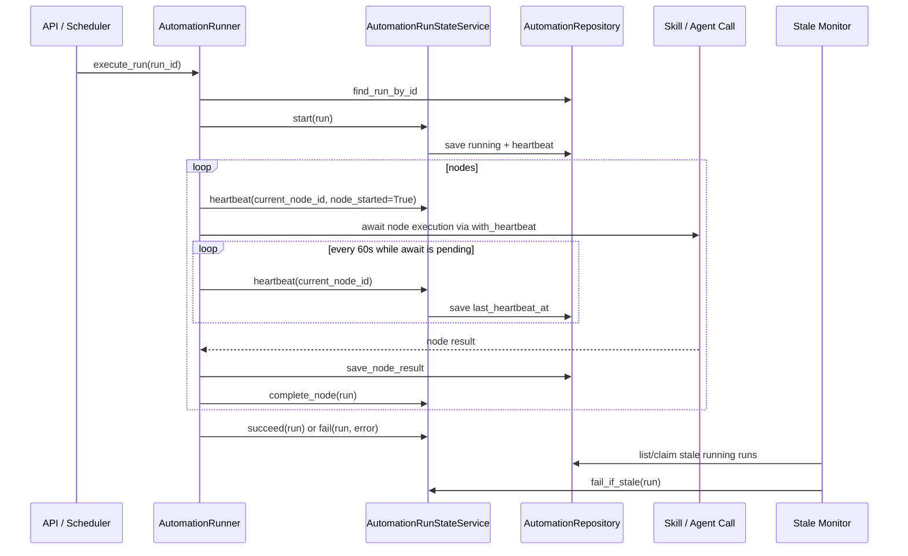

# Low Level Design: Automation Run Heartbeats

Date: 2026-07-09  
Status: Draft  
Owner: InnomightLabs API

## Summary

Replace read-time stale-run guessing with explicit automation run heartbeats.

Today an automation run can remain `running` if the web process, Lambda invocation, or in-process background task is interrupted while a node is executing. The current defensive patch marks old `pending`/`running` runs as failed when run list/detail endpoints read them. That is useful as a stopgap, but it is a time-based guess and can incorrectly fail legitimate long-running automations.

The better design is:

- Track run liveness with `last_heartbeat_at`.
- Track where the run currently is with `current_node_id` and `current_node_started_at`.
- Update heartbeat during execution and around long-running awaits.
- Classify stale runs only when their heartbeat is old, not merely because the run duration is long.
- Move run state mutation into a small service so the runner does not directly hand-edit status fields everywhere.
- Replace `_execute_node(...)` branching with node executor strategies to keep adding node/action types clean.

## Current Behavior

Key files:

- `api/src/automations/models.py`
- `api/src/automations/repository.py`
- `api/src/automations/runner.py`
- `api/src/automations/service.py`
- `api/src/automations/router.py`

Current run execution flow:

1. `AutomationRunner.create_test_run(...)` creates `AutomationRun(status=pending)`.
2. `invoke_automation_run_async(...)` starts async execution.
3. `AutomationRunner.execute_run(...)` loads the run and graph.
4. `execute_run_graph(...)` sets `status=running`, `started_at=now`.
5. Each node returns an `AutomationRunNodeResult`.
6. The runner writes the node result, updates `run.context`, saves the run, and moves to the next edge.
7. Final node sets `status=succeeded`.
8. Exceptions set `status=failed`.

Weakness:

- If the process is interrupted while awaiting an agent/tool/skill call, no exception handler runs.
- The run can remain `running` forever.
- There is no durable indicator that the executor is still alive.

Recent stopgap:

- `AutomationService.fail_stale_run_if_needed(...)` marks old `pending/running` runs failed when list/detail endpoints read them.
- This should be removed once heartbeat-based liveness is in place.

## Design Goals

- Correctly distinguish long-running healthy runs from stale/interrupted runs.
- Keep the implementation small and local to the automations module.
- Avoid a new standalone jobs framework for this feature.
- Preserve existing run, node result, and router contracts where possible.
- Make the runner easier to extend without adding more action-type branching.
- Keep reads side-effect-free after the heartbeat monitor exists.

## Non-Goals

- No full distributed workflow engine in this change.
- No UI event stream in this change.
- No automatic resume from the middle of a node in v1.
- No per-node cancellation in v1.
- No migration requirement for historical runs.

## Data Model Changes

Extend `AutomationRun`:

```python
class AutomationRun(BaseModel):
    ...
    last_heartbeat_at: datetime | None = None
    current_node_id: str | None = None
    current_node_started_at: datetime | None = None
    heartbeat_timeout_seconds: int = 30 * 60
```

Persist the new fields in:

- `AutomationRun.to_dynamo_item(...)`
- `AutomationRun.to_owner_lookup_item(...)`
- `AutomationRun.from_dynamo_item(...)`
- `AutomationRunResponse`

Why store timeout on the run:

- Default can be 30 minutes.
- Later, high-risk/slow automation templates can request a different timeout.
- The monitor can make decisions without loading graph/template metadata.

Backward compatibility:

- If `last_heartbeat_at` is missing, use `started_at` or `created_at` as a fallback for old runs.
- If `heartbeat_timeout_seconds` is missing, default to 30 minutes.

## Repository Changes

Add run state update helpers to `AutomationRepository`:

```python
def update_run_heartbeat(
    self,
    *,
    run: AutomationRun,
    current_node_id: str | None = None,
    current_node_started_at: datetime | None = None,
) -> AutomationRun:
    ...

def mark_run_running(self, run: AutomationRun) -> AutomationRun:
    ...

def mark_run_succeeded(self, run: AutomationRun) -> AutomationRun:
    ...

def mark_run_failed(self, run: AutomationRun, error: str) -> AutomationRun:
    ...
```

These helpers should update both:

- Primary run item: `pk=Automation#{automation_id}`, `sk=Run#{created_at}#{run_id}`
- Owner lookup item: `pk=User#{email}`, `sk=AutomationRun#{run_id}`

The current `save_run(run)` already writes both items, so the first implementation can delegate to it. The helper methods exist to centralize run-state semantics and make conditional updates easier later.

Optional later hardening:

- Use conditional updates to avoid overwriting terminal status:

```text
ConditionExpression = #status IN (:pending, :running)
```

## Run State Service

Add `api/src/automations/run_state.py`.

Responsibilities:

- Own valid run state transitions.
- Own heartbeat updates.
- Own stale classification.
- Keep `AutomationRunner` focused on orchestration.

Shape:

```python
AUTOMATION_RUN_DEFAULT_HEARTBEAT_TIMEOUT_SECONDS = 30 * 60


class AutomationRunStateService:
    def __init__(self, repo: AutomationRepository):
        self.repo = repo

    def start(self, run: AutomationRun) -> AutomationRun:
        now = utcnow()
        run.status = AutomationRunStatus.RUNNING
        run.started_at = run.started_at or now
        run.last_heartbeat_at = now
        return self.repo.save_run(run)

    def heartbeat(
        self,
        run: AutomationRun,
        *,
        current_node_id: str | None = None,
        node_started: bool = False,
    ) -> AutomationRun:
        now = utcnow()
        run.last_heartbeat_at = now
        if current_node_id is not None:
            run.current_node_id = current_node_id
            if node_started:
                run.current_node_started_at = now
        return self.repo.save_run(run)

    def complete_node(self, run: AutomationRun) -> AutomationRun:
        run.last_heartbeat_at = utcnow()
        run.current_node_id = None
        run.current_node_started_at = None
        return self.repo.save_run(run)

    def succeed(self, run: AutomationRun) -> AutomationRun:
        run.status = AutomationRunStatus.SUCCEEDED
        run.completed_at = utcnow()
        run.last_heartbeat_at = run.completed_at
        run.current_node_id = None
        run.current_node_started_at = None
        return self.repo.save_run(run)

    def fail(self, run: AutomationRun, error: str) -> AutomationRun:
        run.status = AutomationRunStatus.FAILED
        run.error = error
        run.completed_at = utcnow()
        run.last_heartbeat_at = run.completed_at
        run.current_node_id = None
        run.current_node_started_at = None
        return self.repo.save_run(run)

    def is_stale(self, run: AutomationRun, now: datetime | None = None) -> bool:
        if run.status not in {AutomationRunStatus.PENDING, AutomationRunStatus.RUNNING}:
            return False
        reference = run.last_heartbeat_at or run.started_at or run.created_at
        timeout = run.heartbeat_timeout_seconds or AUTOMATION_RUN_DEFAULT_HEARTBEAT_TIMEOUT_SECONDS
        return (now or utcnow()) - as_aware_utc(reference) > timedelta(seconds=timeout)

    def fail_if_stale(self, run: AutomationRun) -> AutomationRun:
        if not self.is_stale(run):
            return run
        node_hint = f" while running node {run.current_node_id}" if run.current_node_id else ""
        return self.fail(
            run,
            f"Automation run heartbeat timed out{node_hint}. The worker may have been interrupted; please retry.",
        )
```

## Heartbeat During Long Awaits

The runner should heartbeat:

- When run starts.
- Before each node starts.
- After each node completes.
- Before and after long external awaits:
  - agent invocation
  - skill action execution

This is enough to distinguish process death from normal progress between nodes.

For truly long single awaits, a heartbeat before the await is not enough if the call takes more than the timeout. Use a lightweight periodic heartbeat wrapper.

```python
async def with_heartbeat(
    awaitable: Awaitable[T],
    *,
    heartbeat: Callable[[], None],
    interval_seconds: int = 60,
) -> T:
    task = asyncio.create_task(awaitable)
    try:
        while not task.done():
            await asyncio.sleep(interval_seconds)
            if not task.done():
                heartbeat()
        return await task
    finally:
        if not task.done():
            task.cancel()
```

Use only inside automation runner-owned awaits. Do not push heartbeat responsibility into every skill.

Example:

```python
result = await with_heartbeat(
    self.skill_service.registry.execute_action(...),
    heartbeat=lambda: self.run_state.heartbeat(run, current_node_id=node.node_id),
)
```

This keeps long-running skill calls healthy as long as the Python process is alive.

## Runner Refactor

Current `_execute_node(...)` branches by node type and action type.

Replace it with small strategy objects:

```python
class AutomationNodeExecutor(Protocol):
    async def execute(self, context: NodeExecutionContext) -> AutomationRunNodeResult:
        ...


@dataclass
class NodeExecutionContext:
    automation: Automation
    node: AutomationNode
    run: AutomationRun
    conversation: AutomationConversation
    user_email: str
    started_at: datetime
```

Executors:

- `StartNodeExecutor`
- `ConditionNodeExecutor`
- `AgentActionNodeExecutor`
- `SkillActionNodeExecutor`
- `UnsupportedNodeExecutor`

Registry/factory:

```python
class AutomationNodeExecutorRegistry:
    def __init__(self, executors: list[AutomationNodeExecutor]):
        self.executors = executors

    def for_node(self, node: AutomationNode) -> AutomationNodeExecutor:
        for executor in self.executors:
            if executor.supports(node):
                return executor
        return UnsupportedNodeExecutor()
```

Why this helps:

- Adding future node types does not make `_execute_node(...)` bigger.
- Agent action and skill action dependencies stay isolated.
- Heartbeat wrapper can be applied consistently by the runner around executor calls.

Recommended v1 compromise:

- Add `AutomationRunStateService` first.
- Add `with_heartbeat(...)`.
- Keep `_execute_node(...)` temporarily if needed.
- Then split executors in a follow-up patch if the first implementation becomes too large.

This avoids a large, risky rewrite.

## Execution Flow



## Stale Monitor

V1 can keep this simple.

Options:

1. Read-time classification only:
   - Better than current if based on heartbeat.
   - Still side-effecting reads.
   - No extra worker.

2. Scheduled monitor:
   - Runs every 1-5 minutes.
   - Marks stale runs failed proactively.
   - Requires an efficient way to find active runs.

Recommendation:

- Implement heartbeat fields and read-time heartbeat classification first.
- Add active-run indexing before implementing scheduled monitor.

Why:

- Existing run storage is keyed by `Automation#{automation_id}`.
- There is no efficient global query for active runs.
- A monitor without an index would scan the table.

## Active Run Index

To support a real monitor without scans, add active run lookup records:

```text
PK = AutomationRunStatus#running
SK = Heartbeat#{last_heartbeat_at_iso}#Run#{run_id}
```

or, if using existing GSIs:

```text
gsi2_pk = AutomationRunStatus#running
gsi2_sk = Heartbeat#{last_heartbeat_at_iso}#Run#{run_id}
```

On heartbeat:

- Delete old active index item if heartbeat key changed.
- Put new active index item.

On terminal status:

- Delete active index item.

Monitor can query:

```text
PK = AutomationRunStatus#running
SK < Heartbeat#{now - timeout}
```

This is the right production version, but it is more code because heartbeat updates must keep the index consistent.

## Timeout Policy

Default:

```python
AUTOMATION_RUN_DEFAULT_HEARTBEAT_TIMEOUT_SECONDS = 30 * 60
AUTOMATION_RUN_HEARTBEAT_INTERVAL_SECONDS = 60
```

Interpretation:

- A run can last hours if it keeps heartbeating.
- A run is stale only if no heartbeat has been written for 30 minutes.
- The 30-minute timeout is not a max runtime.

Future:

- Add `max_runtime_seconds` separately if product limits require it.
- Do not overload heartbeat timeout as max runtime.

## API Behavior

Run list/detail should return:

- `running` if heartbeat is fresh.
- `failed` if stale and classification has occurred.
- Optional future field: `liveness`.

Optional response extension:

```python
class AutomationRunResponse(BaseModel):
    ...
    last_heartbeat_at: datetime | None = None
    current_node_id: str | None = None
    current_node_started_at: datetime | None = None
```

The UI can show:

- "Running: Send Email step"
- "Last progress 48 seconds ago"
- "Likely stuck" only after stale classification.

## Removing Current Stopgap

Remove or replace:

- `AutomationService.fail_stale_run_if_needed(...)` duration-based logic.
- `AUTOMATION_RUN_STALE_AFTER_SECONDS`.
- Router calls that mark runs failed solely because `started_at` is old.
- Test that expects old running run to fail by duration alone.

Replace with:

- `AutomationRunStateService.fail_if_stale(...)` based on `last_heartbeat_at`.
- Tests that prove old run with fresh heartbeat remains running.
- Tests that prove stale heartbeat marks failed.

## Tests

Add API/model tests:

- `AutomationRun` serializes/deserializes heartbeat fields.
- Starting a run sets `started_at` and `last_heartbeat_at`.
- Runner heartbeats before a node starts.
- Runner heartbeats while a long skill action is pending.
- Completing a node clears `current_node_id`.
- A run older than 30 minutes but with recent heartbeat stays `running`.
- A run with `last_heartbeat_at` older than timeout becomes `failed`.
- Terminal runs are never modified by heartbeat/stale checks.

Add runner tests:

- A skill action that sleeps longer than heartbeat interval receives heartbeat updates.
- If a node fails, terminal status clears current node metadata.
- If final node is reached, terminal status clears current node metadata.

## Implementation Steps

1. Extend `AutomationRun` and response models with heartbeat/current-node fields.
2. Persist/read those fields in DynamoDB model methods.
3. Add `AutomationRunStateService`.
4. Replace direct run status mutation in `AutomationRunner` with `run_state.start/succeed/fail/heartbeat/complete_node`.
5. Add `with_heartbeat(...)` wrapper around agent and skill awaits.
6. Replace read-time duration stale logic with heartbeat stale logic.
7. Update router tests.
8. Add model and runner heartbeat tests.
9. Run:

```bash
cd api
uv run pytest -v tests/test_automations_models.py tests/test_automations_runner.py tests/test_automations_router.py
```

## Follow-Up: Executor Strategy Refactor

After heartbeat is stable, refactor `_execute_node(...)` into executor strategies.

Suggested files:

- `api/src/automations/execution/context.py`
- `api/src/automations/execution/heartbeats.py`
- `api/src/automations/execution/executors.py`
- `api/src/automations/run_state.py`

Keep the first heartbeat implementation small. Do not move every runner helper at once.

## Open Decisions

1. Should we add active-run index now, or after heartbeat fields prove useful?
2. Should heartbeat timeout be configurable per automation template or only per run?
3. Should UI expose `current_node_id` immediately, or only after a later design pass?

Recommendation:

- Do not add active-run index in the first heartbeat patch.
- Store timeout on the run for future configurability, defaulting to 30 minutes.
- Expose `current_node_id` and `last_heartbeat_at` in API responses now, but keep UI changes minimal.
