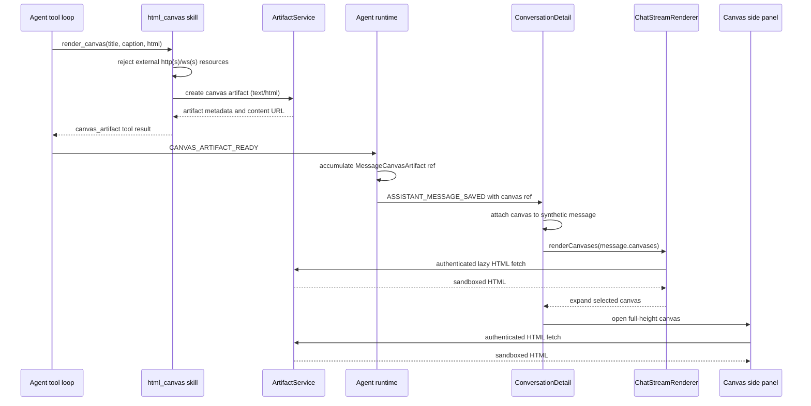

# LLD: Agent-Authored Interactive Canvas Artifacts

Jira: [KAN-26](https://vslala007.atlassian.net/browse/KAN-26) - Render Agent-Generated Charts in Conversation Canvas

Revision note: this supersedes both earlier drafts of this document (`LLD-agent-generated-chart-artifacts.md`, now removed). Draft 1 had the agent write a Python script that a sandboxed runner executed to produce a chart file, read back over a chunked filesystem API. Draft 2 dropped that round trip but kept the feature framed narrowly as "chart rendering." This revision generalizes it once more: the skill is not chart-specific at all -- it saves any self-contained, agent-authored HTML/CSS/JS document as an inline-renderable artifact, and a chart is just the first, most obvious thing an agent will use it for. The skill is renamed from `chart_generation` to `html_canvas` to reflect that.

## Goal

Give agents a general-purpose way to author a self-contained, interactive HTML/CSS/JS document -- a chart, a small dashboard, a diagram, a data table with interactive sorting, a mini simulation, whatever the task calls for -- save it as a durable artifact tied to the conversation, and have the SPA render it natively and interactively inline in the chat, without executing that document's script in the SPA's own page context, and without the inline card dominating the conversation's scroll space. Reloading a conversation must reproduce the same inline canvas from storage.

## Decisions From Clarification

1. **Not chart-specific.** The skill, its artifact type, and every identifier in this design are named around the general concept ("canvas") rather than "chart," so the agent reaches for it for any self-contained interactive HTML output, not just data visualizations.
2. **Chart/canvas type**: interactive, not a static image. The artifact is dynamic HTML/CSS/JS that the browser renders natively, persisted as text with the conversation and reloaded later.
3. **How the HTML is produced**: the agent authors it directly, in one tool call. No Python execution, no sandboxed-runner round trip, no chunked file reads. `python_code_execution` remains available as a separate tool for data computation the agent can reach for first when a canvas needs real number-crunching, but it is not invoked by this skill.
4. **Rendering safety**: a sandboxed `<iframe sandbox="allow-scripts">` (no `allow-same-origin`).
5. **Inline footprint**: a canvas can be large in rendering space, so the inline chat card must load lazily and render at a constrained preview height by default. An explicit expand action opens the full canvas in a side panel that shrinks the conversation column -- not a page navigation away from the conversation.
6. **Artifacts page**: organizing/browsing artifacts better there is an explicit, separate follow-up, not part of this pass. This design only needs the existing list/open page to keep working for the new `canvas` artifact type.
7. **Deliverable for this pass**: this document only. No implementation yet.

## Current System Facts

### Backend building blocks reused as-is

- **Generic Artifact system** (`api/src/artifacts/`): `Artifact` (`models.py:24`) already has an `ArtifactType` literal (`"image"`, `"html_report"`, `"code"`, etc.), and `ArtifactSource` (`models.py:13`) already carries `conversation_id`/`message_id`/`agent_id`/`skill_id`. `ArtifactService.create_artifact()` (`service.py:28`) takes raw `bytes` + mime type and stores them in S3 via `ArtifactStorage` (`storage.py:15`), independent of any specific skill.
- **`upload_file` skill** (`api/src/skills/upload_file/`) is the closest existing precedent and is not being replaced -- it stays as the general "save arbitrary text/base64 content as an artifact" tool (`artifact_type` in `{html_report, csv, markdown, json, text, code, file}`), aimed at downloadable files. The new `html_canvas` skill is deliberately separate (see below), even though both end up calling the same `ArtifactService.create_artifact()`.
- **Skill discovery is directory-based**: `SkillRegistry.reload()` (`registry.py:26`) iterates `src/skills/*/manifest.yml` -- a new skill needs no explicit registration anywhere else.
- **`VIEWABLE_ARTIFACT_TYPES`** (`api/src/artifacts/service.py:8`) currently excludes `"image"` and needs to include the new canvas type so `GET /artifacts/{id}/view` (`router.py:58`) works for it.

### Why a dedicated skill, not `upload_file`

`upload_file` already accepts `artifact_type: "html_report"` with raw HTML in `text_content` -- reusing it verbatim was considered and rejected for one concrete reason: the tool-loop code that decides whether to attach an artifact to the conversation as an inline-rendered block (see backend section 4 below) has to key off an unambiguous signal in the tool result. `upload_file`'s result shape has no such marker, and adding one there would mean every future generic HTML upload risks being mistaken for an inline-rendered canvas. A distinct skill with its own `type: "canvas_artifact"` result marker, its own `artifact_type: "canvas"`, and its own authoring system prompt keeps that signal unambiguous, while still delegating the actual storage mechanics to the same `ArtifactService` both skills already share -- no duplicated S3/artifact code, just a distinct, single-purpose entry point. `upload_file` is for "give the user a file"; `html_canvas` is for "show the user something live, inline, right now."

### Where images attach to messages today (the closest existing analogue for message-level attachment, not for authoring)

- `Message` (`api/src/messages/models.py:99`) already embeds a denormalized `images: list[MessageImage]` list alongside `content`, and `MessageResponseFactory.to_response()` (`api/src/messages/responses.py:24`) turns each into a fresh signed/proxied URL at read time. The new `canvases` block on `Message` copies this shape.
- AI image generation is its own dedicated feature that bypasses the normal tool-calling loop (`AgentImageGenerationService`). Canvas artifacts must not follow that path -- confirmed by reading `api/src/agents/architectures/krishna_memgpt.py:92-429`, the agent reaches this skill as an ordinary tool call inside a normal turn, the same way it can call `upload_file` today.
- Confirmed from that same read: every tool call surfaces as a `"tool_call_result"` loop event (`krishna_memgpt.py:288`), which already parses the string result as JSON and special-cases `parsed.get("type") == "ui_form_render"` (`krishna_memgpt.py:320`) to emit a dedicated SSE event outside the assistant message's text. This is the exact seam to reuse.
- The assistant `Message` is only constructed once, at the end of the turn (`krishna_memgpt.py:416`), and `full_response` is guaranteed non-empty whenever `had_tool_call` is `True` via `_tool_turn_fallback_message()` (`krishna_memgpt.py:408`) -- so a canvas-only turn still produces a saved assistant message to attach the block to.

### Frontend rendering today (confirmed by reading the actual event handler)

- `ConversationDetail.tsx`'s `handleEvent` (line ~402) is the single place SSE events become UI state during a live turn. `ASSISTANT_MESSAGE_SAVED` (`line 502`) builds a synthetic `Message` from accumulated `AGENT_RESPONSE_TO_USER` text plus `event.message_id` -- it does not refetch anything. A canvas accumulated from a new SSE event attaches to that same synthetic message the same way.
- `ChatStreamRenderer.tsx` renders `msg.images` via `renderImages()` + `ImagePreview` (`ChatStreamRenderer.tsx:53-246`), doing an authenticated `fetch()` + blob URL only when the URL's origin matches the API base URL (`requiresAuthenticatedFetch`, `line 214`). This confirms the SPA already has a working "authenticated same-origin proxy fetch" pattern, and that reasoning also flags a real constraint below.
- `ConversationDetail.tsx` (`Conversation.module.css`) has a single vertical `styles.shell` (header, then a `CardContent` with `flex:1, display:flex, flexDirection:column` wrapping `styles.messagesPane` and the composer). There is currently no horizontal split-pane layout at this page level -- the side panel (design below) is a new layout concept here, not an extension of an existing one.
- `ArtifactsPage.tsx` / `ArtifactOpenPage.tsx` already list artifacts and "open" them via `GET /artifacts/{id}/view` -> presigned S3 URL -> `window.location.replace(url)`. This keeps working unchanged for the `"canvas"` type once it's added to `VIEWABLE_ARTIFACT_TYPES`, and stays as the "open in a real page" / shareable-link path -- the new in-chat side panel (below) is an additional, faster way to expand a canvas without leaving the conversation, not a replacement for this page.

### A real constraint this design must still route around: no S3 CORS today

- `terraform/artifacts.tf` and `terraform/conversation_media.tf` define the S3 buckets backing artifacts and message media; neither has an `aws_s3_bucket_cors_configuration`. Rendering the canvas inline requires the SPA to read the artifact's HTML as text (to inject into `iframe.srcdoc`), which needs `fetch()`, not ``, and a cross-origin `fetch()` to a presigned S3 URL without CORS headers is blocked from reading the response body. Reuse the pattern the SPA already uses for images: a same-origin, Bearer-authenticated backend proxy endpoint, rather than adding S3 CORS (a Terraform change with broader exposure than needed).

## Architecture Overview



*Artifact HTML is validated before storage and is fetched through the authenticated application path before rendering in a sandboxed iframe.*

## Backend Changes

### 1. New skill: `api/src/skills/html_canvas/`

Same file layout as `upload_file/`: `__init__.py`, `manifest.yml`, `models.py`, `actions.py`. No client module, no async I/O -- this is a synchronous validate-and-store action, matching `upload_file`'s `def` (not `async def`) handler style.

**`manifest.yml`**

```yaml
id: html_canvas
namespace: content.canvas
name: HTML Canvas
description: Save a self-contained, interactive HTML/CSS/JS document as a conversation artifact that renders inline in the chat.
system_prompt: |
  Use this skill whenever you want to show the user something visual and interactive that
  a browser can render natively -- a chart, plot, dashboard, diagram, data table, small
  simulation, or any other self-contained visual output. It is not limited to charts.
  Author one complete, self-contained HTML document: inline <style> and <script> only.
  Do not reference any external URL -- no <script src="http...">, no CDN stylesheets,
  no fetch/XMLHttpRequest/WebSocket calls, no external fonts or images. The canvas renders
  inside a sandboxed iframe with no network access, so anything external will not load.
  Prefer small, dependency-free code (plain <canvas>/SVG/DOM) over large embedded
  libraries, since the whole document is sent to the browser as one block.
  If you need to crunch numbers first (aggregate a large dataset, run statistics), use the
  Python Code Execution skill to compute the results, then author the canvas HTML from
  those already-computed numbers -- do not try to do heavy data processing in the canvas's
  own JavaScript.
  Provide a short, human-readable title (and optional caption) describing what this canvas shows.
automation:
  enabled: false
actions:
  - name: render_canvas
    aliases: [create_canvas, save_canvas, render_html]
    description: Save a self-contained interactive HTML document as an artifact linked to this conversation, rendered inline in the chat.
    input_schema:
      type: object
      required: [title, html]
      additionalProperties: false
      properties:
        title:
          type: string
          description: Short human-readable title for the canvas.
        caption:
          type: string
          description: Optional one- or two-sentence caption shown with the canvas.
        html:
          type: string
          description: Complete, self-contained HTML document (inline CSS/JS only, no external references).
    automation:
      enabled: false
    handler: actions:render_canvas
```

**`models.py`**

```python
from __future__ import annotations

from pydantic import BaseModel, ConfigDict, Field, model_validator

MAX_CANVAS_HTML_BYTES = 6 * 1024 * 1024  # 6 MB cap per canvas artifact
CANVAS_ARTIFACT_FILENAME = "canvas.html"


class RenderCanvasRequest(BaseModel):
    model_config = ConfigDict(extra="forbid")

    title: str
    caption: str | None = Field(default=None, max_length=500)
    html: str

    @model_validator(mode="after")
    def normalize(self) -> "RenderCanvasRequest":
        self.title = self.title.strip()
        self.caption = self.caption.strip() if self.caption else None
        if not self.title:
            raise ValueError("title is required")
        if not self.html.strip():
            raise ValueError("html is required")
        if len(self.html.encode("utf-8")) > MAX_CANVAS_HTML_BYTES:
            raise ValueError(f"html exceeds the {MAX_CANVAS_HTML_BYTES // (1024 * 1024)} MB limit")
        return self
```

**`actions.py`**

```python
from __future__ import annotations

import re
from typing import Any

from pydantic import ValidationError

from src.artifacts.models import ArtifactSource
from src.artifacts.service import ArtifactService
from src.skills.html_canvas.models import CANVAS_ARTIFACT_FILENAME, RenderCanvasRequest

_EXTERNAL_REFERENCE_RE = re.compile(
    r"""(?:src|href)\s*=\s*['"]https?://|@import\s+url\(\s*['"]?https?://|"""
    r"""fetch\(\s*['"]https?://|XMLHttpRequest|WebSocket\(\s*['"]wss?://""",
    re.IGNORECASE,
)


def render_canvas(arguments: dict[str, Any], config: dict[str, Any], context: dict[str, Any]) -> dict[str, Any]:
    del config
    request = _validate_request(arguments)

    if _EXTERNAL_REFERENCE_RE.search(request.html):
        return {
            "ok": False,
            "message": (
                "The canvas HTML references an external http(s)/ws(s) resource. Canvases must be "
                "fully self-contained (inline <style>/<script> only) -- retry without external references."
            ),
        }

    owner_email = _required_context(context, "owner_email")
    artifact = ArtifactService().create_artifact(
        owner_email=owner_email,
        artifact_type="canvas",
        title=request.title,
        filename=CANVAS_ARTIFACT_FILENAME,
        mime_type="text/html",
        body=request.html.encode("utf-8"),
        source=ArtifactSource(
            skill_id="html_canvas",
            agent_id=_context_value(context, "agent_id"),
            conversation_id=_context_value(context, "conversation_id"),
            message_id=_context_value(context, "user_message_id"),
            metadata={"caption": request.caption} if request.caption else {},
        ),
    )
    return {
        "ok": True,
        "type": "canvas_artifact",
        "artifact_id": artifact.artifact_id,
        "title": artifact.title,
        "caption": request.caption,
        "mime_type": artifact.mime_type,
        "size_bytes": artifact.size_bytes,
        "view_url": artifact.view_url,
    }


def _validate_request(arguments: dict[str, Any]) -> RenderCanvasRequest:
    try:
        return RenderCanvasRequest.model_validate(arguments)
    except ValidationError as exc:
        raise ValueError(f"Invalid html_canvas render_canvas arguments: {exc}") from exc


def _required_context(context: dict[str, Any], key: str) -> str:
    value = str(context.get(key) or "").strip()
    if not value:
        raise ValueError(f"Missing skill runtime context: {key}")
    return value


def _context_value(context: dict[str, Any], key: str) -> str | None:
    value = str(context.get(key) or "").strip()
    return value or None
```

This is the entire backend authoring path -- no CLI runner, no filesystem client, no pagination, no workspace concept. `create_artifact` is the only I/O call.

### 2. `api/src/artifacts/models.py` -- new artifact type

```python
ArtifactType = Literal["html_report", "image", "file", "csv", "markdown", "json", "text", "code", "canvas"]
```

### 3. `api/src/artifacts/service.py` -- make canvases browser-viewable

```python
VIEWABLE_ARTIFACT_TYPES = {"html_report", "csv", "markdown", "json", "text", "code", "canvas"}
```

### 4. New backend endpoint: artifact content proxy (`api/src/artifacts/router.py` + `service.py` + `storage.py`)

Needed because the SPA must `fetch()` the raw HTML text, and the artifact bucket has no CORS policy.

`storage.py`:

```python
def get_object_body(self, key: str) -> bytes:
    return self.client.get_object(Bucket=self.bucket, Key=key)["Body"].read()
```

`service.py`:

```python
CONTENT_PROXY_ARTIFACT_TYPES = {"canvas", "html_report", "text", "markdown", "code", "json"}

def get_content(self, owner_email: str, artifact_id: str) -> tuple[bytes, str]:
    artifact = self._require_artifact(owner_email, artifact_id)
    if artifact.artifact_type not in CONTENT_PROXY_ARTIFACT_TYPES:
        raise ArtifactNotViewableError(artifact_id)
    return self.storage.get_object_body(artifact.s3_key), artifact.mime_type
```

`router.py`:

```python
from fastapi import Response

@router.get("/{artifact_id}/content")
async def get_artifact_content(
    request: Request,
    artifact_id: str,
    service: Annotated[ArtifactService, Depends(get_artifact_service)],
) -> Response:
    try:
        body, mime_type = service.get_content(request.state.user_email, artifact_id)
    except ArtifactNotFoundError as exc:
        raise HTTPException(status_code=404, detail="Artifact not found") from exc
    except ArtifactNotViewableError as exc:
        raise HTTPException(status_code=400, detail="Artifact content is not inline-fetchable") from exc
    return Response(content=body, media_type=mime_type)
```

### 5. `api/src/messages/models.py` -- embed canvas refs on the message, mirroring `MessageImage`

```python
class MessageCanvasArtifact(BaseModel):
    """Reference to a generated interactive canvas artifact, embedded on a message."""

    artifact_id: str
    title: str
    mime_type: str
    caption: str | None = None
    created_at: datetime = Field(default_factory=lambda: datetime.now(timezone.utc))


class MessageCanvasArtifactResponse(BaseModel):
    artifact_id: str
    title: str
    mime_type: str
    caption: str | None = None
    content_url: str | None = None   # backend proxy: GET /artifacts/{artifact_id}/content
    open_url: str | None = None      # dashboard artifact page, for the "open full page" link
```

Add `canvases: list[MessageCanvasArtifact] = Field(default_factory=list)` to `Message`, and the response equivalent to `MessageResponse`. Extend `to_dynamo_item` / `from_dynamo_item` / `to_response` exactly as `images` is handled today.

Deliberately not storing `s3_key` on this block (unlike `MessageImage`): the content proxy endpoint only needs `artifact_id`, and going through `ArtifactService`/S3-by-key at read time keeps a single source of truth for "is this artifact still viewable."

### 6. `api/src/messages/responses.py` -- enrich canvas refs at read time

```python
def to_response(self, message: Message) -> MessageResponse:
    response = message.to_response()
    if message.images:
        ...  # unchanged
    if message.canvases:
        response.canvases = [
            MessageCanvasArtifactResponse(
                artifact_id=canvas.artifact_id,
                title=canvas.title,
                mime_type=canvas.mime_type,
                caption=canvas.caption,
                content_url=f"{settings.api_base_url.rstrip('/')}/artifacts/{canvas.artifact_id}/content",
                open_url=f"{settings.frontend_url.rstrip('/')}/dashboard/artifacts/{canvas.artifact_id}" if settings.frontend_url else None,
            )
            for canvas in message.canvases
        ]
    return response
```

### 7. `api/src/llm/events.py` -- new SSE event type + fields

```python
SSEEventType = {
    ...
    "CANVAS_ARTIFACT_READY": "CANVAS_ARTIFACT_READY",
}
```

Add optional fields to `SSEEvent`: `canvas_artifact_id`, `canvas_title`, `canvas_caption`, `canvas_mime_type`, `canvas_content_url`.

### 8. `api/src/agents/architectures/krishna_memgpt.py` -- attach canvases to the turn

In the `tool_call_result` branch (`line 288` onward), alongside the existing `ui_form_render` detection:

```python
canvas_artifacts: list[MessageCanvasArtifact] = []  # declared once, above the loop, near `tool_call_starts`

...

if isinstance(parsed, dict) and parsed.get("type") == "canvas_artifact" and parsed.get("ok"):
    canvas = MessageCanvasArtifact(
        artifact_id=parsed["artifact_id"],
        title=parsed.get("title", "Canvas"),
        mime_type=parsed.get("mime_type", "text/html"),
        caption=parsed.get("caption"),
    )
    canvas_artifacts.append(canvas)
    yield SSEEvent(
        event_type=SSEEventType.CANVAS_ARTIFACT_READY,
        content=canvas.title,
        canvas_artifact_id=canvas.artifact_id,
        canvas_title=canvas.title,
        canvas_caption=canvas.caption,
        canvas_mime_type=canvas.mime_type,
        canvas_content_url=f"{settings.api_base_url.rstrip('/')}/artifacts/{canvas.artifact_id}/content",
    )
```

Then at message construction (`line 416`): `Message(..., canvases=canvas_artifacts)`. No change needed to the `had_tool_call` / `_tool_turn_fallback_message()` fallback logic -- it already guarantees `full_response` is non-empty whenever any tool was called.

### 9. Checklist: other entry points that build the same kind of turn

If other `AgentArchitecture` implementations under `api/src/agents/architectures/` or the widget's send-message path (`api/src/widget/router.py`) run their own copy of this tool-loop-to-message flow rather than sharing this one, apply the identical detection + `canvases=` attachment there. Confirm during implementation by grepping for `"ui_form_render"` across `api/src/agents/architectures/` and `api/src/widget/`.

## Frontend Changes

### 1. `spa/src/types/message.ts`

```ts
export interface MessageCanvasArtifact {
  artifact_id: string;
  title: string;
  mime_type: string;
  caption?: string | null;
  content_url?: string | null;
  open_url?: string | null;
}

export interface Message {
  ...
  canvases?: MessageCanvasArtifact[];
}

export const SSEEventType = {
  ...
  CANVAS_ARTIFACT_READY: "CANVAS_ARTIFACT_READY",
} as const;

export interface SSEEvent {
  ...
  canvas_artifact_id?: string;
  canvas_title?: string;
  canvas_caption?: string;
  canvas_mime_type?: string;
  canvas_content_url?: string;
}
```

### 2. Shared hook: `spa/src/hooks/useArtifactHtml.ts`

Both the inline card and the side panel need to fetch the same authenticated content and hold the same three states (loading / loaded / failed). Extracting this once removes real duplication between the two call sites -- this is the one new shared abstraction this design adds, and it exists because two components genuinely need identical logic, not speculatively.

```ts
import { useEffect, useState } from "react";

export type ArtifactHtmlState =
  | { status: "loading" }
  | { status: "loaded"; html: string }
  | { status: "failed" };

export function useArtifactHtml(contentUrl: string | null | undefined, enabled: boolean): ArtifactHtmlState {
  const [state, setState] = useState<ArtifactHtmlState>({ status: "loading" });

  useEffect(() => {
    if (!enabled || !contentUrl) return;
    let active = true;
    setState({ status: "loading" });

    async function load() {
      try {
        const token = localStorage.getItem("auth_token");
        const response = await fetch(contentUrl!, {
          headers: token ? { Authorization: `Bearer ${token}` } : undefined,
        });
        if (!response.ok) throw new Error(`Canvas request failed with ${response.status}`);
        const html = await response.text();
        if (active) setState({ status: "loaded", html });
      } catch {
        if (active) setState({ status: "failed" });
      }
    }

    void load();
    return () => {
      active = false;
    };
  }, [contentUrl, enabled]);

  return state;
}
```

The `enabled` flag is what makes lazy loading possible: the inline card passes `false` until it has scrolled near the viewport, and only then flips to `true`, which triggers the fetch. The side panel always passes `true` (it only mounts once the user has explicitly asked to expand, so there's nothing to defer).

### 3. New component: `spa/src/components/chat/InlineCanvasCard.tsx` (+ `.module.css`)

A lazy, height-constrained iframe card:

```tsx
export function InlineCanvasCard({
  canvas,
  onExpand,
}: {
  canvas: MessageCanvasArtifact;
  onExpand: (canvas: MessageCanvasArtifact) => void;
}) {
  const [visible, setVisible] = useState(false);
  const containerRef = useRef<HTMLDivElement>(null);

  useEffect(() => {
    const el = containerRef.current;
    if (!el) return;
    const observer = new IntersectionObserver(
      (entries) => {
        if (entries[0]?.isIntersecting) {
          setVisible(true);
          observer.disconnect();
        }
      },
      { rootMargin: "200px" },
    );
    observer.observe(el);
    return () => observer.disconnect();
  }, []);

  const state = useArtifactHtml(canvas.content_url, visible);

  return (
    <div ref={containerRef} className={styles.card}>
      <div className={styles.cardHeader}>
        <span className={styles.cardTitle}>{canvas.title}</span>
        <button
          type="button"
          className={styles.expandButton}
          onClick={() => onExpand(canvas)}
          aria-label="Expand canvas"
        >
          <Maximize2 className="h-3.5 w-3.5" />
        </button>
      </div>
      <div className={styles.previewFrame}>
        {state.status === "loading" && <CanvasPlaceholder mode="loading" />}
        {state.status === "failed" && <CanvasPlaceholder mode="failed" />}
        {state.status === "loaded" && (
          <iframe
            srcDoc={state.html}
            sandbox="allow-scripts"
            referrerPolicy="no-referrer"
            title={canvas.title}
            className={styles.previewIframe}
          />
        )}
      </div>
      {canvas.caption && <p className={styles.caption}>{canvas.caption}</p>}
    </div>
  );
}
```

`.module.css` gives `.previewFrame` a constrained max height (e.g. `max-height: 20rem; overflow: hidden;`) -- that is the "partial load" behavior: the canvas is fully rendered inside the iframe, but the card only shows a fixed-height window onto it. The full, unclamped canvas is what the side panel shows.

`sandbox="allow-scripts"` deliberately excludes `allow-same-origin`, `allow-top-navigation`, and `allow-popups`: unique opaque origin, no cookies/localStorage/DOM access to the parent page, no top-level navigation. This is the load-bearing safety boundary now that there is no execution-time validation step on the backend (see "Safety Model" below).

### 4. New component: `spa/src/components/chat/CanvasSidePanel.tsx` (+ `.module.css`)

```tsx
export function CanvasSidePanel({
  canvas,
  onClose,
}: {
  canvas: MessageCanvasArtifact;
  onClose: () => void;
}) {
  const state = useArtifactHtml(canvas.content_url, true);

  return (
    <aside className={styles.panel}>
      <div className={styles.panelHeader}>
        <div>
          <h2 className={styles.panelTitle}>{canvas.title}</h2>
          {canvas.caption && <p className={styles.panelCaption}>{canvas.caption}</p>}
        </div>
        <div className={styles.panelActions}>
          {canvas.open_url && (
            <a href={canvas.open_url} target="_blank" rel="noreferrer" className={styles.openLink}>
              <ExternalLink className="h-4 w-4" /> Open full page
            </a>
          )}
          <button type="button" onClick={onClose} aria-label="Close canvas panel" className={styles.closeButton}>
            <X className="h-4 w-4" />
          </button>
        </div>
      </div>
      <div className={styles.panelBody}>
        {state.status === "loading" && <CanvasPlaceholder mode="loading" />}
        {state.status === "failed" && <CanvasPlaceholder mode="failed" />}
        {state.status === "loaded" && (
          <iframe
            srcDoc={state.html}
            sandbox="allow-scripts"
            referrerPolicy="no-referrer"
            title={canvas.title}
            className={styles.panelIframe}
          />
        )}
      </div>
    </aside>
  );
}
```

`CanvasPlaceholder` is one small shared presentational component (`loading` / `failed` modes) used by both `InlineCanvasCard` and `CanvasSidePanel`, again because both genuinely need it, not speculatively.

### 5. `spa/src/pages/dashboard/ConversationDetail.tsx` -- split-pane layout + state

- New state: `const [expandedCanvas, setExpandedCanvas] = useState<MessageCanvasArtifact | null>(null);`
- New ref: `pendingCanvasArtifactsRef = useRef<MessageCanvasArtifact[]>([])`, mirroring `streamingContentRef`.
- New `handleEvent` case:

```ts
case SSEEventType.CANVAS_ARTIFACT_READY:
  if (event.canvas_artifact_id) {
    pendingCanvasArtifactsRef.current.push({
      artifact_id: event.canvas_artifact_id,
      title: event.canvas_title || "Canvas",
      mime_type: event.canvas_mime_type || "text/html",
      caption: event.canvas_caption,
      content_url: event.canvas_content_url,
    });
  }
  break;
```

- Extend the `ASSISTANT_MESSAGE_SAVED` handler (`line 502`) to include `canvases: pendingCanvasArtifactsRef.current` on the synthetic message, matching the existing `if (streamingContentRef.current)` guard; reset the ref at the same points `streamingContentRef` is reset (`STREAM_COMPLETE`, and at the start of a new send). Mirror the same in the second SSE handling block (~line 674) if that path is confirmed live during implementation.
- Layout: today's root return is `<div className={styles.shell}>...</div>` (single vertical column). Introduce one new wrapping element, e.g. `<div className={styles.pageRow}>`, with `styles.shell` as its first child (add `flex: 1 1 auto; min-width: 0; transition: flex-basis 0.2s ease;` in `Conversation.module.css`) and, as an optional second child rendered only when `expandedCanvas` is set, `<CanvasSidePanel canvas={expandedCanvas} onClose={() => setExpandedCanvas(null)} />` with a fixed-ish width (e.g. `flex: 0 0 min(46rem, 44vw); border-left: 1px solid var(--border-subtle);`). This is the "shift the conversation column left" behavior -- a CSS flex-basis change on an existing sibling, not a new layout system.
- `ChatStreamRendererProps` gains `onExpandCanvas?: (canvas: MessageCanvasArtifact) => void`, threaded down to `InlineCanvasCard`'s `onExpand`, and `ConversationDetail` passes `setExpandedCanvas`.

### 6. `spa/src/components/chat/ChatStreamRenderer.tsx`

Add `renderCanvases(msg.canvases, onExpandCanvas)` alongside the existing `renderImages(msg.images)` call (`ChatStreamRenderer.tsx:422-423`), rendering one `InlineCanvasCard` per artifact.

### 7. `spa/src/pages/dashboard/ArtifactsPage.tsx` / `ArtifactOpenPage.tsx`

No code change required.

## Safety Model

1. **Sandboxed iframe is the only real boundary.** There is no backend execution step for the canvas's JS. The static external-reference regex in `actions.py` is defense in depth, not a guarantee -- it can be evaded by a sufficiently obfuscated reference. The thing that actually has to hold is `sandbox="allow-scripts"` with no `allow-same-origin`: unique opaque origin, no cookies/localStorage, no parent DOM access, no top-level navigation. This is an explicit, accepted trade-off -- the same one ChatGPT/Claude's own canvas/artifact rendering already makes.
2. **No credentials or secrets reach the artifact.** The skill never touches the sandboxed CLI runner at all -- there's no script execution in this path, only HTML text being stored and later rendered.
3. **Size-bounded.** `MAX_CANVAS_HTML_BYTES` (6 MB) caps a single artifact.
4. **`referrerPolicy="no-referrer"`** on the iframe prevents leaking the conversation's URL to any resource the sandboxed content might still attempt to reach.

## Known Risks / Edge Cases

- **No execution-time feedback loop.** Because nothing runs the canvas's JS before it's saved, a broken canvas (typo, logic bug) is only discovered visually, by the sandboxed iframe rendering nothing or something wrong -- there's no stderr-equivalent signal routed back to the agent the way there would be with actual script execution. Accepted per the clarification decision; worth revisiting only if this turns out to produce a lot of visibly broken canvases in practice.
- **Iframe sizing inside the constrained preview.** A canvas authored assuming full-viewport dimensions may look cramped or partially cut off inside the `max-height`-clamped preview card. The system prompt should nudge the agent toward layouts that degrade gracefully at a modest fixed height (responsive sizing inside the HTML itself, not a hardcoded huge canvas), but this can't be fully guaranteed from the backend side -- treat it as a UX quality issue to watch for, not a safety issue.
- **Side panel + inline card both fetching.** If a user expands a canvas that's already visible inline, both `InlineCanvasCard` and `CanvasSidePanel` independently fetch the same `content_url` via `useArtifactHtml`. This is a deliberate simplicity choice over adding a shared fetch cache -- content is small-to-moderate HTML text, not a heavy asset, so a duplicate fetch is an acceptable cost; revisit only if real artifact sizes make this expensive.
- **Presigned-URL freshness is a non-issue.** The content proxy endpoint re-derives the S3 read at request time from the DB-backed `Artifact` record, so there is no expiring-URL problem on reload.
- **Artifact deletion.** There is currently no artifact deletion endpoint, so "canvas referenced by a message but artifact deleted" is not reachable today; the content-proxy 404 path exists for forward-compatibility only.

## Coding Standards Notes (per project priority on clean code)

- Each new piece has one job: `html_canvas/actions.py` only validates + stores; `useArtifactHtml` only fetches + tracks load state; `InlineCanvasCard` only decides *when* to fetch (lazy) and renders a clamped preview; `CanvasSidePanel` only renders the unclamped version and owns its own close/open affordances. None of them know about each other's internals.
- The one new shared abstraction (`useArtifactHtml`) exists because two call sites need byte-for-byte the same logic today, not in anticipation of a third. No generic "artifact panel provider," no generic "expandable card" framework -- those would be speculative given only one page needs this right now.
- No new `any` types on the frontend; `MessageCanvasArtifact` is the single shape shared by the message model, the SSE accumulation, and both render components.
- Backend: the new skill has zero new external dependencies (no CLI runner client, no filesystem client) -- its only collaborator is `ArtifactService`, already a stable, tested seam.
- Naming is deliberately generic end-to-end (`html_canvas`, `canvas` artifact type, `MessageCanvasArtifact`) rather than chart-specific, so a future chart-generation prompt, a dashboard prompt, and a diagram prompt all reach for the same skill and the same rendering path -- no parallel "chart artifact" and "diagram artifact" types to keep in sync later.

## Out of Scope / Follow-ups

- **Artifacts page reorganization/navigation** (explicitly called out by the user as a later pass): better browsing/filtering of artifacts in `ArtifactsPage.tsx` so canvases, reports, and files are easy to tell apart and navigate. This design intentionally keeps that page's current behavior untouched.
- Editing/regenerating an existing canvas in place (this design always creates a new artifact + new message per canvas).
- A shared fetch cache across `InlineCanvasCard`/`CanvasSidePanel` if duplicate fetches ever prove costly in practice.
- Automation/skill-action support for `html_canvas` (manifest sets `automation.enabled: false`, matching `python_code_execution`'s current stance).
- Any execution-time validation of canvas HTML before it's saved (e.g. a headless render check) -- would reintroduce complexity this design deliberately avoids; only worth it if broken canvases turn out to be a frequent, real problem.

## Implementation Checklist

- [ ] `api/src/skills/html_canvas/{__init__.py,manifest.yml,models.py,actions.py}`
- [ ] `api/src/artifacts/models.py`: add `"canvas"` to `ArtifactType`
- [ ] `api/src/artifacts/service.py`: add `"canvas"` to `VIEWABLE_ARTIFACT_TYPES`; add `CONTENT_PROXY_ARTIFACT_TYPES` + `get_content()`
- [ ] `api/src/artifacts/storage.py`: add `get_object_body()`
- [ ] `api/src/artifacts/router.py`: add `GET /artifacts/{artifact_id}/content`
- [ ] `api/src/messages/models.py`: add `MessageCanvasArtifact`, `MessageCanvasArtifactResponse`, `Message.canvases`, `MessageResponse.canvases`, update `to_dynamo_item`/`from_dynamo_item`/`to_response`
- [ ] `api/src/messages/responses.py`: enrich `canvases` in `to_response()`
- [ ] `api/src/llm/events.py`: add `CANVAS_ARTIFACT_READY` + new `SSEEvent` fields
- [ ] `api/src/agents/architectures/krishna_memgpt.py`: detect `canvas_artifact` tool results, emit `CANVAS_ARTIFACT_READY`, attach `canvases=` on save
- [ ] Grep `api/src/agents/architectures/` and `api/src/widget/` for other `ui_form_render`-style special-casing and mirror the same handling there if found
- [ ] `spa/src/types/message.ts`: `MessageCanvasArtifact`, `Message.canvases`, `SSEEventType.CANVAS_ARTIFACT_READY`, `SSEEvent` canvas fields
- [ ] `spa/src/hooks/useArtifactHtml.ts`
- [ ] `spa/src/components/chat/InlineCanvasCard.tsx` (+ `.module.css`), `CanvasPlaceholder` presentational component
- [ ] `spa/src/components/chat/CanvasSidePanel.tsx` (+ `.module.css`)
- [ ] `spa/src/components/chat/ChatStreamRenderer.tsx`: `renderCanvases(msg.canvases, onExpandCanvas)`
- [ ] `spa/src/pages/dashboard/ConversationDetail.tsx`: `expandedCanvas` state, `pendingCanvasArtifactsRef`, `CANVAS_ARTIFACT_READY` case, extend `ASSISTANT_MESSAGE_SAVED`, reset on `STREAM_COMPLETE`, new `pageRow`/side-panel layout in `Conversation.module.css`, and check/mirror in the second SSE handling block (~line 674)
- [ ] Manual test: a canvas that tries an external `fetch()` (verify the regex + sandbox both stop it), a deliberately broken canvas script (verify the failed-state placeholder, not a silent blank), scrolling a long conversation with several canvases (verify lazy load actually defers fetches), expand/collapse the side panel (verify layout shift and independent fetch), and a full conversation reload (verify the canvas re-renders identically from `GET /artifacts/{id}/content`)
