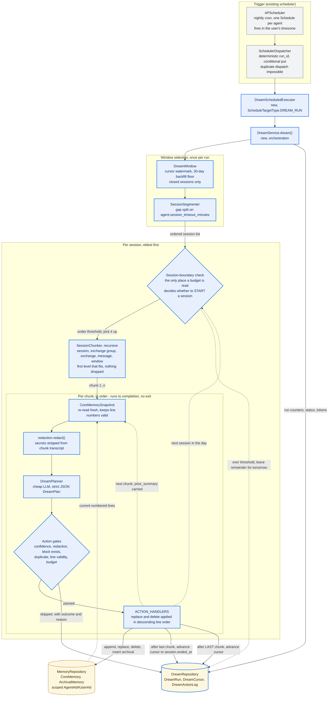

# LLD: Dream Framework — Nightly Background Memory Organization

Date: 2026-09-18
Status: Draft
Owner: InnomightLabs API
Ticket: [KAN-30](https://vslala007.atlassian.net/browse/KAN-30) (Epic: KAN-29 Memory Intelligence)

## Goal

Give every MemGPT-architecture agent a **daily dream**: a scheduled background pass that replays the
day's conversations *session by session, in order*, and organizes its own core and archival memory —
keeping what is durable, correcting what changed, and deleting what went stale.

The live agent stays focused on answering the user. Memory quality becomes a property of the nightly
routine rather than of the agent remembering to call a memory tool mid-task.

## Governing Principle: Completion Over Budget

**A session is atomic. Once a dream picks up a session, it dreams that session to the end.**

Completion, quality, and accuracy outrank cost. This is the product's selling point: our memory
organization is the most accurate available, and accuracy is incompatible with stopping halfway
through someone's conversation because a counter ran out. A half-dreamed session leaves memory in a
state no one designed — facts appended but not yet corrected, a contradiction read but not resolved.

Concretely, throughout this design:

- Every budget is **advisory** and evaluated **only at a session boundary** — it decides whether to
  *start* the next session, never whether to abandon the current one.
- Overshooting an advisory budget is acceptable and expected. It is **reported**, never enforced.
- No pipeline stage discards user content to fit a limit. Where content exceeds a per-call input
  budget, it is subdivided into more calls — never truncated, clipped, or summarized away.
- The user learns about overshoot through analytics (`DreamRun` counters and `TokenUsageService`),
  not through degraded memory.

Every budget-shaped decision below is annotated with where it is checked. If a limit could ever
interrupt a session mid-flight, that is a bug.

## Design Decisions (confirmed)

| Question | Decision | Rationale |
| --- | --- | --- |
| How are "sessions" obtained? | Derive from inactivity gap; persist only a cursor | No session entity exists today. Deriving matches live context behavior exactly and needs no change to the chat write path or a message backfill. |
| Which model dreams? | New per-user `DreamSettings` (provider + model + cron + timezone) | Lets the user point dreams at a cheap model. Framework is inert until configured — no surprise spend. |
| Which `(agent_id, user_id)` pairs dream? | Dashboard owner only (`user_id == owner_email`) | Bounded cost. Widget-visitor dreaming is deferred (see [Non-Goals](#non-goals-for-v1)). |
| How is it triggered? | New `ScheduleTargetType.DREAM_RUN` + executor | Inherits cron, timezone, pause/resume, run history, and duplicate-dispatch protection from the existing scheduler. |
| What happens when a budget is hit? | Sessions are atomic; budgets are advisory and checked only between sessions | Completion, quality and accuracy are the product differentiator. See [Completion Over Budget](#governing-principle-completion-over-budget). |

## Current State

Facts established by reading the code, with references. These constrain the design.

### Memory

- `api/src/memory/models.py` — `MemoryBlockDefinition`, `CoreMemory` (line-based, word-counted),
  `ArchivalMemory` (content-hash idempotent), `CapacityWarningTracker`. All keyed
  `pk = Agent#{agent_id}#User#{user_id}`.
- `api/src/memory/repository.py:35` — `MemoryRepository` already exposes everything the dream needs:
  `get_block_definitions`, `get_all_core_memories`, `get_core_memory`, `save_core_memory`,
  `line_exists` (`:145`), `insert_archival` (returns `(memory, is_new)`, `:196`), `search_archival`,
  `delete_archival`.
- `api/src/memory/compaction.py:25` — `MemoryCompactionService` handles *capacity-driven* compaction.
  The dream is a sibling mechanism (*quality*-driven), not a replacement.
- `api/src/memory/snapshot.py` — `CoreMemorySnapshot` is the single-consistent-read shape used for
  prompt rendering. The dream planner prompt reuses it.

### Sessions

There is **no** persisted session. `FixedWindowStrategy.build_context`
(`api/src/llm/conversation_strategy.py:95`) computes the gap between `now` and the last message and
returns an empty context when it exceeds `agent.session_timeout_minutes` (default `60`,
`api/src/agents/models.py:56`). "Session" is therefore an inactivity-gap segmentation of a
conversation's message list — which we can reproduce deterministically offline.

### Conversations and messages

- `Conversation` — `pk = USER#{created_by}`, `sk = CONVERSATION#{conversation_id}`, carries `agent_id`
  (`api/src/conversations/models.py:64`). Listable per owner via
  `ConversationRepository.find_all_by_user` (`:93`).
- `Message` — `pk = CONVERSATION#{conversation_id}`, `sk = MESSAGE#{created_at}#{message_id}`
  (`api/src/messages/models.py:137`). The sort key is chronological, so a `begins_with` range query
  pages a conversation in time order. `DynamoDBMessageRepository.find_by_conversation_paginated`
  (`api/src/messages/repositories/dynamodb.py:56`) already does cursor-based forward paging.
- `AutomationConversation` (`conversation_type == "automation"`) is a subtype and must be **excluded**
  — automation runs are machine traffic, not user conversation.

### Scheduler

- `api/src/scheduler/models.py:18` — `ScheduleTargetType` enum (`AGENT_MESSAGE`, `AUTOMATION_RUN`).
- `api/src/scheduler/dispatcher.py:33` — executors are a `dict[ScheduleTargetType, ScheduleTargetExecutor]`
  injected into `SchedulerDispatcher`. Adding a target type is a registry entry, not a branch.
- `api/src/scheduler/dispatcher.py:58` — `save_run_once` uses a conditional put on a deterministic
  `run_id` (`schedule_id:scheduled_for`), so duplicate dispatch across API replicas is already solved.
- `api/src/scheduler/service.py:139` — `_validate_target` **is** an `if`-chain. See
  [Target validation](#5-target-validation-strategy-registry) — we replace it with a registry rather
  than appending a third branch.
- `api/src/scheduler/cron.py` — 5-field cron + explicit `ZoneInfo` timezone, via `croniter`.

### LLM access

- `api/src/llm/credentials.py:16` — `load_provider_credentials(provider_name, provider_settings, provider_settings_repo)`.
- `api/src/llm/providers/factory.py:14` — `get_llm_provider(name)`.
- `api/src/smart_suggestions/` is the precedent for a cheap-model, strict-JSON feature:
  per-user settings entity (`models.py:19`), a `Protocol`-based strategy registry (`strategies.py:23`),
  and a service that streams text and parses one JSON object (`service.py:63`).
- `api/src/token_usage/service.py:36` — `record_usage(owner_email, agent_id, llm_model, prompt_tokens, completion_tokens)`.

### Storage

Single table, `pk`/`sk`, plus **one** GSI: `gsi2` (`gsi2_pk`/`gsi2_sk`, projection ALL) —
`terraform/dynamodb.tf:37`. `gsi1_*` attributes are written by `Conversation` but **no `gsi1` index
exists**; do not rely on it. TTL attribute is `ttl`.

> **Consequence:** there is no global index over agents or users. The dream cannot "sweep all agents".
> This is exactly why one `Schedule` row per dreaming agent (keyed by owner) is the right trigger —
> `list_active_schedules` already reads `gsi2_pk = ScheduleDue#active`.

## High-Level Shape



Blue border = new in this design; grey = existing and reused unchanged; amber cylinder =
DynamoDB-backed. Note where the budget diamond sits: **outside** the per-chunk loop. It gates whether
a session is *started*, never whether one is finished — so the inner loop has no exit condition but
running out of chunks. The dashed edges are the inner chunk loop (carrying `prior_summary`), the
outer session loop, and the remainder exit that leaves undreamed sessions for tomorrow. Every loop
re-reads memory first, which is why line numbers stay valid across a multi-chunk, multi-session
dream.

Each layer is independently testable. `DreamPlanner` is the only component that touches an LLM;
`DreamExecutor` is the only component that writes memory.

## Data Model

New module: `api/src/dream/`.

```text
api/src/dream/
├── __init__.py
├── models.py          # DreamSettings, DreamRun, DreamCursor, plan models
├── repository.py      # DreamRepository (settings, runs, cursor, action log)
├── sessions.py        # SessionSegmenter — gap-based session derivation
├── window.py          # DreamWindow — which sessions to replay, in order
├── planner.py         # DreamPlanner — cheap-LLM -> DreamPlan
├── actions.py         # action strategies (append/replace/delete/archival/no_op)
├── redaction.py       # secret detection + redaction
├── service.py         # DreamService — orchestration
├── executor.py        # DreamScheduledExecutor (scheduler target)
└── router.py          # settings CRUD, manual trigger, run history
```

### 1. `DreamSettings` — per-user configuration

Mirrors `SmartSuggestionSettings` (`api/src/smart_suggestions/models.py:19`) so the SPA can reuse the
same settings-form shape.

```python
class DreamSettings(BaseModel):
    user_email: str
    enabled: bool = False
    provider_name: str | None = None
    model_name: str | None = None
    cron_expression: str = "0 3 * * *"       # 03:00 daily, in `timezone`
    timezone: str = "UTC"
    # Advisory only. All three are checked at session boundaries, never mid-session.
    soft_sessions_per_run: int = 25
    soft_chunks_per_run: int = 120
    soft_actions_per_run: int = 40
    min_confidence: float = 0.75
    backfill_days: int = 30
    created_at: datetime = Field(default_factory=lambda: datetime.now(timezone.utc))
    updated_at: datetime | None = None

    @model_validator(mode="after")
    def validate_model_when_enabled(self) -> "DreamSettings":
        if self.enabled and (not self.provider_name or not self.model_name):
            raise ValueError("provider_name and model_name are required when dreaming is enabled")
        return self

    @property
    def pk(self) -> str:
        return f"User#{self.user_email}"

    @property
    def sk(self) -> str:
        return "DreamSettings"
```

`cron_expression` and `timezone` are validated through the existing
`validate_schedule_expression(ScheduleExpression(...))` (`api/src/scheduler/cron.py:24`) — one source
of truth for cron semantics.

### 2. `DreamCursor` — the "movie" bookmark

One cursor per `(agent_id, user_id)`. This is what makes the replay resumable and prevents
re-dreaming the same sessions.

```python
class DreamCursor(BaseModel):
    agent_id: str
    user_id: str
    last_session_ended_at: datetime | None = None   # watermark: sessions at/before this are done
    last_run_id: str | None = None
    sessions_dreamed: int = 0
    backfill_completed: bool = False                # True once the 30-day backfill has drained
    updated_at: datetime = Field(default_factory=lambda: datetime.now(timezone.utc))

    @property
    def pk(self) -> str:
        return f"Agent#{self.agent_id}#User#{self.user_id}"       # same partition as memory

    @property
    def sk(self) -> str:
        return "DreamCursor"
```

Co-locating the cursor in the memory partition means a dream's reads of memory + cursor hit one
partition, and account deletion already sweeping that partition picks it up.

### 3. `DreamRun` — observability record

```python
class DreamRunStatus(str, Enum):
    RUNNING = "running"
    SUCCEEDED = "succeeded"
    PARTIAL = "partial"       # every session touched was dreamed IN FULL; more remain for tomorrow
    FAILED = "failed"
    SKIPPED = "skipped"       # nothing new to dream, or disabled


class DreamRun(BaseModel):
    run_id: str
    agent_id: str
    user_id: str
    owner_email: str
    status: DreamRunStatus = DreamRunStatus.RUNNING
    mode: Literal["backfill", "daily", "manual"] = "daily"
    window_start: datetime | None = None
    window_end: datetime | None = None
    sessions_considered: int = 0
    sessions_dreamed: int = 0
    chunks_planned: int = 0             # LLM calls made; >= sessions_dreamed
    chunks_skipped_empty: int = 0       # structural pre-filter: chunk had no user message
    sessions_remaining: int = 0         # not picked up; tomorrow's dream starts here
    budget_overshoot_chunks: int = 0    # chunks_planned beyond soft_chunks_per_run
    budget_overshoot_actions: int = 0   # actions_executed beyond soft_actions_per_run
    longest_session_chunks: int = 0     # largest single session completed this run
    candidates_extracted: int = 0
    actions_proposed: int = 0
    actions_executed: int = 0
    actions_skipped: int = 0
    prompt_tokens: int = 0
    completion_tokens: int = 0
    error: str | None = None
    started_at: datetime = Field(default_factory=lambda: datetime.now(timezone.utc))
    completed_at: datetime | None = None

    @property
    def pk(self) -> str:
        return f"Agent#{self.agent_id}#User#{self.user_id}"

    @property
    def sk(self) -> str:
        return f"DreamRun#{self.started_at.isoformat()}#{self.run_id}"
```

Reverse-chronological run history is a `begins_with("DreamRun#")` query with
`ScanIndexForward=False` — no new index.

### 4. `DreamActionLog` — why a memory changed

One item per proposed action, executed or not. This is the audit trail the ticket's Observability
section asks for.

```python
class DreamActionOutcome(str, Enum):
    EXECUTED = "executed"
    SKIPPED_LOW_CONFIDENCE = "skipped_low_confidence"
    SKIPPED_DUPLICATE = "skipped_duplicate"
    SKIPPED_STALE_LINE = "skipped_stale_line"
    SKIPPED_REDACTED = "skipped_redacted"
    SKIPPED_UNKNOWN_BLOCK = "skipped_unknown_block"
    FAILED = "failed"
```

- `pk = DreamRun#{run_id}`, `sk = Action#{index:04d}`
- Fields: `action_type`, `block_name`, `line_number`, `content_preview` (truncated, redacted),
  `reason`, `confidence`, `outcome`, `detail`, `session_ref`.
- `ttl` set to 90 days — audit logs are debugging aids, not durable state.

### 5. Plan models

The ticket's JSON contract, as validated Pydantic:

```python
class DreamActionType(str, Enum):
    APPEND_CORE = "append_core"
    REPLACE_CORE = "replace_core"
    DELETE_CORE = "delete_core"
    INSERT_ARCHIVAL = "insert_archival"
    NO_OP = "no_op"


class DreamAction(BaseModel):
    type: DreamActionType
    block_name: str = ""
    line_number: int | None = None
    content: str = ""
    reason: str = Field(min_length=1)
    confidence: float = Field(ge=0.0, le=1.0)

    @model_validator(mode="after")
    def validate_shape(self) -> "DreamAction":
        """Each action type has its own required fields — enforced by a spec table, not an if-chain."""
        ACTION_SPECS[self.type].validate(self)
        return self


class DreamPlan(BaseModel):
    actions: list[DreamAction] = Field(default_factory=list)
    session_summary: str = ""
```

`ACTION_SPECS` is a `dict[DreamActionType, DreamActionSpec]` defined in `actions.py` — see
[Action strategies](#action-strategies-no-if-chains).

## Session Derivation

`api/src/dream/sessions.py`. Pure, dependency-free, fully unit-testable.

```python
@dataclass(frozen=True)
class DreamSession:
    conversation_id: str
    conversation_title: str
    messages: list[Message]

    @property
    def started_at(self) -> datetime:
        return self.messages[0].created_at

    @property
    def ended_at(self) -> datetime:
        return self.messages[-1].created_at


class SessionSegmenter:
    """Splits a conversation's messages into sessions on inactivity gaps.

    Mirrors FixedWindowStrategy's session semantics (src/llm/conversation_strategy.py:95):
    a gap larger than `session_timeout_minutes` starts a new session. Unlike the live
    strategy -- which only compares `now` to the last message -- this walks the whole
    history and compares consecutive messages.
    """

    def segment(
        self,
        conversation_id: str,
        conversation_title: str,
        messages: list[Message],
        session_timeout_minutes: int,
    ) -> list[DreamSession]:
        ...
```

Rules:

- Consider only `role in {"user", "assistant"}`; drop `system`.
- `session_timeout_minutes <= 0` (no timeout configured) → the whole conversation is one session.
- Messages arrive sorted ascending (guaranteed by the `sk` range query); assert rather than re-sort.
- A session with no `user` message is dropped — nothing durable can come from assistant-only traffic.

### Chunking a session to fit the planner budget

A session is bounded **only** by inactivity gaps. Nothing caps its message count, and
`SendMessageRequest.content` has no `max_length` (`api/src/agents/router.py:46`), so a single message
is unbounded too. An 8-hour support session with no 60-minute gap is *one* session and can exceed any
single-prompt budget.

The planner therefore consumes **chunks**, produced by *recursive subdivision* — never by dropping
messages. Chunking descends through granularity levels, stopping as soon as the unit fits:

| Level | Unit | Splits into | Triggers when |
| --- | --- | --- | --- |
| L0 | whole session | — | always tried first; the common case, one chunk |
| L1 | group of exchanges | greedy pack of exchanges into the budget | session exceeds budget |
| L2 | single exchange | — | one exchange alone exceeds budget |
| L3 | single message | — | a user or assistant message alone exceeds budget |
| L4 | message window | contiguous word windows with a small overlap | one message alone exceeds budget |

An **exchange** is unambiguous in this codebase: `krishna_memgpt.py:453-461` saves exactly one
assistant message per turn, and only when the final text is non-empty. So an exchange is one `user`
message plus the `assistant` reply if there was one. A tool-only turn that produced no text yields a
user message with no reply — handled, not special-cased.

```python
@dataclass(frozen=True)
class DreamSessionChunk:
    session: DreamSession
    index: int                       # 0-based, ordered within the session
    total: int
    messages: list[Message]          # contiguous slice; concat of all chunks == session.messages
    granularity: str                 # "session" | "exchange_group" | "exchange" | "message" | "window"
    window_of_message_id: str = ""   # set at L4; this chunk is a slice of one long message
    window_index: int = 0
    window_total: int = 1


class MessageExchange(NamedTuple):
    messages: list[Message]          # one user message, plus the assistant reply if present

    @property
    def word_count(self) -> int:
        return sum(len(m.content.split()) for m in self.messages)


def split_into_exchanges(messages: list[Message]) -> list[MessageExchange]:
    """Fold messages into exchanges. A `user` message opens a new exchange."""
    ...


class SessionChunker:
    """Recursively subdivides a session until every chunk fits the planner budget.

    Unlike FixedWindowStrategy -- which keeps the newest messages and drops the rest
    (src/llm/conversation_strategy.py:117) -- this drops nothing. A long session costs
    more LLM calls, never less coverage.

    Invariant, asserted in tests:
        concat(chunk.messages for chunk in chunks) == session.messages
    (modulo L4 clipping, which records the affected ids.)
    """

    def chunk(
        self,
        session: DreamSession,
        max_words: int,
        window_overlap_words: int,
    ) -> list[DreamSessionChunk]:
        ...
```

Rules:

- Try the whole session first. Fits → one chunk, `granularity = "session"`. No cost change for
  normal sessions.
- Otherwise fold into exchanges and greedily pack exchanges into budget-sized groups. Because
  packing is greedy over ordered units, this already yields roughly `⌈total_words / max_words⌉`
  chunks — L2 and L3 only ever trigger for a *single* oversized exchange, which is rare.
- **Exchange boundaries are never split.** This is a guarantee, not the soft "prefer to close after
  an assistant reply" heuristic it replaces — a user question and its answer always travel together.
- **No per-session chunk ceiling.** Nothing is truncated for being long. Cost is bounded at the
  *run* level instead, and the remainder is deferred to tomorrow — see
  [Run budget and deferral](#run-budget-and-deferral).
- **L4 is lossless too.** A single message longer than the budget is split into contiguous word
  windows of `max_words`, each overlapping the previous by `window_overlap_words` (default 100) so a
  sentence or a stated fact is never severed at a boundary. The planner is told which window of how
  many it is reading.

**The pipeline has no lossy path.** Every level subdivides; none truncates, clips, or summarizes.
That is the point — see
[Completion Over Budget](#governing-principle-completion-over-budget).

**Why not truncate to the most recent messages?** Because that policy is right for the live agent and
wrong for the dream. `FixedWindowStrategy` keeps the tail because recency is what matters when
*continuing* a conversation. Dreaming needs *coverage*: durable identity, role, and preference facts
are most often stated at the **opening** of a session ("I'm a staff engineer on the payments team, I
prefer X"). Keeping the tail would discard the highest-value memory candidates — and the `DreamRun`
would report `SUCCEEDED` having never seen them. Silent, systematic loss of exactly the facts the
feature exists to capture.

**Why recursive subdivision rather than recursive summarization?** A summary is a lossy paraphrase
produced by the same cheap model; the planner would then be extracting durable facts from a
paraphrase of the user's words rather than the words. Subdivision keeps the planner reading the
actual transcript at every level.

**Why levels rather than one flat greedy pass over messages?** A flat pass gives the same *chunk
count*, so it is not about efficiency — it is about boundary quality. Packing whole exchanges means
a chunk never opens with an orphaned answer to a question the planner cannot see. The extra level
costs one fold and buys a structural guarantee.

### Run budget and deferral

Uncapping chunks per session moves the cost question, it does not remove it. But per
[Completion Over Budget](#governing-principle-completion-over-budget), the answer is a **soft
threshold evaluated between sessions**, not a hard stop:

- `soft_chunks_per_run` (default 120) is checked **before starting each session**, never during one.
- Over threshold → the run does not pick up another session and finalizes. Sessions already dreamed
  are dreamed *in full*.
- Under threshold → the session is picked up and **runs to completion, however many chunks that
  takes**, even if it overshoots the threshold substantially. A 400-chunk session started at chunk
  119 runs all 400.
- `chunks_planned` and `budget_overshoot_chunks` are recorded on the `DreamRun` so the overshoot is
  visible in analytics.

The same rule governs `soft_sessions_per_run` and `soft_actions_per_run`. Sessions not picked up are
the remainder; tomorrow's dream starts exactly where the cursor left off.

**The cursor stays session-granular.** Because a session is never abandoned mid-flight, there is no
partially-dreamed session to resume into — so no `last_chunk_index`, no chunk-plan fingerprint, and
no livelock to defend against. `last_session_ended_at` advances once, after the session's final chunk.

This is a direct consequence of [Completion Over Budget](#governing-principle-completion-over-budget),
and it is *simpler* than budget enforcement would have been. An earlier draft of this design added
intra-session resume state to survive a mid-session budget stop; session atomicity deletes that
machinery outright.

A crash or redeploy mid-session re-dreams that whole session tomorrow, which is safe because every
action is idempotent (`line_exists` for appends, content hash for archival). We pay one repeated
session rather than carry resume state for every session.

### Why no minimum chunk size

An earlier draft pre-filtered chunks under 25 words to avoid paying a planner call for "nothing
here". That is an accuracy leak, and a bad one: some of the most durable facts a user ever states are
the shortest. *"I'm vegetarian."* is three words. *"Call me Vee, not Varun."* is five. *"I'm the only
backend engineer."* is five. Those are exactly the lines that belong in the `human` block forever.

A word floor optimizes away the cheapest, highest-value memories. Removed. The only pre-filter left
is structural — a chunk with no `user` message at all, which can only arise from L2/L3 subdivision of
a single long assistant message and contains nothing the user said.

**Why not chunk before segmenting?** Session boundaries are semantic (the user walked away); chunk
boundaries are mechanical (budget). Segmenting first means chunk boundaries never straddle two
unrelated conversations.

**Why not persist sessions?** It would require stamping `session_id` on every `Message` write in
`krishna_memgpt.py` plus a backfill over all historical messages before the first dream could run.
Deriving is free, exactly consistent with what the live agent experiences, and the cursor gives us the
resumability that a persisted entity would have provided.

## Window Selection and Paging

`api/src/dream/window.py`. This is the "movie from start to end" logic.

The lower bound is always the **cursor checkpoint**, never a fixed one-day lookback. In steady
state the checkpoint is yesterday's last closed session, so a nightly run does read "since
yesterday" — but if dreaming was paused, disabled, or the API was down for a week, the next run
picks up the *whole* week (subject to advisory budgets spreading it over a few nights). There is no
coverage gap by construction, and no way for a day to be skipped.

```python
@dataclass(frozen=True)
class DreamWindow:
    mode: Literal["backfill", "daily", "manual"]
    start: datetime
    end: datetime
    sessions: list[DreamSession]      # chronological, oldest first
    truncated: bool                   # budget hit; more sessions remain
```

### Algorithm

1. **Resolve the lower bound.**
   - Cursor missing or `backfill_completed is False` → `mode = "backfill"`,
     `start = max(cursor.last_session_ended_at or epoch, now - backfill_days)`.
     This is the ticket's 30-day limit for the first organization pass.
   - Otherwise → `mode = "daily"`, `start = cursor.last_session_ended_at`.
2. **Upper bound.** `end = now - session_timeout_minutes`. A session is only dreamed once it has
   *closed*; this prevents dreaming a conversation the user is still mid-way through.
3. **Collect conversations.** `ConversationRepository.find_all_by_user(owner_email)` (one query on
   `pk = USER#{email}`), filtered in memory to `conversation.agent_id == agent_id` and
   `conversation_type != "automation"`.
4. **Probe each conversation for new traffic — one RCU each.**
   `has_messages_after(conversation_id, start)` (new; see
   [Detecting "nothing new" cheaply](#detecting-nothing-new-cheaply)). `False` → skip the
   conversation entirely without paging any history.
5. **Page messages only for conversations that passed the probe.**
   `find_by_conversation_paginated(conversation_id, limit=200, cursor=...)` in a loop. The `sk` is
   `MESSAGE#{created_at}#...`, so pages arrive in order. This keeps a single conversation from being
   loaded whole into memory.
6. **Segment** each conversation via `SessionSegmenter`.
7. **Filter** to sessions with `start < session.ended_at <= end`.
8. **Sort all sessions across all conversations by `started_at` ascending.** This is the key ordering
   property: the dream replays the *day* in sequence, interleaving conversations as they actually
   happened — not conversation-by-conversation.
9. **Empty result → the run ends here.** `DreamWindow.sessions == []` means `SKIPPED` with
   `reason = "no_new_sessions"`, before any provider credential is resolved and before any LLM call.
   No `soft_*` budget is consulted, because nothing is picked up.

Note what is *not* here: no cap is applied to the session list at window-build time. Advisory
budgets are evaluated inside the session loop, at each boundary, per
[Completion Over Budget](#governing-principle-completion-over-budget).

### Detecting "nothing new" cheaply

Most runs will find nothing. That path must cost near-zero, and it must not produce false negatives.

```python
# added to the MessageRepository Protocol (src/messages/repositories/base.py)
def has_messages_after(self, conversation_id: str, after: datetime) -> bool:
    ...
```

DynamoDB implementation is a single `Limit=1` key-condition query — no filter expression, no scan:

```python
response = self.table.query(
    KeyConditionExpression=(
        Key("pk").eq(f"CONVERSATION#{conversation_id}")
        & Key("sk").gt(f"MESSAGE#{after.isoformat()}")
    ),
    Limit=1,
    ProjectionExpression="sk",
)
return bool(response.get("Items"))
```

This is exact because `sk = MESSAGE#{created_at.isoformat()}#{message_id}`
(`api/src/messages/models.py:137`) sorts lexicographically **and** chronologically — ISO-8601 with a
fixed offset has that property. One RCU per conversation, so the whole "nothing new" path is
`1 + N` tiny queries for `N` conversations, zero LLM spend.

> **Why not use `Conversation.updated_at` as the high-water mark?** It is the obvious cheap filter and
> it is **not reliable**, so using it would make the dream silently skip real conversations:
>
> - `api/src/scheduler/executors.py` (`AgentScheduledMessageExecutor`) calls
>   `handle_message_buffered` and **never** saves the conversation — scheduled agent wakeups persist
>   messages while leaving `updated_at` untouched.
> - The dashboard chat path does bump it, but at `api/src/agents/router.py:459`, *after* the whole SSE
>   stream completes, inside the generator. A client disconnecting mid-stream leaves the user message
>   saved (`krishna_memgpt.py:155-162`) and `updated_at` stale.
>
> Both holes would drop conversations from the window with no error and no log line. Probing the
> message partition is authoritative, and costs one RCU. Fixing `updated_at` at its two write sites
> would also work, but it makes dream correctness depend on every future caller remembering to bump
> it — the probe does not.

### Cursor advance

After each session is planned *and* executed in full, advance
`cursor.last_session_ended_at = session.ended_at` and persist. Advancing per-session (not per-run)
means a crash loses at most one session of work, and a retry does not re-dream what succeeded.

The cursor is only ever moved past a session that **completed**, which is what makes "no new
messages → end immediately" safe: anything not fully dreamed stays behind the watermark and is
picked up again.

### "New messages" means new *closed* sessions

One nuance worth stating, because it is easy to misread. The upper bound is
`end = now - session_timeout_minutes`, so a run can find new messages and still correctly do nothing:

- User chats at 02:55. Dream fires at 03:00. `session_timeout_minutes = 60`.
- That session has not closed yet — it could continue at 03:10.
- `has_messages_after` returns `True`, but the session fails the `ended_at <= end` filter.
- Result: `SKIPPED` / `no_new_sessions`, and the session is dreamed **tomorrow**, whole.

This is deliberate. Dreaming a session the user might still be in the middle of would plan against a
partial conversation and then have to correct itself — the opposite of
[Completion Over Budget](#governing-principle-completion-over-budget). A session is never dreamed
until it is finished.

Set `backfill_completed = True` when a `backfill`-mode run finishes with `truncated is False`.

## The Dream Pass

`api/src/dream/service.py`.

```python
class DreamService:
    def __init__(
        self,
        *,
        dream_repo: DreamRepository | None = None,
        memory_repo: MemoryRepository | None = None,
        conversation_repo: ConversationRepository | None = None,
        message_repo: MessageRepository | None = None,
        agent_repo: AgentRepository | None = None,
        provider_settings_repo: ProviderSettingsRepository | None = None,
        planner: DreamPlanner | None = None,
        token_usage_service: TokenUsageService | None = None,
    ) -> None:
        ...

    async def dream(
        self,
        *,
        agent_id: str,
        user_id: str,
        owner_email: str,
        mode: Literal["backfill", "daily", "manual"] = "daily",
    ) -> DreamRun:
        ...
```

### Flow

1. Load `DreamSettings`; if missing/`enabled is False` → write a `SKIPPED` `DreamRun` and return.
   (A manual trigger bypasses `enabled` but still requires `provider_name`/`model_name`.)
2. Load the agent. If `agent.agent_architecture != "krishna-memgpt"` → `SKIPPED`; only MemGPT agents
   have memory blocks.
3. `MemoryRepository.initialize_default_blocks(agent_id, user_id)` — idempotent, guarantees `human`
   and `persona` exist before planning.
4. Build the `DreamWindow`. Empty → write a `SKIPPED` `DreamRun` with
   `reason = "no_new_sessions"` and **return**. This is the common case for most agents on most
   nights.
5. Resolve provider + credentials once for the whole run:
   `load_provider_credentials(...)` + `get_llm_provider(settings.provider_name)`.
   **Ordering is deliberate:** this comes *after* the window check, so a run with nothing to do never
   decrypts credentials, never refreshes an OAuth token, and never touches an LLM.
6. **For each session, in order:**
   a. **Session-boundary budget check — the only place any budget is consulted.** If
      `sessions_dreamed >= soft_sessions_per_run` or `chunks_planned >= soft_chunks_per_run` or
      `actions_executed >= soft_actions_per_run`, do **not** pick up this session. Stop the loop and
      record the remainder. Nothing already started is abandoned.
   b. `SessionChunker.chunk(...)` → ordered chunks by recursive subdivision. Usually exactly one.
   c. **For each chunk, in order — this loop has no exit condition other than running out of
      chunks.** Once we are here the session completes, however long it takes:
      i. Skip without an LLM call only if the chunk contains no `user` message at all
         (`chunks_skipped_empty`). There is **no word floor** — see
         [Why no minimum chunk size](#why-no-minimum-chunk-size).
      ii. Re-read memory state fresh: `get_block_definitions` + `get_all_core_memories` →
          `CoreMemorySnapshot`. *Fresh per chunk*, because the previous chunk's actions changed it —
          this is what keeps line numbers valid (ticket §4).
      iii. Redact the chunk transcript (see [Safety](#safety-and-privacy)).
      iv. `planner.plan(..., prior_summary=...)` → `DreamPlan`, where `prior_summary` is the
          previous chunk's `session_summary` so the planner has continuity across a split.
      v. Validate and execute the plan (see below). Every action that passes the correctness gates
         is applied — the action budget is *not* consulted here.
      vi. Increment `chunks_planned`.
   d. Advance and persist `cursor.last_session_ended_at` — once, after the session's final chunk.
   e. Accumulate counters onto the `DreamRun`; persist the run every session so a long backfill is
      observable while in flight.
7. Finalize the `DreamRun`: `SUCCEEDED` (no sessions remain), `PARTIAL` (every session it touched was
   dreamed in full, and more remain for tomorrow), or `FAILED` (an exception; the in-flight session's
   cursor did not advance, so it is retried whole tomorrow).

### Planner

`api/src/dream/planner.py`. One LLM call per **chunk** (one chunk per session in the common case).
Strict JSON, parsed with the same
`_extract_json_object` + `model_validate_json` discipline as
`api/src/smart_suggestions/strategies.py:80`.

The prompt is a **separate strict-JSON planner prompt**, not a reuse of the compaction prompt
(which answers one of the ticket's open questions). Compaction asks "compress this block";
the dream asks "given this transcript and this memory state, what should change?" — a different task
with a structured output contract.

System prompt, in outline:

```text
You are the dreaming subconscious of an AI agent. While the user sleeps you review one
slice of a conversation session and decide what the agent should remember.
When a prior_summary is supplied, this is a continuation -- earlier parts of the same
session were already reviewed, so do not re-propose what they already covered.

Return ONLY valid JSON: {"actions":[...],"session_summary":"string"}

Each action: {"type","block_name","line_number","content","reason","confidence"}
  append_core      -- add a new durable line to a core block
  replace_core     -- correct/update an existing line (requires line_number)
  delete_core      -- remove an obsolete or superseded line (requires line_number)
  insert_archival  -- store detail too long or too specific for core memory
  no_op            -- nothing durable in this session

REMEMBER: stable preferences, identity/role facts, recurring project context, preferred
workflows, durable decisions, long-lived constraints, corrections to remembered facts.

DO NOT REMEMBER: one-off task instructions, secrets/credentials/tokens/keys, transient
status, speculation, your own guesses, anything already present verbatim in core memory.

Prefer replace_core over append_core when a line already covers the topic.
Prefer delete_core when a remembered fact is contradicted by this session.
Prefer insert_archival for anything longer than roughly 30 words.
Set confidence below 0.75 when unsure -- low-confidence actions are discarded, not applied.
```

User payload (JSON): available block definitions with descriptions and word limits, current core
memory as numbered lines (so `line_number` is unambiguous), the redacted transcript, and the session
timestamps.

Token usage from `LLMEvent(type="usage")` is accumulated and forwarded to
`TokenUsageService.record_usage(owner_email=..., agent_id=..., llm_model=settings.model_name, ...)`,
so dream spend shows up in the existing analytics rather than being invisible.

### Executor: safe execution

`api/src/dream/actions.py` + the execute step in `DreamService`. Every action passes these gates in
order, and a rejection is logged as a `DreamActionLog` with the matching outcome:

| Gate | Check | Outcome on failure |
| --- | --- | --- |
| Confidence | `action.confidence >= settings.min_confidence` | `SKIPPED_LOW_CONFIDENCE` |
| Redaction | `redaction.is_safe(action.content)` | `SKIPPED_REDACTED` |
| Block exists | `normalize_block_name` then `get_block_definition(...)` is not `None` | `SKIPPED_UNKNOWN_BLOCK` |
| Duplicate | `MemoryRepository.line_exists(...)` is `None` for appends | `SKIPPED_DUPLICATE` |
| Line validity | `1 <= line_number <= len(memory.lines)` for replace/delete | `SKIPPED_STALE_LINE` |

Every gate is a **correctness** gate. There is deliberately no budget gate here: a session that is
being dreamed applies all of its valid actions. Dropping action #41 of a session because a counter
hit 40 would leave that session's memory half-organized — precisely the inaccuracy
[Completion Over Budget](#governing-principle-completion-over-budget) exists to prevent. The
`soft_actions_per_run` threshold only decides whether to pick up the *next* session.

Two non-negotiables carried over from the ticket:

- **Block names go through `normalize_block_name`** (`api/src/tools/native/handlers.py:35`) — the same
  normalization the live tools apply, so the dream cannot create a `Human - facts` block that shadows
  `human`.
- **Line numbers are resolved against a read taken immediately before the write.** Within a session's
  plan, `replace_core`/`delete_core` actions are applied in **descending `line_number` order** so that
  deleting line 3 does not shift the meaning of a pending action on line 5. Any action whose
  `line_number` no longer exists after earlier edits is skipped as `SKIPPED_STALE_LINE` rather than
  guessed at.

Idempotency:

- `insert_archival` → `MemoryRepository.insert_archival` is already content-hash idempotent and
  returns `is_new`; `is_new is False` logs `SKIPPED_DUPLICATE`.
- `append_core` → guarded by `line_exists`.
- The whole run → guarded upstream by the scheduler's deterministic `run_id` conditional put.

### Action strategies (no if-chains)

Rather than `if action.type == ...` in the executor, each action type is a strategy registered in a
table. Adding a future action type (e.g. `merge_core`) means adding one entry.

```python
class DreamActionHandler(Protocol):
    action_type: DreamActionType
    def required_fields(self) -> tuple[str, ...]: ...
    def apply(self, ctx: DreamActionContext, action: DreamAction) -> DreamActionOutcome: ...


ACTION_HANDLERS: dict[DreamActionType, DreamActionHandler] = {
    DreamActionType.APPEND_CORE: AppendCoreHandler(),
    DreamActionType.REPLACE_CORE: ReplaceCoreHandler(),
    DreamActionType.DELETE_CORE: DeleteCoreHandler(),
    DreamActionType.INSERT_ARCHIVAL: InsertArchivalHandler(),
    DreamActionType.NO_OP: NoOpHandler(),
}
```

`DreamActionContext` carries the freshly-read `CoreMemory` per block, the `MemoryRepository`, and the
run counters — so handlers stay small and directly unit-testable without an LLM or DynamoDB.

## Safety and Privacy

`api/src/dream/redaction.py`. Applied twice: to the transcript **before** it reaches the planner, and
to every action's `content` **before** it is written to memory.

```python
SECRET_PATTERNS: tuple[tuple[str, re.Pattern[str]], ...] = (
    ("aws_access_key",   re.compile(r"\b(?:AKIA|ASIA)[0-9A-Z]{16}\b")),
    ("private_key",      re.compile(r"-----BEGIN [A-Z ]*PRIVATE KEY-----")),
    ("bearer_token",     re.compile(r"\bBearer\s+[A-Za-z0-9._\-]{20,}\b", re.IGNORECASE)),
    ("github_token",     re.compile(r"\bgh[pousr]_[A-Za-z0-9]{36,}\b")),
    ("openai_key",       re.compile(r"\bsk-[A-Za-z0-9_\-]{20,}\b")),
    ("slack_token",      re.compile(r"\bxox[abprs]-[A-Za-z0-9\-]{10,}\b")),
    ("jwt",              re.compile(r"\beyJ[A-Za-z0-9_\-]{10,}\.[A-Za-z0-9_\-]{10,}\.[A-Za-z0-9_\-]{10,}\b")),
    ("assignment",       re.compile(r"(?i)\b(?:api[_\- ]?key|secret|password|passwd|token|credential)\b\s*[:=]\s*\S+")),
)

def redact(text: str) -> tuple[str, list[str]]: ...   # -> (redacted_text, matched_pattern_names)
def is_safe(text: str) -> bool: ...                   # no pattern matched
```

Additional guarantees:

- Every repository call carries both `agent_id` **and** `user_id`; there is no code path in the dream
  module that reads or writes a memory item outside `Agent#{agent_id}#User#{user_id}`.
- Attachment bodies are **excluded** from the transcript. `Message.attachments[].content` can hold up
  to 100KB of source code per file — expensive, and a common place for embedded credentials. Only
  filenames are passed, so the planner can note "works in `settings.py`" without ingesting it.
- `MessageImage` / `MessageCanvasArtifact` payloads are excluded; only a `[image]` / `[canvas]`
  placeholder is passed.
- `DreamActionLog.content_preview` is truncated to 200 chars and redacted.

## Scheduling

### 1. New target type

```python
# src/scheduler/models.py
class ScheduleTargetType(str, Enum):
    AGENT_MESSAGE = "agent_message"
    AUTOMATION_RUN = "automation_run"
    DREAM_RUN = "dream_run"           # new
```

`Schedule.target` for a dream: `{"agent_id": "...", "user_id": "..."}`. `to_lookup_items()` already
emits an `Agent#{agent_id}` lookup row when `target["agent_id"]` is set, so
"which schedules exist for this agent" works with no change.

### 2. Executor

```python
# src/dream/executor.py
class DreamScheduledExecutor:
    """Runs the nightly dream for the (agent_id, user_id) on the schedule target."""

    def __init__(self, service: DreamService | None = None):
        self.service = service or DreamService()

    async def execute(self, schedule: Schedule, scheduled_for: datetime) -> dict[str, Any]:
        agent_id = _required_target(schedule, "agent_id")
        user_id = str(schedule.target.get("user_id") or schedule.owner_email)

        run = await self.service.dream(
            agent_id=agent_id,
            user_id=user_id,
            owner_email=schedule.owner_email,
            mode="daily",
        )
        return {
            "scheduled_for": scheduled_for.isoformat(),
            "agent_id": agent_id,
            "dream_run_id": run.run_id,
            "status": run.status.value,
            "mode": run.mode,
            "sessions_dreamed": run.sessions_dreamed,
            "actions_executed": run.actions_executed,
            "actions_skipped": run.actions_skipped,
            "error": run.error,
        }
```

Registered in `SchedulerDispatcher.__init__` (`api/src/scheduler/dispatcher.py:33`):

```python
self.executors = executors or {
    ScheduleTargetType.AGENT_MESSAGE: AgentScheduledMessageExecutor(),
    ScheduleTargetType.AUTOMATION_RUN: AutomationScheduledRunExecutor(),
    ScheduleTargetType.DREAM_RUN: DreamScheduledExecutor(),
}
```

A dream that returns `SKIPPED`/`PARTIAL` is a *successful* dispatch — the `ScheduleRun` records
`SUCCEEDED` with the detail in `output`. Only an exception marks the dispatch `FAILED`. This keeps
"nothing to dream about" out of the failure metrics.

### 3. Backfill spread

A `backfill`-mode run is capped at `max_sessions_per_run` like any other. When it returns
`truncated = True` the cursor has advanced, so the *next* night continues the backfill. Thirty days of
history therefore drains over a few nights instead of one expensive burst — and each night's pass has
a bounded, predictable cost. No separate backfill job is needed.

### 4. Schedule lifecycle

`DreamService.ensure_schedule(agent_id, user_id, owner_email, settings)` reconciles one `Schedule` per
dreaming agent, using a **deterministic** `schedule_id` so it is idempotent:

```python
schedule_id = f"dream:{agent_id}:{user_id}"
```

`CreateScheduleRequest` already accepts an explicit `schedule_id`
(`api/src/scheduler/models.py:54`), and `SchedulerService.create_schedule` honors it
(`service.py:41`) — so create-or-update needs no new repository method.

Reconciliation points:
- `PUT /dream/settings` → upsert or pause every dream schedule for that user.
- Agent created with `krishna-memgpt` and dreaming enabled → upsert.
- Agent deleted → `delete_schedule`.

`source_type = "dream"` on the `Schedule` distinguishes framework-managed rows from user-created ones
in the schedules list UI.

### 5. Target validation: strategy registry

`SchedulerService._validate_target` (`api/src/scheduler/service.py:139`) is currently an `if`-chain
over target type. Adding `dream_run` as a third branch is the wrong direction. Replace it with a
validator registry in `src/scheduler/targets.py`:

```python
class ScheduleTargetValidator(Protocol):
    target_type: ScheduleTargetType
    def validate(self, target: dict[str, Any]) -> None: ...


TARGET_VALIDATORS: dict[ScheduleTargetType, ScheduleTargetValidator] = {
    ScheduleTargetType.AGENT_MESSAGE: AgentMessageTargetValidator(),
    ScheduleTargetType.AUTOMATION_RUN: AutomationRunTargetValidator(),
    ScheduleTargetType.DREAM_RUN: DreamRunTargetValidator(),
}
```

`_validate_target` becomes a lookup plus an "unsupported target type" raise. Existing behavior and
error messages are preserved verbatim so `test_scheduler_*` tests keep passing; this is a
refactor-in-place, covered by the existing suite.

## API

`api/src/dream/router.py`, registered in `main.py` alongside the other routers (`main.py:166` area).

Settings (schema-driven, follows the `smart_suggestions` settings shape):

- `GET /dream/settings` → `DreamSettingsResponse`
- `PUT /dream/settings` → validates cron + timezone via `validate_schedule_expression`, saves,
  reconciles schedules
- `GET /dream/settings/forms/configure` → `FormInput`-driven form so the SPA renders it with
  `SchemaForm` and needs no bespoke UI (per `AGENTS.md` → Schema-Driven Forms)

Per-agent:

- `GET /agents/{agent_id}/dream/runs?limit=20` → recent `DreamRun`s, newest first
- `GET /agents/{agent_id}/dream/runs/{run_id}/actions` → the `DreamActionLog` audit trail
- `POST /agents/{agent_id}/dream/run` → manual trigger, `mode = "manual"`. Returns `202` and runs via
  FastAPI `BackgroundTasks` so the request never blocks on LLM calls.
- `GET /agents/{agent_id}/dream/cursor` → current watermark and backfill state

All endpoints resolve `user_id = request.state.user_email` and verify ownership through
`AgentRepository.find_agent_by_id(agent_id, user_id)` — the exact pattern in
`api/src/memory/router.py:85`.

## Configuration

`api/src/config/settings.py`, following the existing dataclass + `os.getenv` pattern
(`settings.py:67` for the scheduler block):

```python
# Dream framework
dream_enabled: bool = True                     # global kill switch
dream_default_cron: str = "0 3 * * *"
dream_backfill_days: int = 30
dream_soft_sessions_per_run: int = 25          # advisory; checked at session boundaries only
dream_soft_actions_per_run: int = 40           # advisory; checked at session boundaries only
dream_min_confidence: float = 0.75
dream_message_page_size: int = 200
dream_chunk_max_words: int = 6000              # planner input budget per LLM call
dream_soft_chunks_per_run: int = 120           # advisory; a started session always finishes
dream_window_overlap_words: int = 100          # L4 window overlap, keeps facts whole at boundaries
```

Mirrored as `DREAM_*` env vars in Terraform per `AGENTS.md` → Configuration Conventions.
`dream_enabled = False` makes `DreamScheduledExecutor` return `SKIPPED` immediately — a safe way to
stop all dreaming in an incident without touching user settings.

## Observability

Per the ticket's §6, each dream logs at `INFO`:

```text
dream.start       agent_id, user_id, mode, window_start, window_end, sessions_considered
dream.session     run_id, conversation_id, session_index, started_at, ended_at, message_count, chunk_count
dream.chunk       run_id, session_index, chunk_index, chunk_total, granularity, words,
                  window_of_message_id, window_index, window_total
dream.plan        run_id, session_index, chunk_index, actions_proposed, candidates
dream.action      run_id, action_type, block_name, confidence, outcome, reason
dream.cursor      run_id, last_session_ended_at, sessions_dreamed
dream.overshoot   run_id, soft_chunks_per_run, chunks_planned, budget_overshoot_chunks,
                  session_index, reason -- emitted at WARNING, the session still completes
dream.remainder   run_id, sessions_remaining, resume_session_ended_at
dream.end         run_id, status, sessions_dreamed, sessions_remaining, chunks_planned,
                  longest_session_chunks, budget_overshoot_chunks, actions_executed,
                  actions_skipped, tokens
```

Durable records: `DreamRun` (counters + window + status + tokens) and `DreamActionLog` (per-action
reason and outcome). Together these answer "why did this memory line appear/change/disappear?" from
the API alone, without log spelunking.

### Analytics: how the user learns the cost

Because budgets are advisory, analytics is the **only** mechanism telling the user what a dream cost.
That makes it load-bearing, not decoration.

Two existing surfaces carry it, so no new analytics infrastructure is needed:

- **Token spend** — `TokenUsageService.record_usage(owner_email, agent_id, llm_model, prompt_tokens,
  completion_tokens)` (`api/src/token_usage/service.py:36`) is already called per LLM call elsewhere;
  the planner does the same per chunk. Dream spend therefore appears in the existing
  `GET /analytics/agents/{agent_id}/token-usage` timeseries
  (`api/src/analytics/router.py:96`) with no schema change — it is attributed to
  `DreamSettings.model_name`, so a cheap dream model shows up distinctly from chat traffic.
- **Dream mechanics** — `GET /agents/{agent_id}/dream/runs` returns the `DreamRun` counters:
  `chunks_planned`, `longest_session_chunks`, `budget_overshoot_chunks`,
  `budget_overshoot_actions`, `sessions_remaining`.

What the SPA should make obvious:

- A run that overshot: `budget_overshoot_chunks > 0` — with the framing that the session was
  completed *deliberately*, not that something went wrong.
- `longest_session_chunks` — the single best signal for a user wondering why one night cost more.
  A 40-chunk session is a 40-call session.
- `sessions_remaining > 0` on a `PARTIAL` run — work queued for tomorrow, nothing lost.

The advisory thresholds are knobs the user can raise if they would rather finish a 30-day backfill in
two nights than six. They are not protection the system relies on.

## Testing

New tests under `api/tests/`, using the existing `dynamodb_table` moto fixture from
`tests/conftest.py:40`. `tests/mock_data.py` needs a `DreamSettings` fixture builder.

| File | Covers |
| --- | --- |
| `test_dream_sessions.py` | Gap segmentation: single session, exact-boundary gap, multiple gaps, `timeout=0` → one session, assistant-only session dropped, empty input |
| `test_dream_chunker.py` | `split_into_exchanges`: user+assistant pair, tool-only turn with no reply, consecutive user messages, leading assistant message. Then per level: L0 session fits → one chunk; L1 oversized session → exchange groups, no exchange ever split; L2 single oversized exchange; L3 single oversized message; L4 windows with overlap. **Lossless invariants**: concat of all chunk messages equals `session.messages`; for L4, de-overlapping the windows reproduces the message word-for-word. A three-word user message is never filtered out |
| `test_dream_atomicity.py` | **The principle, asserted directly.** A session whose chunk count exceeds `soft_chunks_per_run` still makes every planner call and applies every valid action; the budget is consulted only between sessions; a session with 41+ valid actions applies all of them under `soft_actions_per_run = 40`; `budget_overshoot_chunks` is recorded; the cursor advances only after the final chunk |
| `test_dream_probe.py` | `has_messages_after` boundary behavior: message exactly at the watermark excluded, one microsecond after included, empty conversation → `False`, and the DynamoDB and in-memory implementations agree. A conversation whose messages were written **without** bumping `Conversation.updated_at` (the scheduler-wakeup case) is still detected |
| `test_dream_window.py` | Fast exit: no new messages → `sessions == []`, `SKIPPED`/`no_new_sessions`, and **no** provider credential resolved and **no** planner call (assert with strict mocks). New messages but session not yet closed → also `SKIPPED`. Backfill floor at 30 days, cursor resume, `end` excludes an open session, automation conversations excluded, cross-conversation chronological ordering, `truncated` when over budget |
| `test_dream_planner.py` | Strict-JSON parse, JSON wrapped in prose/code fences, malformed JSON raises, invalid action shape rejected by `DreamAction` validators, usage accumulation |
| `test_dream_actions.py` | Each handler in isolation: append dedupe via `line_exists`, replace/delete descending-order application, stale line number skipped, unknown block skipped, archival `is_new is False` → duplicate |
| `test_dream_service.py` | Full pass with a stub planner: multi-chunk session makes N planner calls with `prior_summary` threaded, cursor advances once per session not per chunk, crash mid-session leaves the cursor unmoved and re-dreams the session whole and idempotently, `PARTIAL` when sessions remain, `SUCCEEDED` when none do, `SKIPPED` when disabled / no new sessions / non-MemGPT architecture, re-run is a no-op, counters and `DreamRun` persistence |
| `test_dream_redaction.py` | Each secret pattern matches and redacts; safe text untouched; an action carrying a secret is skipped |
| `test_dream_executor.py` | Scheduler target wiring, missing `agent_id` raises, `SKIPPED` dream still yields a `SUCCEEDED` `ScheduleRun` |
| `test_dream_router.py` | Settings CRUD + cron validation, ownership 404s, run history, manual trigger returns 202 |
| `test_scheduler_targets.py` | Validator registry parity with the old `_validate_target` error messages |

Run with `cd api && uv run pytest -v`.

## Implementation Phases

**Phase 1 — Derivation core (no LLM, no writes).**
`models.py`, `repository.py`, `sessions.py` (segmenter, exchange fold, recursive chunker),
`window.py`. Tests: `test_dream_sessions.py`, `test_dream_chunker.py`, `test_dream_window.py`. Deliverable: given an agent, produce the exact ordered list of session chunks
a dream would replay, and assert that concatenating them reproduces the transcript losslessly at
every granularity level. Fully verifiable with no LLM spend.

**Phase 2 — Planner and execution.**
`redaction.py`, `planner.py`, `actions.py`, `service.py`. Tests: `test_dream_planner.py`,
`test_dream_actions.py`, `test_dream_redaction.py`, `test_dream_service.py`,
`test_dream_atomicity.py`. Deliverable:
`DreamService.dream(...)` callable from a script against a real agent.

**Phase 3 — Scheduling.**
`ScheduleTargetType.DREAM_RUN`, `targets.py` validator registry (refactor), `executor.py`, dispatcher
registration, `ensure_schedule` reconciliation, settings. Tests: `test_dream_executor.py`,
`test_scheduler_targets.py`. Deliverable: nightly dreams actually fire.

**Phase 4 — API and SPA surface.**
`router.py`, settings form schema, `main.py` registration, Terraform env vars. Tests:
`test_dream_router.py`. Deliverable: user can configure dreaming, trigger it manually, and read the
audit trail.

## Acceptance Criteria Mapping

| KAN-30 criterion | Where it is satisfied |
| --- | --- |
| Background job runs per `(agent_id, user_id)` without blocking chat | `DreamScheduledExecutor` on APScheduler; manual trigger via `BackgroundTasks` |
| Scans recent conversation history | `DreamWindow`; window is session-closed rather than a fixed 1 hour (see [Deviations](#deviations-from-the-ticket)) |
| Structured plan before writing | `DreamPlan` / `DreamAction`, produced by `DreamPlanner` and logged before execution |
| Appends stable facts to core memory | `AppendCoreHandler` → `MemoryRepository.save_core_memory` |
| Inserts longer details into archival | `InsertArchivalHandler` → `MemoryRepository.insert_archival` |
| Avoids duplicate core lines | `MemoryRepository.line_exists` gate → `SKIPPED_DUPLICATE` |
| Does not store secrets | `redaction.py`, applied to transcript and to action content |
| Logs proposed and executed actions | `DreamActionLog` + `dream.*` structured logs |
| Preserves `agent_id + user_id` scoping | Every repository call is scoped; no unscoped path exists in the module |
| Unit tests for extraction/planning boundaries, idempotency, stale line numbers | `test_dream_planner.py`, `test_dream_service.py`, `test_dream_actions.py` |

## Deviations from the Ticket

Three deliberate departures, all upgrades rather than reductions in scope:

1. **Window is "closed sessions since cursor", not "last 1 hour".** The ticket proposed an hourly
   scan. The dream framing is a daily routine, and an hourly window would either re-dream overlapping
   material or drop sessions that straddle the boundary. A cursor watermark over closed sessions is
   exhaustive and non-overlapping by construction. Hourly cadence remains available — it is just a
   `cron_expression` in `DreamSettings`.

2. **Separate strict-JSON planner prompt** rather than reusing the compaction prompt style
   (ticket open question). Different task, different output contract.

3. **`SchedulerService._validate_target` is refactored to a registry** instead of gaining a third
   branch. Behavior-preserving and covered by the existing scheduler tests.

## Answers to the Ticket's Open Questions

- *Every hour globally, or only after active conversations?* — Neither: a per-agent nightly cron in
  the user's timezone, configurable. Cost is predictable and the "dream" semantics are honest.
- *Which low-cost model?* — User's choice via `DreamSettings.provider_name` / `model_name`. The
  framework stays off until configured, so we never spend on the user's behalf by default.
- *Low-confidence candidates: store, discard, or surface?* — Persisted in `DreamActionLog` with
  outcome `SKIPPED_LOW_CONFIDENCE` and readable through
  `GET /agents/{agent_id}/dream/runs/{run_id}/actions`. Not applied to memory. A future UI can
  surface them for approval without a schema change.
- *Reuse compaction prompt style?* — No. See [Deviations](#deviations-from-the-ticket).

## Non-Goals for v1

- Widget-visitor dreaming (`user_id == visitor_id`). `WidgetConversation`
  (`pk = Agent#{agent_id}#Widget`) makes this reachable later, but a popular widget agent means one
  LLM pass per visitor per night. Deferred pending a cost ceiling design.
- Automation-conversation dreaming — explicitly filtered out.
- Human approval workflow for each memory edit (the audit trail is the groundwork).
- Cross-agent shared memory.
- Vector-backed archival redesign. `search_archival` remains a substring scan; the dream's archival
  inserts inherit that limitation.
- Replacing `MemoryCompactionService`. Capacity-driven compaction and quality-driven dreaming stay
  separate; a future phase may let the dream pre-empt compaction by deleting stale lines first.

## Open Risks

- **`search_archival` loads the full archival partition** (`repository.py:213`) before filtering in
  Python. The dream does not call it today, but if a future "is this already archived?" check is
  added, it becomes an O(all archival memories) read per session.
- **Provider credential expiry mid-run.** `load_provider_credentials` is resolved once per run; a
  long backfill on an OpenAI OAuth token could outlive it. Mitigation: re-resolve credentials every
  N sessions, or cap run wall-clock. Worth a follow-up if backfills prove slow.
- **APScheduler is process-local.** With multiple Railway replicas every replica fires the cron; the
  deterministic `ScheduleRun` conditional put means only one proceeds. Already true for existing
  schedules, called out here because a dream is more expensive than a no-op dispatch.
- **A single night's cost is unbounded by design.** Session atomicity means one pathological session
  — a 500-chunk all-day transcript — issues 500 planner calls in one dream, whatever the advisory
  threshold says. This is the accepted trade for accuracy, but it is a real spend risk on a cheap
  model with a large context. Mitigations available without breaking atomicity: raise
  `dream_chunk_max_words` so fewer chunks cover the same words, or lower
  `soft_sessions_per_run` so fewer such sessions start per night. Watch
  `longest_session_chunks` before choosing.
- **The whole-session retry is the unit of rework.** A crash or redeploy at chunk 39 of 40 re-dreams
  all 40 chunks tomorrow. Idempotent and correct, but the wasted spend scales with session length.
  Accepted deliberately: carrying resume state for every session, to optimize a rare crash, is the
  complexity session atomicity let us delete.
- **L4 windows cost calls on low-value content.** A pasted 20k-word log is now read in full across
  windows instead of being clipped, so nothing is lost — but the planner spends several calls on
  content it is instructed not to remember, and will mostly return `no_op`. Losslessness is worth
  more than those calls, and `granularity = "window"` in the logs makes the pattern easy to spot if
  it turns out to dominate real spend.
- **Chunk boundaries split context, and more chunks mean more churn.** A fact stated in chunk 1 and
  qualified in chunk 3 is appended then corrected across two LLM calls, briefly leaving a wrong line
  in core memory mid-session. `prior_summary` mitigates it; `replace_core` on the later chunk
  resolves it. Uncapping chunk count makes this more frequent on long sessions: each chunk is another
  sequential read-modify cycle against the same blocks. Only observable by reading memory mid-dream,
  but it is the main reason to keep `dream_chunk_max_words` generous rather than small.
