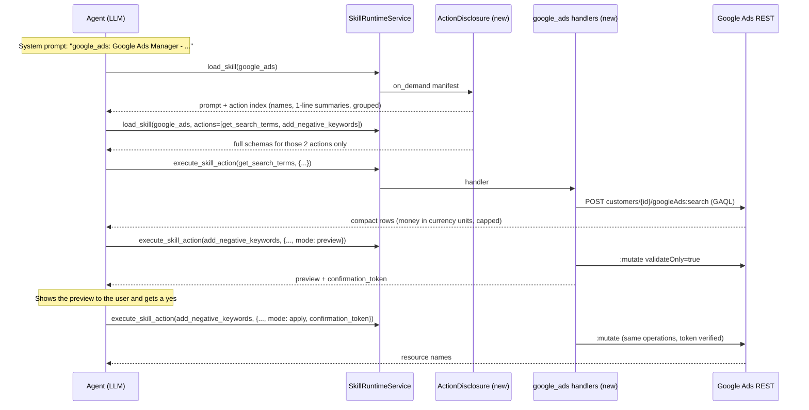
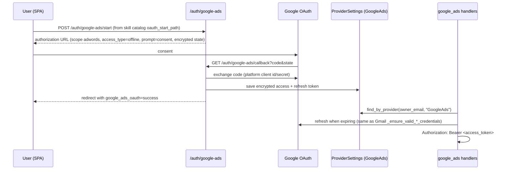

# Google Ads Manager Skill and On-Demand Action Disclosure

| Field | Value |
| --- | --- |
| Status | ✅ Implemented on `feature/google-ads-manager-skill`, pending live testing against a Google Ads account |
| Owner | InnomightLabs API |
| Last reviewed | 2026-09-26 |
| Scope | [`api/src/skills/`](https://github.com/vslala/innomightlabs-dynamic-agent-builder/tree/main/api/src/skills) (platform), [`api/src/agents/tool_runtime/`](https://github.com/vslala/innomightlabs-dynamic-agent-builder/tree/main/api/src/agents/tool_runtime), new `api/src/skills/google_ads/` |
| Depends on | [Unified skill automation actions](LLD-unified-skill-automation-actions), [Gmail skill actions](LLD-google-mail-skill-actions) (OAuth pattern) |

> **Summary:** A `google_ads` skill that lets an agent run Google Ads accounts for SEO experts and site managers:
> structure, reporting, and changes to campaigns, budgets, keywords, ads, and recommendations. It has 29 actions,
> so it must not dump every schema into context. That problem is not specific to Google Ads, so the fix goes in the
> platform: a manifest flag `action_disclosure: on_demand` makes `load_skill` return a compact **action index**
> (names plus one-line summaries). The agent then pulls full schemas with `load_skill(skill_id, actions=[...])`, or
> searches with `load_skill(skill_id, query=...)`. Curated workflow actions cover what users usually do. Two generic
> escape hatches cover the rest of the API: `query` (any GAQL read) and `mutate` (any `MutateOperation`). Every write
> goes through a server-enforced preview, then an apply step, and budgets are capped.
> Tool results only last one turn, so the schemas of the five most recently used actions are re-rendered into each
> turn's system prompt. The list is derived from the existing tool-call audit trail, not stored separately.

---

## 1. Where the proposal changes, and why

The original proposal: the skill exposes only a `search` action at load time, and the agent searches to reveal
action definitions. Keep the goal (don't pay for schemas the agent won't use) and change three details.

| Proposal | Change | Reason |
| --- | --- | --- |
| `search` is an action *inside* the Google Ads skill | Make disclosure a **platform** feature of `load_skill`, turned on by a manifest flag | Every large skill would otherwise rebuild search. `execute_skill_action` is for doing things, not describing them. `list_mcp_tools` has the same problem and can reuse the same mechanism later. |
| Loading the skill shows *only* search | Loading shows an **index** of action names and one-line summaries, with no schemas | With search only, the agent can't see what exists. It has to guess keywords, and every miss costs a round trip that re-sends the whole conversation. That usually costs more than the ~600 tokens the index takes. The index also lets the agent plan multi-step work ("list campaigns → get search terms → add negatives") before loading anything. |
| One hand-written action for everything the Python SDK supports | 27 curated actions plus generic `query` and `mutate` | The Google Ads API has over 100 services and thousands of fields. Hand-wrapping them all is unbounded work, and most wrappers would never be called. GAQL `query` already reads *any* resource. `GoogleAdsService.Mutate` already writes *any* resource. |
| Python `google-ads` SDK | **REST via `httpx`**, the same way the Gmail and Drive skills call Google | See §6. The SDK pulls in gRPC and protobuf, it's a large package for Lambda/Railway, and generic `mutate` would need JSON→protobuf conversion. REST takes the same JSON in and out. |

Search stays, as an optional `query` argument on `load_skill`. With 29 actions the index is enough. Search matters
once a skill (or an MCP server) has hundreds.

---

## 2. Current state (verified in code)

The runtime already does two levels of progressive disclosure:

1. **System prompt**: [`krishna_memgpt/sections/skills.j2`](https://github.com/vslala/innomightlabs-dynamic-agent-builder/blob/main/api/src/agents/prompt_templates/krishna_memgpt/sections/skills.j2)
   lists each installed skill as one line: id, name, description.
   (`SkillRuntimeService.build_system_prompt_addendum`, [service.py:342](https://github.com/vslala/innomightlabs-dynamic-agent-builder/blob/main/api/src/skills/service.py), renders a similar
   block, but only `tests/test_skills.py:687` calls it. It's dead in production, but it is also the only code that renders install "Use when" usage context into a
   prompt; `skills.j2` does not. Left in place: fixing that gap is a separate change.)
2. **`load_skill`**: `handle_tool_call` → `_build_loaded_skill_runtime_payload`
   ([service.py:511](https://github.com/vslala/innomightlabs-dynamic-agent-builder/blob/main/api/src/skills/service.py)) returns the skill `system_prompt` and **every** action with its full
   `input_schema`.
3. **`execute_skill_action`** runs `SkillRegistry.execute_action` ([registry.py:128](https://github.com/vslala/innomightlabs-dynamic-agent-builder/blob/main/api/src/skills/registry.py)), which
   only checks that required fields are present, then calls the handler.

The tool definitions are in [tool_runtime/skills.py](https://github.com/vslala/innomightlabs-dynamic-agent-builder/blob/main/api/src/agents/tool_runtime/skills.py), and the input contracts
are in [skill_contracts.py](https://github.com/vslala/innomightlabs-dynamic-agent-builder/blob/main/api/src/agents/tool_runtime/skill_contracts.py) (`LoadSkillInput` has only `skill_id`).

Step 2 is what breaks at 29 actions. At roughly 300–500 tokens per schema, one `load_skill` would inject 8–13k tokens.

**Tool results only live for one turn.** Each turn, `KrishnaMemGPTArchitecture._run_turn` rebuilds the context
([krishna_memgpt.py:190](https://github.com/vslala/innomightlabs-dynamic-agent-builder/blob/main/api/src/agents/architectures/krishna_memgpt.py)) from the system prompt plus saved messages.
`FixedWindowStrategy.build_context` keeps only `user` and `assistant` roles
([conversation_strategy.py:91](https://github.com/vslala/innomightlabs-dynamic-agent-builder/blob/main/api/src/llm/conversation_strategy.py)). Tool calls and results go to `AUDIT#` rows
([tool_audit.py](https://github.com/vslala/innomightlabs-dynamic-agent-builder/blob/main/api/src/agents/tool_audit.py)), which stay out of context. So whatever `load_skill` returned is gone on
the next user message, and an agent working one account across several turns reloads the same schemas each turn.
§4.6 addresses this.

Other readers of `manifest.actions` must keep working unchanged: the catalog `action_names`
([service.py:68](https://github.com/vslala/innomightlabs-dynamic-agent-builder/blob/main/api/src/skills/service.py)), the automation action catalog
([automations/service.py:768](https://github.com/vslala/innomightlabs-dynamic-agent-builder/blob/main/api/src/automations/service.py)), automation validation
([automations/validation.py:198](https://github.com/vslala/innomightlabs-dynamic-agent-builder/blob/main/api/src/automations/validation.py)), and lifecycle hooks
([lifecycle.py:140](https://github.com/vslala/innomightlabs-dynamic-agent-builder/blob/main/api/src/skills/lifecycle.py)). Disclosure only affects what the **agent** sees, so none of them
change.

Google Ads today: an MCP preset ([connectors/mcp/providers/google_ads.py](https://github.com/vslala/innomightlabs-dynamic-agent-builder/blob/main/api/src/connectors/mcp/providers/google_ads.py))
runs `googleads/google-ads-mcp`. That server is read-only (GAQL search and account listing), and the user brings
their own OAuth client. The skill adds writes and curated workflows. The MCP preset stays for users who just want
raw GAQL.

---

## 3. Target flow



*The flow uses two small tool results and loads only the schemas it needs. Preview and apply are two calls with
identical operations. The token proves they match.*

---

## 4. Platform change: on-demand action disclosure

### 4.1 Manifest

Add two optional keys. Defaults keep every existing skill as it is today.

```python
# api/src/skills/models.py
class ActionDisclosureMode(str, Enum):
    EAGER = "eager"          # load_skill returns every schema (today's behaviour)
    ON_DEMAND = "on_demand"  # load_skill returns an index; schemas load by name or query


class SkillActionManifest(BaseModel):
    ...
    #: Groups the action in the on-demand index, e.g. "campaigns", "reporting".
    group: str = "general"


class SkillManifest(BaseModel):
    ...
    action_disclosure: ActionDisclosureMode = ActionDisclosureMode.EAGER
```

```yaml
# api/src/skills/google_ads/manifest.yml
action_disclosure: on_demand
actions:
  - name: get_search_terms
    group: reporting
    description: >-
      Search terms that triggered ads, with clicks, cost and conversions. Use to find
      negative-keyword candidates. ...
```

### 4.2 Contract: `load_skill`

```python
# api/src/agents/tool_runtime/skill_contracts.py
class LoadSkillInput(BaseModel):
    model_config = ConfigDict(extra="forbid")

    skill_id: str
    actions: list[str] | None = None   # exact names or aliases -> full schemas
    query: str | None = None           # keyword search -> best matches with schemas
```

```python
# api/src/agents/tool_runtime/skills.py  (LOAD_SKILL_TOOL)
"description": (
    "Load an installed skill's instructions and action contracts. "
    "Large skills return an action index first; then pass `actions` with the names you need, "
    "or `query` to search, to get their full schemas."
),
"properties": {
    "skill_id": {...},
    "actions": {"type": "array", "items": {"type": "string"},
                "description": "Action names to load full schemas for."},
    "query": {"type": "string",
              "description": "Words describing the task, e.g. 'negative keywords'. Returns matching actions."},
},
```

### 4.3 Selecting the payload: a strategy list, not an `if` chain

Three request shapes (default, by name, by query) × two manifest modes. Each strategy decides for itself whether it
applies, and one selector picks the first match. That keeps `handle_tool_call` flat.

```python
# api/src/skills/disclosure.py  (new)
"""What load_skill shows the agent about a skill's actions."""

@dataclass(frozen=True)
class DisclosureRequest:
    manifest: SkillManifest
    actions: list[str] | None
    query: str | None


class ActionDisclosure(Protocol):
    def applies(self, request: DisclosureRequest) -> bool: ...
    def disclose(self, request: DisclosureRequest) -> DisclosedActions: ...


class NamedActions:
    def applies(self, r): return bool(r.actions)
    def disclose(self, r):
        found, missing = r.manifest.find_actions(r.actions)
        return DisclosedActions(actions=found, unknown=missing, suggestions=_search(r.manifest, " ".join(missing)))


class SearchedActions:
    def applies(self, r): return bool(r.query)
    def disclose(self, r): return DisclosedActions(actions=_search(r.manifest, r.query, limit=5))


class ActionIndex:
    def applies(self, r): return r.manifest.action_disclosure is ActionDisclosureMode.ON_DEMAND
    def disclose(self, r): return DisclosedActions(index=_index(r.manifest))


class AllActions:
    def applies(self, r): return True
    def disclose(self, r): return DisclosedActions(actions=list(r.manifest.actions))


DISCLOSURES: list[ActionDisclosure] = [NamedActions(), SearchedActions(), ActionIndex(), AllActions()]

def disclose(request: DisclosureRequest) -> DisclosedActions:
    return next(d for d in DISCLOSURES if d.applies(request)).disclose(request)
```

- `find_actions` goes on `SkillManifest`. It matches by `name` or `aliases`, the same way `registry.execute_action`
  resolves an action today. Both call sites then share one method, and the lookups in `lifecycle._find_action` and
  `automations/validation.py` can move onto it too.
- `_search` is plain keyword scoring over `name`, `aliases`, `group` and `description`, with an exact name or alias
  match ranked first. No embeddings and no new dependency: the corpus is under 100 short strings per skill.
- `_index` returns `{group: [{name, summary}]}`. The summary is the description's first sentence, capped at 90
  characters. For `google_ads` the index is about 3.5k characters (~900 tokens), against about 22k characters of schemas.

`SkillRuntimeService._build_loaded_skill_runtime_payload` calls `disclose(...)` and fills an extended response:

```python
# api/src/skills/models.py
class LoadedSkillRuntimeActionSummary(BaseModel):
    name: str
    summary: str

class LoadedSkillRuntimeResponse(BaseModel):
    skill_id: str
    prompt: str
    actions: list[LoadedSkillRuntimeAction] = Field(default_factory=list)
    action_index: dict[str, list[LoadedSkillRuntimeActionSummary]] | None = None
    unknown_actions: list[str] = Field(default_factory=list)
```

The skill `prompt` is included on every load, including `actions=` and `query=` follow-ups. A follow-up in a later turn
can't see the earlier load (§2), and the preview-first rules in the prompt must be present when the agent writes.

### 4.4 Self-correcting errors

In `SkillRegistry.execute_action` ([registry.py:128](https://github.com/vslala/innomightlabs-dynamic-agent-builder/blob/main/api/src/skills/registry.py)), when the action is unknown or a
required argument is missing, append the action's schema (or the top three search suggestions) to the `ValueError`
message. An agent that skipped the schema load then recovers in one retry instead of two. This works for eager skills
too.

### 4.5 Prompt copy

Add to the `Skill rules` in [`skills.j2`](https://github.com/vslala/innomightlabs-dynamic-agent-builder/blob/main/api/src/agents/prompt_templates/krishna_memgpt/sections/skills.j2):

```text
- Call load_skill(skill_id) before execute_skill_action unless the action is listed under "Loaded actions" below.
- If load_skill returns an action_index, call load_skill(skill_id, actions=[...]) for the actions you will use,
  or load_skill(skill_id, query="...") to search.
```

### 4.6 Recently used actions stay loaded

Because of the one-turn lifetime (§2), a typical Google Ads session reloads the same schemas every turn: "show search
terms" → "add these as negatives" → "now pause campaign X". Each reload costs a full extra model round trip, which
re-sends the whole context, plus latency. **Fix:** every turn, render the schemas of the few skill actions most recently
used in this conversation into the system prompt, so the agent can call them without `load_skill`.

Four design choices keep this simple and correct:

1. **The unit is an action, not a skill.** Pinning a whole on-demand skill would bring back the 27 schemas that
   disclosure removed. Pin `(installed_skill_id, action)` pairs, plus the `system_prompt` of each skill that has a
   pinned action. It carries the safety rules.
2. **Derive the list. Don't store an LRU.** The audit trail already records every tool call with its arguments, newest
   first: `MessageRepository.find_audit_by_conversation(conversation_id, limit=20)`
   ([dynamodb.py:96](https://github.com/vslala/innomightlabs-dynamic-agent-builder/blob/main/api/src/messages/repositories/dynamodb.py)). Walk it, keep successful `execute_skill_action` calls
   and `load_skill` calls with `actions=`, dedupe, and take the first `RECENT_ACTION_LIMIT = 5`. There's no new table,
   no second copy of state to drift, and nothing to invalidate. It works the same across async turns and workers. It
   costs one extra DynamoDB query per turn. (That query's docstring says "Inspection only". Update it, since it now
   feeds the runtime.)
3. **Render from the current manifest, not from the audit's stored result.** The audit supplies only the identity. The
   schema comes from `registry.get(skill_id)`. Pins for uninstalled or disabled skills, and for renamed actions, drop
   out automatically, and a manifest change is picked up on the next turn.
4. **Bound it the same way the conversation is bounded.** Five actions (~2k tokens) is the ceiling. That covers a
   read → preview → apply loop plus one or two neighbouring actions. Five, not three, because the unit is actions
   rather than skills. When the session times out (`session_timeout_minutes`, the same check `build_context`
   applies), the context starts fresh and so do the pins. Concretely: the current user message is saved before the
   context is built, so a history holding only that message is a fresh session, and it gets no pins.

```python
# api/src/skills/service.py  (SkillRuntimeService)
RECENT_ACTION_LIMIT = 5

def recent_actions(self, audit: list[Message], enabled_skills: list[AgentSkill]) -> list[LoadedSkillRuntimeResponse]:
    """The skill actions this conversation used most recently, grouped by skill (newest first)."""
    # Walks _skill_actions_used(audit): successful execute_skill_action calls and load_skill(actions=) loads.
    # Resolves each against today's manifest (find_action, aliases included), dedupes, stops at the limit,
    # and returns one LoadedSkillRuntimeResponse (skill prompt + action schemas) per skill.
```

Wiring: `_run_turn` now builds the conversation history *before* the system prompt, then fills
`state.recent_skill_actions` from it ([krishna_memgpt.py](https://github.com/vslala/innomightlabs-dynamic-agent-builder/blob/main/api/src/agents/architectures/krishna_memgpt.py)).
It skips the audit query entirely for agents with no skills. `_build_memory_prompt` passes it to
`build_krishna_memgpt_system_prompt`, and `skills.j2` renders it at the end of the skills section:

```jinja

Loaded actions (recently used here; their schemas are below, so call execute_skill_action directly):

<loaded_skill id="{{ skill.skill_id }}">
{{ skill.prompt }}

- {{ action.name }}: {{ action.description }}
  schema: {{ action.input_schema | tojson }}

</loaded_skill>


```

`PromptRefreshNeeded` re-renders from `state`, so the pins survive a mid-turn refresh unchanged. Pins don't need to
update within a turn, because the loop context already holds that turn's own tool results.

It's safe to get wrong: a pin is only a hint. A stale or missing pin at worst costs the `load_skill` call we make
today, and `execute_skill_action` still validates against the live manifest (§4.4).

Rejected alternatives:

- **Replay earlier turns' tool results into context.** That fixes schemas, but it also replays every report (audit
  rows keep up to 12k characters each), so the context would grow much faster than it saves.
- **An in-memory LRU per conversation.** It's lost on restart, it isn't shared across workers, and it's a second
  source of truth next to the audit trail.
- **Pin whole skills.** Explained in point 1.

If prompt caching is added later, a block that changes turn to turn belongs at the end of the system prompt, after the
stable sections. Its place at the end of `skills.j2` is close. Moving it after the MCP section would be better.

---

## 5. The `google_ads` skill

### 5.1 Package layout

```text
api/src/skills/google_ads/
  __init__.py
  manifest.yml
  client.py          # GoogleAdsClient: token, headers, search(), mutate(), error mapping
  oauth.py           # Gmail-pattern OAuth helpers (see §7)
  models.py          # request models, budget-cap and micros conversion
  confirmation.py    # preview token sign/verify (§5.4)
  session.py         # AdsSession: install limits + client + the shared preview/apply pipeline
  operations.py      # pure builders for googleAds:mutate operations
  accounts.py        # list_accounts, query, describe_fields
  reporting.py       # get_performance, get_search_terms, get_change_history, generate_keyword_ideas
  campaigns.py       # list_campaigns, create_search_campaign, update_campaign, pause_campaigns, enable_campaigns, update_budget, remove_campaign
  ad_groups.py
  keywords.py
  ads.py
  recommendations.py
  mutate.py          # generic mutate
```

The handlers are split by resource, so there's no single 2,000-line `actions.py`. Manifest handlers read like
`campaigns:create_search_campaign`, which `_resolve_handler` already supports.

### 5.2 Action catalog (v1)

| Group | Action (aliases) | API | Writes |
| --- | --- | --- | :-: |
| accounts | `list_accounts` | `customers:listAccessibleCustomers` + `customer_client` GAQL | |
| accounts | `query` (`gaql`, `search`) | `googleAds:search`, read-only GAQL, rows capped | |
| accounts | `describe_fields` | `googleAdsFields:search`, for when the agent writes its own GAQL | |
| reporting | `get_performance` (`get_report`) | GAQL template by `level` = account / campaign / ad_group / ad / keyword | |
| reporting | `get_search_terms` | `search_term_view` | |
| reporting | `get_change_history` | `change_event`, for auditing what the agent or a human changed | |
| campaigns | `list_campaigns` | GAQL, with budget, bidding and status | |
| campaigns | `create_search_campaign` (`create_campaign`) | one atomic `googleAds:mutate`: budget, campaign, optional ad groups, keywords, RSAs (temporary `-1` resource names) | ✓ |
| campaigns | `update_campaign` | name, bidding strategy, end date, network settings | ✓ |
| campaigns | `pause_campaigns` (`pause_campaign`), `enable_campaigns` (`enable_campaign`) | `campaign.status`. Two actions, because an alias cannot carry the target status | ✓ |
| campaigns | `update_budget` | `campaignBudget.amountMicros`, capped | ✓ |
| campaigns | `remove_campaign` | `REMOVED` (irreversible; says so in the description) | ✓ |
| ad_groups | `list_ad_groups`, `create_ad_group`, `update_ad_group` | | ✓ |
| keywords | `list_keywords` | `keyword_view` with quality score | |
| keywords | `add_keywords` | `adGroupCriterion.keyword` {text, matchType, cpcBidMicros} | ✓ |
| keywords | `update_keywords` | status and bid | ✓ |
| keywords | `remove_keywords` | | ✓ |
| keywords | `add_negative_keywords` | campaign-level or ad-group-level negatives | ✓ |
| keywords | `generate_keyword_ideas` | `KeywordPlanIdeaService.GenerateKeywordIdeas` (the most SEO-relevant action) | |
| ads | `list_ads` | `ad_group_ad` with approval status | |
| ads | `create_responsive_search_ad` (`create_ads`) | 3–15 headlines ≤30 chars, 2–4 descriptions ≤90 chars, validated in `models.py` | ✓ |
| ads | `set_ad_status` | | ✓ |
| recommendations | `list_recommendations` | `recommendation` GAQL | |
| recommendations | `apply_recommendations`, `dismiss_recommendations` | `recommendations:apply` / `:dismiss` | ✓ |
| advanced | `mutate` | raw `mutateOperations[]` on `googleAds:mutate`; needs `allow_advanced_mutate` | ✓ |

Where "any SDK action" is covered: `query` reads any resource, `mutate` writes any resource through the same guards,
and `describe_fields` lets the agent find field names without us documenting them. Promote a raw call to a curated
action when you see the agent building the same `mutate` over and over.

**Every action is available to automations.** None set `automation.enabled: false`, so each one shows up in the
automation action catalog ([automations/service.py:768](https://github.com/vslala/innomightlabs-dynamic-agent-builder/blob/main/api/src/automations/service.py)). Each needs an `action_form`,
as [SKILL_MANIFEST.md](https://github.com/vslala/innomightlabs-dynamic-agent-builder/blob/main/api/src/skills/SKILL_MANIFEST.md) requires, so users never edit raw JSON for simple inputs:

- Scalars (ids, names, amounts, status, date range, level) use `text` or `select` fields with `smart_values: "true"`.
  That lets a rule like "if CPA > 40, pause `{{ input.campaign_id }}`" feed values in from earlier nodes.
- Lists and nested inputs (keyword lists, ad groups in `create_search_campaign`, RSA headlines, raw `mutate`
  operations) use a `text_area` that takes JSON, also with smart values. Request models accept either the parsed value
  (from an agent) or a JSON string (from a form), using a `field_validator(mode="before")` that calls `json.loads`.
  That's the `rest_template` precedent ([rest_template/models.py:49](https://github.com/vslala/innomightlabs-dynamic-agent-builder/blob/main/api/src/skills/rest_template/models.py)).
- `mode` and `confirmation_token` are left out of every `action_form`. Automation runs apply directly (§5.4).

### 5.3 Install form (skill config)

```yaml
form:
  - input_type: text
    name: customer_id
    label: Default Google Ads account ID
    attr: {placeholder: "123-456-7890", optional: "true", expose_to_runtime: "true", usage_context_label: "Default account"}
  - input_type: text
    name: login_customer_id
    label: Manager account ID
    attr: {optional: "true", help_text: "Only when access goes through a manager (MCC) account."}
  - input_type: select
    name: access
    label: Access
    values: [read_only, read_write]
    value: read_only
  - input_type: text
    name: max_daily_budget
    label: Maximum daily budget per campaign (account currency)
    attr: {optional: "true", placeholder: "50", expose_to_runtime: "true", usage_context_label: "Daily budget cap"}
  - input_type: select
    name: allow_advanced_mutate
    label: Allow raw mutate operations
    values: ["false", "true"]
    value: "false"
```

Validation lives in `models.py`, not only in the prompt:

- `access=read_only` → every write handler raises `ValueError("Google Ads skill is installed read-only")`.
- `read_write` requires `max_daily_budget`. It is checked in the skill's config model on first use. (Install
  validation is generic and form-driven, and doesn't do cross-field rules.)
- Every action takes an optional `customer_id` and falls back to config. Dashes are stripped.

### 5.4 Write safety: money is a real trust boundary

CODE_PHILOSOPHY says to guard money, and these actions spend it. Four server-side rules:

1. **Preview, then apply, with a signed token.** Every write action takes `mode: preview | apply` (default
   `preview`). Preview builds the operations, calls `:mutate` with `validateOnly: true`, and returns a readable
   summary plus a `confirmation_token`. Apply requires the token and rebuilds the operations from the same arguments.
   It verifies the token and then sends the real call. The token is **stateless**: it carries the installed skill
   id, the customer id, a SHA-256 of the canonical JSON of the operations, and an expiry 15 minutes out. It's
   encrypted with the existing `src.crypto.encrypt`. Fernet is authenticated, so a forged or edited token fails to
   decrypt. There's no new secret and nothing stored.

   ```python
   # api/src/skills/google_ads/confirmation.py
   def sign(scope: str, customer_id: str, operations: list[dict], ttl: int = TOKEN_TTL_SECONDS) -> str:
       claim = {"scope": scope, "customer": customer_id, "digest": _digest(operations), "expires": int(time.time()) + ttl}
       return encrypt(json.dumps(claim, sort_keys=True))
   ```

   Recommendations apply and dismiss have no validate-only mode, so their preview makes no Google call. They still
   issue a token over the resource names.

   This guarantees the validated operations are exactly the ones applied, and it forces a preview the agent is told
   to show. It can't prove a human said yes. That needs a platform approval UI (§9).

   **Automation runs apply directly.** The user authored the node and its inputs, and no one is present to confirm.
   A run is recognised by `automation_run_id` in the action context, which the runner sets
   ([automations/runner.py:449](https://github.com/vslala/innomightlabs-dynamic-agent-builder/blob/main/api/src/automations/runner.py)). Don't use "no `conversation_id`": automation runs
   pass one too. In a run, `mode` and the token are ignored, and the handler sends the real mutate. Google validates
   the operations in that call anyway, so a separate preview adds nothing. Rules 2–4 below still apply, and
   `access=read_only` still blocks every write, so an automation can never go past the installer's limits.

   ```python
   # api/src/skills/google_ads/session.py  (AdsSession.change)
   in_automation = bool(self.context.get("automation_run_id"))
   if in_automation or request.mode == "apply":
       if not in_automation:
           confirmation.verify(request.confirmation_token, self._token_scope(), customer_id, operations)
       response = await sender(False)
   ```

2. **Budget cap.** `update_budget`, `create_search_campaign`, and any `campaignBudgetOperation` inside raw `mutate`
   are rejected if `amountMicros > max_daily_budget × 1_000_000`.
3. **New campaigns start `PAUSED`** unless the caller passes `start_enabled: true`, which also needs the
   preview/apply step.
4. **Raw `mutate` is off by default** (`allow_advanced_mutate`), and it always runs `partialFailure: false`.

The skill `system_prompt` states the policy: always preview first, show the user the preview, and only apply after
explicit agreement in the conversation.

### 5.5 Keeping results small

Tool results fill the context for the rest of the turn, so they cost as much as schemas do:

- Money comes back in account currency units (`cost: 12.34`, `currency: "GBP"`), never in micros.
- Rows default to 25 (50 for lists and `query`), max 200, capped with GAQL `LIMIT`, and reports include
  `truncated`. Rows are flattened to snake_case dotted keys, and resource names are dropped except where an action
  needs them (`query`, recommendations). `get_performance` returns only the requested metrics.
- Action forms send `""` for blank fields. `session.parse` drops blank values before validation, so blank means
  "not given" for every action.
- Long reports use the existing `async: true` job path. No new mechanism.
- Google errors map to `RuntimeError` with the first `GoogleAdsFailure` error code and message only, the bounded
  preview rule in [CONTRIBUTION.md](https://github.com/vslala/innomightlabs-dynamic-agent-builder/blob/main/api/src/skills/CONTRIBUTION.md).

### 5.6 Shape of an action

Every write follows the same shape. The shared pipeline lives in one place, `AdsSession.change`:

```python
# api/src/skills/google_ads/keywords.py
async def add_negative_keywords(arguments, config, context):
    request = parse(AddNegativeKeywordsRequest, arguments)
    ads = await AdsSession.open(config, context, writes=True)   # read-only / no cap fails before any network call
    customer_id = ads.customer(request.customer_id)
    batch = [ops.negative_keyword_for_campaign(customer_id, request.campaign_id, k) for k in request.keywords]
    return await ads.change(request, customer_id, batch, summary)  # preview, apply, or automation apply
```

`GoogleAdsClient` ([client.py](https://github.com/vslala/innomightlabs-dynamic-agent-builder/blob/main/api/src/skills/google_ads/client.py)) loads the `GoogleAds` provider settings for
`owner_email`. It refreshes the token when it's expiring, and once more on a 401. It sends only `Authorization`
(plus `login-customer-id` for manager access).

---

## 6. Dependency decision: REST, not the `google-ads` SDK

```text
Need: call Google Ads search/mutate/keyword-ideas/recommendations.
Why the existing stack is insufficient: it isn't. httpx + OAuth tokens is how google_mail and google_drive already work.
Why this is the smallest adequate solution: REST takes and returns the same JSON the agent writes, so generic `mutate`
  is a pass-through. The SDK would need JSON→protobuf conversion for each operation type.
New operational/conceptual cost: pin one API version in settings (Google releases roughly quarterly and sunsets old
  versions after about a year). One setting to bump; tests hit a mocked transport.
```

Rejected: `google-ads` SDK (grpcio, protobuf, large wheel, slower cold start, and a second way to call Google in one
codebase). Rejected: routing writes through the MCP sidecar. The official server is read-only, and a skill action is
a simpler call path than stdio MCP.

---

## 7. OAuth and credentials

**OAuth only.** The skill authenticates with the user's Google OAuth access token and nothing else. No developer
token: there's no setting, no install field, and no `developer-token` header. Google is sunsetting developer tokens,
and the MCP preset already dropped them ([google_ads.py:19](https://github.com/vslala/innomightlabs-dynamic-agent-builder/blob/main/api/src/connectors/mcp/providers/google_ads.py)).

The flow is the Gmail and Drive pattern exactly ([google_mail/oauth.py](https://github.com/vslala/innomightlabs-dynamic-agent-builder/blob/main/api/src/skills/google_mail/oauth.py),
[auth/router.py:100](https://github.com/vslala/innomightlabs-dynamic-agent-builder/blob/main/api/src/auth/router.py)). It uses the platform's Google OAuth client (`settings.google_client_id`
/ `google_client_secret`), so the user clicks *Connect*, consents, and is done. There's no GCP console setup and no
client of their own.



*Every box on this diagram already exists for Gmail and Drive. The Ads skill adds one flow entry and one provider
name.*

- `api/src/skills/google_ads/oauth.py`: `build_authorization_url`, `create/encode/decode_state_session`,
  `build_credentials_from_auth_code`, `save_credentials`, and `GoogleAdsOAuthError`. It's the same surface as
  `google_mail/oauth.py`, so it plugs into `GoogleSkillOAuthFlow` unchanged.
- `api/src/skills/google_ads/models.py`: `GoogleAdsCredentials`, with the same shape and `with_token_response` /
  `is_expiring_soon` as `GoogleMailCredentials`.
- Settings: `google_ads_redirect_uri` (default `{api_base_url}/auth/google-ads/callback`),
  `google_ads_oauth_scopes = "https://www.googleapis.com/auth/adwords"`, `is_google_ads_oauth_configured()`, and
  `google_ads_api_version = "v25"`.
- `SKILL_OAUTH_PROVIDERS["GoogleAds"]` → `/auth/google-ads/start`
  ([oauth_providers.py](https://github.com/vslala/innomightlabs-dynamic-agent-builder/blob/main/api/src/skills/oauth_providers.py)).
- `CONNECTORS["google_ads"]` ([connectors/service.py:10](https://github.com/vslala/innomightlabs-dynamic-agent-builder/blob/main/api/src/connectors/service.py)).
- A `"google_ads"` entry in `_google_skill_oauth_flows()`, plus `/auth/google-ads/start` and `/callback` routes.
- Manifest: `requires_oauth: true`, `oauth_provider_name: GoogleAds`, and
  `connectors: [{connector_id: google_ads, required: true}]`.

Account scoping stays in the skill's install form (`customer_id`, `login_customer_id`, §5.3), not in OAuth. One
Google connection per owner serves every Ads account that Google user can reach.

Rollout prerequisite: `adwords` is a sensitive scope, so the platform's Google OAuth app must add it to its consent
screen and pass Google's verification, as it did for Gmail's `gmail.modify`. Until then, only test users on the app
can connect.

**Prep refactor (recommended, separate commit):** this would be the third near-identical Google OAuth module (Drive
and Gmail differ only in names, scope and redirect). Extract a `GoogleSkillOAuth(provider_name, scope_setting,
redirect_setting)` in `src/skills/google_oauth.py`, and have the three skills instantiate it. That removes about
250 duplicated lines and the per-skill `GoogleSkillOAuthFlow` wiring. The pattern is now visible, so the extraction
is earned.

---

## 8. File change list

| Area | File | Change |
| --- | --- | --- |
| Platform | `api/src/skills/models.py` | `ActionDisclosureMode` enum, `SkillManifest.action_disclosure`, `SkillActionManifest.group`, `SkillManifest.find_action` (also used by `lifecycle.py` and `automations/validation.py`), response fields |
| Platform | `api/src/skills/disclosure.py` *(new)* | strategies, `summarize`, `search_actions` |
| Platform | `api/src/skills/service.py` | `load_skill` branch uses `disclose(...)`; prompt copy |
| Platform | `api/src/skills/service.py`, `api/src/agents/runtime_state.py`, `api/src/agents/architectures/krishna_memgpt.py`, `krishna_memgpt_prompt.py`, `prompt_templates/krishna_memgpt/sections/skills.j2` | §4.6 recent actions |
| Platform | `api/src/skills/registry.py` | `execute_action` uses `find_action`; schema or suggestions in errors |
| Platform | `api/src/agents/tool_runtime/skill_contracts.py`, `skills.py` | `LoadSkillInput.actions/query`, tool definition |
| Platform | `api/src/skills/SKILL_MANIFEST.md`, `CONTRIBUTION.md` | document `action_disclosure` and `group` |
| Skill | `api/src/skills/google_ads/*` *(new)* | §5 |
| OAuth | `api/src/config/settings.py`, `api/src/auth/router.py`, `api/src/auth/middleware.py` (public callback), `api/src/skills/oauth_providers.py`, `api/src/connectors/service.py` | §7 |
| SPA | `spa/src/pages/dashboard/ConnectorsPage.tsx`, `spa/src/pages/dashboard/agent-detail/AgentSkillsPage.tsx` | Megaphone connector icon; clear `google_ads_oauth` callback param |
| Tests | `api/tests/test_skill_disclosure.py` *(new)* | see §10 |
| Tests | `api/tests/test_google_ads_skill_actions.py` *(new)*, `test_google_ads_oauth.py` *(new)* | see §10 |

The SPA needs only the two one-line changes above. The catalog, install form, OAuth button and automation action
forms are all manifest-driven.

---

## 9. Phases

1. **Disclosure platform** (§4.1–4.5). Ships alone, and is useful to any skill. No behaviour change for eager skills.
2. **Recent actions** (§4.6). Independent of disclosure. It also saves repeated reloads for today's eager skills, so it can ship first.
3. **Read-only Google Ads**: OAuth, client, accounts, reporting, and list actions, plus `generate_keyword_ideas`.
   Delivers monitoring value with zero spend risk.
4. **Writes**: preview/apply, budget cap, campaign, keyword, ad and recommendation mutations.
5. **Raw `mutate`** behind `allow_advanced_mutate`.

Later, out of scope here:

- **Platform approval step.** Manifest `requires_approval: true` on an action makes the runtime render an
  approve/reject card (the lead_capture form machinery can already render in chat), and apply runs on the click. That
  replaces "the agent says the user agreed" with an actual human signal, for every spend-affecting skill.
- **MCP tool disclosure.** `list_mcp_tools` returns every tool schema from every connector. Run the same
  `ActionIndex`/`SearchedActions` strategies over MCP tool lists.

---

## 10. Tests

Disclosure (`test_skill_disclosure.py`, using real registry objects and no mocks of our own code):

- An eager manifest's `load_skill` payload is unchanged from today (a regression guard).
- An on-demand manifest returns `action_index` grouped by `group`, with no `actions` and summaries ≤ 90 characters.
- `actions=[alias]` resolves to the canonical action. Unknown names come back in `unknown_actions` with suggestions.
- `query="negative"` ranks `add_negative_keywords` first.
- `execute_skill_action` with a missing required argument puts the schema in the error message.
- `LoadSkillInput` rejects unknown fields.

Recent actions (`test_skill_disclosure.py`, in-memory message repository):

- After `execute_skill_action` in turn 1, turn 2's system prompt contains that action's schema and its skill prompt,
  and no other actions from the skill.
- Six distinct actions used → only the five most recent render. A repeated action counts once.
- Failed calls are ignored. A disabled or uninstalled skill, or a removed action, drops out.
- A session past `session_timeout_minutes` renders no pins.

Google Ads (a mocked `httpx` transport, the only external boundary):

- GAQL templates per `level`; micros → currency conversion; row cap and `truncated`.
- A `read_only` install rejects every write action.
- A budget over the cap is rejected in `update_budget`, `create_search_campaign`, and raw `mutate`.
- Preview sends `validateOnly: true` and returns a token. Apply with a matching token sends `validateOnly: false`.
  A token for different arguments, or an expired token, is rejected.
- With `automation_run_id` in context, a write sends `validateOnly: false` with no token. The same write still fails
  under `access=read_only` or over the budget cap.
- Every action appears in the automation action catalog with an `action_form`. JSON `text_area` inputs parse into the
  same request model as agent arguments.
- `create_search_campaign` builds one atomic mutate with temporary resource names and `status: PAUSED`.
- RSA headline and description limits are enforced in the model.
- A Google error payload maps to a bounded `RuntimeError`. A 401 triggers a refresh.

Run: `uv run pytest tests/test_skill_disclosure.py tests/test_google_ads_skill_actions.py -v`, then the full suite.

---

## 11. Decisions

1. **Automations can use every action**, writes included. They apply directly under the same install-time limits (§5.2,
   §5.4).
2. **API version: `v25`**, the latest major version (v25 released 2026-07-22; the latest minor, v25.2, on 2026-09-23,
   per [Google Ads API release notes](https://developers.google.com/google-ads/api/docs/release-notes), checked
   2026-09-26). Minor releases are additive and keep the `v25` REST path, so the pin changes only on a major upgrade.
   Build request shapes against the v25 reference, including any required campaign fields such as the EU
   political-advertising declaration on campaign create.
