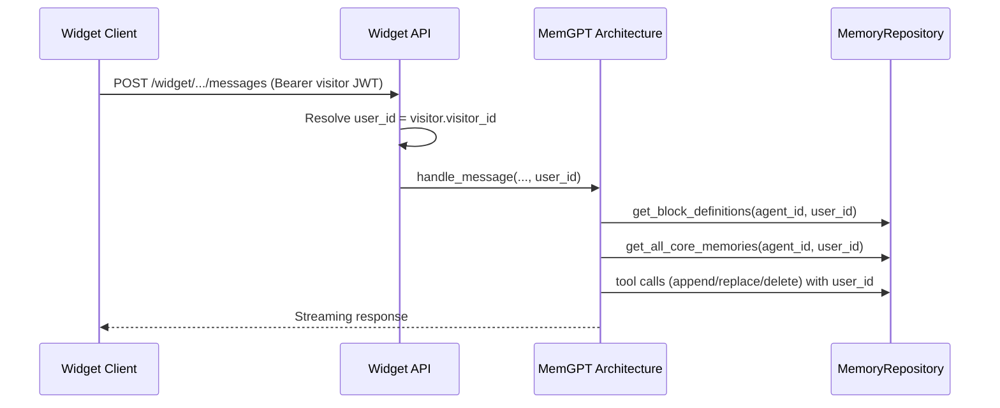
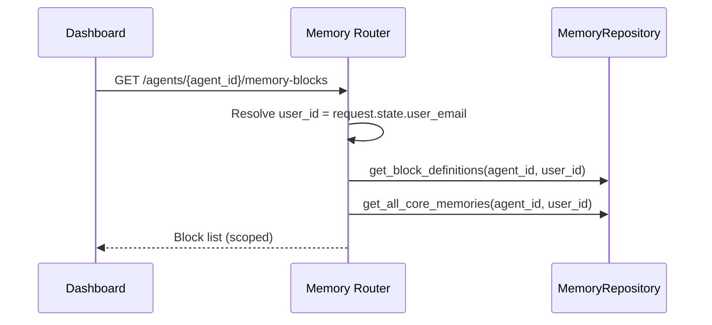

# Low Level Design: User-Scoped Memory Blocks

Date: 2026-01-29
Status: Draft
Owner: InnomightLabs API

## Context
Memory blocks are currently stored and loaded only by `agent_id`. This works for single-user agents but breaks for widget usage where one agent serves many visitors. We need deterministic, user-scoped memory while keeping the LLM interface unchanged (LLM still uses `block_name` only).

We will generate a deterministic `block_id` from `agent_id`, `user_id`, and `block_name`. All memory storage (core + archival + definitions + warnings) must be scoped to the logged-in user at read/write time.

## Goals
- Scope core and archival memory by user without changing LLM tool interface.
- Deterministic, unique block IDs derived from `agent_id`, `user_id`, `block_name`.
- Minimal, reliable scoping logic with a single source of truth for user identity.
- Prevent cross-user memory leakage for widget visitors.

## Non-goals
- Changing LLM tool schemas or prompt format.
- Introducing new memory categories beyond existing blocks.
- Reworking conversation storage.

## Current State (Summary)
- `MemoryBlockDefinition`, `CoreMemory`, `ArchivalMemory`, and `CapacityWarningTracker` are keyed by `Agent#{agent_id}`.
- Memory tools (`core_memory_*`, `archival_memory_*`) resolve by `agent_id` and `block_name`.
- Widget visitor identity exists (`visitor_id`), but memory paths do not use it.

## Proposed Design

### 1. User Scope Resolution
Introduce a single resolver for `user_id` at the request boundary.

| Channel | Source | Value | Notes |
| --- | --- | --- | --- |
| Dashboard API | `request.state.user_email` | `user_id = user_email` | Uses existing JWT `sub` (email). |
| Widget API | `WidgetVisitor` | `user_id = visitor.visitor_id` | Uses visitor JWT `sub`. |

If `user_id` is missing, memory read/write is disabled for that request (safe default).

### 2. Deterministic Block ID
Block IDs are derived from agent, user, and block name:

```
block_id = f"{agent_id}:{user_id}:{block_name}"
```

Notes:
- `block_name` is already normalized via `normalize_block_name` in native tools.
- This keeps LLM-facing block names unchanged.
- If key length or PII exposure is a concern, replace with a hash:
  `block_id = sha256(f"{agent_id}:{user_id}:{block_name}")`.

### 3. DynamoDB Keying Changes
Scope all memory entities by `(agent_id, user_id)` and use `block_id` where block identity is needed.

#### MemoryBlockDefinition
- **pk**: `Agent#{agent_id}#User#{user_id}`
- **sk**: `MemoryBlockDef#{block_id}`
- Attributes: `agent_id`, `user_id`, `block_id`, `block_name`, `description`, `word_limit`, `is_default`, `created_at`

#### CoreMemory
- **pk**: `Agent#{agent_id}#User#{user_id}`
- **sk**: `CoreMemory#{block_id}`
- Attributes: `agent_id`, `user_id`, `block_id`, `block_name`, `lines`, `word_count`, `created_at`, `updated_at`

#### ArchivalMemory
- **pk**: `Agent#{agent_id}#User#{user_id}`
- **sk**: `Archival#{created_at_iso}#{memory_id}`
- Attributes: `agent_id`, `user_id`, `memory_id`, `content`, `content_hash`, `created_at`

#### Archival Hash Index (Idempotency)
- **pk**: `Agent#{agent_id}#User#{user_id}#Hash#{content_hash}`
- **sk**: `Archival#{memory_id}`
- Attributes: `agent_id`, `user_id`, `memory_id`

#### CapacityWarningTracker
- **pk**: `Agent#{agent_id}#User#{user_id}`
- **sk**: `CapacityWarning#{block_id}`
- Attributes: `agent_id`, `user_id`, `block_id`, `block_name`, `warning_turns`, `updated_at`

### 4. Repository API Changes
Add `user_id` to all memory repository methods and compute `block_id` internally.

New helper:
```
def build_block_id(agent_id: str, user_id: str, block_name: str) -> str:
    return f"{agent_id}:{user_id}:{block_name}"
```

Examples of updated signatures:
- `get_block_definitions(agent_id, user_id)`
- `get_block_definition(agent_id, user_id, block_name)`
- `save_block_definition(block_def)` (now includes user_id + block_id)
- `get_core_memory(agent_id, user_id, block_name)`
- `get_all_core_memories(agent_id, user_id)`
- `insert_archival(agent_id, user_id, content)`
- `search_archival(agent_id, user_id, query, page, page_size)`
- `increment_warning_turns(agent_id, user_id, block_name)`

### 5. LLM and Tool Changes (No Interface Change)
The LLM still uses `block_name` only. The system applies user scoping under the hood.

- `NativeToolHandler.execute(...)` will include `user_id` (from a new setter or argument).
- `KrishnaMemGPTArchitecture.handle_message(...)` will pass `user_id` when loading core memory and executing tools.
- `MemoryCompactionService` will include `user_id` when checking warnings and compacting blocks.

#### Request-to-Tool Propagation (Code References + Planned Snippets)
This is the concrete call chain that resolves `user_id` and ensures tools use it, with the exact files and planned code changes.

Dashboard API (agent chat endpoints):
- Source of user: `request.state.user_email` in `api/src/auth/middleware.py`.
- Planned router/controller change (where `handle_message` is invoked):

```py
# file: api/src/<chat_router>.py
user_id = request.state.user_email

async for event in architecture.handle_message(
    agent=agent,
    conversation=conversation,
    user_message=body.content,
    user_email=request.state.user_email,
    user_id=user_id,
    attachments=attachments,
):
    yield event
```

Widget API:
- Source of user: `visitor.visitor_id` from `get_visitor_from_request` in `api/src/widget/router.py`.
- Planned change in `send_message(...)` (`api/src/widget/router.py`):

```py
# file: api/src/widget/router.py
user_id = visitor.visitor_id

async for event in architecture.handle_message(
    agent=agent,
    conversation=mock_conversation,
    user_message=body.content,
    user_email=visitor.email,
    user_id=user_id,
    attachments=[],
):
    yield event.to_sse()
```

Architecture → Tools:
- Planned change in `KrishnaMemGPTArchitecture.handle_message(...)` (`api/src/agents/architectures/krishna_memgpt.py`):

```py
# file: api/src/agents/architectures/krishna_memgpt.py
async def handle_message(..., user_id: str, ...):
    self.tool_handler.set_user_context(user_id)
```

- Planned change in `NativeToolHandler` (`api/src/tools/native/handlers.py`):

```py
# file: api/src/tools/native/handlers.py
class NativeToolHandler:
    def __init__(...):
        self._user_id: Optional[str] = None

    def set_user_context(self, user_id: str) -> None:
        self._user_id = user_id

    async def execute(self, tool_name: str, arguments: dict, agent_id: str) -> str:
        if not self._user_id:
            return "Error: Missing user context"
        handler = getattr(self, f"_handle_{tool_name}", None)
        return await handler(arguments, agent_id, self._user_id)
```

Memory repository usage inside tool handlers:

```py
# file: api/src/tools/native/handlers.py
async def _handle_core_memory_append(self, args: dict, agent_id: str, user_id: str) -> str:
    block_name, block_def, error = self._get_block_or_error(args, agent_id, user_id)
    ...
    memory = self.memory_repo.get_core_memory(agent_id, user_id, block_name)
    ...
    self.memory_repo.save_core_memory(memory)
```

### 6. Widget Message Flow (User-Scoped Memory)



### 7. Dashboard Memory API Flow



## Migration and Backward Compatibility
Existing memory items are keyed by `Agent#{agent_id}` only. Migration options:

1. **One-time migration script (preferred)**
   - For each agent, infer owner user_id (agent.created_by).
   - Re-write memory items into new scoped keys using `user_id = owner_email`.
   - Remove old items after verification.

2. **Dual-read fallback (temporary)**
   - If no scoped records are found and `user_id == agent.created_by`, read legacy keys.
   - On write, store only scoped items.
   - Remove fallback after migration.

## Impacted Modules and Change List

**Memory Models**
- Add `user_id` and `block_id` fields to:
  - `MemoryBlockDefinition`
  - `CoreMemory`
  - `ArchivalMemory`
  - `CapacityWarningTracker`
- Update `pk`/`sk` construction to include user scope and block_id.

**Memory Repository**
- Add `user_id` to all read/write methods.
- Centralize `build_block_id` helper.
- Update hash index PK to include `user_id`.

**Native Tool Handler**
- Add `set_user_context(user_id)` or pass `user_id` into `execute`.
- Use scoped repository calls.

**Agent Architecture**
- Pass `user_id` into memory-related operations and tool handler.
- For widget, set `user_id = visitor.visitor_id`.
- For dashboard, set `user_id = request.state.user_email` (unchanged source).

**Memory Router**
- Resolve `user_id` from request and call scoped repository methods.

**Memory Compaction**
- Scope warning tracking and archival inserts by `user_id`.

**Docs**
- Update `api/README.md` memory schema section with new PK/SK format.

## Validation and Tests
- Unit tests for `build_block_id` (deterministic, stable).
- Repository tests:
  - `user_a` and `user_b` on same agent do not see each other’s blocks.
  - Archival idempotency uses user-scoped hash index.
- Widget integration test:
  - Same agent, two visitors: tool writes for one are not visible to the other.

## Open Questions
- Confirm whether `user_id` should be the email (dashboard) or a new stable user UUID.
- Confirm whether `block_id` should be raw concatenation or hashed to avoid PII in keys.
