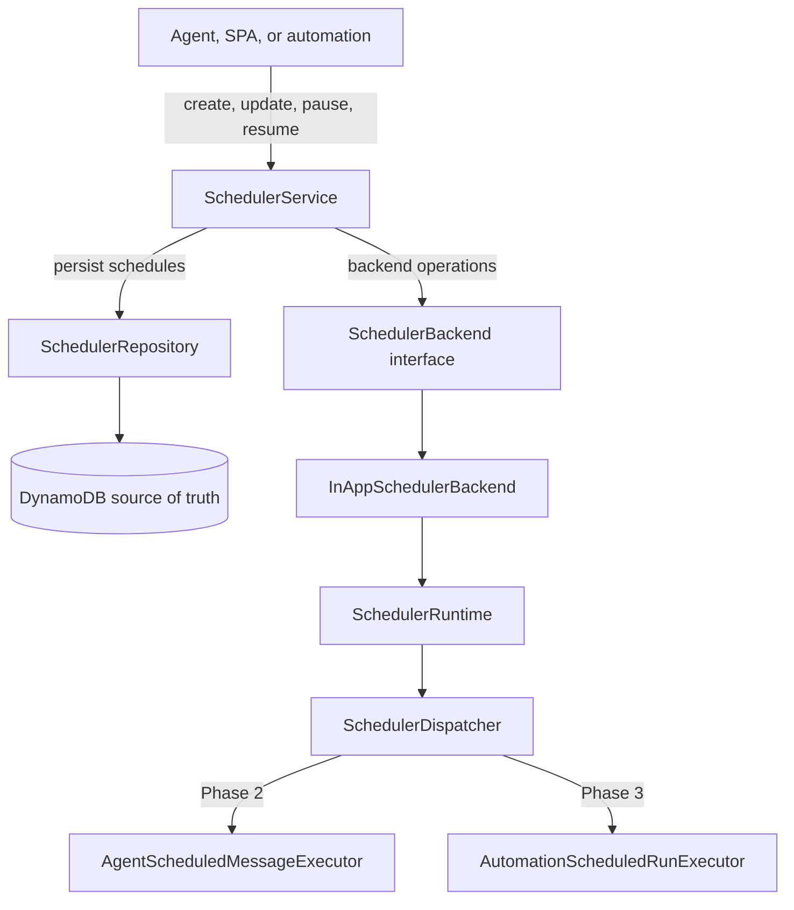

# LLD: Scheduler Architecture

## Goal

Add a first-class scheduler that can:

- Wake an agent by sending a scheduled message.
- Start an automation with configured input.
- Let agents schedule future work for themselves.
- Let automations create/update/delete schedules as normal skill-backed actions.
- Support 5-field cron expressions with explicit timezone handling.

## Recommendation

Use **DynamoDB as the source of truth** and an **in-app APScheduler runtime** as the clock.

This keeps Phase 1 simple for the current Railway deployment: no EventBridge bridge Lambda, no public dispatch endpoint, no signed callback URL, and no separate local scheduler container. Local and production both run the same scheduler module inside the API process. The runtime is not the persistence layer; it only keeps active DynamoDB schedules registered in the current process.

## High-Level Shape



*DynamoDB owns schedule state; the in-app runtime only registers and dispatches persisted schedules in the active API process.*

`SchedulerService` does not know APScheduler. It persists the schedule and tells a backend to upsert/pause/resume/delete. `InAppSchedulerBackend` syncs that schedule into the process-local `SchedulerRuntime`.

## Data Model

The scheduler module lives under `src/scheduler/`.

Primary model:

```python
class Schedule(BaseModel):
    schedule_id: str
    owner_email: str
    name: str
    status: ScheduleStatus
    cron_expression: str
    timezone: str = "UTC"
    target_type: ScheduleTargetType
    target: dict[str, Any]
    source_type: str = "api"
    source_ref: dict[str, Any] = Field(default_factory=dict)
    next_run_at: datetime | None = None
    last_run_at: datetime | None = None
    created_by: str
    created_at: datetime
    updated_at: datetime | None = None
```

DynamoDB keys:

- Primary item: `pk = User#{owner_email}`, `sk = Schedule#{schedule_id}`.
- Active schedule lookup on existing `gsi2`:
  - `gsi2_pk = ScheduleDue#active`
  - `gsi2_sk = {next_run_at.isoformat()}#Schedule#{schedule_id}`
- Target lookup items:
  - `pk = Agent#{agent_id}`, `sk = Schedule#{schedule_id}`
  - `pk = Conversation#{conversation_id}`, `sk = Schedule#{schedule_id}`
  - `pk = Automation#{automation_id}`, `sk = Schedule#{schedule_id}`

No new index is required.

## Cron

Use `croniter` for validation and next-run calculation, added with `uv add croniter`.

`src/scheduler/cron.py` owns:

- `ScheduleExpression`
- `validate_schedule_expression`
- `next_run_at`

The supported contract is standard 5-field cron:

```text
minute hour day month weekday
```

Timezone is always explicit and defaults to `UTC`.

### One-time schedules (`run_at`), added 2026-10-09

**Why.** A 5-field cron expression has no year, so it can't say "once". Agents using the scheduler skill wrote
one-off reminders as dated cron, such as `34 22 31 5 *`, which repeats every 31 May. Two such reminders from
2026-05-31 were still active, due again on 2027-05-31.

**The model.** A schedule now either repeats on `cron_expression` or runs once at `run_at`; exactly one is set,
and `cron_expression` is `""` for a one-time schedule. A `run_at` without an offset is read in the schedule's
`timezone`. A new `run_at` may be at most a minute in the past (`RUN_AT_PAST_TOLERANCE`).

**Timing strategies.** `src/scheduler/timing.py` has two:

| Timing | Validates | Next run | Process clock | After its run |
| --- | --- | --- | --- | --- |
| `OneTime` | not both, a real timezone, not in the past | `run_at` until it has passed | `DateTrigger`; a moment missed while the server was down runs as soon as it's back | `completed` |
| `Recurring` | a 5-field cron | from `croniter` | `CronTrigger` | the next cron time |

`timing_for(schedule)` picks the strategy, and the service, runtime and dispatcher use it rather than branching.

- **The new status `completed`.** After its run, succeeded or failed, a one-time schedule becomes `completed`.
  It leaves the active index and the process clock, can't be resumed, and a repeat fire is skipped
  (`schedule_completed`). Its runs stay as history.
- **A recurring schedule now moves to its next time after a failed run too.** Before, a failed run left
  `next_run_at` where it was.
- **Validation errors** are raised as `SchedulerValidationError`, so the API answers 400.
- **The scheduler skill:**
  - `create_or_update` takes `run_at` (ISO 8601) or `cron_expression`, and says plainly when it gets neither,
    both, or an unreadable time.
  - Its system prompt tells the agent to use `run_at` for anything one-off, and why dated cron is wrong.
  - Repeating the same request finds the existing one-time schedule instead of adding another.
- **Automation schedule triggers can run once too.**
  - `ScheduleTriggerConfig` (`automations/triggers/models.py`) takes `cron_expression` or `run_at`. The form
    field left empty arrives as `""` and counts as unset.
  - The trigger form (`build_schedule_trigger_form`) has a "Run once at" field next to the cron one. The editor
    builds the form from the API schema, so it shows up there with no extra work.
  - `AutomationTriggerLifecycleService.sync_trigger` passes `run_at` to the scheduler. It leaves a completed
    one-time schedule alone when its `run_at` hasn't changed, so switching the automation off and on neither
    fails (the moment has passed) nor runs it again. A new `run_at` schedules it again.
  - `pause_schedule` leaves a completed schedule completed.
  - A moment already past is refused when the automation goes active: a draft's schedule is saved paused and
    isn't timed. The API answers 422 with the reason, because `translate_error` now maps `SchedulerValidationError`.
  - The SPA's trigger summary reads "Once on 2026-10-10 at 09:00 · Europe/London".
  - Tests: `api/tests/test_automations_one_time_trigger.py`, plus `chain.test.ts` in the SPA.
- **Not changed:** dream schedules are nightly by nature and stay cron-only.
- **Tests:** `api/tests/test_scheduler_one_time.py`.

## Runtime

Use APScheduler, added with:

```bash
uv add 'apscheduler>=3.11,<4'
```

`src/scheduler/runtime.py` owns `SchedulerRuntime`.

Responsibilities:

- Start on FastAPI startup.
- Load active schedules from DynamoDB through `SchedulerRepository.list_active_schedules()`.
- Register each active schedule in APScheduler using `CronTrigger.from_crontab(...)`.
- Remove jobs when schedules are paused or deleted.
- Dispatch jobs through `SchedulerDispatcher`.
- Stop on FastAPI shutdown.

APScheduler is intentionally process-local. If Railway runs more than one API replica, each replica may register the same schedule. Duplicate execution is prevented by DynamoDB idempotency in `SchedulerDispatcher`: every dispatch uses the persisted `schedule.next_run_at` as `scheduled_for`, and `ScheduleRun` is written with a conditional put. Only one process can create the run for that due time.

## Dispatch

`src/scheduler/dispatcher.py` owns execution orchestration.

Flow:

1. Load the schedule by `owner_email` and `schedule_id`.
2. Write a deterministic `ScheduleRun` with conditional put.
3. If the run already exists, return `skipped`.
4. If the schedule is paused/deleted, record `skipped`.
5. Execute the target through a target executor.
6. Mark the run succeeded/failed.
7. Update `last_run_at` and the next `next_run_at`.

Phase 1 uses a placeholder executor that records dispatch only. Phase 2 and Phase 3 replace that with target-specific executors.

## API

`src/scheduler/router.py` exposes authenticated user APIs:

- `GET /schedules`
- `POST /schedules`
- `GET /schedules/{schedule_id}`
- `PATCH /schedules/{schedule_id}`
- `POST /schedules/{schedule_id}/pause`
- `POST /schedules/{schedule_id}/resume`
- `DELETE /schedules/{schedule_id}`
- `GET /schedules/{schedule_id}/runs`

There is no unauthenticated scheduler dispatch endpoint in this architecture.

## Configuration

Settings:

- `SCHEDULER_BACKEND=in_app`
- `SCHEDULER_RUNTIME_ENABLED=true`

`SCHEDULER_RUNTIME_ENABLED=false` is useful for one-off scripts, tests that do not need the runtime, or future worker separation.

## Phases

### Phase 1: Domain and In-App Runtime

- Add scheduler models, repository, service, cron helpers, backend interface, in-app backend, runtime, dispatcher, router, and tests.
- Keep DynamoDB as source of truth.
- Start/stop runtime from FastAPI startup/shutdown.
- Keep dispatch idempotent through conditional `ScheduleRun` writes.

### Phase 2: Agent Scheduler Skill

- Add scheduler skill actions.
- The skill schedules the current agent and current conversation by default.
- At due time, send the scheduled message as a system message into the same conversation.

### Phase 3: Automation Scheduling and Orchestration

- Because scheduler is a skill, expose it as an automation action.
- Applying action arguments creates/updates the schedule through `SchedulerService`.
- Updating the automation step updates the same schedule.
- Deleting the automation step deletes the schedule.
- Add a separate automation action for triggering another automation, so complex workflows can orchestrate across automations.

### Phase 4: SPA

- Add schedule forms and schedule run history using the schema-driven form system.
- Keep automation step UX consistent with other skill-backed actions.

## Coding Standards

- Keep persistence in `SchedulerRepository`.
- Keep runtime concerns in `SchedulerRuntime`.
- Keep schedule lifecycle coordination in `SchedulerService`.
- Keep target execution behind small executor classes.
- Do not put APScheduler calls in routers or skills.
- Do not introduce a second local/prod scheduler code path.
