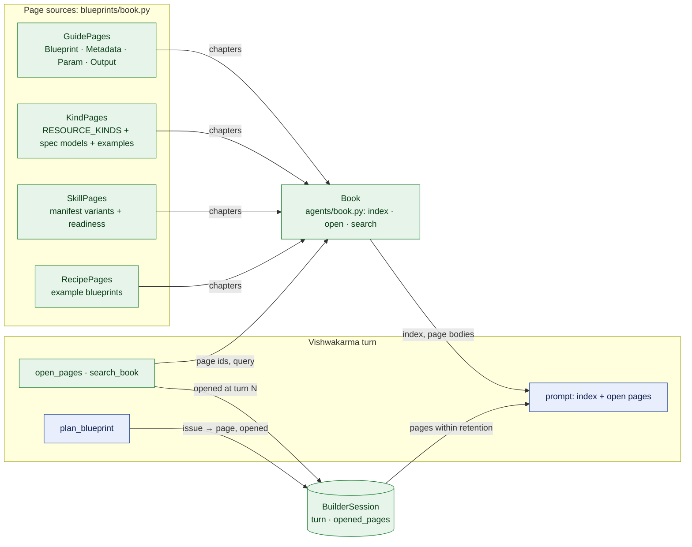
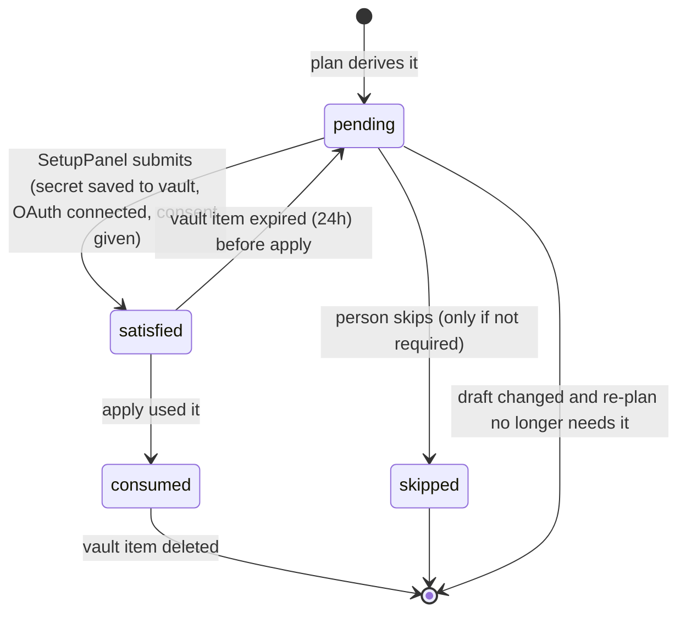
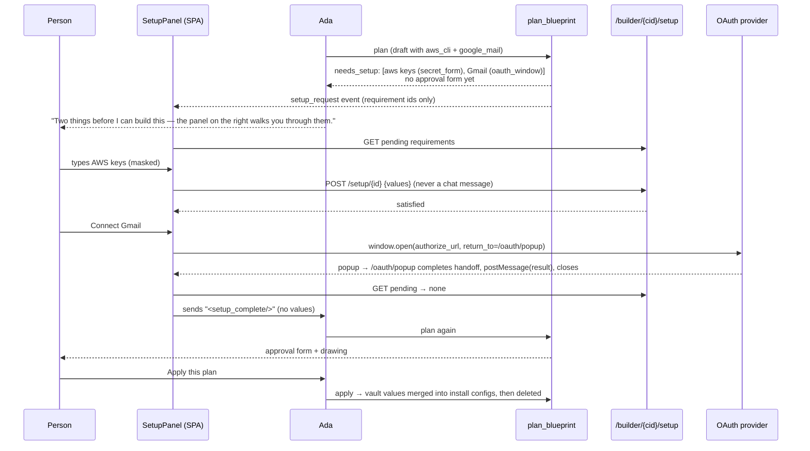
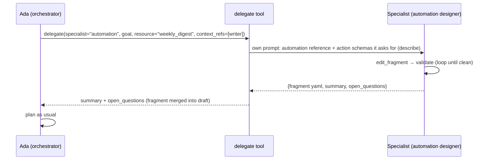

# Ada: Building With Everything InnomightLabs Offers

| Field | Value |
| --- | --- |
| Status | 🚧 In progress: the blueprint book (foundation) is built and tested; the phases below are proposed |
| Owner | InnomightLabs API / SPA |
| Last reviewed | 2026-10-08 |
| Scope | `api/src/blueprints/` (new kinds, setup requirements), `api/src/builder/` (setup vault, routes, tools, specialists), `api/src/agents/prompt_templates/vishwakarma/`, small extractions in `api/src/automations/`, `api/src/connectors/mcp/`, `api/src/settings/`; SPA `SetupPanel`, OAuth popup route, chat wiring |
| Depends on | [Solution Blueprints](LLD-solution-blueprints.md) (parent: spec, plan/apply, Ada on Vishwakarma, idempotent updates), [Automations module](../api/docs/LLD-automations-module.md), [Unified skill automation actions](../api/docs/LLD-unified-skill-automation-actions.md), [MCP connector machinery](LLD-mcp-connector-machinery.md), [MCP sharing](LLD-mcp-sharing-for-widget-a2a-api.md) |
| Tracker | — |
| Replaces | — |

> **Summary:** Ada can build a knowledge base, an agent with skills that need no secrets, and a widget key. That is
> a small slice of the product. This LLD extends her, module by module and skill by skill, until she can build with
> every skill, automation and feature InnomightLabs offers. Three things make that possible:
>
> - **More resource kinds**: `Automation`, `McpConnection`, `SecretKey`, plus new fields on `Agent` and
>   `KnowledgeBase`.
> - **Setup requirements**: what a build needs from the person (an API key, a Google sign-in, consent to widen
>   access, a file). The plan works these out from the manifests and kinds, never from Ada's words. Each one is
>   shown on the surface its input calls for: a masked modal for secrets, a popup window for OAuth, a side panel for
>   consent and uploads. Secrets go from that surface straight to the API. They never pass through the model or the
>   chat history.
> - **Context management**: draft edits by resource, on-demand descriptions of kinds and skills, and later, if the
>   numbers say so, specialist sub-agents.
>
> Each phase ships behind the same plan, approval and apply pipeline, so every new capability is validated,
> idempotent and reversible in the same way.

## Implementation notes

**Built first: the blueprint book** (it replaces the "describe on demand" idea in [§4.2](#42-describe-on-demand)
and comes before phase 1). Ada no longer carries the whole catalog in her prompt. She reads what she can build like
a book: an **index** is always in her prompt, and she **opens pages** when she needs them. An opened page stays in
her prompt for a configurable number of turns. Adding a resource kind, a skill manifest or an example blueprint
adds a page, and Ada can use it with no prompt change. It covers the same resources as before (3 kinds, every
skill, 2 recipes), so it can be tested on its own before more resources arrive.



*Green is new. Every page is generated from the code that defines it; nothing in the book is written twice.*

- **The framework:** `api/src/agents/book.py`. It knows nothing about blueprints, so another architecture could
  use it.
  - `Page` has `id`, `title`, `summary`, `body`, `use_when`, `note` and `related`.
  - `Chapter`, and the `PageSource` protocol: one chapter per source.
  - `Book.from_sources`, with `open(ids)` (unknown ids get close-match suggestions) and keyword `search(query)`.
  - Retention: `open_pages`, `pages_in_view` and `turns_left`.
- **The pages:** `api/src/blueprints/book.py`.

  | Page | Generated from |
  | --- | --- |
  | `guide/blueprint` | the document's own models |
  | `kind/<Kind>` | its spec's fields and nested models (a KB's `CrawlSpec`), what outputs can use, and its first resource in the examples, with the text kept as written |
  | `skill/<id>` | its manifest variant: description, sharing, plain settings, secret settings, an example entry, and a note when it can't be built (a required secret, or an account that isn't connected) |
  | `recipe/<name>` | each example blueprint |

  - Each kind now declares `use_when` (`kinds/base.py`), in the words a person would ask with. The index routes on
    it.
  - Skills use their manifest description. A manifest `use_when` field can come later if routing needs it.
- **Ada's tools:** `open_pages(page_ids)` (up to 6 per call) and `search_book(query)` come first in the list.
  - `open_pages` marks the prompt stale, so pages opened in a turn show up in that turn's next model call.
- **Issues point at pages.** Every issue and blocker from `plan_blueprint` carries the `page` that explains it,
  found by `page_for_issue`:
  - `resources.x.skills[i]…` gives that skill's page;
  - `resources.x…` gives the kind's page;
  - anything else gives `guide/blueprint`.

  Those pages are opened automatically, so the fix has them to hand.
- **Retention.** `BuilderSession.turn` counts Ada's turns, and `BuilderSession.opened_pages` maps a page id to the
  turn it was last opened in.
  - Each turn increments `turn` and drops pages older than the retention.
  - A page is shown while `turn - opened_at < retention`, so the turn it's opened in counts as one.
  - Opening it again restarts the count. Each page is labelled "open for N more turns" or "closes after this turn".
  - **Configurable:** `ADA_PAGE_RETENTION_TURNS` (`settings.ada_page_retention_turns`, default 3, minimum
    effectively 1). It's read at use, so it can be changed between tries. `VishwakarmaArchitecture` also takes
    `page_retention_turns=` for tests and experiments.
- **Prompt:**
  - `vishwakarma/sections/book.j2` is the index and how to use it.
  - `open_pages.j2` holds the open pages.
  - `blueprint_language.j2` keeps only the rules.
  - `ideas.j2` is gone: the recipes chapter is the ideas.
  - The workflow's DRAFT step says to open the recipe, kind and skill pages first.
  - `ANCHOR_TOOL_CALL_DISCIPLINE` says to open a page before writing what it describes.
- **Size.** Ada's system prompt with an empty draft is about 1,770 words with no pages open. It was about 2,550
  with the old catalog. A typical build opens a recipe, the Agent kind and one skill, which comes to about 2,630
  words, but those are full pages rather than one-line summaries. Today's catalog is small, so the saving here is
  modest. It grows with every resource added, because a new page costs one index line until it's opened.
- **Not changed:** the published JSON Schema, `/blueprints/reference` and `/blueprints/catalog` still render from
  the same spec and manifest helpers (`field_rows`, `skill_config_rows` and `markdown_table` in
  `blueprints/catalog.py`, now public because the book uses them too).
- **Tests:** `api/tests/test_builder_book.py`:
  - coverage: every kind, skill and example has a page; every kind has `use_when` and an example;
  - page content, search routing, and unknown-id suggestions;
  - issue-to-page mapping, and plan issues opening pages;
  - retention as pure functions;
  - across real turns of the architecture at retention 1, 2 and 3.
- **Still to try:** real models, small ones included, at different retention values. Watch:
  - whether Ada opens pages before writing;
  - how often she reopens them;
  - plan issues per build.

**Skills by what they need before they work.** The book's skills come in four chapters, easiest first. A skill's
tier is read from its manifest by a list of rules (`SETUP_RULES` in `blueprints/skills_schema.py`, one selection
function `setup_for`), never listed per skill. The hardest need decides:

| Tier | Rule | Skills today | What Ada does |
| --- | --- | --- | --- |
| `ready` | Nothing below applies | `agent_invocation` and `agent2agent_client` (their settings are Ada's), `file_system`, `html_canvas`, `image_generation`, `lead_capture`, `python_code_execution`, `rest_template` (its only secret is optional), `scheduler`, `upload_file` | Adds it, writing any settings that are hers |
| `settings` | A required setting only the person knows | `send_email`, `wordpress_search` | Leaves those settings out; the system asks the person for them |
| `account` | `requires_oauth` or `connectors` | `google_mail`, `google_drive`, `google_ads` | Adds it once the account is connected, otherwise sends them to Connectors |
| `secrets` | A required secret | `aws_cli`, `riot_lol_api_client`, `league_insights_report` | Not buildable yet: sends them to the Skills tab (the setup panel, phase 1, will close this) |

The `settings` tier is built end to end:

- **Settings that name an agent.** A setting whose options are the person's agents (`options_source: agents`,
  e.g. `agent_invocation.target_agent_id`) may name an Agent in the same blueprint instead of an id.
  - The validator makes it a dependency, so that agent is built first. It rejects naming the agent itself, a
    resource that isn't an Agent, or one being removed.
  - The plan checks everything else about the install. `SkillService.check_install(pending_fields=...)` skips only
    the ownership check for an agent that doesn't exist yet.
  - Apply swaps the name for the new id (`skill_config(entry, ids)` in `kinds/agent.py`), and the drawing wires the
    two agents.
- **Skills installed more than once.** Entries match installs by installed id (`install_key`, via
  `installed_skill_id_for`), so two `send_email` entries to different recipients are two installs. Before, they
  collapsed into one.
- **The system asks for settings, not Ada** (`api/src/builder/skill_inputs.py`). Ada writes `- id: send_email`
  and plans. `plan_blueprint` does the rest, generically from the manifests:

  ```mermaid
  sequenceDiagram
      participant A as Ada
      participant T as plan_blueprint
      participant P as Person
      participant V as Vishwakarma turn
      A->>T: plan (skill without config)
      T->>T: fill earlier answers · missing_inputs(draft)
      alt other validation issues
          T-->>A: issues (fixed before the person is asked)
      else a skill is missing settings
          T-->>P: form "Set up Send Email for Acme assistant"<br/>from the manifest's fields
          T-->>A: needs_input: say one line, stop
          P->>V: form submission
          V->>V: absorb_submission: validate with the manifest,<br/>keep on session.skill_inputs, fill the draft
          A->>T: plan (no arguments)
          Note over T: next skill's form, or…
      end
      T-->>P: the plan and approval form, as before
  ```

  *One skill at a time, in draft order. Issues about the missing settings are left out of what Ada sees; other
  issues go to her first, so the person is only asked once the blueprint is sound.*

  - **Who supplies a setting** is read from the manifest by `SUPPLIER_RULES` (`blueprints/skills_schema.py`):
    - `attr.supplied_by` wins when the skill author sets it;
    - otherwise a setting that names an agent, or is exposed to the runtime (e.g. "when should this agent be
      invoked?"), is **Ada's**. It's the build's design, which she knows from the request;
    - anything else is **the person's** (recipients, a site address).

    *Learned the hard way.* Asking the person for every setting meant building a four-agent team produced four
    "Set up Invoke Agent" forms asking which agent to pick, for agents they had just described to Ada. Now
    `agent_invocation` is in the `ready` tier, and its page says "You write: `target_agent_id`,
    `usage_description`".
  - **Missing** means a required, non-secret person's setting (`SkillVariant.person_settings`) that the entry's
    `config` lacks, for skills outside the `secrets` tier. A missing Ada's setting is an ordinary issue that goes
    back to her with its page. Settings a recipe or a loaded agent already has are kept.
  - **Forms say why.** The first field's help reads "Acme assistant will use Send Email: …", from the manifest.
  - **A form the draft no longer needs** stops being waited on at the next plan.
  - **The form** is built from the manifest's own `FormInput`s, through the Interactive Forms module, so the chat
    renders it like any form. Option sources are hydrated. Agent pickers also offer the agents this build creates,
    "(in this build)", by blueprint name. Entries of a repeatable skill get their own form, "(2)".
  - **Answers** are taken at the start of the next turn, before Ada runs (`requirements.absorb_answers`, which for
    settings is `absorb_submission`, from the session's `pending_input`). They're checked with `registry.validate_config`. A bad answer keeps the form pending with the
    reason, shown on the form next time.
  - **They outlive Ada's edits.** `session.skill_inputs` is keyed by `<agent>/<skill id>/<n>`, and every plan fills
    the answers back in, so Ada resending her YAML doesn't lose them. `load_agent` clears them.
  - **`plan_blueprint` takes no arguments** to plan the draft as it is.
  - **Ada's prompt:** "Skill settings are not yours". Skill pages and examples have no `config`. Pages say what
    the system will ask for, and `needs_input` tells her to say one line and stop.
  - **Not in the chat: secrets.** A form submission is a chat message, so skills with required secrets stay in the
    `secrets` tier until the secure setup panel ([§3](#3-setup-requirements)) exists.
- **Recipes (Ada's ideas): ten**, one per kind of build that works today. Each is an example blueprint in
  `api/src/blueprints/examples/`.

  | Recipe | Uses |
  | --- | --- |
  | Website support agent | KB, `lead_capture`, widget |
  | Documentation assistant | KB |
  | Team of agents | two agents, `agent_invocation` naming the other |
  | Lead qualifier with email alerts | KB, `lead_capture`, `send_email`, widget |
  | Product finder quiz | KB, `lead_capture` choice forms, widget |
  | WordPress blog companion | `wordpress_search`, widget |
  | Data and report studio | `python_code_execution`, `html_canvas`, `upload_file` |
  | Creative image studio | `image_generation`, `html_canvas` |
  | Personal follow-up assistant | `scheduler`, `send_email` |
  | Gmail inbox helper | `google_mail` (account tier) |

  - Recipes leave skill settings out, as Ada does, so the system asks for them. The examples test accepts
    only validation issues the validator marks as the person's (`IssueOwner.PERSON`).
  - Ideas are listed by file name. Add an order to `metadata` if the brainstorm list needs one.
- **Still to do in this tier:** `agent2agent_client` also needs the account's A2A domain allowlist. The plan
  reports it as a blocker (from `check_install`), but there's no way to build it yet; that's the consent surface in
  [§3](#3-setup-requirements).
- **Tests:** `api/tests/test_blueprints_skill_setup.py` and `api/tests/test_builder_skill_inputs.py`.

**Ada builds kits (2026-10-10).**

- **Every build is a kit, and each change she applies is its next version.** The session keeps `kit_id`.
  `load_agent` continues the kit an agent belongs to; an agent from outside any kit becomes one at its first apply
  here, compared with what it was when loaded.
- **She takes things away by leaving them out of the draft.** The plan names each removal before the person
  approves.
- **The person rolls back or removes a kit** on the Build with Ada page. See
  [REFACTOR-blueprints.md](REFACTOR-blueprints.md), phase 6.

**What the system asks the person, and how `plan_blueprint` answers (refactor phase 5, 2026-10-09).**

- **`builder/requirements.py`.** Each `Requirement` has `missing(draft, …)`, `settle`, `ask` and `absorb`, and
  `REQUIREMENTS = (AccountConnection(), SkillSettings())` is the order the person is asked. The secure secrets
  panel and A2A consent ([§3](#3-setup-requirements)) are meant to be further entries.
- **`builder/plan_gates.py`.** `plan_blueprint` runs `PLAN_GATES`: `AuthorIssues`, `NeedsPerson`, `Blocked`,
  `NothingToChange` and `AwaitApproval`. The first gate that answers gives the tool result.
- **Issues carry an owner** (`BlueprintIssue.owner`). The validator marks a missing required person's setting as
  `PERSON`, and Ada only sees `AUTHOR` issues. This replaces filtering issues by path (`covers`), and the owner isn't
  in her tool results.
- **The draft is read once,** through `blueprints/draft.Draft`. It holds the skill entries and their keys,
  `with_skill_settings` (was `fill_inputs`) and `pinned` (was `export.with_ids`).
- **Order change:** a missing account is now asked before a missing setting even when the draft doesn't validate
  yet. Before, a draft invalid only for the person's settings asked for them first.

**MCP connections (`McpConnection`), and Tavily web search.** Built ahead of the rest of
[§2.2](#22-mcpconnection), and simpler: a blueprint never creates or stores a connection.

- **Tavily preset:** `api/src/connectors/mcp/providers/tavily.py`, `https://mcp.tavily.com/mcp/`.
  - Tavily's authorization server offers dynamic client registration (`/register`) with PKCE, so the preset is
    `DiscoveredOAuth(register_client=True)`, like Atlassian. No API key or OAuth app is needed: the person signs in
    to Tavily once.
  - It appears on the Connectors page too.
- **The spec:** `kind: McpConnection` with `provider` (an enum read from the preset catalog, `PROVIDERS`) or `id`,
  and an optional `name`. Agents get `mcp_connections: [...]` and `remove_mcp_connections: [...]`.
- **The kind** (`blueprints/kinds/mcp_connection.py`) only finds a connection on the account:
  - by `id`, else the ready one for its provider;
  - it is never "created";
  - an unconnected provider is a plan blocker, a safety net, because the system asks first (below);
  - `remove: true` is rejected, because the connection belongs to the whole account;
  - its book page lists every provider and whether it can be connected from the chat (`page_sections`, a new kind
    hook).
- **The agent kind** links new connections (`enable_for_agent`), diffs them ("give it the Tavily tools"), takes
  them away (`remove_mcp_connections`, "take the Tavily tools away"), rolls links back on failure, and exports them.
- **The system connects, not Ada** (`api/src/builder/connections.py`):

  ```mermaid
  sequenceDiagram
      participant A as Ada
      participant T as plan_blueprint
      participant C as Chat (ConnectAccountCard)
      participant R as POST /builder/{id}/connect
      participant P as Tavily (popup)
      A->>T: plan (McpConnection provider: tavily)
      T-->>C: connect_request → CONNECT_REQUEST event
      T-->>A: needs_connection: say one line, stop
      C->>R: person clicks "Connect Tavily"
      R->>R: install_provider (DCR) or start_oauth
      R-->>C: authorize_url
      C->>P: window.open popup
      P-->>C: /dashboard/oauth/done → postMessage(result), close
      C->>A: "I've connected Tavily."
      A->>T: plan (no arguments) → the plan, as before
  ```

  *The popup's return page sits inside the dashboard, so `OAuthReturn` completes the sign-in there, signed in, as
  for every connect flow. The chat believes only messages from its own origin. If the provider cuts the popup's
  link to the chat, the card's "I've signed in" button carries on, and the plan checks for itself.*

  - The order is accounts first, then skill settings, then the plan.
  - Only presets that need nothing typed in are connected from the chat. One that needs the person's own OAuth
    app (GitHub, Canva, Google Ads) is left to the Connectors page, and the plan's blocker says so.
- **SPA:**
  - `spa/src/components/chat/ConnectAccountCard.tsx`;
  - `spa/src/services/builder/connect.ts` (origin and type checks, tested);
  - `spa/src/pages/dashboard/oauth/OAuthPopupDone.tsx` at `/dashboard/oauth/done`;
  - `SSEEventType.CONNECT_REQUEST` and `BuilderApiService.connect`.
- **Drawing:** an MCP card, a "tools for" wire, and "Uses tools from 1 connection" on the agent.
- **Recipe:** `web-research-team` (Web research team): Tavily, a researcher that uses it, and a lead that
  delegates and writes HTML reports.
- **Not yet:**
  - sharing a connection's tools with widget visitors (the sharing disclaimer is a consent step);
  - custom MCP servers;
  - the card isn't kept on the message, so after a reload, planning again shows it again.
- **Tests:** `api/tests/test_blueprints_mcp.py`, `spa/src/services/builder/connect.test.ts`.

## Context and problem

Ada's pipeline (validate, then plan, then approve, then apply) is sound, and it updates rather than duplicates (see
the parent LLD, "Applying updates what exists"). What she can build is the limit:

| Capability | Today | Why |
| --- | --- | --- |
| Agent with secret-free skills (`lead_capture`, `html_canvas`, `send_email`, `upload_file`, `image_generation`, `scheduler`, `agent_invocation`, `file_system`, `python_code_execution`) | ✅ | Config can be written in YAML |
| Skills with **required secrets** (`aws_cli`, `riot_lol_api_client`, `league_insights_report`) | ❌ blocked at validation | "Secrets never go in a blueprint" (`blueprints/validator.py:382-391`), and there is no other way to supply them |
| Skills with **optional secrets** (`rest_template`, `wordpress_search`, `agent2agent_client`) | ⚠️ installed without them | The person has to find the Skills tab afterwards |
| **OAuth skills** (`google_mail`, `google_drive`, `google_ads`) | ⚠️ only if already connected | `check_install` blocks when the `ProviderSettings` for the provider is missing; the catalog marks them NOT READY |
| `agent2agent_client` | ❌ usually | Needs the account's A2A domain allowlist (`settings/agent2agent_policy.py:100-112`) |
| **Automations** (schedule, agent steps, skill actions) | ❌ | No kind |
| **MCP connectors** (presets and custom), sharing | ❌ | No kind; auth needs secrets or OAuth; sharing needs a disclaimer |
| **/v1 secret keys**, **A2A publishing** | ❌ | No kind; plaintext is shown once |
| **Custom memory blocks** | ❌ | Not in `AgentSpec` |
| **KB from uploaded files** | ❌ | `CrawlSpec` only |
| **Widget appearance** (theme, colour, greeting, launcher) | ❌ | Client-side `data-*` attributes on the snippet (`spa/embed/loader/index.ts:54-75`); the blueprint's snippet output has none |
| **Provider not set up** | ❌ blocker | The plan says "set it up in Settings" and stops |

Every ❌ and ⚠️ falls into one of two gaps:

1. **No kind for it.** The blueprint can't describe it.
2. **It needs the person.** A secret, a browser sign-in, consent, or a file. Ada can't write these into YAML, must
   not see them, and must not ask for them in chat.

Today the chat can't close the second gap safely:

- A chat form comes back as a plaintext user message. It is stored in history and sent to the model
  (`ConversationDetail.tsx:811-832`).
- `ChatFormRenderer` renders `password` as a plain text input (`ChatFormRenderer.tsx:239-249`).
- `render_custom_form` only allows `text`, `text_area`, `select` and `choice` (`lead_capture/manifest.yml:110-168`).
- Every OAuth flow does a full-page redirect (`AgentSkillsPage.tsx:286-327`). That would tear down the chat in the
  middle of a turn.

## Goals and non-goals

**Goals**

1. **Coverage.** Ada can build with every skill, every automation feature, and every configurable feature listed in
   [§1](#1-capability-coverage). A coverage test fails when a new skill or kind arrives without a path.
2. **Setup is the tool's job, not Ada's.** Ada names what to build. The plan works out what the person must supply,
   from the manifests (field input types, `requires_oauth`, `connectors`) and the kinds. The input type decides the
   surface: `password` gives a masked modal, `key_value` secret gives a key/value modal, OAuth gives a popup window,
   consent and uploads use a side panel.
3. **Secrets never touch the model or the transcript.** They go from the surface to an authenticated route, into an
   encrypted, short-lived vault tied to the building session, and are used at apply.
4. **The chat stays open.** OAuth runs in a popup window and reports back with `postMessage`.
5. **Same guarantees.** Every new kind matches, diffs, updates, keeps and restores like the existing three. The
   approval form still gates apply, and plan limits still count only creates.
6. **Context stays small** as the catalog grows, so small models still work.

**Non-goals**

- **Implicit deletion.** Leaving something out of a blueprint never removes it. Explicit removal (disconnect,
  uninstall, `remove: true`) is built; see the parent's "Removing, explicitly". New kinds implement `removals`,
  `remove_parts` and `delete` like the existing three.
- **Payments.** Ada links to the upgrade page when a quota blocks; she never starts a checkout.
- **Read-only or system features** (analytics, artifacts, system email, contact forms). There's nothing to build.
- **Marketplace publishing from Ada.** It comes later; see [Later](#later).
- **Server-side widget theming.** Appearance stays client-side; Ada only writes it into the snippet.
- **Automation conditions and foreach** in v1 of the `Automation` kind. Foreach isn't implemented in automations
  yet either (`api/docs/LLD-automation-foreach-construct.md` is a draft).

## Design

```mermaid
flowchart LR
    subgraph Chat["Dashboard chat (SPA)"]
        CD[ConversationDetail]
        SP[SetupPanel<br/>modal · popup · side panel]
        OP[/oauth/popup route/]
    end
    subgraph Builder["api/src/builder/"]
        T[Ada's tools<br/>edit_draft · describe · plan · apply]
        SR[setup routes<br/>/builder/{cid}/setup]
        V[(BuilderSetup items<br/>encrypted, TTL)]
        SPC[specialists<br/>phase 4]
    end
    subgraph Blueprints["api/src/blueprints/"]
        PL[planner]
        RQ[setup.py<br/>requirement strategies]
        K[kinds<br/>+ Automation · McpConnection · SecretKey]
        X[executor]
    end
    subgraph Existing["Existing services"]
        SK[SkillService]
        AU[AutomationService]
        MCP[MCPConnectorService]
        PS[ProviderSettings]
        OA[OAuth start + handoff]
    end
    T -- yaml --> PL
    PL --> K
    PL -- per resource --> RQ
    RQ -- requirements --> T
    T -- setup_request --> CD
    CD --> SP
    SP -- secret values, consent --> SR
    SP -- window.open --> OA
    OA -- redirect --> OP
    OP -- postMessage result --> SP
    SR --> V
    SR -- provider keys --> PS
    T -- approved --> X
    X -- vault values --> K
    K --> SK & AU & MCP
    T -.-> SPC

    classDef new fill:#e6f4ea,stroke:#1e7e34,color:#0b3d17
    classDef existing fill:#e8eefc,stroke:#2b4c9b,color:#0d1f4d
    classDef later fill:#f3f3f3,stroke:#888,color:#333,stroke-dasharray: 4 3
    class SP,OP,SR,V,RQ new
    class CD,T,PL,K,X,SK,AU,MCP,PS,OA existing
    class SPC later
```

*Green is new, blue is existing (some extended), dashed is the conditional phase 4. Secret values only travel on the
`SetupPanel → setup routes → vault → kinds` edges; none of them go through Ada's tools or the chat.*

### 1. Capability coverage

Each row is something InnomightLabs offers and how Ada builds it. "Setup" is what the person supplies, and on which
surface ([§3](#3-setup-requirements)).

**Skills.** Every row comes from that skill's `manifest.yml`. Nothing here is a second definition; the coverage test
derives the same table.

| Skill | Where it goes | Setup | Notes |
| --- | --- | --- | --- |
| `lead_capture`, `html_canvas`, `upload_file`, `image_generation`, `scheduler`, `file_system`, `python_code_execution` | `Agent.skills` | — | Already works |
| `send_email` | `Agent.skills`, `Automation.skills` | — | `to` is plain config |
| `agent_invocation` | `Agent.skills` (orchestrators), `Automation` agent steps | — | `target_agent_id` may now be a blueprint reference ([§2.4](#24-agent-additions)) |
| `wordpress_search` | `Agent.skills` | Optional secret modal (`app_password`, `cf_bypass_token`) | Optional, so not a gate: the setup can be done now or skipped |
| `rest_template` | `Agent.skills` | Optional key/value secret modal (`secrets`) | The prompt refers to the names (`{{ name }}`), never the values |
| `aws_cli` | `Agent.skills` | **Required** secret modal (access key, secret key) | `command_policy_yaml` stays plain config, so Ada can write a policy; `parse_policy` validates it at plan |
| `riot_lol_api_client` | `Agent.skills` | Required secret modal (`riot_api_key`) | |
| `league_insights_report` | `Agent.skills` | Required secret modal (`riot_api_key`) | `report_agent_id` must be a `krishna-mini` agent, so `AgentSpec` gains `architecture` ([§2.4](#24-agent-additions)) |
| `google_mail`, `google_drive` | `Agent.skills` | OAuth popup (GoogleMail / GoogleDrive) | Per user: once connected, every agent can use it |
| `google_ads` | `Agent.skills` | OAuth popup (GoogleAds) | Plain config (`access`, `max_daily_budget`) in YAML. `access: read_write` gets a consent card, since it can spend money |
| `agent2agent_client` | `Agent.skills` | Consent side panel to add registry origins to the A2A allowlist; optional key/value secret modal (`default_credentials`); optional remote-agent OAuth popup | |

**Platform features**

| Feature | Blueprint | Setup |
| --- | --- | --- |
| Knowledge base from a site | `KnowledgeBase.crawl` (exists) | — |
| Knowledge base from files | `KnowledgeBase.uploads` (new) | Upload side panel, **after apply** (the KB must exist) |
| Agent: persona, provider, model, KBs, skills, timeout | `Agent` (exists) | **Provider setup** modal or popup when the provider isn't set up (was a blocker) |
| Agent: custom memory blocks | `Agent.memory_blocks` (new) | — |
| Agent: MCP connections | `Agent.mcp_connections` (new) | — |
| Agent: A2A publishing | `Agent.a2a.enabled` (new) | Consent card ("anyone can discover this agent") |
| MCP connector (preset or custom) | `McpConnection` (new) | OAuth popup, or a secret modal for API-key and stdio env values; consent card for sharing |
| Widget key | `WidgetKey` (exists) | — |
| Widget appearance | `WidgetKey.appearance` (new, snippet only) | — |
| /v1 secret key | `SecretKey` (new) | **Reveal** side panel, after apply, shown once |
| A2A caller secret | `SecretKey` with `for: a2a` (new) | Reveal side panel, after apply |
| Automation (manual or schedule; agent and skill steps) | `Automation` (new) | Whatever its skills need, as for agents |
| Dream (memory schedule) | — | Per account, not per agent. Ada mentions it and links to Settings. A later account-level kind, if wanted |
| Smart suggestions, default agent | — | Account preferences; not part of a build |
| Marketplace import | — | Ada loads a template as a draft instead (later) |
| Subscription, payments | — | Quota blockers link to the upgrade page |

### 2. New kinds and fields

Each new kind implements the existing `ResourceKind` interface (`blueprints/kinds/base.py`): `find_existing`,
`differences`, `check`, `usage`, `describe`, `apply`, `update`, `kept`, `start`, `rollback`, `restore`. It also adds
two new methods:

- `setup(...)`: its setup requirements ([§3](#3-setup-requirements)).
- `export(...)`: for loading what exists ([§5](#5-loading-anything-that-exists)).

Kinds call services, never routes. Where a route has logic inline, the logic moves into a service first, as the
parent did for agents and crawls.

#### 2.1 `Automation`

The automation module stores a graph (nodes, edges, triggers; `automations/models.py`). The SPA shows that graph as a
rule chain. The blueprint does the same: a **trigger and an ordered list of steps**, which the kind compiles into
Start, then the action nodes, then Done, joined by `next` edges. Small models write lists more reliably than graphs.

```yaml
resources:
  weekly_digest:
    kind: Automation
    title: Weekly {{ params.business_name }} digest
    description: Every Monday, summarise the week's posts and email them.
    enabled: true                      # ACTIVE: strict validation, and the schedule is registered
    trigger:
      schedule:
        cron: "0 9 * * 1"
        timezone: Europe/London
    skills:                             # installed on the automation, same entries as Agent.skills
      - id: send_email
        config:
          to: "{{ params.owner_email }}"
    steps:
      - name: draft                     # becomes the node alias, so later steps use {{ steps.draft... }}
        agent: writer                   # a blueprint reference (x-ref-kind: Agent) or an id
        prompt: |
          Summarise this week's posts on {{ params.site_url }} in five bullets.
      - name: send
        skill: send_email
        action: send
        arguments:
          subject: "Your weekly digest"
          body: "{{ steps.draft.output.response_text }}"
```

- **Spec** (`AutomationSpec` in `spec.py`):
  - `title`, `description`, `enabled`.
  - `trigger`: exactly one of `manual: {}` or `schedule: {cron, timezone, input}`. Webhook triggers wait until the
    receiver route exists; today only the GSI key is written (`automations/models.py:544-548`).
  - `skills: list[SkillEntry]`, the same manifest-generated variants as `Agent.skills`.
  - `steps`: a list, each with `name` (alias pattern `^[a-z][a-z0-9_]{0,62}$`, not a reserved word; read from
    `automations/aliases.py`) and exactly one of:
    - `agent` and `prompt`: compiles to `invoke_agent`.
    - `skill`, `action` and `arguments`: compiles to `skill_action`. `skill` names an entry in `skills` (or a
      skill with no install form, which is enabled on demand, as `_find_or_enable_default_skill` does).
  - An optional `on_error: stop | continue` per step. `continue` adds an `error` edge to the next step.
- **Smart values and params share `{{ }}`.** `check_templates` rejects every token that isn't `params.*`
  (`validator.py:176-225`), so `{{ steps.draft.output }}` fails today. The fix:
  - Fields that carry smart values are marked `json_schema_extra={SMART_VALUES: True}` (`SMART_VALUES =
    "x-smart-values"`, next to `REF_KIND`). That covers `prompt`, `arguments` values, and `trigger.schedule.input`.
  - In those fields, `check_templates` lets the automation roots through (`input`, `trigger`, `steps`, `nodes`,
    `last`, `execution`, and `$.`). It reads the list from `automations/smart_values.py`, never a copy.
  - `substitute` already replaces only `params.*`, so `{{ params.x }}` still fills prompts.
  - Step references (`steps.<name>`) are checked against earlier step names, using the alias resolver from
    `automations/smart_values.py`.
- **Validation.** The plan compiles the graph and runs `AutomationService.validate_graph` in STRICT mode when
  `enabled: true`, otherwise DRAFT, so its errors appear as plan issues with paths like
  `resources.weekly_digest.steps[1].arguments`. Agent references resolve after their agents are matched or applied,
  as knowledge bases do for agents.
- **Matching:** by `id`, else by a unique `title` among the owner's automations (`find_automations_by_user`,
  `repository.py:55`).
- **Differences:** the compiled graph is compared with the stored one, ignoring positions and generated ids. The
  results read like "change the schedule to Mondays 09:00", "change step 'draft'", "add step 'send'",
  "turn it on".
- **Apply** goes through `AutomationService`, never `repo.save_graph` alone, because `save_graph` ignores triggers
  (`service.py:354, 364`) and triggers own the schedule sync:
  1. `create_automation` (status DRAFT, default graph).
  2. `install_skill` for each automation skill, with vault values ([§3.4](#34-the-vault-and-apply)).
  3. `save_graph(nodes, edges)`.
  4. Replace the default trigger through `update_trigger`.
  5. If `enabled`, `update_automation(status=ACTIVE)`, which validates strictly and runs `sync_trigger`.
- **Update:** the same steps on the existing automation. `previous` holds its graph, triggers, status and skill
  configs.
- **Restore** puts them back through the same service methods, so schedules follow.
- **Rollback** is `delete_automation`, which already deletes schedules and runs skill delete hooks.
- **Extraction:** a small `AutomationService.replace_graph(automation_id, nodes, edges, triggers, user_email)` that
  does steps 3 and 4 with trigger sync. The marketplace import (`automation_marketplace/service.py:393-431`) can
  move onto it too.
- **Usage:** none. There is no automation cap (`payments/pricing_config.py:9`).

#### 2.2 `McpConnection`

```yaml
  github:
    kind: McpConnection
    provider: github                   # a preset from connectors/mcp/providers/, or omit and give `server`
    share_with: [visitor]              # optional; needs consent and a tool list
    allowed_tools: [search_issues, get_issue]
  # custom:
  #   kind: McpConnection
  #   name: Internal tools
  #   server: { url: https://mcp.acme.example, auth: api_key, headers: [X-Api-Key] }  # header NAMES only
```

- **Spec:**
  - `provider` (enum read from the preset registry) or `server` (`url`, `transport`, `auth: none | api_key |
    oauth`, and the header or env names, which are secret placeholders).
  - `share_with` (from the sharing model's allowed actor kinds, `connectors/mcp/models.py:497-510`) and
    `allowed_tools`.
- **Setup:**
  - `auth: oauth` and OAuth presets get the OAuth popup (`/connectors/mcp/{id}/oauth/start`, with DCR handled by
    `discover_authorization_server`).
  - API-key headers and stdio env values get a secret modal with one masked field per named header.
  - `share_with` gets a consent card with the disclaimer text, recording `accept_disclaimer_version`.
- **Order:** OAuth needs the connection to exist, so for a new connection the popup is an **after-apply** setup.
  The connection is created disabled and enabled when the callback completes. The plan says so. For an existing
  connection it is a before-apply setup.
- **Linking:** `Agent.mcp_connections: [ref]` calls `PUT /agents/{id}/mcp-connections/{mcp_id}` logic through the
  service.
- **Matching:** by `id`, else by the preset key or a unique name.

#### 2.3 `SecretKey`

```yaml
  api_key:
    kind: SecretKey
    agent: assistant
    name: Backend integration
    for: api                           # api → /v1 sk_live_ key; a2a → the A2A client id + secret on a widget key
```

- The plaintext is created once and never stored readable (`public_api/keys.py`,
  `apikeys/router.py:234`). The kind:
  1. creates the key;
  2. puts the plaintext in the vault as a **reveal** item (TTL 15 minutes, one read);
  3. returns only the key's id and prefix as attributes.
- `SetupPanel` shows "Copy your key now" and fetches the plaintext once through the setup route.
- Outputs can never reference the plaintext. The planner rejects `{{ resources.api_key.secret }}`, because
  `exposes` doesn't list it.
- **Matching** by `id` or name. An update never rotates a key: rotation is a delete and a create, which updates
  never do.
- The create logic is inline in both routers today; it moves into `public_api/keys.py` and `apikeys/service.py`.

#### 2.4 Agent additions

| Field | Type | Applies through | Notes |
| --- | --- | --- | --- |
| `architecture` | `krishna-memgpt` (default) \| `krishna-mini` | `AgentService.create` | Read from the factory, minus `vishwakarma`. `krishna-mini` agents reject `skills`, `knowledge_bases`, `memory_blocks` and `mcp_connections` at validation, because it has no tools. Needed for `league_insights_report`'s `report_agent_id` |
| `memory_blocks` | list of `{name, description, word_limit}` | the memory module's create logic (inline in `memory/router.py:128`, moved to a service) | `human` and `persona` are reserved (`memory/router.py:162`). Counts toward `memory_blocks`, which is shown but not enforced today |
| `mcp_connections` | list of refs (`x-ref-kind: McpConnection`) or ids | MCP service link | |
| `a2a` | `{enabled: bool}` | the toggle logic in `agents/router.py:256-279`, moved to `AgentService` | Needs an active widget key (`:271`), so the plan checks that one exists or is in the blueprint. Consent card |
| skill `config` refs | e.g. `agent_invocation.config.target_agent_id: researcher` | resolved like `knowledge_bases` | Fields with `options_source: agents` or `krishna_mini_agents` accept a blueprint reference. The kind resolves it to an id before `install_skill`, and `validate_form_options` still checks ownership |

#### 2.5 KnowledgeBase and WidgetKey additions

- `KnowledgeBase.uploads: {accept: [".md", ".pdf"...], note: "…"}` asks for files after apply. The allowed
  extensions come from `messages/models.py:14` and the 5 MB limit from the upload route. Each file goes through
  `content-upload` (`knowledge/router.py:951`). A KB may have `crawl`, `uploads` or both.
- `WidgetKey.appearance: {theme, primary_color, greeting, placeholder, position, launcher_label, mode}` is written
  into the snippet output as `data-*` attributes. The attribute names come from one list, exported next to
  `embed_snippet`, which also documents the loader's `shared/protocol.ts`. Nothing is stored server-side.

### 3. Setup requirements

This is what the person must supply for the build to work. **The plan derives them; Ada never declares them.** She
can't add a requirement, skip one, or mark one done.

#### 3.1 Where they come from

Each kind's `setup(name, spec, change, ctx)` returns requirements. For skills, a list of strategies (one per kind of
need) reads the manifest and the account, and one selection function runs them, following the codebase's strategy
pattern (`rate_limits/strategies.py`):

```python
# api/src/blueprints/setup.py
class SetupSurface(str, Enum):
    SECRET_FORM = "secret_form"     # masked modal: password / secret fields
    OAUTH_WINDOW = "oauth_window"   # popup window, result by postMessage
    CONSENT = "consent"             # side panel: read, then allow
    UPLOAD = "upload"               # side panel: drop files
    REVEAL = "reveal"               # side panel: copy once


class SetupTiming(str, Enum):
    BEFORE_APPLY = "before_apply"   # gates the approval form
    AFTER_APPLY = "after_apply"     # needs the resource to exist (uploads, reveal, OAuth on a new MCP connection)


class SetupRequirement(BaseModel):
    #: Deterministic: sha256(resource, kind of need, target)[:16]. The same blueprint gives the same ids, so a
    #: re-plan finds the person's earlier answers.
    id: str
    resource: str                   # blueprint resource name
    surface: SetupSurface
    timing: SetupTiming
    required: bool                  # False: the person may skip it
    title: str                      # "Connect your AWS account"
    why: str                        # "AWS CLI runs read-only commands with these keys."
    #: For SECRET_FORM: the manifest's own FormInputs for the secret fields, so SchemaForm renders them unchanged.
    fields: list[FormInput] = []
    #: For OAUTH_WINDOW: the start route and its body (no secrets); for CONSENT: what is being allowed.
    action: dict[str, Any] = {}


class SkillNeed(Protocol):
    def applies(self, entry: SkillEntry, manifest: SkillManifest) -> bool: ...
    def requirement(self, name: str, entry: SkillEntry, manifest: SkillManifest,
                    installed: AgentSkill | None, ctx: PlanContext) -> SetupRequirement | None: ...


SKILL_NEEDS: tuple[SkillNeed, ...] = (
    SecretFields(),       # manifest fields with is_secret_input; satisfied if stored or in the vault
    OAuthConnection(),    # requires_oauth / connectors; satisfied by ProviderSettings for the provider
    A2AOrigins(),         # agent2agent_client registry origins outside the allowlist
    SpendingAccess(),     # google_ads access: read_write
)


def skill_setup(name: str, entry: SkillEntry, installed: AgentSkill | None, ctx: PlanContext) -> list[SetupRequirement]:
    manifest = get_skill_registry().get(entry.id).manifest
    return [req for need in SKILL_NEEDS if need.applies(entry, manifest)
            if (req := need.requirement(name, entry, manifest, installed, ctx))]
```

- **The input type chooses the surface.** This is the "tool looks at the widget" rule. `SecretFields` passes the
  manifest's own `FormInput`s through:
  - a `password` field renders masked;
  - a `key_value` secret renders as the key/value editor with masked values;
  - `select` options hydrate as usual.

  A skill author who adds a secret field gets a setup modal for it with no builder change.
- **Satisfied means:**
  - A secret is already stored on the installed skill (decrypt and check the key is present; `secret_fields` lists
    the manifest's secret names, not the ones that are set), or it is in the vault.
  - An OAuth provider has `ProviderSettings`.
  - Consent is recorded on the session.
  - Satisfied requirements are not shown. So an update to a skill whose key was set on the Skills tab asks for
    nothing.
- **Kinds add their own needs:**
  - `AgentKind`: provider setup. A missing provider stops being a blocker and becomes a requirement. For Bedrock,
    Anthropic, Gemini and Ollama it is a `SECRET_FORM` with the provider's credential form from
    `settings/schemas.py`. For OpenAI it is an `OAUTH_WINDOW` with the existing paste-the-callback completion as a
    fallback. It also adds the `a2a` consent.
  - `McpConnectionKind`: auth and sharing.
  - `KnowledgeBaseKind`: uploads.
  - `SecretKeyKind`: reveal.
- **The validator relaxes:** a required secret is no longer an error; it becomes a requirement. A secret *value*
  written in YAML is still an error, with the hint "Leave it out; I'll ask for it in a secure form."

#### 3.2 Lifecycle



*Requirements are recomputed on every plan; only their answers (vault items, consent) are stored. `consumed` vault
items are deleted in the same apply, whether it succeeds or fails.*

#### 3.3 The flow in the chat



*The `<setup_complete/>` message carries no values and proves nothing. Apply re-plans and reads the setup state
from the server, so a fake message only makes Ada plan again.*

- **Plan result.** When before-apply requirements are pending, `plan_blueprint` returns these and **no approval
  form**:

  ```json
  {
    "ok": true,
    "needs_setup": [{"id": "…", "title": "Connect your AWS account", "surface": "secret_form", "required": true}],
    "setup_request": {"conversation_id": "…", "requirement_ids": ["…"]},
    "next": "Tell the person in one sentence what you need and that the panel will ask for it. Never ask for it yourself."
  }
  ```

  The drawing marks those cards **Needs you**. Optional requirements don't gate: the approval form appears, and
  they're listed as "you can add these now or later".
- **New interpreter.** `SetupRequest` in `agents/tool_results.py` turns `setup_request` into a new
  `SSEEventType.SETUP_REQUEST`, alongside the form and canvas interpreters.
- **SPA:**
  - On that event `ConversationDetail` opens `SetupPanel`.
  - `SetupPanel` fetches `GET /builder/{cid}/setup` itself, so it survives a reload: pending requirements live on
    the server, not in React state.
  - It renders one card per requirement:

    | Surface | Built from |
    | --- | --- |
    | `secret_form` | `Dialog` with `SchemaForm`; `PasswordField` already masks |
    | `oauth_window` | a button that `window.open`s |
    | `consent` | the text and an Allow button |
    | `upload` | the file picker |
    | `reveal` | copy-once |

  - It uses the existing Radix `Dialog` and the `CanvasSidePanel` layout. There is no Sheet primitive today; one
    `SidePanel` is extracted from `CanvasSidePanel`.
- **OAuth popup:**
  - A new SPA route `/oauth/popup` reuses `OAuthReturn`'s completion: it POSTs `/connectors/oauth/complete` while
    signed in, then `window.opener.postMessage({type: "innomight:oauth", result}, window.location.origin)` and
    `window.close()`.
  - The parent accepts messages only from its own origin, with that `type`.
  - `return_to` is already limited to the SPA's own origin (`auth/oauth_handoff.py:27-33`), so no server change is
    needed beyond passing `return_to=/oauth/popup`.
  - If the popup is blocked, the card falls back to a link that opens in a new tab; the panel polls
    `GET /builder/{cid}/setup` when the window regains focus.
- **After-apply requirements** (uploads, reveal, OAuth on a new MCP connection) are returned by `apply_blueprint`
  the same way. Ada's "run and test" step waits for them: "Drop your price list into the panel; I'll tell you when
  it's read."

#### 3.4 The vault and apply

- **Item:** `BuilderSetup`, `pk=User#{email}`, `sk=BuilderSetup#{conversation_id}#{requirement_id}`, with:
  - `status`;
  - `encrypted_values` (Fernet via `src/crypto.py`, the same helper skill secrets use);
  - `consent` (text version and timestamp);
  - `ttl` (24 hours; 15 minutes for reveal items).
- **Expiry is checked in code too**, because DynamoDB TTL can lag up to 48 hours (`api/AGENTS.md`).
- **Routes** (`api/src/builder/router.py`, owner-authenticated, rate-limited with a `RateLimitPolicy`):
  - `GET /builder/{cid}/setup`: pending and satisfied requirements for the current draft. It re-plans the draft;
    values are never returned.
  - `POST /builder/{cid}/setup/{requirement_id}` with `{values}` or `{consent: true}`:
    1. Re-plans to confirm the requirement is current.
    2. Validates the values with the manifest's own field validation (`registry.validate_config` on those fields,
       plus `_validate_skill_policy`).
    3. Stores them.
    - Provider credentials are different: they're account settings, not build inputs. They're saved straight to
      `ProviderSettings` through a `ProviderSettingsService.save` extracted from `settings/router.py:173-237`, then
      marked satisfied.
  - `POST /builder/{cid}/setup/{requirement_id}/skip`, for optional requirements only.
  - `GET /builder/{cid}/setup/{requirement_id}/reveal`: one read, then deleted.
- **Apply:** `ApplyContext` gains `setup: SetupValues`, a read-only view of the session's satisfied vault items.
  - `AgentKind._link_and_install` merges `ctx.setup.secrets_for(resource, skill_id)` into `raw_config` before
    `install_skill` or `update_installed`.
  - Blank values are dropped before the merge. That avoids the `update_installed` path where `""` overwrites a
    stored required secret.
  - Consent items are applied by their kinds (allowlist origins, MCP sharing, A2A).
  - The executor deletes consumed vault items in a `finally`.
- **Ada sees only status.** The model never receives a value: tools return requirement titles and states, and
  `GET /builder/{cid}/setup` is an HTTP route, not a tool.

### 4. Keeping Ada's context small

The catalog grows with this LLD:

- 3 → 6 kinds.
- Every skill gains setup facts.
- Automations add action schemas (`google_ads` alone has 29 actions).

Today the whole catalog and the whole draft are in every prompt, and every `plan_blueprint` call resends the whole
YAML. Three measures, in order. The third happens only if the first two aren't enough.

#### 4.1 Edit the draft by resource

New tools replace "send the whole YAML":

- `edit_draft(set?: {resource_name: yaml_fragment}, remove?: [resource_name], params?: {...})`. Each fragment is
  validated alone (structure only) before it's merged, so issues point at the fragment.
- `plan_blueprint()` with no arguments plans the stored draft. The `yaml` argument stays for a full rewrite.
- `draft.j2` shows a **compact outline**:
  - every resource's name, kind and id;
  - the full YAML of the resources edited in the last two turns only.
- `get_draft(resource?)` returns a resource's full YAML when Ada needs it.

#### 4.2 Describe on demand

- **The prompt carries an index**, not the reference:
  - each kind's one-line purpose;
  - each skill's id, one line, and what it needs ("needs your AWS keys (asked securely)", "needs a Google
    sign-in").
- `describe(kind?: str, skill?: str, actions?: [str], query?: str)` returns:
  - a kind's field reference (from `_field_rows`, the same generator as today);
  - a skill's config fields;
  - for automation steps, action schemas through `skills/disclosure.py` (`NamedActions`, `SearchedActions` and
    `ActionIndex` for on-demand manifests).

  The same manifests feed both views, so there's still one source.
- **Described items are pinned.** The `BuilderSession` keeps the names described in it, and their references stay
  in the prompt for the session. Turns don't carry tool results, so without this Ada would describe the same thing
  again every turn. This works like `_recent_skill_actions` in `krishna_memgpt.py:319-335`, but per session.
- **Ideas** remain the example blueprints. Each new kind ships one: weekly digest (Automation), GitHub triage agent
  (McpConnection), API backend (SecretKey).

#### 4.3 Specialists (sub-agents), only if measured

If the measures above still leave Ada's prompt too large, or a small model can't write automations, she gets
specialists. A specialist is a focused sub-agent that writes one resource and returns it. It never talks to the
person.



*Specialists can only edit their own fragment, validate and describe. They can't plan, apply, show forms or touch
setup, so approval and secrets stay with Ada and the person.*

- **What a specialist is:** a `Specialist` dataclass with:
  - `name`;
  - prompt sections (`vishwakarma/specialists/<name>/`);
  - a tool subset (`describe`, `edit_fragment`, `validate_fragment`);
  - an output schema.
- **How it runs:** it runs `run_agentic_tool_loop` with buffered events on Ada's provider session, like
  `handle_message_buffered` (`agents/architectures/base.py:146`), and with an in-memory message list, so nothing is
  persisted.
- **Not reused:** `agent_invocation` isn't, because it targets the owner's stored agents and persists their
  transcripts.
- **Candidates:**
  - `automation` (graph design, smart values);
  - `skill_setup` (writing an `aws_cli` command policy, choosing `google_ads` access);
  - `reviewer` (reads the plan against the person's words and flags mismatches before the approval form).
- **Limits:**
  - Specialist tokens count toward the person's token usage (`token_usage/`).
  - Each delegation has a step cap.
  - Ada's `AdaWorking` tile shows "Designing your automation…".
- **Decision gate:** measure first ([Validation](#validation)). Adopt specialists for a kind only when Ada alone
  fails its eval cases with the target small model, or a typical prompt for that kind is over budget (8k words, the
  current `max_context_words`).

### 5. Loading anything that exists

`list_my_agents` and `load_agent` generalise:

- `list_mine(kind?)`: the person's agents, automations, MCP connections and keys, with what each uses.
- `load(kind, id)`: exports that resource and what it depends on into the draft. For an automation, that includes
  the agents its steps call and its skills.
- Export moves from `blueprints/export.py` into each kind's `export(record, ctx) -> dict`. `export_agent` becomes
  `AgentKind.export` plus its dependencies. `with_ids` is unchanged.
- **Skills with required secrets are exported** now, without values. Their requirement is satisfied by the stored
  secret, so a loaded agent with `aws_cli` plans as unchanged and asks for nothing.

### 6. Prompt changes

- **New section `setup.j2`:**
  - Never ask for passwords, keys, tokens or sign-ins in your message or in `show_form`. The plan works out what's
    needed and the panel asks for it.
  - When a plan says `needs_setup`, say in one sentence what's needed and why, then stop.
  - After `<setup_complete/>`, plan again.
  - Never claim something is connected; the plan knows.
- **`blueprint_language.j2`** becomes the index ([§4.2](#42-describe-on-demand)) plus the rules. A new rule: smart
  values (`{{ steps.x… }}`) only in automation prompts and arguments.
- **`workflow.j2`:**
  - Step 4 adds "needs_setup → tell them, wait".
  - Step 6 adds after-apply setup.
  - "Changing something that exists" uses `list_mine` and `load`.
- **New anchor** in `vishwakarma_system_prompt.j2`: `ANCHOR_NO_SECRETS_IN_CHAT`.

## Data model and contracts

```mermaid
erDiagram
    BuilderSession ||--o{ BuilderSetup : "answers for"
    BuilderSession {
        string pk "User#{email}"
        string sk "BuilderSession#{conversation_id}"
        string draft_yaml
        json draft_params
        string plan_id
        string deployment_id
        list described "kinds/skills pinned in the prompt (new)"
        list recent_edits "resources shown in full (new)"
    }
    BuilderSetup {
        string pk "User#{email}"
        string sk "BuilderSetup#{conversation_id}#{requirement_id}"
        string resource
        string surface
        string status "satisfied | skipped | reveal"
        string encrypted_values "Fernet, never returned"
        json consent "version, at"
        int ttl "24h; 15m for reveal"
    }
    Deployment ||--o{ AppliedResource : records
```

*`BuilderSetup` holds answers only. Requirements themselves are recomputed by every plan, so they can't go stale or
be forged.*

**Kind interface additions** (`blueprints/kinds/base.py`):

```python
class ResourceKind(Generic[SpecT]):
    ...
    def setup(self, name: str, spec: SpecT, change: Change, ctx: PlanContext) -> list[SetupRequirement]:
        """What the person must supply for this resource. Satisfied requirements are left out."""
        return []

    def export(self, record: Any, ctx: ExportContext) -> dict[str, Any]:
        """This resource as blueprint YAML (a dict), with its id, for loading it into a draft."""
        raise NotImplementedError


@dataclass
class ApplyContext:
    ...
    #: Satisfied setup answers for this session; values are decrypted only here.
    setup: SetupValues = field(default_factory=SetupValues.empty)


class Plan(BaseModel):
    ...
    setup: list[SetupRequirement] = []

    @property
    def ready(self) -> bool:
        """ok, and nothing required before apply is still pending. The approval form needs this."""
```

**Tools** (`api/src/builder/tools.py`), in order:

| Tool | New/changed | Notes |
| --- | --- | --- |
| `show_form` | unchanged | Still no password type; `forms.j2` says why |
| `edit_draft` | new | By resource |
| `get_draft` | new | One resource's YAML |
| `describe` | new | Kinds, skills, actions (disclosure) |
| `plan_blueprint` | changed | No-arg form; `needs_setup`; approval form only when `plan.ready` |
| `apply_blueprint` | changed | Refuses unless `plan.ready`; returns after-apply setup |
| `list_mine` | replaces `list_my_agents` | Any kind |
| `load` | replaces `load_agent` | Any kind |
| `get_build_status` | changed | Also automation runs, MCP connection state, upload progress |
| `delegate` | phase 4 | Specialists |

**HTTP:** `GET/POST /builder/{cid}/setup`, `POST .../{id}/skip` and `GET .../{id}/reveal` ([§3.4](#34-the-vault-and-apply)).

**SSE:** `SETUP_REQUEST` (`conversation_id`, `requirement_ids`, `timing`).

## Implementation map

| Area | Code | Responsibility |
| --- | --- | --- |
| Setup requirements | `api/src/blueprints/setup.py` (new) | `SetupRequirement`, `SKILL_NEEDS` strategies, `skill_setup` |
| Planner | `api/src/blueprints/planner.py` | Collect `setup`; provider "blocker" becomes a requirement; `Plan.ready` |
| Validator | `api/src/blueprints/validator.py` | Required secrets no longer errors; `x-smart-values` fields; step references |
| Spec | `api/src/blueprints/spec.py` | `AutomationSpec`, `McpConnectionSpec`, `SecretKeySpec`, Agent/KB/WidgetKey fields, `SMART_VALUES` |
| Kinds | `api/src/blueprints/kinds/automation.py`, `mcp_connection.py`, `secret_key.py` (new); `agent.py`, `knowledge_base.py`, `widget_key.py` | Match, diff, apply, update, restore, setup, export |
| Export | `api/src/blueprints/export.py` | Becomes a walk over `kind.export` |
| Extractions | `automations/service.py` (`replace_graph`), `settings/service.py` (`ProviderSettingsService.save`), `memory/service.py`, `public_api/keys.py`, `apikeys/service.py`, `AgentService.set_a2a` | Logic out of routers, so kinds call services |
| Vault and routes | `api/src/builder/setup.py`, `models.py`, `repository.py`, `router.py` | `BuilderSetup`, `SetupValues`, setup routes |
| Tools | `api/src/builder/tools.py` | Table above |
| Interpreter | `api/src/agents/tool_results.py`, `api/src/llm/events.py` | `SetupRequest`, `SSEEventType.SETUP_REQUEST` |
| Prompt | `api/src/agents/prompt_templates/vishwakarma/sections/` | `setup.j2` (new), `blueprint_language.j2`, `workflow.j2`, `draft.j2`, anchor |
| Canvas | `api/src/builder/canvas.py`, `templates/blueprint_canvas.html.j2` | Automation card (trigger and steps), MCP card, **Needs you** badge |
| Specialists (phase 4) | `api/src/builder/specialists.py`, `prompt_templates/vishwakarma/specialists/` | `Specialist`, `delegate` |
| SPA setup | `spa/src/components/chat/SetupPanel.tsx` (new), `spa/src/components/ui/side-panel.tsx` (extracted from `CanvasSidePanel`) | Cards per surface |
| SPA OAuth popup | `spa/src/pages/oauth/OAuthPopup.tsx` (new route), `spa/src/components/dashboard/OAuthReturn.tsx` (completion extracted to a hook) | Complete the handoff, `postMessage`, close |
| SPA chat | `ConversationDetail.tsx`, `services/builder/BuilderApiService.ts` | Open the panel on `SETUP_REQUEST`; setup API calls |
| Examples | `api/src/blueprints/examples/weekly-digest.yaml`, `github-triage.yaml`, `api-backend.yaml` | New ideas and fixtures |

## Rollout and compatibility

Each phase is releasable on its own and adds tests and an example. "Module by module, skill by skill" is built into
the order: each phase unlocks a set of rows in [§1](#1-capability-coverage).

| Phase | Ships | Unlocks |
| --- | --- | --- |
| **1. Setup foundation** | `setup.py`, vault and routes, `SetupPanel`, OAuth popup, provider setup, validator relaxation, export of secret skills, `setup.j2` | Every skill on agents: `aws_cli`, Riot, `league_insights_report` (with `architecture: krishna-mini`), Google skills, optional secrets, `agent2agent_client` consent; no more provider blocker |
| **2. Context** | `edit_draft`, `get_draft`, `describe`, the index prompt, pinned descriptions; first eval run | Headroom for phases 3-4; the numbers for the specialist decision |
| **3. Automations** | `Automation` kind, `replace_graph`, smart-value fields, automation canvas card, `weekly-digest` example, `list_mine`/`load` | Scheduled and manual automations with agent and skill steps |
| **4. Connections and access** | `McpConnection`, `SecretKey`, `Agent.mcp_connections`, `memory_blocks`, `a2a`, KB uploads, widget appearance | MCP presets and custom servers, sharing, /v1 and A2A keys, memory blocks, file KBs, a styled snippet |
| **5. Specialists** (conditional) | `delegate`, the `automation` specialist first | Only if phase 2's evals say so |

**Compatibility**

- Existing blueprints still validate. All new fields are optional, and `architecture` defaults to `krishna-memgpt`.
- Blueprints with required-secret skills used to fail validation. They now plan with setup. That is a deliberate
  behaviour change, and the error message's test is updated.
- `plan_blueprint(yaml, params)` keeps working alongside the no-argument form.
- The `list_my_agents` and `load_agent` tool names stay as aliases for one release, then go.
- Plans made before phase 1 have no setup. `Plan.ready` equals `ok` for them.

**Configuration** (`api/src/config/settings.py`, plus the Railway deploy script):

- `builder_setup_ttl_hours` (24).
- `builder_reveal_ttl_minutes` (15).
- `builder_setup_limit` (a `RateLimitPolicy` for the setup routes).

## Validation

**API tests**

| File | Covers |
| --- | --- |
| `test_blueprints_setup.py` | Each `SkillNeed` strategy; satisfied by stored secret, vault, `ProviderSettings`; deterministic ids; blank values dropped |
| `test_blueprints_coverage.py` | Every manifest in the live registry maps to a path. A secret field gets a `SecretFields` requirement; `requires_oauth`/`connectors` get `OAuthConnection`; every `FormInputType` used by a secret field has a surface. This fails when a new skill or input type arrives without one, which is the "nothing left behind" guarantee |
| `test_builder_setup_routes.py` | Owner only; values validated by the manifest; never returned; expiry checked in code; reveal reads once; skip only optional |
| `test_builder_ada.py` | Pending required setup → no approval form; `<setup_complete/>` without state changes nothing; apply merges vault secrets and deletes them on success and on failure; no tool result contains a value |
| `test_blueprints_automation.py` | Compile steps to a graph; smart values pass, unknown roots fail; STRICT validation issues map to step paths; schedule synced on create, update and restore; rollback deletes schedules; twice-applied is unchanged; export → plan unchanged |
| `test_blueprints_mcp.py`, `test_blueprints_secret_key.py` | Matching, after-apply OAuth and reveal, sharing consent, no plaintext in attributes or outputs |
| Existing `test_blueprints_*` | Unchanged behaviour for the three existing kinds |

**SPA tests**

- `SetupPanel` renders each surface from a fixture.
- The `postMessage` handler ignores other origins and types.
- `OAuthPopup` posts and closes.
- A form submission never includes setup values (unit test on `handleFormSubmit`).

**Ada evals** (`api/tests/evals/ada/`, run by hand, not in CI):

- Scripted conversations, one per row of [§1](#1-capability-coverage). For example: "build me an agent that reads my
  Gmail and drafts replies", "email me a weekly digest", "let my site's visitors search GitHub issues".
- Run against the target models, a small one included.
- Recorded per case:
  - plan reached;
  - issues per plan;
  - whether Ada ever asked for a secret in chat (must be zero);
  - prompt words per turn;
  - tool calls per build.
- These numbers make the phase 5 decision.

**Manual**

- Headless screenshots of the drawing with **Needs you** cards and with an automation card.
- An end-to-end run with real Google OAuth in the popup.

## Alternatives and decisions

| Decision | Chosen | Rejected, and why |
| --- | --- | --- |
| Who decides what the person must supply | The plan, from manifests and kinds | **Ada declares it in YAML:** she could forget one, invent one, or be talked into skipping one. The manifest already says which fields are secret |
| Where secrets go before apply | Encrypted vault item per session, 24h TTL | **Install the skill disabled first, then PATCH the secret:** `install_skill` validates required fields even when disabled, and it splits apply into steps the person sees half-done. **Secrets in the chat form:** stored in plaintext history and sent to the model |
| Collecting secrets | `SetupPanel` posting to `/builder/{cid}/setup` | **Extend `render_custom_form` with `password`:** its submission is a chat message. Its manifest already forbids sensitive data |
| OAuth | Popup and `postMessage` | **Full-page redirect** (today's pattern): tears down the chat mid-build. **New tab with polling only:** kept as the popup-blocked fallback |
| Provider not set up | A setup requirement | **A blocker** (today): a dead end in the very first build for a new account |
| Automation shape | Trigger plus a list of steps, compiled to the graph | **The raw graph in YAML:** node and edge ids are noise for a model, and the dashboard is a chain already |
| `{{ }}` clash | Mark smart-value fields with `x-smart-values` | **A different delimiter for params:** breaks every existing blueprint and diverges from the marketplace's `{{ inputs.* }}` |
| Context | Edit by resource and describe on demand first; specialists only if measured | **Specialists now:** more moving parts and more tokens before we know where Ada actually struggles |
| Sub-agent mechanism | In-memory specialists on Ada's session | **`agent_invocation`:** targets stored user agents, persists transcripts, owner-only |

## Later

- **Removal for the new kinds** (automations, connections, keys), through the same `removals`, `remove_parts` and `delete` methods.
- **Webhook triggers**, once the receiver route and token issuance exist.
- **Automation conditions** (`when:` on a step, compiled to a condition node), then foreach once the automation
  module has it.
- **Account-level kinds:** Dream settings, the A2A allowlist as a resource rather than a consent card.
- **Publish to the marketplace from Ada:** a built deployment becomes a blueprint template, with the secrets turned
  into setup requirements for whoever imports it. The same machinery runs without an LLM.
- **Server-side widget appearance**, if customers want to restyle without editing their site.

## Related documentation

- [Solution Blueprints](LLD-solution-blueprints.md): the parent design, Ada, and idempotent updates
- [Automations module](../api/docs/LLD-automations-module.md), [Smart values](../spa/docs/LLD-automation-smart-values.md),
  [Unified skill automation actions](../api/docs/LLD-unified-skill-automation-actions.md)
- [MCP connector machinery](LLD-mcp-connector-machinery.md), [MCP provider catalog](LLD-mcp-provider-catalog.md),
  [MCP sharing](LLD-mcp-sharing-for-widget-a2a-api.md)
- [Agent2Agent domain allowlist](../api/docs/LLD-agent2agent-domain-allowlist-settings.md)
- [Google Ads skill](../api/docs/LLD-google-ads-manager-skill.md): on-demand action disclosure
- [Durable agent orchestration](../api/docs/LLD-durable-agent-orchestration.md): background for specialists
- `api/src/skills/SKILL_MANIFEST.md`: secret fields, OAuth and connectors in manifests
