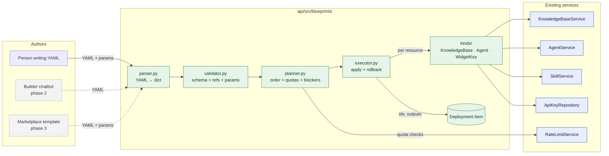
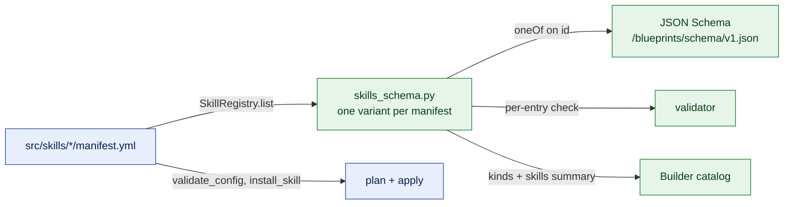
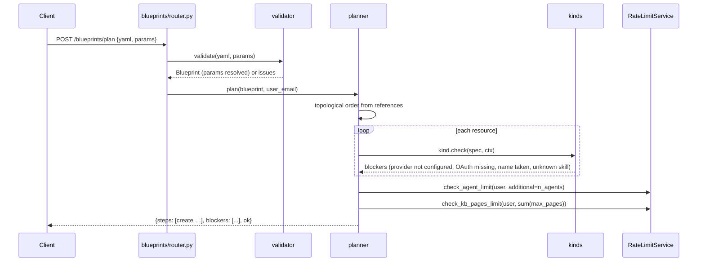
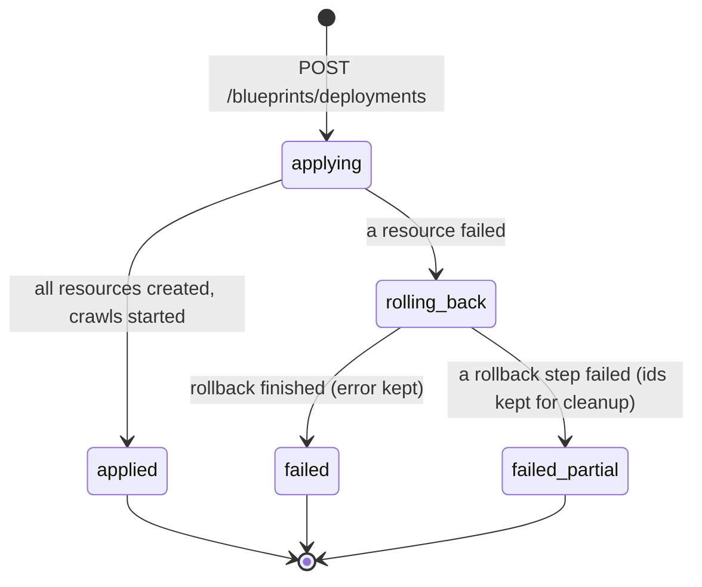

# Solution Blueprints (POC)

| Field | Value |
| --- | --- |
| Status | 🚧 In progress: POC built and tested (API and dashboard page); not deployed |
| Owner | InnomightLabs API / SPA |
| Last reviewed | 2026-10-08 |
| Scope | new `api/src/blueprints/`; small extractions in `api/src/knowledge/`, `api/src/agents/`, `api/src/skills/service.py`, `api/src/rate_limits/service.py`; new SPA page under `spa/src/pages/dashboard/blueprints/` |
| Depends on | [Public API and Embeddable Widget](LLD-public-api-and-embeddable-widget.md), [Widget Guest Sessions](LLD-widget-guest-sessions.md), [Agent Marketplace](../api/docs/LLD-agent-marketplace.md) |
| Tracker | — |
| Replaces | — |

> **Summary:** Building something useful on InnomightLabs today takes several separate dashboard tasks: create a
> knowledge base, crawl a site, create an agent, link the KB, install skills, set who can use them, and create a widget
> key. A **blueprint** is a YAML document that describes that whole solution as resources that reference each other.
> InnomightLabs validates it against a published schema, shows a **plan** of what it will create, and **applies** it
> through the existing services, rolling back if a step fails. Humans write blueprints by hand today. Later a Builder
> chatbot writes them from a conversation, and the marketplace offers them as one-click templates. The POC ships the
> spec, the validator, plan/apply, and three resource kinds (`KnowledgeBase`, `Agent`, `WidgetKey`). That is enough
> for the first blueprint: *a website agent that knows your site and can capture leads*.

## Implementation notes

**Who writes blueprints.** People don't. **Ada**, InnomightLabs' solution builder, writes the YAML from a
conversation and hands it to a tool that turns it into real resources. The person sees questions, forms, a
plain-words plan, an approval form, the result and how to test it. So phase 2 (the Builder) is part of the POC.

Ada runs on her own agent architecture, **Vishwakarma**, named after the divine architect. It sits next to
`krishna_memgpt` but runs one workflow, with tools and prompts made for it:

```mermaid
sequenceDiagram
    participant P as Person
    participant A as Ada (Vishwakarma)
    participant T as Builder tools
    participant B as blueprints
    Note over P,A: Session starts with Ada's greeting: "What do you want to build today?"
    P->>A: "I don't know, what can you do?"
    A->>T: show_form (choice: the ideas + "Something else")
    T-->>P: form under Ada's message
    P->>A: form submission: "Website support agent"
    A->>T: show_form (requirements: the draft's params + up to two questions)
    P->>A: form submission: site, business name, ...
    A->>T: plan_blueprint(yaml, params)
    T->>B: validate + plan; draft saved on the BuilderSession
    alt issues
        T-->>A: issues with paths and hints
        A->>T: plan_blueprint(fixed yaml, params)
    end
    T-->>P: approval form (plan_id)
    P->>A: form submission: "Apply this plan"
    A->>T: apply_blueprint(plan_id)
    T->>B: draft re-validated, re-planned, applied
    T-->>A: outputs (snippet), dashboard links
    A-->>P: what was built + numbered steps to test it
    P->>A: "Is it ready?"
    A->>T: get_build_status
```

*Apply refuses unless `plan_id` is the session's current plan and the person's latest message is that plan's
approval form with "Apply this plan" chosen. The model can't write a user message, so it can't approve for the
person.*

- **Architecture:** `api/src/agents/architectures/vishwakarma.py` (`VishwakarmaArchitecture`) and
  `vishwakarma_prompt.py`. Templates are `api/src/agents/prompt_templates/vishwakarma_system_prompt.j2` and
  `vishwakarma/sections/` (`persona`, `workflow`, `forms`, `ideas`, `blueprint_language`, `draft`).
  - The turn follows the same order as Krishna MemGPT: prepare, prompt, context, loop, persist. It reuses
    `TurnOutputs`, so tool results that are forms reach the chat.
  - It has no memory, knowledge or skill tools, only the builder's (`ToolCategory.BUILDER`).
  - Every collaborator is injected: the message repository, session repository, tool registry, provider settings
    and skill service.
- **Not in the factory.** No agent can be created with it. `start_turn(architecture=...)` takes an injected
  architecture (`api/src/agents/turns/run.py`), and the builder module creates Vishwakarma explicitly
  (`api/src/builder/ada.py`).
- **Ada's tools:** `api/src/builder/tools.py`, a `BuilderTools` class bound into its own `ToolRegistry`.
  - `show_form`: the Interactive Forms module's `render_custom_form`. Its parameters are that action's own
    `input_schema` from `lead_capture/manifest.yml`, so the form contract has one definition. Used to brainstorm
    ideas and collect requirements.
  - `plan_blueprint`: saves the draft on the session, validates and plans it, and returns issues, blockers or the
    approval form. The approval form is built through the same forms module (`blueprints/approval.py`).
  - `apply_blueprint(plan_id)`: builds the session's draft once it's approved.
  - `get_build_status`: crawl progress and dashboard links, for the "how to test it" step.
  - `plan_blueprint` and `apply_blueprint` mark the prompt stale, so the next model call sees the updated draft.
- **The blueprint document:** `api/src/builder/canvas.py` and `builder/templates/blueprint_canvas.html.j2`.
  - When Ada plans, the result carries a canvas: a drawing on blueprint paper of each resource and the wires
    between them. It has a "Draft, awaiting approval" stamp and tabs for the steps and the highlighted YAML.
  - When she applies, the same drawing comes back stamped "Built", with ticks, pulses along the wires, and a
    "Use it" tab with the outputs.
  - It's an ordinary canvas artifact, kept on the assistant message.
  - A result already has its own `type` (the form), so the canvas rides under a `canvas` key. A new interpreter,
    `AttachedCanvas` in `agents/tool_results.py`, picks it up.
  - Everything the person typed is escaped before it's drawn. If the canvas can't be saved, the plan and the build
    carry on without it.
- **While she works:** the dashboard shows `AdaWorking` (`spa/src/components/chat/AdaWorking.tsx`) instead of the
  tool list. It's a blueprint tile sketching a drawing for the current step (asking, drafting, building, checking),
  with her words for it.
- **Applying updates what exists (idempotent).** Phase 4 is partly built: applying no longer only creates.
  - **Matching:** each resource gets an optional `id`. With it, apply updates that resource, and an unknown id
    blocks the plan. Without it, apply matches by name: an agent by name, a knowledge base by a unique name, a
    widget key by name on the matched agent, or the agent's only key. Anything unmatched is created.
  - **The plan:** every step is `create`, `update` (with each change in plain words) or `unchanged`. Plan limits
    count only creates. A plan that changes nothing has no approval form.
  - **Applying:** `apply_blueprint(validated, plan, ...)` creates, updates or keeps each resource. If a step
    fails, created resources are deleted and updated ones restored from their previous record. Skill settings are
    restored through `update_installed`, which keeps secrets.
  - **What an update does:**
    - Agent: changes its fields, links new knowledge bases, installs new skills, and changes existing skills'
      settings, sharing and on/off state.
    - Knowledge base: re-read only when its crawl settings differ from the last crawl.
    - Widget key: updated in place, so its public key, and the snippet already on the site, never change.
  - **Updates never delete.** Skills, knowledge base links and keys the blueprint leaves out stay as they are. To
    switch a skill off, a blueprint sets `enabled: false`. Deleting is still to do.
  - **Starting from an existing agent:** `blueprints/export.py` (`export_agent`) writes an agent, its knowledge
    bases, skills and widget keys out as a blueprint with their ids. Skills that need a secret are left out, and
    since updates never remove skills, they stay installed.
  - **Ada's side:**
    - `list_my_agents` and `load_agent` load an existing agent into her draft.
    - After a build she pins the draft to the built ids (`with_ids`), so her next change updates rather than
      rebuilds.
    - Her prompt says so, adds `ANCHOR_NO_DUPLICATES`, and forbids renaming to get past a blocker.
  - **The drawing** badges each card New, Update or No change, and lists an update's changes on the card.
- **Builder session:** `api/src/builder/models.py`, item `pk=User#{email}`, `sk=BuilderSession#{conversation_id}`.
  - Chat history keeps messages, not tool calls. So the draft (YAML, params), the current `plan_id` and the
    `deployment_id` live here, and the prompt renders them every turn.
  - It also records the provider and model Ada runs on, which are the person's own, as for their agents.
- **Ideas come from the example blueprints** (`build_ideas()` in `blueprints/catalog.py`), from each one's
  `metadata.title` and `description`. So adding an example under `blueprints/examples/` adds an idea.
  - Today there are two: Website support agent (`site-agent`) and Documentation assistant (`docs-assistant`).
  - A weekly newsletter idea needs an `Automation` kind first.
- **Routes:** `api/src/builder/router.py`.
  - `GET /builder/session-form` returns the create-agent form's provider and model fields.
  - `POST /builder/sessions` creates the conversation (`agent_id = innomightlabs-ada`), the session and Ada's
    greeting message.
  - `GET /builder/sessions` lists them.
  - The chat routes (`/builder/{conversation_id}/send-message`, `turns/active`, `turns/{id}/events`,
    `turns/{id}/stop`) mirror an agent's.
  - Ada's messages count against the person's monthly message limit (`rate_limits/middleware.py`).
- **Dashboard:**
  - **Build with Ada** (`/dashboard/build`, first in the sidebar) picks a provider and model and opens the chat.
  - Ada's conversations open in the existing conversation page. `spa/src/services/builder/ada.ts` maps
    `innomightlabs-ada` to the `/builder` routes in `ChatService` and names her in conversation lists. The chat's
    form renderer shows her forms unchanged.
- **Replaced:** the `solution_builder` skill from an earlier iteration of this POC is gone. Ada owns the workflow.
  The internal `/dashboard/blueprints` page stays for inspecting what was built, with no sidebar link.

Where the POC differs from the design below, and why:

- **Fewer extractions.**
  - Creating a KB and creating a widget key are each a model plus `save()`, so the kinds use those repositories
    directly.
  - Only logic that's more than a save was shared:
    - `api/src/knowledge/crawl_launch.py`: `launch_crawl`, used by both crawl routes and the `KnowledgeBase` kind.
    - `api/src/agents/service.py`: `AgentService.create` (with the dream schedule) and `validate_provider_model`,
      now also used by the marketplace.
    - `SkillService.check_install`: every install check without installing. `install_skill` calls it, and so does
      the plan, so the plan and the install can't disagree.
    - `check_agent_limit(user_email, additional=1)`.
- **Required secrets block at validation.** The design said a skill with a required secret would be installed
  disabled. An install can't skip a required field, though. So the validator reports "*Skill* needs *API key*, which
  can't be written in a blueprint" and asks for the skill to be installed from the Skills tab after apply. Optional
  secrets are just left out.
- **Provider check.** The create-agent form always offers Bedrock, but a chat fails unless the owner has provider
  settings saved. So the plan also requires a `ProviderSettings` item for the chosen provider.
- **Validation runs in two passes.** Structural errors (unknown fields, missing fields, wrong types) are reported
  together. Reference checks (`agent: assistnt`) and skill checks run once the structure is valid. The Builder's fix
  loop handles this. Reporting both in one pass would need reference checks on the raw YAML.
- **Interpolation only fills string fields**, so a param can't set `crawl.max_pages`. The example uses a fixed 10
  pages, which is the free tier's allowance.
- **The skill registry has a `version`**, a hash of the loaded manifests set in `reload()`. It's the cache key for the
  skill variants and the schema's `ETag`.
- **Crawls start in `start()`.** If two KBs crawl and the second launch fails, the first crawl is already queued and
  then runs against a KB that has been rolled back. With one KB per blueprint today this can't happen; fix it before
  multi-KB blueprints.
- **Tests:**
  - `api/tests/test_blueprints_validator.py`, `test_blueprints_skills_schema.py`, `test_blueprints_apply.py` and
    `test_builder_ada.py`, plus an injected-architecture case in `test_chat_turn_run.py`.
  - `spa/src/pages/dashboard/blueprints/blueprintView.test.ts`.

## Context and problem

The features exist, but each one is a separate task:

| Step | Where it lives today |
| --- | --- |
| Create a KB | `POST /knowledge-bases`: logic inline in `api/src/knowledge/router.py:167-189` |
| Crawl a site | `POST /knowledge-bases/{kb_id}/crawl-jobs`: logic inline in `knowledge/router.py:341-415` (Lambda invoke or `BackgroundTasks`) |
| Create an agent | `POST /agents`: logic inline in `api/src/agents/router.py:150-207`, including the dream schedule for `krishna-memgpt` |
| Link KB → agent | `POST /agents/{agent_id}/knowledge-bases`: `knowledge/router.py:936-976`, `AgentKnowledgeBaseRepository.link` |
| Install a skill | `SkillService.install_skill` (`api/src/skills/service.py:108`); audience set separately with `update_installed(available_to=…)` (`service.py:231`) |
| Widget key | `POST /agents/{agent_id}/api-keys`: `api/src/apikeys/router.py:71-110`, `AgentApiKey` + `ApiKeyRepository.save` |
| Snippet | Rendered in the SPA only (`spa/src/pages/dashboard/agent-detail/WidgetSnippets.tsx:27-31`) |

A few things make these steps easy to get wrong, even for someone who knows the product:

- Only `krishna-memgpt` loads knowledge bases and skills (`api/src/agents/architectures/krishna_memgpt.py:140-142`).
  `krishna-mini` has no tools.
- A skill is usable only by its owner until `available_to` includes `visitor` or `guest`
  (`api/src/skills/models.py:212-219`), so `lead_capture` silently does nothing in a widget.
- A crawl from a homepage needs `source_type=url`. The default (`sitemap`) expects a sitemap URL
  (`api/src/knowledge/models.py:83-85`).
- Subscription caps are enforced in `RateLimitMiddleware` by matching HTTP paths (`api/src/rate_limits/middleware.py:31-53`).
  Anything that creates agents or crawls without going through those paths skips the cap. The marketplace import
  already does (`docs/LLD-security-hardening-and-conversation-context.md` §4.1).

There is no way to describe a combination once and reuse it. That also blocks the two follow-ons we want: a chatbot
that builds solutions, and a marketplace of one-click solutions.

## Goals and non-goals

**Goals (POC)**

1. A versioned YAML spec, `apiVersion: innomight/v1`, simple enough for a small model to write and readable by
   anyone. **Every field carries its description in the spec itself**, and that description flows into the
   generated JSON Schema, the model catalog and the editor tooltip.
2. A JSON Schema generated from code and published at a fixed URL. **Nothing is defined twice:**
   - Blueprint structure comes from the Pydantic models in `spec.py`.
   - **Everything about skills comes from each skill's `manifest.yml`**, read from the live `SkillRegistry`. That
     covers which skills exist, their config fields, help text, allowed values, who they can be shared with, and
     whether they need OAuth. Add, change or remove a skill, and the schema, the validator and the Builder catalog
     follow automatically. See [§5](#5-skills-come-from-their-manifests).
3. Validation with precise, fixable errors (path, message, hint, "did you mean").
4. **Plan** (what will be created, and what's blocking) and **apply** (create, in dependency order, through the
   existing services, with rollback).
5. A `Deployment` record of what a blueprint created.
6. Three kinds: `KnowledgeBase`, `Agent` (with inline skills), `WidgetKey`.
7. A minimal dashboard page: paste YAML, fill in params, see the plan, apply, copy the outputs.
8. The first blueprint, `site-agent`, checked into the repo as an example and a test fixture.

**Non-goals (POC)**

- **Updating or deleting** a deployment from an edited blueprint. The POC creates only; see
  [Later phases](#later-phases).
- **The Builder chatbot** (phase 2) and **the blueprint marketplace** (phase 3).
- **A leads inbox.** It's needed for lead-gen blueprints to be useful, but it's a separate module with its own LLD.
  The POC agent still captures leads through `lead_capture.register_lead`. They're just not listed anywhere yet.
- **Platform-paid models.** The agent uses the owner's own provider credentials, as every agent does today.
- **Control flow in the spec** (loops, conditions, expressions). This is deliberate; see
  [Alternatives and decisions](#alternatives-and-decisions).

## Design



*Green is new, blue is existing, and dashed boxes are later phases. Resource kinds call services, never HTTP routes.*

### 1. Principles of the spec

- **Declarative.** A blueprint lists the resources that should exist and how they reference each other. The planner
  works out the order. Small models describe end states more reliably than they write correct sequences.
- **No logic.** No loops, conditionals or expressions. Power comes from combining kinds. Runtime behaviour belongs in
  a resource that has it (an `Automation` kind, later).
- **One way to do each thing.** References are plain resource names. Interpolation has one form, `{{ params.x }}`,
  plus `{{ resources.<name>.<attribute> }}` in `outputs` only.
- **Strict.** Unknown fields are errors (`extra="forbid"`), so a typo is caught and corrected, not ignored.
- **Self-describing.** Every field has a description: in the Pydantic model for blueprint structure, and in the
  manifest for skill config. Authors can also describe each param and each resource in the YAML, so a blueprint
  explains itself to the next reader.
- **One definition.** Whenever code already defines a set of values, the blueprint code reads it from there and
  never copies it:
  - skills and their config: manifests;
  - crawl limits: `MAX_CRAWL_PAGES` and `MAX_CRAWL_DEPTH`;
  - audiences: `ActorKind`.
- **No secrets.** Credentials are never written in a blueprint. Skills that need OAuth or provider keys are reported
  as plan blockers ("connect Google Mail first").

### 2. Document shape

```yaml
# yaml-language-server: $schema=https://api.innomightlabs.com/blueprints/schema/v1.json
apiVersion: innomight/v1
kind: Blueprint
metadata:
  name: site-agent
  title: Website agent that captures leads
  description: Learns your website and answers visitors' questions in a chat widget. Offers a contact form when a visitor is interested.
params:
  site_url:
    type: url
    label: Your website
    description: The homepage the agent should learn from. Only pages on the same domain are read.
  business_name:
    type: string
    label: Business name
    description: Used in the agent's name and in how it introduces itself.
  provider:
    type: string
    label: Model provider
    description: A provider you've set up in Settings > Provider Configuration.
    default: openai
resources:
  site_kb:
    kind: KnowledgeBase
    description: Everything the agent knows about the business, read from the website.
    name: "{{ params.business_name }} website"
    crawl:
      url: "{{ params.site_url }}"
      mode: site
      max_pages: 25

  assistant:
    kind: Agent
    description: The agent visitors chat with.
    name: "{{ params.business_name }} assistant"
    provider: "{{ params.provider }}"
    instructions: |
      You are the website assistant for {{ params.business_name }}.
      Answer questions using the website knowledge base. If you don't know, say so.
      When a visitor wants a quote, a demo or to be contacted, offer the contact form.
    knowledge_bases: [site_kb]
    skills:
      - id: lead_capture
        available_to: [visitor, guest]

  widget:
    kind: WidgetKey
    description: The key the website's chat widget uses.
    agent: assistant
    allowed_origins: ["{{ params.site_url }}"]
    allow_guests: true
outputs:
  snippet:
    description: Paste this before </body> on every page of your site.
    value: "{{ resources.widget.snippet }}"
  agent_id:
    description: Open the agent in the dashboard to test it.
    value: "{{ resources.assistant.id }}"
```

The POC checks this file in as `api/src/blueprints/examples/site-agent.yaml`.

### 3. Rules

| Rule | Detail |
| --- | --- |
| Version | `apiVersion` must be a version the runner supports. Inside `v1` changes are additive only: new kinds, new optional fields. A breaking change is `v2`, and the runner keeps accepting `v1`. |
| Resource names | `^[a-z][a-z0-9_]{0,39}$`, unique within the blueprint. They're local handles, not the names shown to users. |
| References | Fields typed as references (`Agent.knowledge_bases`, `WidgetKey.agent`) hold resource names. The referenced resource must exist and be of the expected kind. References decide the apply order. A cycle is an error. |
| Params | Referenced as `{{ params.<name> }}` in any string field. Every param used must be declared. A param with no `default` is required. Values are type-checked (`url` must be `http(s)://`, `integer` must parse, `choice` must be one of `options`). |
| Interpolation | Plain substitution, no filters or expressions. Unknown names are errors. `{{ resources.… }}` is allowed in `outputs` only, because resource attributes exist only after apply. |
| Unknown fields | Rejected everywhere, with a "did you mean" hint (`difflib.get_close_matches`). |
| Size | At most 20 resources and 64 KB of YAML in v1 (`settings.blueprint_max_resources`, `settings.blueprint_max_bytes`). |
| Parsing | `yaml.safe_load` only. Anchors and aliases are rejected (they make the "Norway problem" and billion-laughs inputs possible, and no blueprint needs them). |

### 4. Field reference

These tables are a **snapshot for reviewing this design**, not the reference. The reference is generated:

- `GET /blueprints/reference` renders Markdown from the same schema the validator uses.
- The SPA docs page renders that same output.

The descriptions live only in `Field(description=…)` in `api/src/blueprints/spec.py`, and, for skill config, in each
`manifest.yml`. Nobody keeps a document in step by hand.

**Blueprint**

| Field | Type | Required | Description |
| --- | --- | --- | --- |
| `apiVersion` | `"innomight/v1"` | yes | Which version of the blueprint rules this document follows. |
| `kind` | `"Blueprint"` | yes | Always `Blueprint`. Marks the document type. |
| `metadata.name` | slug | yes | Short id for the blueprint, lowercase with dashes, e.g. `site-agent`. |
| `metadata.title` | string | yes | One-line human name, shown in lists and the marketplace. |
| `metadata.description` | string | no | What the solution does for the person who runs it, in plain words. |
| `params` | map of name → Param | no | Values the person running the blueprint fills in. Each becomes an input in the run form. |
| `resources` | map of name → Resource | yes | Everything the blueprint creates. The key is the resource's local name, used for references. |
| `outputs` | map of name → Output | no | Values shown after a successful apply, such as the embed snippet. |

**Param**

| Field | Type | Required | Description |
| --- | --- | --- | --- |
| `type` | `string` \| `text` \| `url` \| `boolean` \| `integer` \| `choice` | no (default `string`) | The kind of value expected. `text` is multi-line. `url` must start with http:// or https://. |
| `label` | string | yes | Shown above the input when someone runs the blueprint. |
| `description` | string | no | Help text under the input: what to enter and why it's needed. |
| `default` | string \| integer \| boolean | no | Used when the person leaves the input empty. A param without a default is required. |
| `options` | list of strings | for `choice` | The allowed values. Required for `choice`, not allowed otherwise. |

**Common to every resource**

| Field | Type | Required | Description |
| --- | --- | --- | --- |
| `kind` | string | yes | Which kind of resource to create: `KnowledgeBase`, `Agent` or `WidgetKey`. |
| `description` | string | no | What this resource is for. Stored as the resource's description where it has one. |

**`KnowledgeBase`**: a searchable store of content an agent can answer from.

| Field | Type | Required | Description |
| --- | --- | --- | --- |
| `name` | string | yes | Name shown in the dashboard's knowledge base list. |
| `crawl` | Crawl | no | Fill the knowledge base by reading a website. Leave it out to create an empty knowledge base. |
| `crawl.url` | url | yes | Where to start reading: a homepage for `mode: site`, a sitemap.xml for `mode: sitemap`. |
| `crawl.mode` | `site` \| `sitemap` | no (default `site`) | `site` follows links from `url` on the same domain. `sitemap` reads the pages listed in a sitemap. |
| `crawl.max_pages` | integer, 1–1000 | no (default 25) | The most pages to read. Counts against your plan's knowledge base page allowance. |
| `crawl.max_depth` | integer, 1–10 | no (default 3) | How many links away from `url` to follow. |

Exposes to `outputs`: `id`, `crawl_job_id`.

**`Agent`**: an AI agent people can chat with in the dashboard, a widget or the API.

| Field | Type | Required | Description |
| --- | --- | --- | --- |
| `name` | string | yes | The agent's name. Shown in the dashboard and as the widget title. Must not match one of your existing agents. |
| `instructions` | text | yes | Who the agent is and how it should behave. This is the agent's system persona. |
| `provider` | string | yes | The LLM provider the agent uses. It must be set up in Settings > Provider Configuration. |
| `model` | string | no | Model id from that provider. Leave it out to use the provider's default model. |
| `knowledge_bases` | list of `KnowledgeBase` names | no | Knowledge bases in this blueprint the agent can search when answering. |
| `skills` | list of Skill | no | Skills to install on the agent, such as `lead_capture`. **The allowed entries are generated from the installed skill manifests** ([§5](#5-skills-come-from-their-manifests)). |
| `skills[].id` | one of the registered skill ids | yes | Which skill to install. Its description comes from the manifest. |
| `skills[].config` | per skill, from the manifest's `form` | depends on the skill | The skill's install settings. Field names, types, allowed values, required/optional and help text all come from the manifest. Secret fields are never part of a blueprint. |
| `skills[].available_to` | list of `visitor` \| `guest` \| `api` \| `a2a` | no (default owner only) | Who besides you may use the skill. `visitor` is a signed-in widget user, `guest` is a widget user who gave only an email. **Absent from the schema for skills whose manifest makes them owner-only.** |
| `skills[].enabled` | boolean | no (default `true`) | Install the skill switched off when false. |
| `session_timeout_minutes` | integer ≥ 0 | no (default 60) | Minutes of silence after which a conversation starts fresh. 0 means never. |

The architecture is always `krishna-memgpt`, the only one that uses knowledge bases and skills, so the spec doesn't
expose it. Exposes to `outputs`: `id`, `name`.

**`WidgetKey`**: a public key that lets a website embed an agent's chat widget.

| Field | Type | Required | Description |
| --- | --- | --- | --- |
| `agent` | `Agent` name | yes | The agent in this blueprint that the widget talks to. |
| `name` | string | no (default "`<agent name>` widget") | Label for the key in the dashboard. |
| `allowed_origins` | list of urls | yes | Sites allowed to embed the widget. Each is reduced to its origin (`https://example.com`). An empty list is rejected: blueprints never create keys that work on any site. |
| `allow_guests` | boolean | no (default `false`) | Let visitors chat after giving only their email, without Google sign-in. |

Exposes to `outputs`: `id`, `public_key`, `snippet`.

**Output**

| Field | Type | Required | Description |
| --- | --- | --- | --- |
| `value` | string | yes | The value to show. Usually a `{{ resources.<name>.<attribute> }}` reference. |
| `description` | string | no | What the value is and what to do with it. |

### 5. Skills come from their manifests

The skill part of the spec is not written anywhere in `blueprints/`. On startup, and on `SkillRegistry.reload()`,
`api/src/blueprints/skills_schema.py` walks `SkillRegistry.list()` and builds one **skill variant** per manifest.
`skills[]` in the schema is a discriminated union on `id` over those variants. An agent writing a blueprint sees
exactly the skills the platform has right now, each with its real config fields.



*The manifest feeds every consumer. `skills_schema.py` only translates; it holds no skill knowledge of its own.*

**What each manifest key becomes**

| Manifest | In the skill variant |
| --- | --- |
| `id` | `id: Literal["<id>"]`, the discriminator |
| `name`, `description` | The variant's `title` and `description` |
| `form[]` (install form) | The `config` object: one property per input, named by `name` |
| `form[].label`, `form[].attr.help_text` | Property `title` and `description`. `help_text` is used when present, otherwise the label |
| `form[].attr.optional`, `form[].value` | Required unless the field is optional or has a default. `value` becomes the default |
| `form[].values`, `form[].options` | `enum` of the allowed values (when static) |
| `form[].options_source` | A string whose description names the source, such as "one of your agents (agent id)". The plan checks the actual value through `validate_form_options`, as installs do |
| `form[].input_type` | `key_value` → object of strings. `text`, `text_area`, `select`, `search` and `choice` → string |
| Secret inputs (`is_secret_input`) | **Left out of the schema.** A blueprint can't carry a credential. If one is required, the skill is installed `enabled: false`. The plan shows "Finish setup: add *API key* on the agent's Skills tab", and the deployment outputs a link to that tab |
| `runs_only_for_owner` (`owner_only`, `requires_oauth`, `connectors`) | `available_to` is **left out** of the variant, so `extra="forbid"` rejects it with the reason as the hint |
| `requires_oauth`, `oauth_provider_name`, `connectors` | Added to the description ("Needs a connected Google Mail account"). The plan checks the user's actual connection and reports a blocker |
| `repeatable`, `repeatable_identity_fields` | A non-repeatable skill may appear once per agent. A repeatable one may repeat, as long as the identity fields differ (`installed_skill_id_for`) |
| `actions[].name`, `actions[].description` | Catalog only, not the schema. They tell the Builder what the skill can *do*, so it can pick the right one. `system_prompt` stays out: it's runtime guidance for the agent using the skill |

```python
# api/src/blueprints/skills_schema.py
def skill_variant(loaded: LoadedSkill) -> type[BaseModel]:
    manifest = loaded.manifest
    config_fields = {
        field.name: config_field(field)
        for field in manifest.form
        if not is_secret_input(field)
    }
    fields: dict[str, Any] = {
        "id": (Literal[manifest.id], Field(description=f"{manifest.name}: {manifest.description}")),
        "config": (create_model(f"{manifest.id}_config", __config__=STRICT, **config_fields), Field(default=None)),
        "enabled": (bool, Field(True, description="Install the skill switched off when false.")),
    }
    if not manifest.runs_only_for_owner:
        fields["available_to"] = (list[SharedAudience], Field(default_factory=list, description=AVAILABLE_TO_DESCRIPTION))
    return create_model(f"Skill_{manifest.id}", __config__=STRICT, __doc__=manifest.description, **fields)


def config_field(field: FormInput) -> tuple[Any, Any]:
    allowed = [*(field.values or []), *(option.value for option in field.options or [])]
    if field.input_type is FormInputType.KEY_VALUE:
        annotation: Any = dict[str, str]
    elif allowed and not field.options_source:
        annotation = Literal[tuple(allowed)]
    else:
        annotation = str
    description = (field.attr or {}).get("help_text") or field.label
    required = not field.is_optional and field.value is None
    return annotation, Field(... if required else field.value, title=field.label, description=description)


@cache
def skill_variants(registry_version: str) -> tuple[type[BaseModel], ...]:
    return tuple(skill_variant(loaded) for loaded in get_skill_registry().list())
```

`registry_version` is a hash of the loaded manifests. It's computed in `SkillRegistry.reload()` and used as the
cache key and the schema's `ETag`, so a changed manifest gives a new schema without a restart flag.

`spec.py` keeps `AgentSpec.skills` as a plain `list[SkillEntry]` (`id`, `config`, `available_to`, `enabled`),
which parses any skill. The skill variants are then used in two places:

1. **Schema:** `blueprint_json_schema()` swaps the `SkillEntry` definition for
   `{"oneOf": [variant schemas], "discriminator": {"propertyName": "id"}}`.
2. **Validator:** each entry is checked against its variant, so errors are as precise as for the fixed parts. For
   example: "`lead_capture` has no config field `titel`; did you mean `title`?", or "`google_mail` uses your own
   account, so it can't be shared."

**The manifest stays the authority at plan and apply time too.** The plan calls `SkillRegistry.validate_config`,
`validate_form_options`, and the OAuth and connector checks. Apply calls `SkillService.install_skill`. These are
exactly what a dashboard install runs. The generated variant is for writing and early errors; it never replaces
the install checks.

**What this asks of skill authors** (added to `api/src/skills/SKILL_MANIFEST.md`):

- **Treat `id` and `form[].name` as a public API.** Blueprints and templates refer to them. Renaming or removing one
  breaks saved blueprints the way it already breaks installed skills. Add new fields as optional.
- **Give every install-form field an `attr.help_text`.** It becomes the field's description for people and models.
  Today only a few fields have one (for example `agent2agent_client`, `google_ads`, `rest_template`). Fields
  without it fall back to `label`, which works, but tells a model less.
- A test in `test_blueprints_skills_schema.py` lists the install-form fields without `help_text`. Existing gaps sit
  on an allowlist, so the test only fails for new ones. The list shrinks as manifests are touched, and no new gaps
  get in.

**Compatibility.** Skill changes don't change `apiVersion`. `v1` covers the blueprint structure; the skill set is
data. A blueprint that worked yesterday is re-validated against today's registry on every plan, so a skill that was
removed or changed shows up as a normal issue, never as a failed apply. CI validates every example blueprint
(`api/src/blueprints/examples/*.yaml`) against the current registry, which catches a breaking manifest change in the
PR that makes it.

### 6. Validation errors

Every problem is one `BlueprintIssue`. The validator collects all of them instead of stopping at the first, so a
person or a model can fix everything in one pass:

```json
{
  "valid": false,
  "issues": [
    {
      "path": "resources.widget.agent",
      "line": 41,
      "message": "'assistnt' is not a resource in this blueprint.",
      "hint": "Did you mean 'assistant'?"
    },
    {
      "path": "resources.assistant.skils",
      "line": 33,
      "message": "Unknown field 'skils' on Agent.",
      "hint": "Did you mean 'skills'?"
    }
  ]
}
```

`line` comes from a line-aware YAML load: `yaml.compose` gives node marks, which map dotted paths to lines. It's best
effort, and `path` is always present. The Builder (phase 2) feeds `issues` back to the model as they are.

### 7. Plan



*A plan has no side effects. Blockers are reported in the plan, so the UI can show "connect Google Mail" next to the
step it blocks.*

The plan's checks reuse existing code:

- **Provider and model:** `validate_form_options(get_create_agent_form().form_inputs, …)`, the same check the
  marketplace import uses (`api/src/agent_marketplace/service.py:245-253`). Move it to `agents/service.py` so both
  callers share it.
- **Skills:** `SkillRegistry.get`, `SkillService.validate_install_config` (`skills/service.py:158`), the
  OAuth-provider check from `install_skill`, and the `runs_only_for_owner` rule (`skills/models.py:125-127`) when
  `available_to` asks for anyone other than the owner.
- **Agent name taken:** `AgentRepository.find_by_name` (`agents/repository.py:158`).
- **Quotas:** `RateLimitService.check_agent_limit` gains an `additional: int = 1` argument so one plan can create
  several agents. `check_kb_pages_limit` takes the sum of `max_pages`.
- **Pinecone configured** (`settings.require_pinecone()`) when any resource has `crawl`.

### 8. Apply

`POST /blueprints/deployments` re-runs validation and the plan (the state may have changed since the client last
planned). It refuses if there are blockers, then:

1. Writes a `Deployment` item with `status=applying`.
2. Creates resources in dependency order. Each kind's `apply` returns an `AppliedResource{kind, id, attributes}`,
   which is recorded on the deployment straight away.
3. After every resource exists, runs each kind's `start` hook. Only `KnowledgeBase.start` does anything: it launches
   the crawl. Crawls start last so a failure earlier never leaves a crawl running, and rollback never has to cancel
   one.
4. Resolves `outputs` and sets `status=applied`.

If step 2 fails, the executor calls `rollback` on the applied resources in reverse order, sets `status=failed` with
the error, and returns the issue. This is the same pattern `AgentMarketplaceService.import_agent` uses
(`agent_marketplace/service.py:96-115`).



*`failed_partial` keeps the ids of what couldn't be removed, so a person can clean up from the deployment page.*

Apply is synchronous. Every step is a DynamoDB write, and the crawl runs in the background as it does today. The
response comes back in well under a second, apart from the crawl, which the client follows with the existing crawl
job endpoints.

Per kind:

| Kind | `apply` | `start` | `rollback` |
| --- | --- | --- | --- |
| `KnowledgeBase` | `KnowledgeBaseService.create(name, description, user_email)` | `KnowledgeBaseService.start_crawl(kb_id, CrawlConfig(…), user_email, launcher)` | `KnowledgeBaseService.soft_delete` (`knowledge/service.py:71`) |
| `Agent` | `AgentService.create(...)` with `agent_architecture="krishna-memgpt"`; then `AgentKnowledgeBaseRepository.link` per KB; then `SkillService.install_skill(..., available_to=…)` per skill | — | `SkillService.uninstall` per skill, `AgentKnowledgeBaseRepository.unlink` per KB, `AgentRepository.delete_by_id` |
| `WidgetKey` | `ApiKeyRepository.save(AgentApiKey(...))` with origins normalised | — | `ApiKeyRepository.delete_by_id` |

### 9. Extractions the kinds need

Kinds call services, not routes. Today most of this logic is inline in the routers, so the POC moves it into
functions that the routers and the kinds both call. These are moves, with no behaviour change:

- **`api/src/knowledge/service.py`:**
  - `KnowledgeBaseService.create(...)` from `router.py:167-189`.
  - `KnowledgeBaseService.start_crawl(kb_id, config, user_email, launch)` from `router.py:341-415`.
  - `launch` is a small callable: in a request it wraps `BackgroundTasks.add_task(_run_crawl_in_background, …)`, and
    on Lambda it's `_invoke_crawl_async`. The `settings.async_job_backend` branch moves into one function,
    `crawl_launcher(background_tasks)`.
- **New `api/src/agents/service.py`:**
  - `AgentService.create(request: CreateAgentRequest, user_email) -> Agent` from `agents/router.py:186-205`,
    including the dream schedule.
  - It also fixes the dropped `session_timeout_minutes` (accepted at `models.py:9-19`, never passed on).
  - `validate_provider_model(...)` moves here from the marketplace.
- **`SkillService.install_skill`** gains `available_to: list[ActorKind] | None = None`. It applies the same
  `runs_only_for_owner` rule as `update_installed` (`service.py:254-255`). This lets the marketplace import set
  audiences later too.
- **`RateLimitService.check_agent_limit(user_email, additional=1)`.**

Because the kinds call `RateLimitService` directly in the plan, blueprints can't skip the caps that the middleware
applies to the HTTP routes.

### 10. JSON Schema, reference and catalog

All three are generated by one function, `blueprint_json_schema(registry_version)`, plus renderers. Each is a
different view of the same schema.

- **`GET /blueprints/schema/v1.json`:** the full schema, which is the `spec.py` models with the skill variants from
  [§5](#5-skills-come-from-their-manifests) swapped in.
  - It's public, so editors can fetch it: add the path to `PUBLIC_PATHS` in `api/src/auth/middleware.py:22`.
  - It's served with `ETag: <registry_version>`.
  - `resources` is a discriminated union on `kind`, and `skills[]` is one on `id`. Editors autocomplete each kind's
    fields and each skill's config fields.
  - Every description from the models and the manifests appears in the schema, which is what VS Code shows on hover.
- **`GET /blueprints/reference`:** Markdown rendered from the same schema. It has one section per kind and one per
  skill, each with a field table. The SPA docs page shows it. This replaces any reference written by hand,
  including the snapshot tables in this LLD.
- **`GET /blueprints/catalog`** (authenticated): a compact summary for models, generated from the same schema plus
  per-user status.
  - For each kind: its purpose (the class docstring), its fields with type, required flag and description, and the
    attributes it exposes.
  - For each skill: id, name, description, config fields, whether it can be shared, and its action names and
    descriptions. It also says whether the skill is **ready for this user**, reusing `SkillService.list_catalog`'s
    `oauth_connected` and `available`.
  - It also lists the example blueprints.
  - The Builder (phase 2) gets this, not the raw schema. The POC builds it so the format can be tried with a model
    by hand.

### 11. Dashboard (POC)

A new page, `/dashboard/blueprints/new` (`spa/src/pages/dashboard/blueprints/BlueprintRunPage.tsx`), with a
service at `spa/src/services/blueprints/BlueprintApiService.ts`:

1. A YAML text area, pre-filled with `site-agent.yaml` from `GET /blueprints/examples/site-agent`.
2. **Validate** shows `issues` next to the text area. When the YAML is valid, `params` render as a form. The API
   turns params into `form_models.Form`, so the SPA uses `SchemaForm`, not a bespoke form:

   | Param type | `FormInputType` |
   | --- | --- |
   | `string`, `url`, `integer` | `TEXT` (with validation format for url/integer) |
   | `text` | `TEXT_AREA` |
   | `boolean` | `CHOICE` (yes/no) |
   | `choice` | `SELECT` |
3. **Plan** lists the steps ("Create knowledge base *Acme website*, read up to 25 pages", …) and any blockers.
4. **Apply** shows the outputs: the snippet with a copy button, and links to the agent and the crawl's progress.
5. `/dashboard/blueprints` lists past deployments with their status.

Use the shared primitives in `spa/src/components/ui/` and run `yarn design:audit`.

## Data model and contracts

### Spec models: `api/src/blueprints/spec.py`

The descriptions are part of the spec. Every field has one, and `extra="forbid"` is set on every model.

```python
from typing import Annotated, Literal
from pydantic import BaseModel, ConfigDict, Field, StringConstraints

from src.knowledge.models import MAX_CRAWL_DEPTH, MAX_CRAWL_PAGES
from src.skills.models import ActorKind

ResourceName = Annotated[str, StringConstraints(pattern=r"^[a-z][a-z0-9_]{0,39}$")]


class Strict(BaseModel):
    model_config = ConfigDict(extra="forbid")


class ParamSpec(Strict):
    type: Literal["string", "text", "url", "boolean", "integer", "choice"] = Field(
        "string",
        description="The kind of value expected. `text` is multi-line. `url` must start with http:// or https://.",
    )
    label: str = Field(description="Shown above the input when someone runs the blueprint.")
    description: str | None = Field(None, description="Help text under the input: what to enter and why it's needed.")
    default: str | int | bool | None = Field(
        None, description="Used when the person leaves the input empty. A param without a default is required."
    )
    options: list[str] = Field(
        default_factory=list, description="The allowed values. Required for `choice`, not allowed otherwise."
    )


class ResourceBase(Strict):
    description: str | None = Field(
        None, description="What this resource is for. Stored as the resource's description where it has one."
    )


class CrawlSpec(Strict):
    url: str = Field(description="Where to start reading: a homepage for `mode: site`, a sitemap.xml for `mode: sitemap`.")
    mode: Literal["site", "sitemap"] = Field(
        "site",
        description="`site` follows links from `url` on the same domain. `sitemap` reads the pages listed in a sitemap.",
    )
    max_pages: int = Field(
        25, ge=1, le=MAX_CRAWL_PAGES,
        description="The most pages to read. Counts against your plan's knowledge base page allowance.",
    )
    max_depth: int = Field(3, ge=1, le=MAX_CRAWL_DEPTH, description="How many links away from `url` to follow.")


class KnowledgeBaseSpec(ResourceBase):
    """A searchable store of content an agent can answer from."""

    kind: Literal["KnowledgeBase"] = Field(description="Which kind of resource to create.")
    name: str = Field(description="Name shown in the dashboard's knowledge base list.")
    crawl: CrawlSpec | None = Field(
        None, description="Fill the knowledge base by reading a website. Leave it out to create an empty knowledge base."
    )


#: Audiences a skill can be shared with, read from ActorKind, never listed here.
SharedAudience = Literal[tuple(kind.value for kind in ActorKind if kind is not ActorKind.OWNER)]

AVAILABLE_TO_DESCRIPTION = (
    "Who besides you may use the skill. `visitor` is a signed-in widget user, "
    "`guest` is a widget user who gave only an email."
)


class SkillEntry(Strict):
    """The fallback shape of `skills[]`, which parses any skill. In the published schema, and in the validator's
    per-entry check, it is replaced by the variants generated from the manifests (§5)."""

    id: str = Field(description="Which skill to install.")
    config: dict[str, object] = Field(default_factory=dict, description="The skill's install settings.")
    available_to: list[SharedAudience] = Field(default_factory=list, description=AVAILABLE_TO_DESCRIPTION)
    enabled: bool = Field(True, description="Install the skill switched off when false.")


class AgentSpec(ResourceBase):
    """An AI agent people can chat with in the dashboard, a widget or the API."""

    kind: Literal["Agent"] = Field(description="Which kind of resource to create.")
    name: str = Field(
        description="The agent's name. Shown in the dashboard and as the widget title. "
        "Must not match one of your existing agents."
    )
    instructions: str = Field(description="Who the agent is and how it should behave. This is the agent's system persona.")
    provider: str = Field(
        description="The LLM provider the agent uses. It must be set up in Settings > Provider Configuration."
    )
    model: str | None = Field(
        None, description="Model id from that provider. Leave it out to use the provider's default model."
    )
    knowledge_bases: list[ResourceName] = Field(
        default_factory=list,
        description="Knowledge bases in this blueprint the agent can search when answering.",
        json_schema_extra={"x-ref-kind": "KnowledgeBase"},
    )
    skills: list[SkillEntry] = Field(
        default_factory=list, description="Skills to install on the agent, such as `lead_capture`."
    )
    session_timeout_minutes: int | None = Field(
        None, ge=0, description="Minutes of silence after which a conversation starts fresh. 0 means never."
    )


class WidgetKeySpec(ResourceBase):
    """A public key that lets a website embed an agent's chat widget."""

    kind: Literal["WidgetKey"] = Field(description="Which kind of resource to create.")
    agent: ResourceName = Field(
        description="The agent in this blueprint that the widget talks to.", json_schema_extra={"x-ref-kind": "Agent"}
    )
    name: str | None = Field(None, description='Label for the key in the dashboard. Defaults to "<agent name> widget".')
    allowed_origins: list[str] = Field(
        min_length=1,
        description="Sites allowed to embed the widget. Each is reduced to its origin, such as https://example.com.",
    )
    allow_guests: bool = Field(
        False, description="Let visitors chat after giving only their email, without Google sign-in."
    )


Resource = Annotated[KnowledgeBaseSpec | AgentSpec | WidgetKeySpec, Field(discriminator="kind")]


class OutputSpec(Strict):
    value: str = Field(description="The value to show. Usually a {{ resources.<name>.<attribute> }} reference.")
    description: str | None = Field(None, description="What the value is and what to do with it.")


class Metadata(Strict):
    name: Annotated[str, StringConstraints(pattern=r"^[a-z][a-z0-9-]{0,62}$")] = Field(
        description="Short id for the blueprint, lowercase with dashes, such as site-agent."
    )
    title: str = Field(description="One-line human name, shown in lists and the marketplace.")
    description: str | None = Field(None, description="What the solution does for the person who runs it, in plain words.")


class Blueprint(Strict):
    """A description of a solution on InnomightLabs: the resources to create and how they connect."""

    api_version: Literal["innomight/v1"] = Field(
        alias="apiVersion", description="Which version of the blueprint rules this document follows."
    )
    kind: Literal["Blueprint"] = Field(description="Always Blueprint. Marks the document type.")
    metadata: Metadata
    params: dict[ResourceName, ParamSpec] = Field(
        default_factory=dict,
        description="Values the person running the blueprint fills in. Each becomes an input in the run form.",
    )
    resources: dict[ResourceName, Resource] = Field(
        min_length=1,
        description="Everything the blueprint creates. The key is the resource's local name, used for references.",
    )
    outputs: dict[ResourceName, OutputSpec] = Field(
        default_factory=dict, description="Values shown after a successful apply, such as the embed snippet."
    )
```

`x-ref-kind` marks reference fields. The validator reads it from `model_json_schema()` to check each reference's
target kind. Adding a reference field to a new kind therefore needs no validator change.

### Kind interface: `api/src/blueprints/kinds/`

Each kind is one class. They're registered in a list with one selection function, following the strategy pattern
in `api/src/rate_limits/strategies.py`.

```python
@dataclass(frozen=True)
class AppliedResource:
    name: str
    kind: str
    id: str
    attributes: dict[str, str]          # what `outputs` may reference


@dataclass
class ApplyContext:
    user_email: str
    applied: dict[str, AppliedResource]  # resolved references, filled in order
    crawl_launcher: CrawlLauncher


class ResourceKind(Protocol):
    kind: str
    spec_model: type[BaseModel]
    exposes: tuple[str, ...]             # attribute names, listed in the catalog

    def check(self, name: str, spec: BaseModel, ctx: PlanContext) -> list[BlueprintIssue]: ...
    def describe(self, name: str, spec: BaseModel) -> str: ...      # the plan step's sentence
    def apply(self, name: str, spec: BaseModel, ctx: ApplyContext) -> AppliedResource: ...
    def start(self, applied: AppliedResource, spec: BaseModel, ctx: ApplyContext) -> None: ...
    def rollback(self, applied: AppliedResource, ctx: ApplyContext) -> None: ...


RESOURCE_KINDS: tuple[ResourceKind, ...] = (KnowledgeBaseKind(), AgentKind(), WidgetKeyKind())


def kind_for(name: str) -> ResourceKind:
    return next(k for k in RESOURCE_KINDS if k.kind == name)
```

Adding a capability means adding a spec model to the `Resource` union and a class to `RESOURCE_KINDS`.

### Deployment item

```mermaid
erDiagram
    USER ||--o{ BLUEPRINT_DEPLOYMENT : runs
    BLUEPRINT_DEPLOYMENT {
        string pk "User#{user_email}"
        string sk "BlueprintDeployment#{created_at_iso}#{deployment_id}"
        string entity_type "BlueprintDeployment"
        string deployment_id
        string blueprint_name "metadata.name"
        string blueprint_yaml "as submitted"
        map params "resolved values"
        string status "applying | applied | failed | failed_partial"
        map resources "name -> {kind, id, attributes}"
        map outputs "name -> value"
        string error
        string created_at
        string updated_at
    }
```

*The sort key starts with the timestamp, so a `begins_with(sk, "BlueprintDeployment#")` query lists newest-last
without a GSI. Lookup by id uses the same query with a filter, which is fine at POC volumes.* Add the item to the
entity diagram in `api/README.md` ("Single Table Design").

### HTTP contract: `api/src/blueprints/router.py`

| Method and path | Auth | Body → response |
| --- | --- | --- |
| `GET /blueprints/schema/v1.json` | public | → JSON Schema |
| `GET /blueprints/reference` | public | → Markdown reference generated from the schema |
| `GET /blueprints/catalog` | user | → `{kinds: [{kind, purpose, fields, exposes}], skills: [{id, name, description, config_fields, shareable, actions, ready}], examples: [name]}` |
| `GET /blueprints/examples/{name}` | user | → `{yaml}` |
| `POST /blueprints/validate` | user | `{yaml}` → `{valid, issues, params_form}` |
| `POST /blueprints/plan` | user | `{yaml, params}` → `{ok, steps: [{resource, kind, action: "create", summary}], blockers: [BlueprintIssue]}` |
| `POST /blueprints/deployments` | user | `{yaml, params}` → `201 Deployment` or `422 {issues}` |
| `GET /blueprints/deployments` | user | → `[DeploymentSummary]` |
| `GET /blueprints/deployments/{deployment_id}` | user | → `Deployment` |

Rate limit `POST /blueprints/deployments` with
`RateLimitPolicy.sliding_window("BLUEPRINT_APPLY", limit=10, seconds=3600)`, keyed by user email. Release the slot
on failure (the `contact/router.py` pattern).

## Implementation map

| Area | Code | Responsibility |
| --- | --- | --- |
| Spec | `api/src/blueprints/spec.py` (new) | Pydantic models, descriptions, JSON Schema |
| Parse | `api/src/blueprints/parser.py` (new) | `safe_load`, alias rejection, size limit, path → line map |
| Validate | `api/src/blueprints/validator.py` (new) | Schema errors → issues, references and cycles, params, interpolation, did-you-mean |
| Plan | `api/src/blueprints/planner.py` (new) | Topological order, kind checks, quota checks |
| Apply | `api/src/blueprints/executor.py` (new) | Apply, start, rollback, deployment updates |
| Kinds | `api/src/blueprints/kinds/{knowledge_base,agent,widget_key}.py`, `kinds/__init__.py` (new) | One class per kind plus `RESOURCE_KINDS` / `kind_for` |
| Skill variants | `api/src/blueprints/skills_schema.py` (new) | One generated model per manifest; the `skills[]` union for the schema and validator |
| Registry version | `api/src/skills/registry.py` | `registry_version`: a hash of the loaded manifests, computed in `reload()` |
| Catalog and reference | `api/src/blueprints/catalog.py` (new) | Model-friendly summary and Markdown reference, both rendered from the schema |
| Manifest guide | `api/src/skills/SKILL_MANIFEST.md` | `id` and `form[].name` are a public API; every install field gets `attr.help_text` |
| Storage | `api/src/blueprints/repository.py`, `models.py` (new) | `Deployment` item |
| HTTP | `api/src/blueprints/router.py` (new), `main.py` | Routes; register after `agent_marketplace_router` |
| Public path | `api/src/auth/middleware.py:22` | Add `/blueprints/schema/v1.json` |
| Examples | `api/src/blueprints/examples/site-agent.yaml` (new) | First blueprint, also a test fixture |
| KB service | `api/src/knowledge/service.py`, `router.py` | Move `create` and `start_crawl` out of the router; add `crawl_launcher` |
| Agent service | `api/src/agents/service.py` (new), `router.py` | Move create logic; pass `session_timeout_minutes`; `validate_provider_model` |
| Marketplace | `api/src/agent_marketplace/service.py` | Use `validate_provider_model` from `agents/service.py` |
| Skills | `api/src/skills/service.py:108` | `install_skill(..., available_to=None)` |
| Quotas | `api/src/rate_limits/service.py:52` | `check_agent_limit(user_email, additional=1)` |
| Settings | `api/src/config/settings.py` | `blueprint_max_resources=20`, `blueprint_max_bytes=65536`, `embed_loader_url="https://cdn.innomightlabs.com/embed.js"` (env-overridable). Add them to `scripts/deploy_prod_railway.sh` only if production should differ |
| SPA | `spa/src/pages/dashboard/blueprints/` (new), `spa/src/services/blueprints/` (new), `spa/src/App.tsx` | Run page and deployments list |

## Rollout and compatibility

1. **Extractions first, in their own change.** Move the KB, agent, skill and quota logic into services. Run the
   existing suites unchanged (`uv run pytest tests/test_knowledge_*.py tests/test_agents_*.py tests/test_skills_*.py
   tests/test_agent_marketplace_*.py -q`). No behaviour change, except `session_timeout_minutes` now being saved.
2. **Spec, parser, validator, schema and catalog endpoints.** These don't write anything. Ship them, then try writing
   blueprints with a small model by hand, using `/blueprints/catalog` as the prompt. The results tell us whether the
   descriptions need work before phase 2.
3. **Planner, executor, kinds and the deployment item.**
4. **Dashboard page**, behind the signed-in dashboard only. No link from the public site yet.
5. **Homepage:** an early-access "Paste your URL" waitlist using `spa/src/components/WaitlistForm.tsx`, until phase 3
   gives guests a one-click run.

Nothing existing changes shape. `v1` is new, so there's nothing to keep compatible yet.

## Validation

Tests go in `api/tests/test_blueprints_*.py`.

- **Spec:**
  - `site-agent.yaml` validates.
  - The JSON Schema contains every structural field's description. A test walks the schema and fails on any
    property without one, which keeps the "every field is described" rule from rotting.
- **Skill variants** (`test_blueprints_skills_schema.py`, using `SkillRegistry(root_dir=tmp_path)` with fixture
  manifests):
  - Every registered skill produces a variant.
  - A new manifest appears in the schema after `reload()`, and a removed one disappears. `registry_version` and the
    `ETag` change with it.
  - Form fields map correctly: `help_text`, else label, as the description; `optional` and `value` as
    required/default; static `values`/`options` as an enum; `key_value` as an object.
  - Secret inputs are absent. A required secret makes the plan install the skill disabled, with a "finish setup"
    step.
  - Owner-only skills (`owner_only`, `requires_oauth`, `connectors`) have no `available_to`, and the validator
    explains why.
  - A non-repeatable skill listed twice is rejected. A repeatable one with distinct identity fields is accepted.
  - Install-form fields without `help_text` match the allowlist exactly, so a new gap fails the test.
  - Every `api/src/blueprints/examples/*.yaml` validates against the real registry.
- **Validator:** one test per rule in [§3](#3-rules):
  - An unknown field gives a did-you-mean hint.
  - A missing reference, a wrong-kind reference and a cycle are each reported.
  - An undeclared param and a missing required param are reported.
  - A bad `url` param is rejected.
  - `{{ resources.… }}` outside `outputs` is rejected.
  - YAML anchors are rejected, and oversized input is rejected.
  - Several problems are reported together.
- **Planner:**
  - Resources come out in order.
  - An unconfigured provider, an OAuth skill that isn't connected, `available_to` on an owner-only skill, and an
    agent name that's taken each become a blocker.
  - The agent cap and the page cap are hit through `RateLimitService` (free tier: 10 pages, 1 agent;
    `api/src/payments/prod_pricing_config.json:29-34`).
- **Executor** (moto):
  - Applying `site-agent` creates the KB, the agent (`krishna-memgpt`), the KB link, `lead_capture` with
    `available_to=[owner, visitor, guest]`, and a key with the normalised origin and `allow_guests=true`.
  - The crawl launcher is called once, after the key exists.
  - The outputs include a snippet with the new `pk_live_` key.
  - A failure injected at `WidgetKey.apply` rolls back the agent, link, skill and KB, and the deployment ends `failed`.
  - A failure injected during rollback ends `failed_partial` with the leftover ids.
- **Router:**
  - The schema endpoint works without auth.
  - Every other endpoint returns 401 without auth.
  - Apply re-plans and refuses when there are blockers.
  - The apply rate limit returns 429.
- **SPA:** `yarn test` for the param-form mapping and the issue list; `yarn lint`, `yarn build`, `yarn design:audit`.
- **End to end (manual):** apply `site-agent` against a real small site locally. Watch the crawl finish, embed the
  snippet on a local page, chat as a guest, submit the contact form, and confirm the `LeadSubmission` item is written.
- Before calling it done: `uv run pytest -q` and `uv run ruff check` / `uv run mypy` on the changed files.

## Alternatives and decisions

| Decision | Chosen | Rejected and why |
| --- | --- | --- |
| How a chatbot builds solutions | It writes a blueprint, and the runner applies it | **Every API as a tool:** too many tools for reliable selection, destructive calls one mistake away, nothing reusable left behind, and every repeat build costs model tokens |
| Spec style | Declarative resources with references (Terraform / Kubernetes) | **Ordered steps** (CI pipelines): models get ordering wrong, and steps can't be planned, diffed or re-applied |
| Logic in the spec | None | Loops and conditions turn the format into a weak programming language that small models write badly. Runtime logic belongs in automations |
| Schema source | Pydantic models → generated JSON Schema | **A hand-written schema** drifts from the code that runs it |
| Field docs | `Field(description=…)` on every structural field and `attr.help_text` on every skill field; the reference is generated; a test enforces it | **Docs kept separately** go stale; the model, the editor and readers would see different things |
| Skill schema | Generated from the live `SkillRegistry` (each `manifest.yml`) | **A hand-written skill list or config schema in `blueprints/`:** a second definition that drifts the first time a skill changes |
| Skill checks at apply | The same registry and `SkillService` calls a dashboard install makes | **Trusting the generated schema alone:** it can't see per-user state (OAuth, connectors, `options_source` values) |
| References | Plain resource names in typed fields | `${resources.x.id}` everywhere: more syntax for small models to get wrong |
| Skills | Inline on `Agent` | **A separate `Skill` resource:** an extra reference per skill for no gain in v1 |
| Architecture | Always `krishna-memgpt` | Exposing it lets authors pick `krishna-mini`, which silently ignores KBs and skills |
| Kinds call | Services (extracted from routers) | **HTTP to our own API:** auth plumbing, and the middleware caps become accidental |
| Crawl timing | Started after every resource exists | Starting it during apply would mean cancelling a running crawl on rollback |
| Model output | YAML text, then validate and fix | **Provider structured outputs:** support for discriminated unions varies by provider; usable later as an optional extra |
| Widget origins | Required, never empty | An empty list means "any site" (`apikeys/models.py:37-44`); a generated key shouldn't default to that |

## Later phases

Extending Ada to every skill, automation and feature (new kinds, setup requirements for secrets and OAuth, context
management, specialists) has its own design: [Ada: Building With Everything InnomightLabs Offers](LLD-ada-capabilities.md).

- **Phase 2: Builder chatbot.** Built in the POC as Ada on the Vishwakarma architecture (see Implementation notes).
  Still to do:
  - trying it with real models, small ones included, and tuning the prompt sections;
  - more ideas, which need more kinds (`Automation` for a newsletter);
  - a leads view;
  - an entry point from the public site.
- **Phase 3: Blueprint marketplace.**
  - Publish a blueprint, and a one-click run turns `params` into a `SchemaForm` and calls apply. No LLM is needed to
    run a template.
  - Vertical packs (real estate, clinics, ecommerce) become templates.
  - The existing agent and automation templates could be expressed as blueprints.
- **Phase 4: Update and delete.**
  - Re-applying an edited blueprint to a deployment plans `create` / `update` / `delete` against the recorded
    resources, and applies the difference.
  - Deleting a deployment deletes what it created.
- **More kinds:**
  - `Automation` and `McpConnection` (check how `api/src/automations/` and `api/src/connectors/mcp/` model them before
    fixing the fields).
  - `ApiSecretKey` for `/v1`.
- **Leads module** (its own LLD): a `Lead` model and repository behind `register_lead`, `GET /agents/{id}/leads`,
  a dashboard leads view, and an email to the owner on each new lead (through the `*_safe` helpers).
- **Static schema:** also publish the schema at `https://innomightlabs.com/schemas/blueprint/v1.json`, built into
  the SPA's public output, so it doesn't depend on the API being up.

## Related documentation

- [Public API and Embeddable Widget](LLD-public-api-and-embeddable-widget.md): widget keys, origins, snippet
- [Widget Guest Sessions](LLD-widget-guest-sessions.md): guests, and the "no skills for guests in v1" rule this
  blueprint relaxes on purpose, through `available_to`
- [MCP Sharing for Widget, A2A, and API Callers](LLD-mcp-sharing-for-widget-a2a-api.md): the `available_to` model
- [Agent Marketplace](../api/docs/LLD-agent-marketplace.md): the import and rollback pattern reused here
- [Security Hardening](LLD-security-hardening-and-conversation-context.md) §4.1: the cap bypass this design avoids
- [Infra agent wedge plan](PLAN-infra-agent-wedge-v1.md): an earlier direction that dropped website chat and lead
  capture; decide whether this design supersedes it
