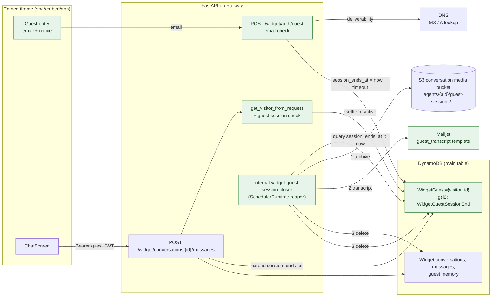
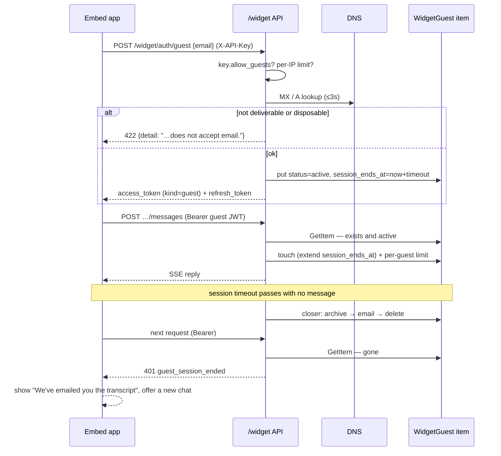

# Widget Guest Sessions

| Field | Value |
| --- | --- |
| Status | 🚧 In progress: implemented and tested; rollout steps 2–5 pending |
| Owner | InnomightLabs API / SPA |
| Last reviewed | 2026-10-07 |
| Scope | `api/src/widget/`, `api/src/apikeys/`, `api/src/embed/`, `api/src/email/`, `api/src/scheduler/runtime.py`, `api/src/memory/`, `api/src/skills/models.py`, `spa/embed/app/`, `spa/src/pages/dashboard/agent-detail/AgentApiKeysPage.tsx`, `terraform/conversation_media.tf` |
| Depends on | [Public API and Embeddable Widget](LLD-public-api-and-embeddable-widget.md), [MCP Sharing for Widget, A2A, and API Callers](LLD-mcp-sharing-for-widget-a2a-api.md), [User-Scoped Memory Blocks](../api/docs/LLD-memory-block-user-scoping.md), [Scheduler Architecture](../api/docs/LLD-scheduler-architecture.md), [Dream Framework](../api/docs/LLD-dream-framework.md) |

> **Summary:** An agent owner can turn on **guest access** for a widget key. Visitors to a site using that key can then
> chat without Google sign-in by giving a **valid email address**. The backend checks the address the moment it is
> entered: it must be well formed, its domain must accept mail, and it must not be a disposable-email domain. A guest
> conversation lasts one **session**, using the session timeout the agent already has. When the session ends, a
> background job does four things:
>
> - archives the chat to S3 under the agent's media path;
> - emails the guest a transcript in the InnomightLabs email style;
> - deletes everything the guest produced from DynamoDB, including their tokens;
> - leaves the next visit to start a new guest session.
>
> Visitors who want to come back to their history still sign in with Google.

## Implementation notes

Where the code differs from the design below, and why:

- **A turn lease.** Starting a guest message takes a 5-minute lease on the session (`turn_id`,
  `turn_expires_at`, renewed every 30 s while the reply streams), and the closer won't claim a session
  while one is held. This protects a turn from **End chat** or the 24-hour cap firing mid-reply.
  A message sent while another reply is still streaming gets **409 `guest_turn_in_progress`**, not 401.
- **Conversations are recorded on the session.** Creating a guest conversation adds its id to
  `conversation_ids` (a string set) on the session item, in the same transaction that checks the session
  is active. The closer reads that list instead of the `Visitor#` index. It is strongly consistent, so a
  conversation created a second before **End chat** isn't missed, and it never reads other visitors' rows.
- **Mail servers must be reachable.** Having an MX record isn't enough: parked domains often publish
  `MX 0 localhost.`. At least one MX host must be a public name that resolves to a global IP address,
  otherwise the address is refused with "We can't send email to that address. Please check it or use a different one.". A lookup timeout still fails
  closed with "try again".
- **The transcript uses the house email layout.** `assets/templates/emails/_layout.html` is the shared
  frame. `message.html` (contact emails) and `guest_transcript.html` both extend it, and the transcript
  has a plain-text part.
- **The bootstrap also sends `guest_session_timeout_minutes`**, so the entry notice shows the real
  session length (the agent's timeout, or the 60-minute default when it has none).
- **Limits** use the shared `api/src/rate_limits/limiter.py` (§8), all failing closed.

## Context and problem

Every widget conversation starts with Google sign-in today. The embed app branches on one thing, whether there is a
session: `session ? <ChatScreen/> : <LoginPanel/>` (`spa/embed/app/App.tsx:142-174`). The server only issues visitor
tokens after the Google callback confirms a verified email (`api/src/widget/router.py:278-319`).

For a site concierge such as Mira on innomightlabs.com, a Google sign-in gate turns away most people who just want to
ask a question.

The platform already has a **session** concept. Every agent has `session_timeout_minutes`, which defaults to 60, and 0
means no timeout (`api/src/agents/models.py:56`). When the gap since the last message exceeds it, the agent starts
from an empty context (`api/src/llm/conversation_strategy.py:99-108`). The Dream framework splits conversations into
sessions by the same rule (`api/src/dream/window.py:50-80`).

A guest conversation maps naturally onto one session: when the session ends, so does the guest's need for that data.

Letting strangers in raises problems the current code was not built for:

1. **Identity.** `WidgetVisitor` has a required email and a Google id (`api/src/widget/models.py:15-20`). The visitor
   JWT reads `payload["email"]` (`router.py:179-197`). That email is the `created_by` / `actor_email` of every message
   and tool call (`router.py:741-750`), and the analytics `user_identity` (`api/src/analytics/service.py:261`).
2. **Data lifetime.** Nothing widget-related expires. Conversations, messages and per-visitor memory have no `ttl`, and
   nothing indexes last activity. Refresh tokens are stored by hash, with no way back from a visitor to their tokens
   (`api/src/widget/sessions.py:93-155`).
3. **Cost and abuse.** No limit applies to widget messages: `RateLimitMiddleware` only acts when
   `request.state.user_email` is set, which widget routes never do (`api/src/rate_limits/middleware.py:26-28`). Every
   guest message spends the owner's LLM credentials, and every guest session now also sends an email.

## Goals and non-goals

**Goals**

- Per-key opt-in (`allow_guests`), off by default. Existing keys behave exactly as today.
- With guests on, the widget offers **"Continue as guest"**, which takes a required email, alongside **"Continue with
  Google"**. The guest option states plainly that the transcript is emailed when the conversation ends.
- The email is checked when it is entered, before any chat starts. It must be well formed, its domain must accept mail
  (MX records, or an A/AAAA fallback, and no null MX), and its domain must not be disposable.
- A guest session ends after the agent's `session_timeout_minutes` without a message. At that point the job archives
  the chat to S3 under the agent's media path, emails the transcript to the guest, and deletes the guest's
  conversations, messages, memory, media, session record and refresh token.
- After a session ends, the same visitor starts a new guest session, with no history carried over.
- Guests get no skills or shared MCP tools unless the owner later shares them with guests on purpose.
- Rate limits on guest starts per IP, messages per guest, guest messages per key per day, and transcripts per email
  address.

**Non-goals (v1)**

- **Proving the guest owns the address.** That was a product decision: the domain check stops dummy and mistyped
  addresses, and the widget tells guests where the transcript goes. Someone can still type another person's real
  address; see [Risks](#risks-and-trade-offs) for the mitigations.
- **Checking that the exact mailbox exists** with an SMTP `RCPT TO` probe, or a paid verification API. See
  [Alternatives](#alternatives-and-decisions).
- **Moving a guest's conversation to Google sign-in partway through a session.** Visitors who want history sign in
  with Google from the start. The guest's transcript email is their record.
- Guest support in the classic `widget.js` (`spa/widget/`). It has its own auth path; keys with guests on still require
  sign-in there.
- A dashboard view of guest archives, and Cloudflare Turnstile. Both are follow-ups.

## Design



*Green nodes are new. The closer always runs its steps in order: archive, then transcript, then delete.*

### 1. Opt-in on the widget key

`AgentApiKey` gains `allow_guests: bool = False` (`api/src/apikeys/models.py:74-163`). It is added to
`to_dynamo_item` and to `from_dynamo_item`, read with `item.get("allow_guests", False)` so existing rows stay off.
It is also added to `ApiKeyResponse`, `CreateApiKeyRequest` and `UpdateApiKeyRequest`, and applied in the PATCH handler
(`api/src/apikeys/router.py:163-204`).

The flag reaches the iframe through the server's trusted bootstrap, not through the host-controlled URL fragment, so a
host page cannot switch guests on:

```python
# api/src/embed/router.py
class EmbedBootstrap(BaseModel):
    public_key: str
    agent_id: str
    agent_name: str
    agent_description: str | None
    api_base_url: str
    allow_guests: bool  # new: from api_key.allow_guests
```

### 2. Checking the email at entry

```python
# api/src/widget/guest_email.py
from email_validator import EmailNotValidError, validate_email
from disposable_email_domains import blocklist as DISPOSABLE_DOMAINS


class GuestEmailRejected(ValueError):
    """The visitor-facing reason an address can't be used."""


def check_guest_email(raw: str) -> str:
    """Return the normalised address, or raise with a message the widget can show as-is."""
    try:
        result = validate_email(
            raw.strip(),
            check_deliverability=True,     # MX, A/AAAA fallback, null-MX rejected (RFC 7505)
            timeout=settings.widget_guest_email_dns_timeout_seconds,
        )
    except EmailNotValidError as e:
        raise GuestEmailRejected(str(e)) from e
    if result.domain.lower() in DISPOSABLE_DOMAINS:
        raise GuestEmailRejected("Please use your own email address, not a temporary one.")
    return result.normalized
```

- **Dependencies.** `email-validator` is already a dependency (`api/pyproject.toml:32`), and `dnspython` comes with it.
  `disposable-email-domains` is new: a maintained blocklist, imported as a set. These were checked against our
  installed version:

  | Input | Result |
  | --- | --- |
  | `asdf@asdf.asdf` | *"The domain name asdf.asdf does not exist."* |
  | `test@example.com` | *"The domain name example.com does not accept email."* (null MX) |
  | `someone@gmail.com` | accepted |
  | `a@mailinator.com` | passes DNS, so the blocklist is what stops it |

- **Blocking DNS.** The lookup is blocking, so the route calls it with `run_in_threadpool`, capped at 3 s
  (`widget_guest_email_dns_timeout_seconds`).
- **Timeouts fail closed.** A DNS timeout rejects the address with *"We couldn't check that address. Please try again."*,
  since the requirement is that a guest always has a deliverable address.
- **Normalised addresses.** `result.normalized` (lower-cased domain, Unicode-normalised) is what gets stored and emailed.
- **Ownership is not proven.** This check does not confirm that the visitor owns the inbox; that is a decision recorded
  in the non-goals.

### 3. Guest identity

```python
# api/src/widget/models.py
class WidgetVisitorKind(str, Enum):
    GOOGLE = "google"
    GUEST = "guest"


class WidgetVisitor(BaseModel):
    visitor_id: str
    email: str                   # Google: verified by Google. Guest: deliverable, owner not proven.
    name: Optional[str] = None
    picture: Optional[str] = None
    kind: WidgetVisitorKind = WidgetVisitorKind.GOOGLE

    @property
    def is_guest(self) -> bool:
        return self.kind == WidgetVisitorKind.GUEST
```

- **`email` stays required.** Every guest has one now, so `created_by`, `actor_email` and `visitor_email` keep working
  unchanged (`router.py:630, 741, 749`).
- **Guest ids** are `guest_{uuid4().hex}`, so they can't collide with a Google `sub`. They are never reused: a new
  session with the same email gets a new id, which also means fresh agent memory.
- **Telling guests apart.** `WidgetConversation` gains `visitor_kind`, so the owner's analytics and conversation views
  can label guest emails as unverified. Analytics counts unique users by `visitor_id` rather than `visitor_email`.
- **New actor kind.** `ActorKind.GUEST = "guest"` (`api/src/skills/models.py:13-21`). Guests run with it, so
  `AgentSkill.usable_by` and `AgentMCPConnection.usable_by` refuse them by default: `available_to` never contains
  `guest` until an owner adds it on purpose. In v1, `MCPSharingUpdateRequest` rejects `guest`. Native memory tools still
  work, scoped to the guest's id.

### 4. Guest session record

One item per guest session is the registry, the revocation check, and the session-end index:

| Attribute | Value |
| --- | --- |
| `pk` / `sk` | `WidgetGuest#{visitor_id}` / `WidgetGuest#Metadata` |
| `agent_id`, `key_id`, `email` | The owner's agent and key, and the guest's checked address |
| `status` | `active` · `closing` (claimed by the closer) |
| `created_at`, `last_active_at` | ISO-8601 UTC |
| `session_timeout_minutes` | The agent's timeout when the session started; 0 is replaced by `widget_guest_default_session_minutes` (60), because a guest session must end |
| `session_ends_at` | `last_active_at + session_timeout_minutes` |
| `origin` | The `Origin` of the page where the chat started, shown in the transcript email |
| `refresh_hash` | SHA-256 of the current refresh token, so closing can delete it |
| `transcript` | `pending` · `sent` · `failed` · `skipped`, plus `transcript_attempts` |
| `lease_expires_at` | Epoch seconds, set while `closing` |
| `ip_hash` | `sha256(ip)[:16]`, for abuse review |
| `gsi2_pk` / `gsi2_sk` | `WidgetGuestSessionEnd` / `{session_ends_at}#{visitor_id}`. A sparse index of open sessions, ordered by when they end |
| `ttl` | `created_at + widget_guest_max_lifetime_hours + 24h`, a safety net if the closer is down |

Storing `session_ends_at` rather than the last activity means one index query finds every ended session, even though
agents have different timeouts.

The timeout is captured at session start, so an owner changing it doesn't move sessions that are already open.

Activity is only ever a **sent message**. The touch runs before the agent is called, so a session can't be closed in
the middle of a turn:

```python
# api/src/widget/guests.py
def touch(self, session: GuestSession, now: datetime) -> None:
    """Record a guest message and push the session end out. Fails once the closer has claimed it."""
    ends = (now + timedelta(minutes=session.session_timeout_minutes)).isoformat()
    self.table.update_item(
        Key={"pk": f"WidgetGuest#{session.visitor_id}", "sk": "WidgetGuest#Metadata"},
        UpdateExpression="SET last_active_at = :now, session_ends_at = :ends, gsi2_sk = :sk",
        ConditionExpression="attribute_exists(pk) AND #status = :active",
        ExpressionAttributeNames={"#status": "status"},
        ExpressionAttributeValues={
            ":now": now.isoformat(), ":ends": ends,
            ":sk": f"{ends}#{session.visitor_id}", ":active": "active",
        },
    )
```

### 5. Tokens and the guest endpoint



*The guest JWT alone is never enough. Every guest request also checks the session item, which is what makes the end of
a session final.*

- **`POST /widget/auth/guest {email}`** (needs `X-API-Key`):
  - Returns 404 `guests_disabled` unless `api_key.allow_guests`.
  - Applies the per-IP start limit (§8), then runs `check_guest_email`. A rejection is a 422 whose `detail` is the
    visitor-facing reason.
  - On success it creates the session item and returns the existing `WidgetTokenResponse`, with
    `visitor = {visitor_id, email, kind: "guest"}`.
- **Access token.** The same signing and audience as today (`create_visitor_token`, `router.py:148-161`), plus
  `"kind": "guest"`, with a 1-hour expiry.
- **Guest check.** For `kind == "guest"`, `get_visitor_from_request` does one `GetItem` on `WidgetGuest#{sub}`, which
  must be `active` and belong to `api_key.agent_id`. Otherwise it returns 401 with `detail = "guest_session_ended"`.
  Google-visitor tokens are unchanged.
- **Refresh tokens.**
  - Guest refresh tokens are the existing `WidgetRefresh` items (`sessions.py:93-155`), with `visitor.kind = guest`.
  - Each rotation writes the new hash to the session's `refresh_hash`.
  - Rotation is refused when the session isn't `active`, or is older than `widget_guest_max_lifetime_hours` (24). Past
    that cap the closer ends the session regardless of activity, so one anonymous identity can't live forever.
- **Ending a chat.** "End chat" in the widget calls `POST /widget/auth/guest/end`. It sets `session_ends_at = now`, so
  the next sweep closes the session and emails the transcript within one interval, instead of waiting out the timeout.

### 6. Closing a session: archive, email, delete

A new internal reaper beside the existing four (`api/src/scheduler/runtime.py:57-62`). It runs where the FastAPI
lifespan runs, which is Railway in production: Mangum starts with `lifespan="off"` (`api/main.py:216`). That matches
the other reapers.

```python
# api/src/scheduler/runtime.py
(
    self._close_ended_guest_sessions,
    settings.widget_guest_sweep_interval_seconds,   # default 120
    "internal:widget-guest-session-closer",
),
```



```mermaid
stateDiagram-v2
    [*] --> active: POST /widget/auth/guest (email checked)
    active --> active: message (extend session_ends_at)
    active --> closing: closer claim<br/>(session_ends_at ≤ now)
    closing --> active: lease expired<br/>(crash; next sweep retries)
    closing --> closing: transcript send failed<br/>(retry next sweep, ≤3)
    closing --> [*]: archived, emailed (or failed ×3), deleted
```

*`closing` is a lease, not a terminal state. If a replica dies mid-close the lease lapses and the next sweep picks it
up. Every step is idempotent.*

**Find.** Query `gsi2` for `gsi2_pk = "WidgetGuestSessionEnd"` with `gsi2_sk < "{now}"`, oldest first, paginated at
`widget_guest_sweep_batch` (100) per run. Sessions past the 24-hour cap are closed too: the touch never extends
`session_ends_at` beyond `created_at + 24h`.

**Claim.** Several Railway replicas are made safe by the conditional-lease pattern from Dream runs
(`api/src/dream/repository.py:51-95`):

```python
ConditionExpression=(
    "session_ends_at <= :now AND "
    "(#status = :active OR (#status = :closing AND lease_expires_at < :now))"
)
# SET #status = :closing, lease_expires_at = :now + 600
```

**Collect** everything the guest produced:

| Data | Where | How it's found |
| --- | --- | --- |
| Conversations | `Agent#{aid}#Widget` / `Conversation#{cid}` | `gsi2_pk = Visitor#{visitor_id}` (existing, `api/src/widget/models.py:44-106`) |
| Messages + tool-call audit rows | `CONVERSATION#{cid}` / `MESSAGE#…`, `AUDIT#…` | Query per conversation (`api/src/messages/repositories/dynamodb.py`) |
| Any other rows in that partition (e.g. `TURN#`) | `CONVERSATION#{cid}` | Same query; the delete clears the whole partition |
| Memory | `Agent#{aid}#User#{visitor_id}` / `MemoryBlockDef#`, `CoreMemory#`, `CapacityWarning#`, `Archival#` | Query the partition |
| Archival hash rows | `Agent#{aid}#User#{vid}#Hash#{sha}` / `Archival#{mid}` | From each `Archival#` row's `content_hash` |
| Generated images | S3 `agents/{aid}/conversations/{cid}/…` | List the prefix (`api/src/agents/image_generation/storage.py:76-77`) |
| Refresh token | `WidgetRefresh#{refresh_hash}` | `refresh_hash` on the session |

A session with no user messages (the guest entered an email and left) is deleted without an archive or email.

**Step 1: archive.** One gzip JSON document per session goes to the existing conversation-media bucket, under the
agent's media path. Lambda's IAM already covers `agents/*` (`terraform/conversation_media.tf`):

```
agents/{agent_id}/guest-sessions/{YYYY}/{MM}/{DD}/{visitor_id}.json.gz
agents/{agent_id}/guest-sessions/{YYYY}/{MM}/{DD}/{visitor_id}/media/…        (copied images)
```

```json
{
  "schema_version": 1,
  "archived_at": "2026-10-07T13:05:00Z",
  "end_reason": "timeout",
  "agent_id": "…",
  "key_id": "…",
  "guest": {
    "visitor_id": "guest_…", "email": "…", "email_check": "deliverable",
    "origin": "https://innomightlabs.com", "created_at": "…", "last_active_at": "…",
    "session_timeout_minutes": 60
  },
  "conversations": [
    { "conversation": { "conversation_id": "…", "title": "…", "created_at": "…", "message_count": 4 },
      "messages": [ { "message_id": "…", "role": "user", "kind": "…", "content": "…", "created_at": "…",
                      "images": ["guest-sessions/…/media/…"] } ] }
  ],
  "memory": [ { "sk": "CoreMemory#…", "content": "…" } ],
  "transcript": { "status": "sent", "sent_at": "…", "attempts": 1 }
}
```

- `end_reason` is `timeout`, `ended_by_guest` or `max_lifetime`.
- The object is tagged `retention=guest-session`. A new tag-filtered lifecycle rule in `terraform/conversation_media.tf`
  expires it after `var.guest_archive_retention_days` (default 90).
- The closer confirms the archive with `head_object` before going further.
- The `transcript` field is rewritten after step 2, so the archive records what was sent.

**Step 2: transcript email.** See §7. A failed send is retried on later sweeps, up to `widget_guest_transcript_attempts`
(3). Meanwhile the session stays `closing` and its data stays in place, so a retry can rebuild the email. After the last
failed attempt the session is closed anyway with `transcript = failed`, and the failure is logged with the archive key.

**Step 3: delete**, in an order where each step is safe to repeat:

1. Images under each conversation's media prefix.
2. Every row in each `CONVERSATION#{cid}` partition.
3. Archival hash rows, then the memory partition.
4. The `WidgetConversation` rows.
5. The refresh token.
6. The session item, last. Once it is gone the guest's JWT is useless (§5).

**Left in place, on purpose.** These belong to the owner, not to the guest's conversation:

- `MCPCall` audit events: an owner security log with a 90-day TTL.
- Aggregate token usage and MCP daily counters, which have no visitor dimension.
- Lead submissions, artifacts and tool jobs, which are owner-scoped. Tool jobs carry a 7-day TTL.

Guests can't use skills in v1, so in practice only the audit and usage records can exist.

### 7. Transcript email

A new template, `api/assets/templates/emails/guest_transcript.html`, uses the same frame as the existing templates: the
`#24324a` "InnomightLabs" header, a white content card, and the grey footer (`agent_response.html`). A new
`EmailTemplate.GUEST_TRANSCRIPT` and `EmailService.send_guest_transcript_email(...)` follow the existing pattern
(`api/src/email/service.py:14-134`).

| Part | Content |
| --- | --- |
| Subject | `Your conversation with {agent_name}` |
| Intro | "Here's a copy of your chat with **{agent_name}** on {origin host}, {date}." |
| Body | One block per conversation: the title, then each user and assistant message with a role label ("You" / agent name) and time. Tool-call audit rows and hidden system rows are left out. |
| Images | Listed as "(image)" rather than linked, because the archive is private |
| Closing | "This chat has ended. To continue, open the chat on {origin host} again." |
| Footer | "You received this because this address was entered to start a guest chat on {origin host}. If that wasn't you, you can ignore this email." |

- **Rendering.** The template engine is plain `{{placeholder}}` replacement (`_replace_variables`, `service.py:47-52`),
  so the transcript HTML is built in Python.
- **Escaping.** Every message is HTML-escaped before markdown is applied. Assistant markdown goes through a small
  allowlist renderer (paragraphs, line breaks, lists, bold, italic, inline code, links); user text gets escaping and
  line breaks only.
- **Size cap.** Very long sessions are truncated at `widget_guest_transcript_max_chars` (100,000), with a line saying
  the rest is in the owner's archive.
- **Sender.** `noreply@innomightlabs.com` with the sender name `{agent_name} via InnomightLabs`, so the guest recognises
  who it's from.

### 8. Limits

All limits are settings with the defaults below, enforced with the shared limiter in `api/src/rate_limits/limiter.py`
(✅ implemented). Each limit is a `RateLimitPolicy`, and its algorithm is a strategy chosen from
`RATE_LIMIT_STRATEGIES`: cooldown, fixed window or sliding window. The guest limits use the **sliding window**, so a
guest can't double their allowance by bursting across a window edge. `acquire` is atomic, and expiry never depends on
DynamoDB TTL deleting items on time.

| Limit | Default | Counter | Response |
| --- | --- | --- | --- |
| Guest starts per IP | 5 / 10 min, sliding | `RateLimitPolicy.sliding_window("GUEST_START_IP", …)` | 429 `guest_start_limited` |
| Guest starts per email | 5 / day, sliding | `RateLimitPolicy.sliding_window("GUEST_START_EMAIL", …)` | 429 `guest_start_limited` |
| Messages per guest | 30 / hour, sliding | `RateLimitPolicy.sliding_window("GUEST_MESSAGES", …)` | 429 `guest_message_limited` |
| Guest messages per key | 500 / day, fixed (calendar day) | `RateLimitPolicy.fixed_window("GUEST_KEY_DAILY", …)` | 429 `guest_daily_limited` |
| Message length for guests | 2,000 chars | — | 422 |

The per-email limit caps how many transcripts one address can receive in a day. It is the main defence against someone
typing another person's address repeatedly (see [Risks](#risks-and-trade-offs)).

The embed app turns each 429 into a friendly message that points to **Continue with Google**, since signed-in visitors
aren't subject to guest limits.

### 9. Embed app

**Types** (`spa/embed/app/bootstrap.ts`, `session.ts`, `api.ts`): `Bootstrap.allow_guests: boolean`, and
`Visitor.kind: "google" | "guest"`.

**Entry screen.** `LoginPanel` gains a guest mode when `allow_guests` is true:

- An email field with a **Continue as guest** button.
- Under it, the notice: *"We'll email you a transcript of this chat when it ends. Your chat is deleted from this site
  after {timeout} without messages."*
- A divider, then the existing **Continue with Google** button, captioned *"Sign in to keep your chats and pick up where
  you left off."*
- The address is checked as it is submitted. The server's 422 `detail` shows under the field as-is, so the visitor sees
  the exact reason, for example "The domain name asdf.asdf does not exist."

**Checking the address.** The lookup usually takes tens of milliseconds and at most 3 s (§2). The animation's job is to
never flicker on a fast check and to reassure on a slow one. It reuses the embed's existing motion (`ie-spinner`,
`ie-typing`, `ie-rise` in `spa/embed/app/styles.css`) instead of adding a new one:

| Time since submit | What the visitor sees |
| --- | --- |
| 0 ms | The field and button lock at once, so no double submit. The button label stays "Continue as guest", with no spinner yet, so a fast check doesn't flash. |
| 250 ms, still waiting | The button swaps to `ie-spinner` + "Checking your email…", and the field gets a soft shimmer along its bottom edge. |
| 1.5 s, still waiting | A hint rises in under the field (`ie-rise`): "Still checking — some mail servers take a moment." |
| Accepted | The spinner becomes a ✓ for 400 ms, then the entry panel fades into `ChatScreen`, where the agent's greeting appears with the existing typing dots (`ie-typing`). |
| Rejected | The button returns to normal, the field shakes once (a 200 ms horizontal nudge), and the reason rises in below it. Focus returns to the field with the text selected, so the visitor can retype. |
| Server timeout (fail closed) | The same as rejected, with "We couldn't check that address. Please try again." and a **Try again** link. |

- **Accessibility.** The status line is an `aria-live="polite"` region, so screen readers hear "Checking your email…"
  and the outcome. The button keeps `aria-busy="true"` while waiting.
- **Reduced motion.** The existing reduced-motion rule (`styles.css:783-786`) turns off the shimmer, shake and fades;
  the text changes still happen.
- **Implementation.** All of this is driven by one small state hook, `useDelayedPhase(pending)`. It returns
  `idle → pending → slow → very-slow` from timers that are cleared when the request settles. It is a pure,
  timer-injectable helper, so it can be unit-tested like `session.test.ts`.

**State machine** (`spa/embed/app/App.tsx`):

| State | Shown | Exits |
| --- | --- | --- |
| No session, `allow_guests` false | `LoginPanel` (today) | Google sign-in |
| No session, `allow_guests` true | `LoginPanel` with guest mode | Guest start · Google sign-in |
| Guest session | `ChatScreen` plus a footer line, *"Guest chat · transcript goes to {email}"*, and an **End chat** action | `guest_session_ended` · End chat · a limit |
| Session ended | A card: *"This chat has ended. We've emailed the transcript to {email}."* with a **Start a new chat** button | New guest start (email prefilled) · Google sign-in |
| Google session | `ChatScreen` (today) | Sign-out |

- **Session ended.** A `SignedOutError` for a guest no longer drops straight to `LoginPanel`. It shows the
  *Session ended* card and clears the guest session and its conversation map from storage.
- **Remembered email.** The guest's email is kept in iframe storage (`innomight-embed:{key}:guest-email`) only to
  prefill the next start. The session itself is never resumed.

### 10. Dashboard

On `AgentApiKeysPage.tsx`:

- An **"Allow guest visitors"** checkbox in the create dialog, after Allowed Origins.
- A per-key toggle row next to the A2A secret row. It calls the existing, unused `apiKeyService.updateApiKey` and patches
  local state, the same way `handleIssueA2ASecret` does.

The help text: *"Visitors can chat without signing in by giving their email. When their session ends (this agent's
session timeout), the chat is archived, a transcript is emailed to them, and it's removed from the site. Guests can't
use this agent's skills or shared tools."*

## Data model and contracts

| Contract | Change |
| --- | --- |
| `AgentApiKey` / `ApiKeyResponse` / `Create`/`UpdateApiKeyRequest` | `+ allow_guests: bool` (default `false`) |
| `EmbedBootstrap` | `+ allow_guests: bool` |
| `WidgetVisitor` | `+ kind` (`google` default, `guest`) |
| `WidgetConversation` | `+ visitor_kind` |
| `WidgetTokenResponse.visitor` | `+ kind` |
| `ActorKind` | `+ GUEST = "guest"` |
| `POST /widget/auth/guest {email}` | New: → `WidgetTokenResponse` · 404 `guests_disabled` · 422 email reason · 429 `guest_start_limited` |
| `POST /widget/auth/guest/end` | New: Bearer guest → 204; ends the session now |
| Guest 401 | `detail = "guest_session_ended"` |
| New item | `WidgetGuest#{visitor_id}` / `WidgetGuest#Metadata` (§4) |
| Rate limit items | `RATE_LIMIT#{scope}#{subject hash}` / `WINDOW#{start}`, written by `api/src/rate_limits/limiter.py` |
| S3 | `agents/{aid}/guest-sessions/{date}/{visitor_id}.json.gz`, tag `retention=guest-session` |
| Email | `EmailTemplate.GUEST_TRANSCRIPT`, `guest_transcript.html` |

**Settings** (`api/src/config/settings.py`):

- `widget_guest_default_session_minutes=60`
- `widget_guest_max_lifetime_hours=24`
- `widget_guest_sweep_interval_seconds=120`
- `widget_guest_sweep_batch=100`
- `widget_guest_email_dns_timeout_seconds=3`
- `widget_guest_transcript_attempts=3`
- `widget_guest_transcript_max_chars=100000`
- `widget_guest_start_limit=5`
- `widget_guest_start_window_seconds=600`
- `widget_guest_email_daily_limit=5`
- `widget_guest_message_limit=30`
- `widget_guest_message_window_seconds=3600`
- `widget_guest_daily_message_limit=500`
- `widget_guest_max_message_chars=2000`

## Implementation map

| Area | Code | Responsibility |
| --- | --- | --- |
| Key flag | `api/src/apikeys/models.py`, `api/src/apikeys/router.py` | Store, return and PATCH `allow_guests` |
| Bootstrap | `api/src/embed/router.py` | Pass `allow_guests` to the iframe |
| Email check | `api/src/widget/guest_email.py` (new) | Syntax, DNS deliverability, disposable domains |
| Identity | `api/src/widget/models.py`, `api/src/skills/models.py` | `WidgetVisitor.kind`, `visitor_kind`, `ActorKind.GUEST` |
| Guest sessions | `api/src/widget/guests.py` (new) | Create, check, touch, end, claim, release |
| Routes | `api/src/widget/router.py` | `/auth/guest`, `/auth/guest/end`, guest checks in `get_visitor_from_request`, touch before the turn |
| Refresh | `api/src/widget/sessions.py` | Guest rotation rules, `refresh_hash` write-back |
| Closing | `api/src/widget/guest_closer.py` (new) | Collect, archive to S3, transcript, delete cascade |
| Transcript | `api/src/email/service.py`, `api/src/widget/transcript.py` (new), `api/assets/templates/emails/guest_transcript.html` (new) | Render and send the transcript |
| Memory delete | `api/src/memory/repository.py` | `delete_all_for_user(agent_id, user_id)`, including hash rows |
| Sweeper | `api/src/scheduler/runtime.py` | `internal:widget-guest-session-closer` reaper |
| Limits | `api/src/rate_limits/limiter.py` (✅ done), plus four guest policies in `api/src/widget/guests.py` | Shared limiter; guest policies |
| Analytics | `api/src/analytics/service.py` | Unique users by `visitor_id`; mark guests |
| Dependencies | `api/pyproject.toml` | `+ disposable-email-domains` |
| Infra | `terraform/conversation_media.tf` | Tag-filtered lifecycle rule, `guest_archive_retention_days` |
| Local DB | `api/scripts/init_local_dynamodb.py` | Enable TTL on `ttl`, so local matches prod |
| Embed | `spa/embed/app/App.tsx`, `session.ts`, `api.ts`, `bootstrap.ts`, `components/LoginPanel.tsx` | Guest entry with email, ended card, End chat |
| Dashboard | `spa/src/pages/dashboard/agent-detail/AgentApiKeysPage.tsx`, `spa/src/services/apikeys/ApiKeyService.ts` | Toggle on create and per key |
| Docs | `spa/src/pages/docs/QuickStart.tsx`, `FAQ.tsx`, `spa/src/pages/legal/Privacy.tsx` | Guest behaviour, transcript email, retention |

## Rollout and compatibility

1. **Backend, with the flag off everywhere.** Ship the email check, identity changes, guest routes, the closer, the
   transcript email and the limits. With `allow_guests` false nothing reachable changes; the guest routes return 404.
2. **Infra.**
   - The lifecycle rule and `guest_archive_retention_days`.
   - Confirm the Railway IAM user can `PutObject` / `PutObjectTagging` / `GetObject` / `DeleteObject` under
     `agents/*/guest-sessions/*`. That user's permissions are managed outside Terraform.
   - Confirm DNS lookups work from the Railway container.
3. **Embed app and dashboard toggle.** Older embed builds ignore `allow_guests` and keep showing Google sign-in, which
   is safe because the CDN serves the new build on the next load.
4. **Privacy policy.** It must cover guest emails, transcript emails, deletion at session end and archive retention
   before the toggle is offered to customers.
5. **Turn it on for Mira's key first.** Watch the closer logs, archive objects and Mailjet bounce and complaint rates for
   a week, then announce it in What's New and the docs.

Every change is backward compatible. Existing rows get `allow_guests` false, and Google visitors gain only an optional
`kind`.

## Validation

**Backend** (pytest; moto `mock_aws` for DynamoDB and S3; DNS stubbed by patching the resolver used by
`email_validator`):

- Email check: rejects a malformed address, a missing domain, a null-MX domain and a disposable domain, each with its
  reason. A DNS timeout fails closed. A good address comes back normalised.
- Guest endpoint: 404 with guests off; tokens and session item with guests on; 429 after the per-IP and per-email
  limits.
- Session timing:
  - `session_ends_at` follows the agent's timeout; a timeout of 0 uses the 60-minute default.
  - A touch extends it, but never past the 24-hour cap.
  - Touching a `closing` session fails, and the message gets 401.
- Closer:
  - An ended session gets its archive written, its transcript sent with the expected HTML (escaped content, no audit
    rows), and every item in §6's table deleted.
  - Open sessions are untouched.
  - Two concurrent closers process a session once.
  - A crash after the archive is finished by the next sweep.
  - A failed send is retried, and closes with `transcript = failed` after 3 attempts.
  - A session with no user messages is deleted without an email.
- End chat closes on the next sweep.
- Regressions: Google sign-in, refresh and conversations unchanged; existing keys default to `allow_guests=false`.

**Embed** (vitest, pure helpers as in `spa/embed/app/session.test.ts`): guest session storage, the next-state helper for
`guest_session_ended`, 422 and 429, email prefill after a session ends, and `useDelayedPhase` (no spinner before 250 ms, the slow hint at 1.5 s, timers cleared when the request settles).

**End to end:** with Mira's key in a browser:

1. Try `asdf@asdf.asdf`, then `test@example.com`, and see each rejected with its reason.
2. Start with a real inbox, chat, then use End chat.
3. Receive the transcript, see the archive object in S3, and see the guest's items gone from DynamoDB.

## Alternatives and decisions

- **Mailbox probing with SMTP `RCPT TO`.** Rejected:
  - Major providers (Gmail, Outlook) and catch-all domains accept every recipient at that stage, so the result isn't
    reliable.
  - Cloud hosts commonly block outbound port 25; this is unconfirmed for Railway.
  - Probing looks like address harvesting to mail providers and risks our IP being blocklisted.
- **A paid verification API** (ZeroBounce, Kickbox). Better mailbox detection, at roughly a cent per check, but still no
  proof of ownership and a new vendor. Kept as a follow-up if bounce rates are high.
- **An emailed code before the transcript is sent.** The only check that proves ownership. Declined for v1 to keep the
  guest flow frictionless; the limits and the notice cover the gap.
- **Ending sessions with DynamoDB TTL plus a stream consumer.** Rejected:
  - TTL deletes can run up to 48 h late.
  - There'd be no chance to send the transcript first.
  - A new stream Lambda would be needed.

  TTL stays only as a safety net (§4).
- **Indexing last activity instead of the session end.** Agents have different timeouts, so a single cutoff wouldn't
  work. Indexing `session_ends_at` makes one range query correct for all of them.
- **A single `WidgetGuestSessionEnd` index partition.** At guest volumes this is far below one GSI partition's write
  capacity, roughly one write per message. If it ever runs hot, shard it as `WidgetGuestSessionEnd#{n}`.
- **Moving guest chats to Google sign-in mid-session.** Dropped with the session model: a session is self-contained,
  the transcript is the guest's record, and visitors who want history sign in with Google from the start.

## Risks and trade-offs

- **Sending to an address the guest doesn't own.** Someone can type a real stranger's address, and that person receives
  a transcript. The mitigations:
  - At most 5 starts per address per day.
  - The transcript is only sent when the guest wrote at least one message.
  - The email's footer explains why it arrived and that it can be ignored.
  - The sender name is the agent's.

  If complaints appear in Mailjet, switch on the code step from [Alternatives](#alternatives-and-decisions).
- **Deliverability.** Bounces and spam complaints affect all InnomightLabs mail. Watch Mailjet's metrics during rollout.
  A follow-up can consume Mailjet bounce events into a suppression list that the email check consults.
- **LLM spend and abuse.** The §8 limits cap the damage per IP, per address, per guest and per key per day. Cloudflare
  Turnstile on `POST /widget/auth/guest` is the next step if needed.
- **No closer outside Railway.** Lambda deployments don't run the lifespan. The TTL safety net still removes guest data
  within about 2 days, but without an archive or transcript. An EventBridge-triggered handler calling the same close
  function would fix that if it's ever needed.
- **DNS adds up to 3 s at guest start**, and fails closed when DNS is unhealthy, so guests can't start until it
  recovers. Google sign-in is unaffected.
- **Session end can lag by one sweep interval** (2 min). The guarantee is "closed and emailed shortly after the timeout",
  not at the exact second.
- **Privacy.** Guest messages and emails are stored for the length of the session, then kept in the S3 archive for the
  retention period, and a copy is emailed. The privacy policy and the entry notice must say so.

## Related documentation

- [Public API and Embeddable Widget](LLD-public-api-and-embeddable-widget.md)
- [MCP Sharing for Widget, A2A, and API Callers](LLD-mcp-sharing-for-widget-a2a-api.md)
- [Security hardening and conversation context](LLD-security-hardening-and-conversation-context.md)
- [User-Scoped Memory Blocks](../api/docs/LLD-memory-block-user-scoping.md)
- [Scheduler Architecture](../api/docs/LLD-scheduler-architecture.md)
- [Dream Framework](../api/docs/LLD-dream-framework.md)
