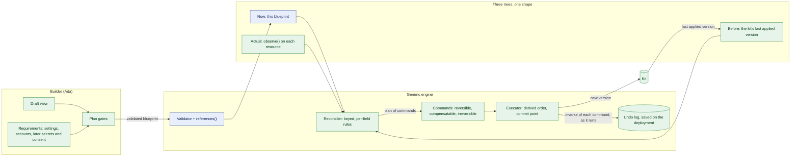

# Refactor: Blueprints and the Builder

| Field | Value |
| --- | --- |
| Status | 🚧 In progress: phases 1 to 5 done; phase 6 (Kits) next |
| Owner | InnomightLabs API |
| Last reviewed | 2026-10-09 |
| Scope | `api/src/blueprints/`, and the parts of `api/src/builder/` that call into it |
| Depends on | [Solution Blueprints](LLD-solution-blueprints.md), [Ada capabilities](LLD-ada-capabilities.md) |
| Tracker | Prepares KAN-68 (Kits) |

> **Summary:** The blueprint pipeline (validate, plan, apply) is sound, and its best parts are already
> generated from one source: the schema, the book and skill variants all come from the spec and the manifests.
> What doesn't scale is everything to do with **links and removals**. Each connection an agent can have (knowledge
> bases, MCP tools, skills, agents named in skill settings) is written out by hand in about a dozen places. Taking
> things away is a second, mirror-image set of fields and loops. Every kind compares fields with its own `if`
> chain, and the executor branches on the action at every step.
>
> This document proposes replacing the hand-written comparisons with **one generic three-way reconciler**. It
> works over a keyed tree, with field rules declared on the spec, and it compares what the blueprint says now,
> what the kit last applied and what the account actually holds. Its output is a list of **commands**. Each
> command declares whether it can be undone, and records its own undo in a log saved on the deployment. Together
> these make **Kits** (KAN-68) nearly free: rolling back is "apply an earlier version", and removing a kit is
> "apply nothing".

## Implementation notes

**Phase 1 (tidy), 2026-10-09:**

- **Single registry.** `Blueprint` and its `Resource` union moved to `blueprints/document.py` and are read from
  `RESOURCE_KINDS`, so `spec.py` no longer lists the kinds. `kinds.KIND_NAMES` replaces the validator's own list.
- **Base classes.** `ResourceKind` is the shared base, with `ManagedKind` and `LookupKind` under it.
  - `McpConnection` is a `LookupKind`. `LookupKind.validate` rejects `remove` for every lookup kind.
  - The executor and planner use `managed_kind_for`, which refuses a lookup kind.
  - The planner still plans a missing lookup resource as a create with a blocker. Turning that into a person
    requirement is phase 5.
- **Presentation on the kind:** `title`, `card_details`, `feeds` and `dashboard_path`.
  - `feeds` stands in for `WIRE_LABELS` until phase 2 moves wire labels onto references.
  - `planner._title` still falls back to the existing record's name. Phase 2's `observe()` replaces it.
- **Param types:** `blueprints/params.py`. `ParamSpec.type` is read from `PARAM_TYPES`.
- **`deploy_blueprint` is a function, not a `BlueprintService` class.** Its outcomes are types (`Invalid`, `Blocked`,
  `RateLimited`, `Deployed`) that callers `match` on.
- **Behaviour:** unchanged, apart from wording. The "can't delete" message is now the generic "A blueprint can't
  delete this MCP connection; it belongs to the whole account." The kinds' order in the "Unknown kind" message
  follows `RESOURCE_KINDS`.
- **Tests:** `test_blueprints_kinds.py` and `test_blueprints_params.py`, plus `test_deploying_says_why_it_didnt` in
  `test_blueprints_apply.py`.

**Phase 2 (references and observe), 2026-10-09:**

- **One reference walk** (`blueprints/references.py`). `ResourceKind.references(name, spec)` returns the fields
  marked `x-ref-kind`, and `AgentKind` adds `skill_references`.
  - A skill's agent settings are found the same way as any reference field. The manifest's option source maps to a
    kind (`REFERENCE_OPTION_SOURCES = {"agents": "Agent"}`), and the variant's config field carries
    `x-ref-kind`, so the published schema shows it too.
  - Each `Reference` carries `path`, `target`, `kind`, `where` (how the place reads in a sentence), `removes`,
    `may_be_id` (an account id is fine) and `outward_wire`.
  - `validator.check_references` checks every reference the same way (missing, the resource itself, wrong kind,
    removed) and orders the resources. The drawing's wires come from the same list.
  - These are gone: `skills_schema.agent_settings`, the `isinstance(AgentSpec)` branch, and the second wire
    source in `canvas._wires`.
  - The messages are now shared: "'knowledge' is a KnowledgeBase, not an Agent.", "This skill can't name the
    agent itself.", "'x' is being removed, so `knowledge_bases` can't use it."
- **`observe(record, names)` per kind.** It writes what a kind stores back as its spec, with its id; `names` gives
  the blueprint name of each linked resource by id.
  - `export_agent` is now only orchestration: it finds the records (`AgentKind.linked`,
    `WidgetKeyKind.for_agent`), names them from each kind's `export_name`, and calls `observe`.
  - The per-field mapping lives in one place per kind.
- **Not done yet, on purpose:**
  - **`DIFF` field rules aren't declared yet.** Nothing reads them until the reconciler (phase 4), so declaring them
    now would be unused metadata. They arrive with it.
  - **`skill_config` and `pending_agents` stay.** They resolve names to ids from `variant.agent_fields`, which is
    now derived from `reference_fields`.
  - **`planner._title`, and the agent's `find_existing`, still read records directly.** Phase 4 builds "actual"
    from `observe`.
- **Tests:** `test_blueprints_references.py`.

**Phase 3 (commands), 2026-10-09:**

- **Commands are in `blueprints/commands.py`.**
  - `Command` declares a `reversibility` (`REVERSIBLE`, `COMPENSATABLE` or `IRREVERSIBLE`), and whether it
    `establishes`, `creates` or `deletes` its resource.
  - `prepare(ctx)` reads what its undo needs, with no side effects. `run(ctx)` does the work.
  - An `Undo` is a registered action name plus arguments (`@undo_action`), so it can be saved and replayed after a
    restart.
- **Each kind emits its commands.** `ResourceKind.commands(name, spec, existing, ctx)` replaces `apply`,
  `update`, `kept`, `start`, `differences`, `removals` and `remove_parts`, and `ManagedKind.delete_commands`
  replaces `delete`.
  - Each command carries what it `says` and any `removal`, and the planner builds the plan's wording from them. So
    the wording and the work can't disagree.
  - Exactly one command establishes each resource: `Create…`, `Save…` or `Use`.
  - `rollback`, `restore`, `AppliedResource.cleanup`, `previous`, `needs_start` and the agent's nested
    try/rollback are gone.
- **The order is derived.** `command_order` runs one topological sort with three rules: create before use, detach
  and delete dependents before a delete, and irreversible after `COMMIT`. Of the commands ready to run, the one
  given first goes first.
  - The plan holds the ordered list in `plan.commands`.
  - A cycle becomes a plan blocker.
- **Write-ahead undo log.**
  - Each command's `JournalEntry` (with its undo) is saved on the deployment before the command runs, and marked
    done after.
  - Creates choose their id in `prepare`. `AgentService.create` takes `agent_id`, and knowledge bases and widget
    keys are built with theirs. So the undo of a create that stopped part-way knows what to delete.
  - Every undo copes with the command not having happened.
- **Recovery.**
  - While a deployment is `applying`, it's in gsi2 (`BlueprintApplying`, `updated_at`).
  - `executor.recover_interrupted`, run by a new scheduler reaper (`BLUEPRINT_APPLY_REAPER_ID`), finds applies
    not saved for `BLUEPRINT_APPLY_STALE_TIMEOUT_SECONDS` (900).
    - Before the commit point, it unwinds the log.
    - After it, it marks the apply `failed_partial` and says to apply again.
  - The reaper runs every `BLUEPRINT_APPLY_REAPER_INTERVAL_SECONDS` (300). Both settings are in `settings.py` and
    the Railway deploy script.
- **The before-state is read when the command runs.**
  - A `Save…` writes only the fields that differ, read fresh.
  - Its undo puts back only those fields, as they were just before the write.
  - A change the person makes between plan and apply survives an unwind.
  - The design said the plan's snapshot would also detect "changed since the plan" and fail. That isn't done:
    writing only the differing fields makes it unnecessary for now.
- **Behaviour changes:**
  - **Disconnecting a knowledge base and taking MCP tools away can be undone,** so they now run before the commit
    point. A failure there puts back the whole apply (`failed`). Before, it left the rest applied
    (`failed_partial`).
  - **Uninstalling a skill and deleting a resource still run last** (irreversible).
  - **Reading a site now runs after the commit point.** A failure to start a crawl no longer rolls back the build;
    it's `failed_partial`. This removes the orphaned-crawl risk the blueprints LLD noted for blueprints with
    several knowledge bases.
  - **An agent record is saved only when its fields differ.** Before, it was saved on every update.
- **Tests:**
  - New: `test_blueprints_commands.py`, covering order, the commit point, journalling, recovery before and after
    commit, the run-time before-state, and reaper registration.
  - Changed: the tests that patched kind methods now patch commands (`CreateWidgetKey.run`, `SaveWidgetKey.run`,
    `UNDO_ACTIONS`). The failed-removal test is now two tests: a failed disconnect puts everything back, and a
    failed delete keeps the rest.

**Phase 4 (reconciler, two-way), 2026-10-09:**

- **Field rules live in `blueprints/diff.py`:** `Scalar` (`record`, `says`, `omit_none`, `normalise`, `unordered`,
  `group`) and `Each` (`adds`, `changes`, `removes`, `removals_from`).
  - They ride in each spec field's type metadata (`Annotated[str, Scalar(...)]`), not in `json_schema_extra`. So
    the published schema is unchanged, and rules can hold functions (`normalise=str.strip`, `says=_switch`).
  - `origin_of` and `origins_of` moved to `spec.py` so the widget's rule can use them.
  - `description` is redeclared on the knowledge base and the agent, which store it, with the shared `DESCRIPTION`
    text.
- **The reconciler is `blueprints/reconcile.py`.** `reconcile(now, actual, before=None, ctx)` returns an
  `Outcome`: `sets`, `added`, `changed`, `removed` and `drift`.
  - The full three-way rule is implemented and tested, including drift and taking away an item left out. Until
    Kits, the planner passes `before=None`, so actual stands in for it and every difference is work.
  - Taking things away still comes only from each `Each.removals_from` list.
  - `Context` supplies titles, the resources being deleted, and per-collection keys, `differs` and `named_by`.
    The agent uses these for skill installs.
- **Each match is observed once.** The planner calls `kind.observe(existing.record, names)` and stores it on
  `Existing.observed`, which replaces the string-keyed `related` bag.
  - `names` holds only the resources the blueprint matched, so links to anything else are invisible to the plan,
    and never touched.
- **The kinds' commands come from the outcome.** The hand-written field comparisons in the agent, knowledge base
  and widget key are gone, along with `skill_changes`. Each kind maps the outcome to its commands: `Save…` with
  `outcome.values(SpecModel)`, links and installs per item.
- **One check for "kept and taken away".** The validator checks every `Each` field with a `removals_from` list.
  This fixes the missing check for `mcp_connections` / `remove_mcp_connections`. The skill-specific hint about
  `enabled: false` is gone.
- **Repeatable skills:**
  - Each install is matched, changed and taken away by its own key (`install_key`), and the reconciler can take
    away one of two `send_email` installs.
  - `remove_skills` names skills, so it still takes away every install of one. Removing a single install arrives
    with Kits, where leaving that entry out is enough.
- **Not done yet:**
  - The rename blocker (Kits, phase 6).
  - `planner._title` still reads the record's name for a resource being removed.
- **Tests:** `test_blueprints_reconcile.py`.

**Phase 5 (builder), 2026-10-09:**

- **`blueprints/draft.Draft`** is the one reader of the raw document: `resources`, `kept(kind)`,
  `skill_entries()` (with their `<agent>/<skill>/<n>` keys), `with_skill_settings`, `pinned` and `dump`.
  - `skill_inputs`, `connections` and `book.page_for_issue` take a `Draft`.
  - `fill_inputs`, `export.with_ids` and the private YAML walkers are gone.
  - `Draft` lives in `blueprints/` rather than `builder/` because the book uses it too.
- **Issue owners.** `BlueprintIssue.owner` is `AUTHOR` (the default) or `PERSON`.
  - The validator marks an issue `PERSON` only when it's a required person's setting that the entry doesn't have,
    for a skill outside the secrets tier. A wrong value Ada wrote there stays hers, so a draft can't stall with
    nobody to fix it.
  - `covers()` is gone, and Ada's tool results leave `owner` out.
- **`builder/requirements.py`:** `Requirement` (`missing`, `settle`, `ask`, `absorb`) with `AccountConnection` and
  `SkillSettings`.
  - `REQUIREMENTS` is the order the person is asked.
  - `absorb_answers` replaces the architecture's direct call to `absorb_submission`.
- **`builder/plan_gates.py`:** `PlanAttempt` plus `PLAN_GATES` (`AuthorIssues`, `NeedsPerson`, `Blocked`,
  `NothingToChange`, `AwaitApproval`).
  - `BuilderTools.plan` builds the attempt and returns the first gate's answer.
  - `_ask_for_settings` and the inline connection branch are gone.
- **Behaviour change.** A missing account is now asked before missing settings even when the draft doesn't validate
  yet. Before, a draft that was invalid only because of the person's settings asked for them first. The order now
  always matches the documented one: sign in, then settings, then the plan.
- **Tests:** `test_builder_plan_gates.py`. The examples test now checks issue owners instead of `covers`.

## What's good and stays

- **One registry of kinds** (`RESOURCE_KINDS`), selected by `kind_for`, with no `if kind ==` chains in the
  pipeline.
- **Generated, never copied.** The JSON Schema, the reference, the catalog, Ada's book and the skill variants are
  all derived from the spec models and the manifests.
- **Strategy lists** for skill setup tiers (`SETUP_RULES`) and setting suppliers (`SUPPLIER_RULES`).
- **Plan before apply, with approval.** No side effects in the planner, and the plan id hashes exactly what was
  approved.

## Findings

### F1. Every link is written out by hand, about twelve times

An agent links to knowledge bases, MCP connections and skills, and to other agents through skill settings. Adding
one more link type (an agent to an automation, say) means touching each of these places:

| Where | What is repeated per link type |
| --- | --- |
| `spec.AgentSpec` | an add list and a `remove_*` list |
| `AgentKind.find_existing` | a key in `related` (`kb_ids`, `mcp_ids`, `skills`, `installs`) |
| `AgentKind.differences` / `removals` | a loop each |
| `AgentKind._link_and_install` / `remove_parts` / `_undo_additions` | a loop each |
| `AgentKind._applied` | a `cleanup` key |
| `AgentKind.describe` | a clause |
| `validator.check_removals` | an "in both lists" check |
| `canvas._wires`, `WIRE_LABELS`, `canvas._agent` | a wire label and a card line |
| `export.export_agent` | a block that writes it out |

The copies have already drifted:

- **One check is missing.** `check_removals` rejects a knowledge base listed in both `knowledge_bases` and
  `remove_knowledge_bases`, but not an MCP connection in both `mcp_connections` and `remove_mcp_connections`.
- **Adding and removing a skill use different identities.** Adds match an install by `install_key` (two
  `send_email` installs to different recipients are two installs). `remove_skills` matches by `skill_id`, so it
  uninstalls every copy of a repeatable skill, and there's no way to remove just one.

### F2. Every kind compares fields by hand

The agent's mapping between spec fields and stored record fields is written four times:

- in `apply`, as the create request;
- in `update`, as an `if not None` per field;
- in `differences`, as an `if !=` per field;
- in `export_agent`, as an `if` per field.

The knowledge base and widget key repeat the pattern.

The rules for *how* a field compares are buried in those `if`s:

- `model: None` means "leave it", not "clear it";
- `allowed_origins` are normalised and compared as a set;
- skill config merges with the stored config, so secrets are kept;
- a changed `crawl` re-reads the site.

Nothing states these rules, so each new kind or field has to rediscover them.

### F3. Removal is a second language

Removing things has its own syntax: `remove: true` on a resource, three `remove_*` lists, the `x-removes` schema
marker, and `Action.REMOVE`. It also has its own code: `Change.removals`, `kind.removals`, `kind.remove_parts`,
`kind.delete`, `planner._removal_step`, `executor._remove` and `validator.check_removals`.

The underlying rule is "leaving something out never removes it". That rule exists because the system has no memory
of what a blueprint put there. Without that memory, a blueprint can only add, so removal has to be spelled out.
Kits provide the memory (see P1).

### F4. Two reference systems

Fields marked with `x-ref-kind` are one way a resource names another. Agents named inside skill settings are a
second way, with their own code:

- `skills_schema.agent_settings`;
- an `isinstance(resource, AgentSpec)` branch in `validator.check_references`, which repeats the reference checks
  with slightly different messages;
- `kinds.agent.skill_config` (names → ids) and `pending_agents`;
- a second wire source in `canvas._wires`.

Anything that walks references has to know both.

### F5. Undo is branched, untyped, captured too early and only in memory

- **The executor and planner branch on the action:**
  - `executor.apply_blueprint`: create, else update, else keep.
  - `executor._remove`: delete, else remove parts.
  - `executor._undo`: roll back, else restore.
  - `planner.plan_blueprint`: `if spec.remove`, then whether there's an existing resource, then update or keep.
- **`Change.existing` is `Optional` even for an update.** So kinds carry `assert existing is not None` and ten
  `# type: ignore[union-attr]`.
- **Undo information is a grab-bag:**
  - `AppliedResource.cleanup: dict[str, list[str]]` and `previous: Any`;
  - `Existing.related: dict[str, Any]`, which is string-keyed;
  - the widget key stores its agent id under `cleanup["agent_id"]`.
- **The agent nests its own undo inside the executor's.** Its `apply` and `update` each have a try/rollback of
  their own.
- **The before-state is captured at plan time.** `restore` saves `Existing.record`, the copy the *planner* read.
  Anything that changed between plan and apply (the person edited the agent while reading the approval form) is
  overwritten by the undo.
- **Undo exists only in memory.** If the process restarts mid-apply (a Railway redeploy), what to undo is lost.
  The deployment says what was touched but not how to put it back.
- **Order matters, and it's left to authors.** Irreversible work (deletes, crawls) is correct today only because
  it's hand-placed in later phases. A new step placed carelessly would break the rollback guarantee silently.

### F6. Knowledge about a kind is spread across modules

- **Presentation keyed by kind name in other modules:**
  - `canvas.CARD_DETAILS` and `WIRE_LABELS`;
  - `isinstance(spec, McpConnectionSpec / WidgetKeySpec)` in `drawing_for` to find a title;
  - `planner._title` using `getattr(spec, "name")`;
  - `builder.tools.DASHBOARD_PATHS`.
- **Two lists to keep in step:** `spec.ResourceSpec` / `RESOURCE_SPECS` and `kinds.RESOURCE_KINDS`.
- **A kind that can only be looked up has to stub out the rest.** `McpConnection` is never created, so its
  inherited `apply`, `update`, `delete`, `rollback` and `restore` raise `NotImplementedError`, and it rejects
  `remove` with a check of its own.
- **Kind-specific checks live in the generic validator.** `validator.check_skills` and `check_removals` are about
  agents only.

### F7. The builder re-reads raw YAML, and filters issues by path

- **Five functions re-parse the draft as raw dicts and duck-type its shape:** `skill_inputs._skill_entries`,
  `connections.missing_connections`, `book.page_for_issue`, `export.with_ids` and `skill_inputs.fill_inputs`.
  Each of them knows that `kind == "Agent"`, `skills` is a list and `remove` means skip.
- **`BuilderTools.plan` is a hand-ordered chain of gates**, each with its own response shape:
  - validate;
  - partition the issues with `covers(missing, issue.path)`, which hides validation errors about settings the
    person hasn't given yet;
  - accounts, then settings;
  - plan, then blockers, then nothing to change, then approval.
- **Settings and accounts are the same idea, built twice.** Both are "something only the person can provide, asked
  for by the system", but settings arrive as a form plus `absorb_submission`, and accounts as a card plus a popup.
  The LLD's secure-secrets modal and A2A consent would add a third and a fourth.
- **The deploy sequence exists twice.** Validate, plan, acquire the rate limit, apply, and release on failure is
  copied in `blueprints/router.create_deployment` and `BuilderTools.apply`.

### F8. Identity by heuristics

Without Kits, a resource is matched by its `id`, or failing that by name:

- the knowledge base: "several with that name, so create a new one";
- the widget key: "a single key, or one ending in ` widget`";
- the MCP connection: "ready ones first, then by name".

`export.with_ids` writes the ids back into the YAML, which makes the draft text the only state.

## Proposals



*Green is new, blue is existing but reshaped. All three inputs share the spec's shape, so the reconciler never
sees a stored record.*

### P1. Desired state per kit (fixes F3 and F8, needs Kits)

A blueprint becomes **the whole desired state of its kit**. The kit maps each blueprint name to a resource id and
keeps every applied version. That map is the identity:

- `id` in the YAML remains only to *adopt* a resource that isn't in a kit yet (`load_agent` of an older agent);
- matching by name, `with_ids` and the widget-key heuristics are no longer needed.

All the explicit removal machinery goes too: `remove`, `remove_*`, `x-removes`, `check_removals`,
`_removal_step`, `kind.removals` and `remove_parts`. Leaving something out removes it only if the kit declared it
before (P2).

- **Kits fall out of it:**
  - Rolling back to version N is reconciling version N's YAML.
  - Removing a kit is reconciling an empty desired state.
  - Both go through the same plan and approval.
- **Adopting existing resources:**
  - When Ada loads an agent that isn't in a kit, the exported blueprint is recorded as the "before" baseline.
    Removing a line from it then removes that link, which is the behaviour the person expects ("take the docs off
    this agent").
  - A resource shared outside the kit (an agent outside it using its knowledge base) is a blocker, never a silent
    delete.
- **Format:** bump to `innomight/v2`. `upgrade_v1(document)` drops the `remove*` fields. A v1 document without them
  is already a valid desired state. Stored versions replay through the upgrader.

**Decision needed.** This reverses the documented rule "leaving out never removes". Safety moves from syntax to the
plan: everything removed is listed in red and approved, and only what the kit itself declared can be removed.

### P2. One reconciler, three inputs, keyed (fixes F1 and F2)

**Like React, but with three inputs.** React compares the previous virtual tree with the next one, matching
children by key, and *assumes* the real DOM still matches the previous tree. We can't assume that: people edit
agents in the dashboard. So the reconciler reads three trees of the same shape:

| Tree | Source |
| --- | --- |
| **now** | the validated blueprint |
| **before** | the kit's last applied version (empty for a new kit; the export, for an adopted resource) |
| **actual** | each resource read back as a spec, by its kind's `observe(id)` |

It works in two passes:

1. **Intent:** compare **before** with **now**. The result is what the person changed.
2. **Work:** compare that intent with **actual**. What's left is what needs doing.

Per field it applies the same rule `kubectl apply` uses with its last-applied configuration:

```python
def resolve(before: V, now: V, actual: V) -> Outcome:
    if before == now:                                   # pass 1: not changed by the person
        return Keep() if actual == now else Drift(actual)   # edited outside Ada: reported, not reverted
    return Keep() if actual == now else Set(now)        # pass 2: only the remaining difference is work
```

For keyed collections (resources, links, skill installs), each key gets the same treatment:

| In before | In now | Outcome |
| --- | --- | --- |
| no | yes | create or link, unless actual already has it |
| yes | yes | reconcile its fields |
| yes | no | **remove** or unlink, shown in red on the approval form |
| no | no | not the kit's: never touched, even when actual has it |

**Drift is reported, not reverted.** If someone changed an agent's instructions in the dashboard and the blueprint
didn't, the plan says "changed outside Ada, and it stays". Reverting would quietly undo the person's own work.

**Field rules are declared once, on the spec.** The reconciler is generic because how each field compares is
written next to the field, the same way `x-ref-kind` already is:

```python
instructions: str = Field(json_schema_extra={DIFF: Scalar(says="update its instructions")})
model: str | None = Field(None, json_schema_extra={DIFF: Scalar(omit_none=True)})      # None: leave it
allowed_origins: list[str] = Field(json_schema_extra={DIFF: AsSet(normalise=origin_of)})
skills: list[SkillEntry] = Field(json_schema_extra={DIFF: Keyed(key=install_key, merge_config=True)})
knowledge_bases: list[ResourceName] = Field(json_schema_extra={REF_KIND: "KnowledgeBase", DIFF: AsSet()})
crawl: CrawlSpec | None = Field(None, json_schema_extra={DIFF: Scalar(says="read {url} again", costs=crawl_pages)})
```

| Rule | Meaning |
| --- | --- |
| `Scalar` | equal or not; `omit_none` means a missing value leaves the actual one alone |
| `AsSet` | order doesn't matter; optional `normalise` |
| `Keyed(key)` | a list matched by identity; each entry reconciled on its own, so one of two `send_email` installs can go |
| `merge_config` | keys the blueprint doesn't mention are kept (secrets, settings from the Skills tab) |
| `says` | how the change reads in the plan; the default is "change {field}" |

Wording comes from the declaration, so no hand-written `differences` is needed.

**`observe()` is the one per-kind lens.** Both sides must be in the spec's shape. `instructions` is stored as
`agent_persona`, a crawl lives in a separate `CrawlJob` record, and stored skill config holds secrets the
blueprint never sees. So each kind supplies `observe(id) -> spec` to read its resource back in spec form, and
nothing else per field. `observe` *is* export: `export_agent` becomes `observe` for each resource in the kit,
written as YAML. The four hand-written copies of the agent's mapping (F2) collapse into this one function plus the
generic `Set` writer.

**Replacing a resource is never automatic.** When React sees a changed key or type, it throws the subtree away and
mounts a new one. That's cheap for React. Here it would mean deleting an agent with its conversations, or a
knowledge base with its content.

- If Ada renames a resource key in the YAML (`assistant` → `support_bot`), a naive keyed diff would plan "delete
  agent, create agent". Identity comes from the kit's map of names to ids, and Ada keeps the `id` when she renames
  a key.
- A removal and a creation of the same kind in one plan is a **blocker** that asks whether it's a rename. It's
  never planned as delete plus create.
- A changed `kind` under the same key is always a blocker.

**Adding a link type is a declaration.** An agent-to-automation link is one spec field with `REF_KIND` and
`DIFF: AsSet()`, plus the two calls that link and unlink. Diffing, removal, wording, the drawing and export come
from the engine.

### P3. One `references()` walk (fixes F4)

```python
@dataclass(frozen=True)
class Reference:
    path: str          # "resources.lead.skills[0].config.target_agent_id"
    target: str        # a blueprint name, or an id from the account
    kind: str          # the kind it must be
    wire: str | None   # how the drawing reads it ("hands work to")

def references(name: str, spec: ResourceBase) -> Iterator[Reference]:
    """Every field marked x-ref-kind, including skill settings whose option source is agents."""
```

- **The skill variant marks its agent fields with `x-ref-kind: Agent`**, so they're found like any other reference
  field.
- **One walk serves everything:** the validator (existence, kind, self-reference, order), the reconciler's ordering
  of commands, the canvas wires, and resolving names to ids at apply time.
- **These go:** `agent_settings`, `pending_agents` and the `isinstance(AgentSpec)` branch in `check_references`.

### P4. Commands that undo themselves, ordered by the executor (fixes F5)

The reconciler's output is a list of commands, each one small: `CreateResource`, `SetField`, `Link`, `Unlink`,
`InstallSkill`, `UpdateSkill`, `UninstallSkill`, `StartCrawl`, `DeleteResource`. A new command gets undo for free,
*if it can be undone*. Not every operation can, so each command declares which class it's in:

| Class | Examples | Undo | When it runs |
| --- | --- | --- | --- |
| Reversible | link, unlink, save a field, install a skill | its exact inverse | in dependency order |
| Compensatable | create an agent (undo = `AgentService.delete`, which also removes its dream schedule) | a compensating action | in dependency order |
| Irreversible | delete a knowledge base or agent, start a crawl, anything that sends or spends | none | only after the **commit point** |

```python
class Command(Protocol):
    reversibility: Reversibility
    target: str                      # the resource it acts on, for dependency order
    def summary(self) -> str: ...
    def run(self, ctx: ApplyContext) -> Undo | None: ...   # captures the before-state now, not at plan time

@dataclass(frozen=True)
class Undo:
    """Serialisable, so it's saved on the deployment and survives a restart."""
    command: str                     # registered command name
    args: dict[str, Any]             # what the inverse needs: ids and the before-state

class Executor:
    def run(self, commands: list[Command], ctx: ApplyContext, log: UndoLog) -> None:
        for command in command_order(commands):      # one topological sort, below
            if command is COMMIT:
                log.commit()                         # the point of no return
            else:
                log.append(command.run(ctx))         # saved with the deployment before the next command runs
```

- **The order is derived, not respected.** Authors don't place commands. The executor runs **one topological
  sort** over a graph of commands. Its edges come from a short list of rules, each a strategy like the others in
  the codebase:

  | Rule | Edge |
  | --- | --- |
  | Create before use | creating X → any command that names X (from `references()`) |
  | Detach before delete | unlinking from X, or deleting a dependent of X → deleting X (a widget key before its agent) |
  | Irreversible last | every reversible or compensatable command → `COMMIT` → every irreversible command |

  So a new command that deletes or sends can't end up in the middle: its class adds the edges that put it after the
  commit point.
- **Plain "reverse order" isn't enough for the irreversible group.** Deletes need dependents first, but a crawl
  needs its knowledge base to exist first. Edges get both right. Reversing a list gets only one.
- **Ties are broken by blueprint order**, so the same blueprint always produces the same plan and drawing.
  `graphlib.TopologicalSorter`, already used by the validator and the canvas, is driven with
  `get_ready()` / `done()`, sorting each ready batch.
- **A cycle is a bug in the rules or the blueprint.** The validator already rejects reference loops. A cycle
  that's left (say, a delete that must come both before and after another) fails the plan, never the apply.
- **The before-state is captured inside `run`.** An update reads the record as it is at that moment and records
  that, so undoing it never overwrites a change made after the plan was approved. The planner's snapshot is used
  only to detect that the record changed since the plan, which becomes a "plan again" failure, not a silent
  overwrite.
- **The undo log is saved on the deployment.** Each `Undo` is appended to the deployment record before the next
  command runs.
  - If the process dies mid-apply, a reaper (the same pattern as the stale-turn reaper in `scheduler/runtime.py`)
    finds deployments stuck in `APPLYING` and unwinds their log.
  - This is also what Kits needs to resume or roll back an interrupted version.
- **Unwinding** replays the log newest first. An undo that fails is recorded on the deployment and makes it
  `FAILED_PARTIAL`, with what's left in plain words.
- **These go:** `AppliedResource.cleanup` and `previous`, `_undo_additions`, the agent's nested try/rollback, the
  per-kind `rollback` and `restore`, `Change.existing` being `Optional`, and the action branches in the executor.
- **The plan is the list of commands.** `PlanStep` becomes their grouped, serialised view per resource, so
  `Plan.changes` and `Plan.steps` stop being parallel lists. The plan id still hashes the YAML and params.

### P5. A kind owns its lens, presentation and capabilities (fixes F6)

With P2 and P4, a kind shrinks to a few methods:

| Method | What it does |
| --- | --- |
| `observe(id) -> spec` | reads the resource back in spec form |
| `writer` | turns the reconciler's field outcomes into commands, usually one save |
| link and unlink calls | per link field |
| `title`, `card_details`, `dashboard_path` | presentation |

- **These go:** `CARD_DETAILS`, `WIRE_LABELS` (now on the references), the `isinstance` and `getattr` title lookups
  and `DASHBOARD_PATHS`.
- **Two base classes instead of stubbed methods:** `ManagedKind` (create, update, delete) and `LookupKind` (find,
  check readiness, keep only). `McpConnection` is a `LookupKind`.
  - It drops its `NotImplementedError` stubs.
  - The reconciler never plans a create or delete for a lookup-only kind.
  - "Not connected" becomes a person requirement (P6).
- **One registry.** `Resource = Annotated[Union[tuple(k.spec_model for k in RESOURCE_KINDS)], discriminator]`, so
  adding a kind means adding one entry.
- **Agent-only checks move into the agent kind.** `check_skills` becomes the agent kind's `validate`, and the
  validator only orchestrates.
- **Param types become strategies.** `ParamType` (`coerce`, `form_input`) replaces the `if` chain in
  `coerce_param` and the branching in `catalog.PARAM_INPUT_TYPES` and `params_form`.

### P6. The builder: a draft view, requirements and gates (fixes F7)

- **`Draft`** parses the YAML once per call and tolerates an invalid document. It offers `resources(kind)`,
  `skill_entries()`, `set(path, value)` and `page_for(path)`. The five raw-dict walkers become methods on it, so
  one place knows the document's raw shape.
- **Issues carry an owner instead of being filtered by path.** The validator and the kinds mark each issue's owner:
  `BUILDER` (Ada fixes it), `PERSON` (a setting only they know) or `ACCOUNT` (a sign-in). `covers()` and the
  double computation of `missing_inputs` go.
- **`Requirement`** is one protocol for everything the system asks the person:
  `missing(draft) → list[Need]`, `ask(need) → payload`, `absorb(message, session)`. `SkillSettings` and
  `AccountConnection` are the first two. The secure-secrets modal and A2A consent from the Ada LLD slot in as
  entries, not as new branches.
- **Plan gates** are a strategy list:
  `PLAN_GATES = (Invalid(), NeedsPerson(REQUIREMENTS), Blocked(), NothingToChange(), AwaitApproval())`. Each
  returns an outcome or `None`, and `BuilderTools.plan` becomes a loop of a few lines.
- **`BlueprintService.deploy(yaml, params, owner, kit_id, background_tasks)`** holds the deploy sequence once.
  The router and Ada both call it. Kits' rollback and remove call it too.

## Phases

Each phase ships on its own, with the full API suite green and no change to what Ada or the API returns, except
where noted.

| Phase | Changes | Behaviour change |
| --- | --- | --- |
| 1. Tidy | P5's single registry, presentation methods, `ParamType`, `LookupKind`; `BlueprintService.deploy` | none |
| 2. References and lens | P3; `observe()` per kind, with `export_agent` rebuilt on it | none; the export round trip proves `observe` |
| 3. Commands | P4: commands, reversibility classes, derived order, run-time capture, saved undo log and the reaper | undo no longer overwrites changes made after the plan; an interrupted apply is unwound |
| 4. Reconciler, two-way | `DIFF` rules declared on the spec; P2 with **before** = **actual**, which is what the planner does today, and `remove_*` still accepted as explicit removals | fixes the missing MCP check and the repeatable-skill removal |
| 5. Builder | P6: `Draft`, issue owners, `Requirement`, gates | none visible to Ada |
| 6. Kits | P1 with KAN-68: the kit record and versions, **before** from the kit, drift reporting, the rename blocker, `innomight/v2` and `upgrade_v1`, with examples, the book and Ada's prompts migrated | omission removes within a kit |

Phase 4 runs the reconciler with **before** = **actual**, so it can replace the hand-written `differences` before
Kits exist. Phase 6 then only supplies a different **before**.

## Validation

- **Existing behaviour is the safety net.** These suites stay green through phases 1 to 5:
  `test_blueprints_*`, `test_builder_*`, `test_blueprints_apply.py` (rollback and restore) and
  `test_blueprints_remove.py`.
- **Reconciler:**
  - `resolve` over all eight combinations of before, now and actual being equal or different;
  - the four-row keyed table;
  - each `DIFF` rule (`omit_none`, `AsSet` with normalising, `Keyed` with `merge_config`);
  - drift is reported and not reverted;
  - the rename blocker.
- **Commands:**
  - an undo for every reversible and compensatable command;
  - irreversible commands always run after the commit point, whatever order they're listed in;
  - before-state captured at run time, with a change made after the plan surviving an unwind;
  - an undo log reloaded from DynamoDB and unwound by the reaper.
- **A round trip for every kind:** `observe` → plan gives `nothing_to_change`.

## Not proposed

- **A general rules engine or plugin loading.** Lists of strategy instances are enough at this size.
- **Reverting drift automatically.** It overwrites the person's own edits. It could become an explicit "reset to
  the kit" action later.
- **Automatic replacement (delete plus create) when identity or kind changes.** It destroys data. It stays a
  blocker that asks.
- **Changing the book, skill tiers or suppliers.** They're already generated and strategy-driven.
