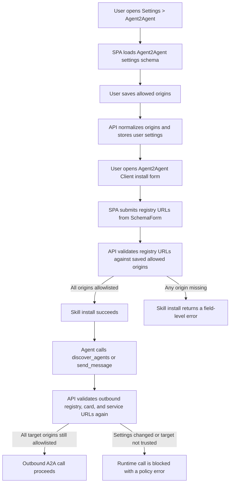

# SPA Frontend Guide

Use this guide when changing the React/Vite dashboard frontend.

## Architecture

- Routes live in `src/App.tsx`; nested resource pages should use nested routes and an outlet context, as in `agent-detail/*` and `automations/*`.
- API calls belong in singleton service classes under `src/services/*`; all HTTP should go through `src/services/http/client.ts`.
- Keep page state close to the page. Extract helpers when they are reused or clarify non-trivial transforms.
- Prefer existing shared UI components in `src/components/ui` before creating local controls.
- Keep backend response types explicit in service files and import those types into pages.

## Styling

- Prefer page-local CSS files for substantial page-specific layout and visual styling, imported beside the page component.
- Use semantic class names such as `agent-page-header` or `a2a-task-row`; avoid long inline Tailwind utility strings in page components.
- Inline styles should be rare and limited to genuinely dynamic values.
- Use the project CSS variables for color and surfaces: `--text-primary`, `--text-secondary`, `--text-muted`, `--surface-panel`, `--bg-tertiary`, `--border-subtle`, `--gradient-start`.
- Use a consistent spacing scale: `4px`, `8px`, `12px`, `16px`, `24px`, `32px`.
- Operational dashboard pages should feel calm, dense enough for repeated use, but not cramped. Use clear gutters between semantic groups.

## UI Patterns

- Build the actual working product surface, not marketing/hero pages, inside the dashboard.
- For resource detail pages, use the existing side-nav pattern and place new tabs under the relevant resource route.
- Prefer compact cards/panels, tables, lists, and inspectors for dashboard workflows.
- Make status, errors, and primary actions visible before secondary metadata.
- Use shortened copyable IDs in UI, with the full value available through copy/title.
- Collapse raw/debug payloads by default and render JSON with `JsonTreeViewer`.
- Use lucide icons for buttons and navigation when a matching icon exists.

## Accessibility

- Interactive list rows should be real buttons or links, with visible focus states.
- Use `aria-current` for selected navigation/list items and `aria-label` for icon-only or copy actions.
- Avoid relying on color alone for failure/selected states; combine color with badges, borders, labels, or layout.

## Schema-Driven Validation

- Prefer backend-owned validation for settings and skill installation flows. The SPA should render the form schema, submit the typed values, and display the API error instead of duplicating trust or credential rules.
- Use `SchemaForm` for fields described by `FormSchema`. Add a bespoke field only when the schema contract cannot represent the interaction.
- Keep client-side validation limited to basic UI affordances such as required browser inputs, disabled loading states, and clear copy. Security and allowlist decisions belong in the API.
- For Agent2Agent, the user first configures trusted origins in Settings, then the Agent2Agent Client skill install form is validated by the backend against those saved origins.
- Runtime calls are validated again by the API because install-time validation is not enough when settings or stored configs change.

## Verification

- For frontend changes, run focused eslint on touched files and `yarn build`.
- Full `yarn lint` may include existing unrelated issues; report that separately if it is not clean.
